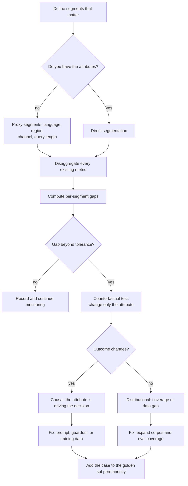
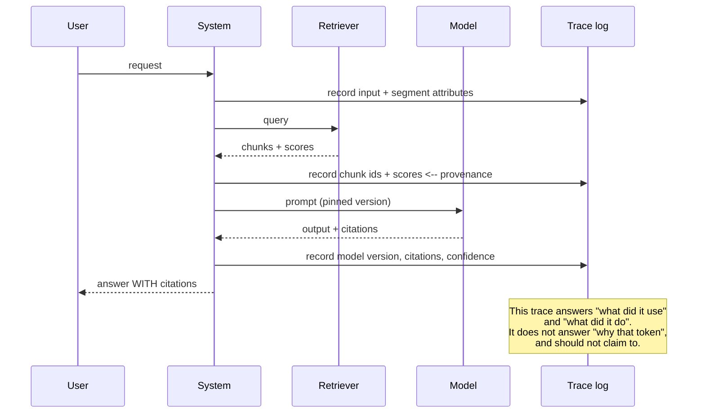

# Bias monitoring & explainability

> **The one sentence:** an aggregate quality number is an average over people,
> and averages hide exactly the failures that get organisations into trouble.

These two sit together because both are attempts to answer a question the
headline metric cannot: *not how good is it, but good for whom, and on what
basis.*

---

## 1 · Diagram

```
   WHY THE AGGREGATE LIES

   overall accuracy 0.91   <- the number in the deck

     segment A (78% of traffic)   0.95
     segment B (15%)              0.93
     segment C  (5%)              0.71     <- unusable, invisible in the average
     segment D  (2%)              0.52     <- actively harmful, moves the mean by 0.008

   The system works. For most people.
   The people it fails are the ones least able to route around it.


   THE TWO QUESTIONS, and what each can actually be answered with

   BIAS          "is it worse for some group?"       -> measurable. Do this.
   EXPLAINABILITY "why did it produce THIS output?"  -> partially answerable.
                                                        Be honest about which part.
```

---

## 2 · Design

**Intermediate — bias is measurement before it is ethics.** The engineering work
is disaggregation: compute the metrics you already have, per segment, and look
at the spread rather than the mean.

| Metric | Question it answers |
|---|---|
| **Per-segment quality** | Is accuracy or groundedness worse for some group? |
| **Refusal rate by segment** | Is it declining more often for some people? |
| **Equal opportunity gap** | Is the true-positive rate equal across groups? |
| **Demographic parity gap** | Is the positive-prediction rate equal across groups? |
| **Counterfactual consistency** | Does the answer change when only a group attribute changes? |

**Counterfactual testing is the most practical technique for LLMs**, and the
easiest to automate. Take a real input, change only a name, gender, dialect or
location, and check whether the decision changes. If "Aisha" and "James" with
identical CVs get different summaries, you have found something concrete, in a
test you can run in CI.

**The impossibility result worth knowing.** Demographic parity, equalised odds
and calibration **cannot all hold simultaneously** unless base rates are equal
across groups. This is a proven mathematical constraint, not an engineering
shortfall. So "make it fair" is not a specification — someone has to choose
*which* fairness definition applies, and that is a product and legal decision,
not an engineering one. Saying this clearly is a strong senior signal, and
pretending all three are achievable is a mistake an interviewer will notice.

**Advanced — what explainability can honestly mean here.** For an LLM, be
precise about which of four different things is being asked for:

| Claim | Honest status |
|---|---|
| **Provenance** — which documents were used | ✅ Fully achievable. Cite retrieved chunks |
| **Traceability** — what the system did, step by step | ✅ Achievable. Log the trace: query, retrieval, tools, output |
| **Faithful reasoning** — why the model produced this token | ❌ Not achievable in production |
| **Counterfactual** — what would change the outcome | ⚠️ Approximable by perturbation and re-running |

**Chain-of-thought is not an explanation.** This matters and it is widely
misunderstood: a model's stated reasoning is generated text that may or may not
describe the computation that produced the answer. Models produce plausible
reasoning for conclusions reached otherwise, and will confidently justify wrong
answers. It is useful for *steering* and for *catching* some errors; it is not
evidence of process, and presenting it to a regulator as such is a
misrepresentation.

**What to give instead:** citations, retrieval traces, confidence signals, and
perturbation-based counterfactuals. Those are real, checkable, and enough for
most governance requirements.

---

## 3 · Flow



**Branch `J` is the one that turns a finding into an action.** A gap alone does
not tell you whether the system is *reacting to* the attribute or simply has
worse coverage for that group. Those need completely different fixes, and
conflating them wastes months.

**Node `C` is the practical reality.** You usually cannot collect demographic
attributes — and often should not. Proxy segments (language, region, device,
query characteristics) are imperfect and are what most teams actually have. Say
so honestly rather than claiming a rigour you do not have.

---

## 4 · UML — the trace that makes a decision explainable



---

## 5 · Example

```python
def disaggregate(results: list[dict], segment_key: str, metric_key: str) -> dict:
    """Per-segment metrics, with the small-sample caveat made explicit.

    The whole point is to surface what the mean conceals -- so this reports the
    worst segment and the gap, not just the average. Segments below a size
    threshold are flagged rather than dropped: 'too small to judge' is useful
    information, and silently excluding them recreates the original problem.
    """
    buckets: dict[str, list[float]] = {}
    for row in results:
        buckets.setdefault(row[segment_key], []).append(row[metric_key])

    per_segment = {
        name: {
            "n": len(vals),
            "mean": round(sum(vals) / len(vals), 4),
            "reliable": len(vals) >= 30,
        }
        for name, vals in buckets.items()
    }
    reliable = {k: v for k, v in per_segment.items() if v["reliable"]}
    overall = sum(r[metric_key] for r in results) / len(results)

    return {
        "overall": round(overall, 4),
        "segments": dict(sorted(per_segment.items(), key=lambda kv: kv[1]["mean"])),
        "worst_reliable": min(reliable, key=lambda k: reliable[k]["mean"]) if reliable else None,
        "gap": round(
            max(v["mean"] for v in reliable.values()) - min(v["mean"] for v in reliable.values()), 4
        ) if len(reliable) > 1 else None,
    }


def counterfactual_test(system, template: str, variants: dict[str, list[str]]) -> list[dict]:
    """Vary one attribute, hold everything else fixed, compare the outputs.

    This is the strongest bias evidence available without demographic data,
    because it is causal by construction: nothing but the attribute changed, so
    any difference in outcome is attributable to it.
    """
    findings = []
    for attribute, values in variants.items():
        outputs = {v: system(template.format(**{attribute: v})) for v in values}
        distinct = {normalise_decision(o) for o in outputs.values()}
        if len(distinct) > 1:
            findings.append({
                "attribute": attribute,
                "outputs": outputs,
                "severity": "decision changed on a protected attribute alone",
            })
    return findings
```

---

## 6 · Depth — the senior layer

**Small segments are where the harm concentrates and where statistics are
weakest.** A 40-item segment gives a ±15-point confidence interval, so you
cannot distinguish a real problem from noise — but that segment is often exactly
the underserved group you are trying to protect. Options, none free:

1. **Oversample** that segment in the eval set. Cheap, and the honest first move.
2. **Aggregate over a longer window.** Trades detection latency for confidence.
3. **Use counterfactual tests**, which are causal and need far fewer samples.
4. **Report the interval honestly** and say the segment is under-measured.

Silently dropping small segments because "n is too low" recreates the original
problem with statistical cover.

**Bias enters at four points, and only one of them is the model.** Training data,
retrieval corpus, prompt, and the evaluation set itself. The last is the one
teams miss: if your golden set was written by one person from one background,
your fairness measurement inherits that perspective and will report everything
is fine.

| Failure mode | Symptom | Fix |
|---|---|---|
| **Aggregate-only reporting** | "It works" while a segment fails | Disaggregate everything; gate per segment |
| **Dropping small segments** | The vulnerable groups vanish from the report | Oversample, or report with intervals |
| **CoT presented as explanation** | Governance built on unfaithful text | Provide citations and traces; state CoT's status |
| **Biased eval set** | Fairness checks pass, users disagree | Diversify who writes and reviews the golden set |
| **Fairness as a single number** | Endless argument about the metric | Choose the definition explicitly with legal and product |
| **Proxy segments treated as ground truth** | Overclaimed rigour | State that they are proxies and what they miss |

**The regulatory direction is towards traceability rather than interpretability**,
and that is fortunate, because traceability is achievable. The EU AI Act's
high-risk obligations centre on logging, documentation, human oversight and data
governance — not on explaining a specific token. Build the trace log, record
model versions, keep the eval history, document the limitations. That is both
good engineering and most of the compliance surface.

**The honest limit, stated plainly.** For a system built on a hosted model, you
cannot inspect the weights, cannot reproduce the computation, and cannot
guarantee the same output twice. Anyone promising true interpretability on top of
that is selling something. What you *can* promise — full provenance, a complete
trace, versioned behaviour, measured per-segment performance, and documented
limitations — is a lot, and it is what should be offered.

---

## 7 · From each seat

| Seat | What this looks like from here |
|---|---|
| **User** | Whether it works for people like them, and whether they can see why it answered as it did. Citations are the most valuable explainability feature you can ship, by a distance. |
| **Coder** | Log the segment attribute and the full trace on every request. You cannot disaggregate retroactively without it, and nobody has ever regretted logging the retrieval trace. |
| **Tester** | Add counterfactual tests to CI — vary one attribute, assert the decision is stable. They are cheap, causal, and catch what aggregate metrics never will. Gate per segment, not just overall. |
| **System designer** | Traces are storage and a retention policy; segment attributes are a privacy question. Design the trace schema early, because retrofitting it means losing the history you most want. |
| **Architect** | Traceability is an architectural property: pinned versions, immutable logs, reproducible retrieval. It is also most of what regulation asks for, so building it is not overhead. |
| **CEO** | This is reputational and legal risk management. The question to ask is not "are we fair" but "which fairness definition did we choose, who signed it off, and what is the worst segment's number". A single fairness metric is a sign nobody has thought about it. |
| **Market** | Tooling exists — Fairlearn, AIF360, the observability vendors — and is easy to adopt. The differentiator is having chosen a definition and being able to show measurements over time. In regulated sectors that documentation is a sales asset, not a cost. |

---

## 8 · Interview questions

| Question | What they are testing | Answer sketch |
|---|---|---|
| "How would you check an LLM system for bias?" | Method | Disaggregate every metric by segment and look at the spread, not the mean. Add counterfactual tests varying one attribute. Gate per segment in CI. Where demographic attributes are unavailable, use proxies and say they are proxies. |
| "Can you make it fair?" | Whether you know the constraint | Not in all senses at once — demographic parity, equalised odds and calibration cannot all hold unless base rates match. So "fair" needs a chosen definition, and that choice is a product and legal decision, not an engineering one. |
| "Is chain-of-thought an explanation?" | The misconception that matters | No. It is generated text that may not describe the computation. Models produce plausible reasoning for conclusions reached otherwise. Useful for steering; not evidence of process, and not something to present to a regulator as such. |
| "What can you actually explain?" | Honesty | Provenance — which documents were used. Traceability — what the system did. Counterfactuals by perturbation. Not why a specific token was chosen, especially on a hosted model. |
| "A segment has 40 samples and looks bad." | Statistical care | ±15 points at that size, so it is not yet distinguishable from noise. Oversample it in the eval set, aggregate over a longer window, or use counterfactual tests, which are causal and need fewer samples. Do not drop it. |
| "Where does bias enter?" | Breadth | Training data, retrieval corpus, prompt, and the eval set itself. The last is the one people miss: a golden set written by one person measures fairness from one perspective and reports everything is fine. |

---

## Stop condition

You are done when you can:

1. explain why an aggregate metric conceals the failures that matter,
2. state the fairness impossibility result and its consequence,
3. separate the four things "explainability" might mean and which are achievable,
4. say why chain-of-thought is not an explanation, and
5. describe what to do about a segment too small to measure reliably.

---

## Sources worth reading

| Topic | Source |
|---|---|
| Impossibility | Kleinberg, Mullainathan & Raghavan (2016); Chouldechova (2017) |
| Unfaithful reasoning | *Language Models Don't Always Say What They Think* (Turpin et al., 2023) |
| Disaggregated evaluation | *Model Cards for Model Reporting* (Mitchell et al., 2019) |
| Practical tooling | Fairlearn's user guide — the clearest treatment of choosing between metrics |
| Regulation | EU AI Act high-risk obligations; note how much is logging and documentation rather than interpretability |
