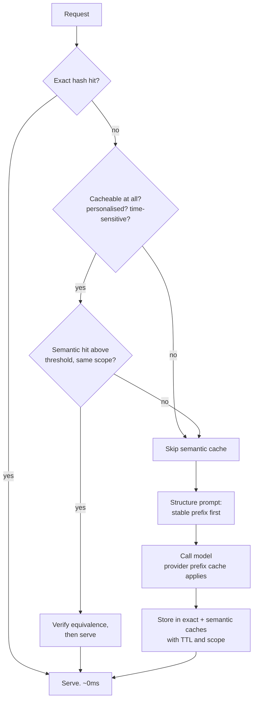
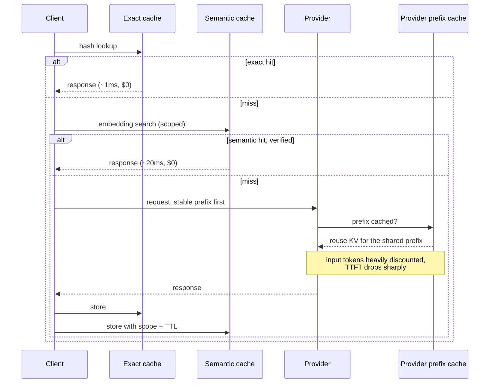

# Caching strategies

> **The one sentence:** caching is the largest cost lever in most LLM systems
> and the only one that also makes things faster — but one of the four kinds can
> serve a user someone else's answer, so they are not interchangeable.

Most teams implement exact-match caching, get a low hit rate, and conclude
caching does not help. The two that actually pay are the ones they skipped.

---

## 1 · Diagram

```
   FOUR CACHES, IN THE ORDER THEY SIT IN THE REQUEST PATH

   request
     │
     ├─► 1. EXACT RESPONSE CACHE      identical request seen before?
     │      hit rate 5-30%             saves 100% of the call
     │      trivially safe             keyed on hash(prompt + params + model)
     │
     ├─► 2. SEMANTIC CACHE            similar QUESTION seen before?
     │      hit rate 20-50%            saves 100% of the call
     │      ⚠ CAN SERVE WRONG ANSWERS  keyed on embedding similarity
     │
     ├─► 3. PREFIX / KV CACHE         shared PREFIX seen before?
     │      hit rate often 80-95%      saves most of the INPUT cost + TTFT
     │      always safe                provider-side, needs prompt structuring
     │
     └─► 4. EMBEDDING CACHE           embedded this text before?
            hit rate very high         saves embedding calls
            always safe                keyed on hash(text + model)


   WHICH ONE TO BUILD FIRST

   #3 costs a prompt restructure and saves the most. Do it first.
   #4 is trivial and saves a surprising amount at ingestion time.
   #1 is easy and helps a little.
   #2 is powerful and needs care -- see below.
```

---

```sim
cachelayers
```

---

## 2 · Design

**Prefix caching is first because it is nearly free money.** Most LLM requests
share a large stable prefix — a system prompt, tool definitions, a few-shot
block, sometimes a fixed corpus. Providers charge a large discount on cached
prefix tokens and skip recomputing their KV cache, which also cuts TTFT.

It requires one thing: **put the stable content first and the variable content
last.** A prompt that interleaves them caches nothing.

```
   CACHEABLE                          NOT CACHEABLE
   system prompt        (stable)      "Today is 2026-09-01"   <- moves every day
   tool definitions     (stable)      user question           <- varies
   few-shot examples    (stable)      retrieved chunks        <- varies
   ─────────────────────────────
   retrieved chunks     (varies)
   user question        (varies)
```

Putting a timestamp at the top of a system prompt invalidates the entire cache on
every request. It is a one-line mistake with a large bill attached.

**Exact caching is easy and limited.** Key on
`hash(model + version + params + full prompt)`. Include the model *version* and
sampling parameters — a cached answer from a different model or temperature is a
different answer.

**Semantic caching is the powerful, dangerous one.** Embed the question, search
previous questions, and return a stored answer if similarity exceeds a threshold.
Hit rates are much higher because real query distributions are Zipfian — the same
questions recur in different words.

The danger is that "similar" is not "the same":

```
   "how do I cancel my subscription?"       vs
   "how do I cancel my subscription        ->  SIMILAR embeddings
    without losing my data?"                    DIFFERENT correct answers
```

And worse:

```
   "what did I order last week?"  ->  identical across every user.
   A shared semantic cache serves one customer another's order history.
```

**Advanced — the rules that make semantic caching safe:**

1. **Scope by user or tenant** unless the query is provably stateless.
2. **Never cache personalised or time-sensitive answers.** Classify first.
3. **Set the threshold high** — 0.95+ — and validate it on real query pairs, not
   by intuition.
4. **Cache the question and answer together**, and check the retrieved question
   is genuinely equivalent before serving.
5. **TTL aggressively.** A correct answer from three months ago may now be wrong.

---

## 3 · Flow



**Node `C` is the safety gate and it belongs before the semantic lookup**, not
after. Deciding cacheability from the *question type* — is this personalised, is
it time-sensitive — is a classification you can do cheaply and must do first.

---

## 4 · UML — where each cache saves



---

## 5 · Example

```python
import hashlib, json, time


def exact_key(model: str, version: str, params: dict, prompt: str) -> str:
    """Cache key including everything that changes the answer.

    Model version and sampling parameters belong in the key. A response
    generated at temperature 0.7 by last month's model is not a valid answer to
    the same prompt today at temperature 0 -- and a cache that conflates them
    produces bugs nobody can reproduce.
    """
    blob = json.dumps([model, version, params, prompt], sort_keys=True)
    return hashlib.sha256(blob.encode()).hexdigest()


CACHEABLE_NEVER = ("my ", "i ordered", "my account", "last time i", "for me")


def is_semantically_cacheable(question: str) -> bool:
    """Decide cacheability from the QUESTION TYPE, before any lookup.

    Personalised and time-sensitive questions must never share a cache entry.
    'What did I order last week' embeds almost identically for every user, so a
    shared semantic cache would serve one customer another's history -- a data
    breach caused by a performance optimisation.
    """
    lowered = question.lower()
    if any(marker in lowered for marker in CACHEABLE_NEVER):
        return False
    if any(word in lowered for word in ("today", "now", "current", "latest")):
        return False
    return True


class SemanticCache:
    """Similarity cache with the guards that make it safe rather than clever."""

    def __init__(self, index, threshold=0.96, ttl_s=86_400):
        self._index = index
        self._threshold = threshold      # high on purpose; validate on real pairs
        self._ttl = ttl_s

    def get(self, question: str, scope: str):
        if not is_semantically_cacheable(question):
            return None

        # Scope is part of the search, not a filter applied afterwards --
        # post-filtering a semantic cache has the same flaw as post-filtering
        # retrieval by permissions.
        hits = self._index.search(question, k=1, filter={"scope": scope})
        if not hits or hits[0].score < self._threshold:
            return None

        entry = hits[0]
        if time.time() - entry.stored_at > self._ttl:
            return None
        return entry.answer
```

**Measuring whether it is working:**

```python
def cache_report(events) -> dict:
    """Hit rate alone is not enough -- a cache that serves wrong answers has a
    great hit rate. Track savings AND the signal that it is misfiring.
    """
    total = len(events)
    exact = sum(1 for e in events if e.source == "exact")
    semantic = sum(1 for e in events if e.source == "semantic")
    return {
        "exact_hit_rate": round(exact / total, 3),
        "semantic_hit_rate": round(semantic / total, 3),
        "cost_saved": round(sum(e.would_have_cost for e in events if e.source != "live"), 2),
        # The one that matters for safety: users re-asking straight after a
        # cached answer is the strongest available signal that the cache
        # returned something that did not fit their question.
        "requery_after_cache_hit": round(
            sum(1 for e in events if e.source != "live" and e.followed_by_requery)
            / max(1, exact + semantic), 3
        ),
    }
```

---

## 6 · Depth — the senior layer

**`requery_after_cache_hit` is the metric that makes semantic caching
operable.** If users frequently re-ask immediately after a cached response, the
threshold is too low and you are serving near-misses. It is a free label — no
annotation, no judge — and it is the only practical way to detect the failure
mode in production.

| Failure mode | Symptom | Fix |
|---|---|---|
| **Timestamp in the system prompt** | Prefix cache never hits | Move volatile content to the end |
| **Model version not in the key** | Stale answers after an upgrade | Include model and version |
| **Unscoped semantic cache** | Cross-user data leakage | Scope by user or tenant, in the search |
| **Threshold too low** | Answers to questions nobody asked | 0.95+, validated on real pairs |
| **No TTL** | Confidently outdated answers | Aggressive TTL by content type |
| **Caching personalised queries** | Wrong answers, possible breach | Classify before looking up |
| **Only exact caching** | Low hit rate, conclusion that caching fails | Prefix caching is the bigger win |

**Cache invalidation is the hard part here as everywhere**, and RAG makes it
harder: an answer cached from retrieved documents becomes wrong when those
documents change. Two workable approaches — tag cache entries with the chunk ids
that produced them and invalidate on re-index, or simply use a short TTL and
accept some staleness. The second is usually right, because the first requires
discipline that decays.

**Caching interacts with evaluation in a way that bites people.** A cached
response during an eval run means you are scoring a stored answer, not the
current system — and your numbers stop reflecting reality. **Disable caching in
eval runs**, or key the cache on a run id. This is a real and easily-missed
source of an eval suite that mysteriously stops catching regressions.

**The ordering worth remembering**, because it is the opposite of what most teams
do:

1. **Prefix caching** — restructure the prompt. Largest saving, always safe.
2. **Embedding caching** — trivial, and ingestion re-embeds far more than you expect.
3. **Exact caching** — easy, modest gain.
4. **Semantic caching** — biggest hit rate, needs the safety work above.

---

## 7 · From each seat

| Seat | What caching looks like from here |
|---|---|
| **User** | Faster answers. And, if the semantic cache is careless, an answer to a question they did not ask — which erodes trust faster than slowness. |
| **Coder** | Stable content first in every prompt. Model version in every cache key. Scope semantic caches in the search, never as a post-filter. Disable caching during evals. |
| **Tester** | Test that the cache is off in eval runs. Test scope isolation directly — two users, similar questions, assert no cross-serving. |
| **System designer** | Caches are state with TTLs, invalidation and a memory budget. The semantic cache is a vector index with all of that index's operational needs. |
| **Architect** | Prompt structure is now an architectural concern, because it determines whether prefix caching works at all. That is unusual and worth writing down. |
| **CEO** | Usually the largest cost reduction available, often halving spend with no quality loss. The risk is a semantic cache serving wrong answers — ask what the threshold is and how it was chosen. |
| **Market** | Provider prefix caching is standard and free to adopt. Semantic caching is available off the shelf. No advantage in building either; the advantage is in using them correctly. |

---

## 8 · Interview questions

| Question | What they are testing | Answer sketch |
|---|---|---|
| ⭐ "How would you cut LLM costs by half?" | Whether you reach for the biggest lever | Prefix caching first — restructure so the stable system prompt and tools come first. Then route easy traffic to a smaller model, then semantic caching, then cap output tokens. Infrastructure changes come last. |
| "Why is your prefix cache never hitting?" | Debugging instinct | Something volatile is at the top — usually a timestamp or a user id in the system prompt. The cache matches on prefix, so one changing token at the front invalidates everything after it. |
| ⭐ "What is dangerous about semantic caching?" | Safety awareness | "Similar" is not "the same". Two questions can embed closely with different correct answers, and personalised questions embed almost identically across users — an unscoped cache serves one user another's data. |
| "How do you know the semantic cache is misfiring?" | Operational depth | Re-query rate immediately after a cache hit. A free implicit label — if users re-ask, the answer did not fit, and the threshold is too low. |
| "What goes in a cache key?" | Detail | The prompt, the model, the model *version*, and the sampling parameters. Anything that changes the answer changes the key, or you serve stale responses after an upgrade. |
| ⭐ "Any interaction between caching and evaluation?" | Rare, and a strong signal | Yes — a cached response during an eval means you are scoring a stored answer rather than the current system, so the suite silently stops catching regressions. Disable caching in eval runs. |

---

## Stop condition

You are done when you can:

1. name the four caches and order them by saving,
2. explain why a timestamp in a system prompt is expensive,
3. give two ways a semantic cache serves a wrong answer,
4. name the free signal that detects it, and
5. say why caching must be off during evaluation.

---

## Sources worth reading

| Topic | Source |
|---|---|
| Prefix caching | Provider documentation on prompt caching — the mechanics and discounts are published |
| KV cache reuse | The vLLM automatic prefix caching documentation |
| Semantic caching | GPTCache, and any write-up honest about its threshold problem |
| Invalidation | Ordinary cache-invalidation literature; nothing about LLMs makes this easier |
