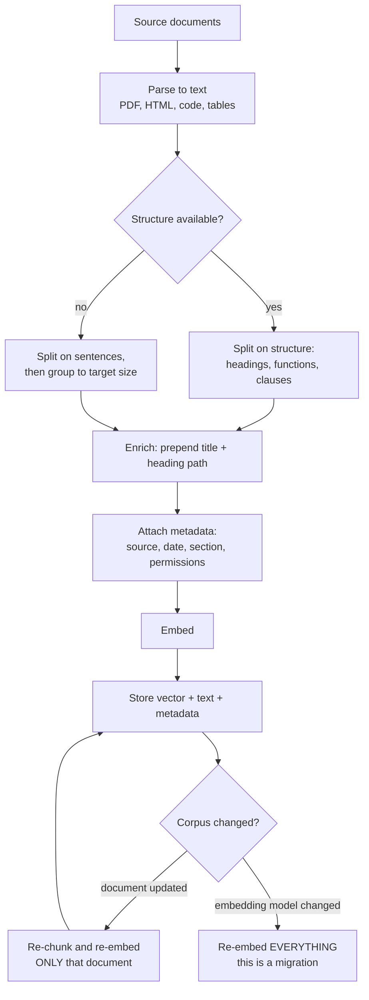
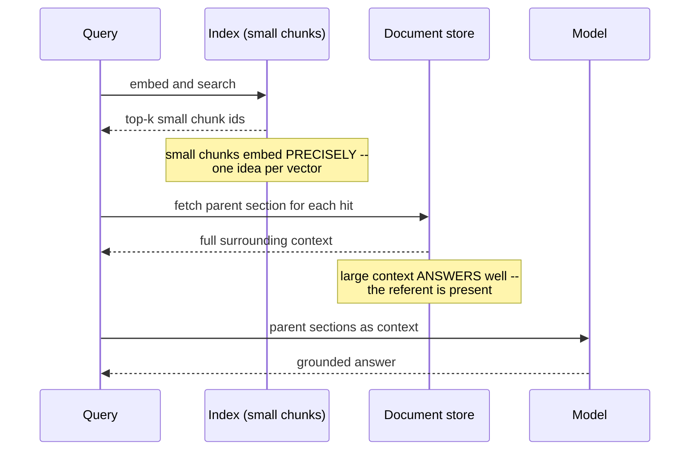

# Chunking & ingestion

> **The one sentence:** retrieval can only ever return a chunk, so a chunk that
> does not contain the answer is a ceiling on quality that no model, reranker or
> prompt can lift.

More RAG failures trace back to chunking than to any other stage, and it is the
stage that gets the least attention because it happens once, offline, before
anything interesting starts.

---

## 1 · Diagram

```
   THE FAILURE CHUNKING CAUSES, and why nothing downstream can fix it

   source document
   ┌──────────────────────────────────────────────┐
   │ The maximum operating temperature is 810 °C.  │
   │ Above this, the seal degrades within hours.   │
   └──────────────────────────────────────────────┘
                    │  chunk boundary falls HERE
                    ▼
     chunk A: "The maximum operating temperature is 810 °C."
     chunk B: "Above this, the seal degrades within hours."

   query: "what happens above the max temperature?"
     -> retrieves chunk B
     -> "Above this" ... above WHAT? The referent is in chunk A.
     -> the model answers anyway, plausibly, and wrongly


   THE THREE THINGS A CHUNK MUST BE

   1. SELF-CONTAINED   understandable without its neighbours
   2. FOCUSED          about one thing, so its embedding means something
   3. SIZED for the embedding model's real capacity, not its stated limit
```

---

## 2 · Design

**Basic — the strategies, in ascending order of effort.**

| Strategy | How | Good for | Fails on |
|---|---|---|---|
| **Fixed-size** | Every N tokens with overlap | Anything; the baseline | Cuts mid-sentence, mid-table |
| **Sentence / paragraph** | Split on punctuation or blank lines | Prose | Wildly uneven sizes |
| **Structural** | Split on markdown headings, HTML sections | Documentation, wikis | Requires structure to exist |
| **Semantic** | Split where adjacent-sentence similarity drops | Unstructured prose | Costs embeddings up front |
| **Hierarchical** | Parent summaries over leaf chunks | Long documents needing both scales | Most complex to build |

**Overlap is the standard mitigation for boundary loss** and it is not free: with
chunk size C and overlap O, you store and embed roughly `C/(C−O)` times the
original text. At 400 tokens with 100 overlap that is 33% more index, embedded
and stored forever. Overlap buys boundary safety with permanent cost.

**Intermediate — sizing, and the mistake almost everyone makes.** Embedding
models have a *stated* maximum sequence length and a much shorter *effective*
one. Feed 512 tokens to a model whose useful capacity is around 256 and the
extra content is averaged into mush — the vector stops representing anything in
particular.

```
   typical starting points, to be validated on YOUR corpus

   dense retrieval, general prose     256 - 512 tokens
   code                              function or class boundaries, not token counts
   tables                            never split a table from its header
   conversation logs                 whole turns, never mid-turn
   legal / regulatory                clause boundaries; the structure is the meaning
```

**Advanced — the decoupling that fixes most of this.** The chunk you *retrieve
on* does not have to be the chunk you *give the model*. This is the single most
useful idea on the page:

| Pattern | Retrieve on | Send to the model |
|---|---|---|
| **Small-to-big** | Small precise chunk | Its surrounding parent section |
| **Sentence window** | One sentence | That sentence ± k neighbours |
| **Summary index** | An LLM-written summary | The full original chunk |
| **Metadata-enriched** | Chunk + prepended heading path | The chunk itself |

Small chunks embed precisely; large chunks give the model enough to answer.
Decoupling gets both. The metadata-enriched variant is the cheapest real win
available: prepend the document title and heading path to each chunk before
embedding, so a chunk reading "It must not exceed 810 °C" becomes "Turbine
Manual > Section 4 > Thermal limits: It must not exceed 810 °C" — and suddenly
it is retrievable by a query mentioning turbines.

---

## 3 · Flow



**`B` is where most real projects lose their time.** PDF extraction is genuinely
hard: multi-column layouts interleave, tables become word soup, headers and
footers pollute every chunk. Budget for it. A pipeline that chunks beautifully
from badly-parsed text is producing beautiful nonsense.

**`L` is a migration, not a config change.** Changing embedding models invalidates
every vector you have. On a large corpus that is hours of compute and a
dual-index cutover — plan it as a project.

---

## 4 · UML — small-to-big retrieval



---

## 5 · Example

```python
import re


def structural_chunks(markdown: str, source: str, target: int = 400, overlap: int = 60):
    """Split on headings first, then size within each section.

    Structure before size, always. A heading boundary is a real semantic
    boundary the author put there; a token count is an arbitrary one we impose.
    Splitting on structure first means arbitrary cuts only ever happen INSIDE a
    section that was already about one thing.
    """
    sections, path, buffer = [], [], []

    for line in markdown.splitlines():
        heading = re.match(r"^(#{1,6})\s+(.*)", line)
        if heading:
            if buffer:
                sections.append((list(path), "\n".join(buffer)))
                buffer = []
            level = len(heading.group(1))
            path = path[: level - 1] + [heading.group(2).strip()]
        else:
            buffer.append(line)
    if buffer:
        sections.append((list(path), "\n".join(buffer)))

    chunks = []
    for heading_path, body in sections:
        for piece in _window(body, target, overlap):
            # The heading path is prepended BEFORE embedding. A chunk saying
            # "It must not exceed 810 C" is unretrievable on its own; the same
            # chunk with "Turbine Manual > Thermal limits" in front of it is not.
            prefix = " > ".join([source] + heading_path)
            chunks.append({
                "text": piece,
                "embed_text": f"{prefix}: {piece}",
                "source": source,
                "heading_path": heading_path,
            })
    return chunks


def _window(text: str, target: int, overlap: int):
    """Group whole sentences up to a token target, overlapping by sentences.

    Overlapping by SENTENCES rather than tokens means the repeated region is
    always a complete thought, so an overlapped chunk never begins mid-clause.
    """
    sentences = re.findall(r"[^.!?]+[.!?]+|\S+$", text)
    out, current, size = [], [], 0
    for sentence in sentences:
        n = len(sentence.split())
        if size + n > target and current:
            out.append(" ".join(current).strip())
            back, kept = 0, []
            for s in reversed(current):          # carry back ~overlap tokens
                back += len(s.split())
                kept.insert(0, s)
                if back >= overlap:
                    break
            current, size = kept, back
        current.append(sentence)
        size += n
    if current:
        out.append(" ".join(current).strip())
    return [c for c in out if c]
```

**Measure the ceiling before tuning anything downstream:**

```python
def retrieval_ceiling(chunks, qa_pairs) -> float:
    """What fraction of answers exist in SOME chunk at all.

    This is the hard upper bound on the whole pipeline. If it is 0.82, no
    reranker, prompt or model can take end-to-end quality above 0.82 -- the
    answer is not in the index. Run this before optimising retrieval; it is
    ten minutes and it regularly redirects a month of work.
    """
    found = 0
    for question, answer_span in qa_pairs:
        if any(answer_span.lower() in c["text"].lower() for c in chunks):
            found += 1
    return found / len(qa_pairs)
```

---

## 6 · Depth — the senior layer

**Metadata is worth more than most chunking cleverness.** Storing source, date,
section, author and permissions with each chunk enables filtered retrieval —
"only documents from this year", "only what this user may see" — which fixes
whole classes of failure that no amount of embedding quality addresses.
Permission filtering in particular has to happen *at retrieval*, not after: a
model that has seen a document it should not have has already leaked it, and
filtering the output is not a control.

| Failure mode | Symptom | Fix |
|---|---|---|
| **Split referents** | Confident answers about "this" and "above" | Overlap, or structural boundaries |
| **Chunks too large** | Retrieval imprecise, everything looks relevant | Smaller chunks; decouple retrieval from context |
| **Chunks too small** | Retrieved chunk lacks the answer | Small-to-big |
| **Tables split from headers** | Numbers with no column meaning | Treat tables as atomic units |
| **No metadata** | Cannot filter by date, source or permission | Attach at ingestion; retrofitting means re-ingesting |
| **Bad PDF parsing** | Garbage in every chunk | Fix parsing first; nothing downstream can recover |
| **Re-embedding not planned** | Model upgrade blocked | Dual index and cutover |

**Ingestion is a pipeline with state, and it needs the discipline of one.**
Idempotent updates keyed on a document hash, so re-running does not duplicate.
Deletions must propagate — an answer sourced from a deleted document is worse
than no answer. Version the chunking configuration alongside the index, because
"which chunker produced this vector" is unanswerable later otherwise, and that
question arrives the first time quality drops.

**Where the effort actually pays.** Ranked by return on time invested:

1. **Fix document parsing.** Everything downstream inherits it.
2. **Add heading paths and metadata.** Cheap, large effect.
3. **Decouple retrieval size from context size.** Small-to-big.
4. **Tune chunk size** against your eval set. Real but smaller.
5. **Semantic chunking.** Usually the smallest gain for the most machinery.

Most teams start at 5. The ordering above is the one that is defensible when
someone asks why you spent the week on it.

---

## 7 · From each seat

| Seat | What chunking looks like from here |
|---|---|
| **User** | Whether the answer cites something that actually supports it. A split referent produces an answer that is fluent, cited, and wrong — the worst combination. |
| **Coder** | Prepend heading paths before embedding. Keep tables atomic. Overlap by sentences, not tokens. Store metadata at ingestion; you cannot add it later without re-ingesting. |
| **Tester** | Measure the retrieval ceiling first — the fraction of answers present in any chunk at all. It is the upper bound on everything, and it is ten minutes of work. |
| **System designer** | Ingestion is a stateful pipeline: idempotent updates, propagated deletes, versioned config. Re-embedding is a migration needing a dual index, not a config change. |
| **Architect** | The chunking decision is coupled to the embedding model, and changing either invalidates the index. That coupling is the migration cost nobody budgets for. |
| **CEO** | The least glamorous stage and the one that most often determines whether the product works. When quality is poor, the honest first question is whether the answer was ever in the index. |
| **Market** | Commoditised — every framework ships chunkers. What is not commoditised is a clean corpus, which is why data quality is the durable advantage and chunking strategy is not. |

---

## 8 · Interview questions

| Question | What they are testing | Answer sketch |
|---|---|---|
| "How would you chunk a technical manual?" | Method | Structure first — split on headings so arbitrary cuts only happen inside a coherent section. Prepend the heading path before embedding. Keep tables atomic. Then size within sections against the embedding model's effective length. |
| "How do you pick chunk size?" | Whether you measure | Against an eval set, not from a blog post. Start at 256–512 tokens for prose, then measure retrieval hit rate at several sizes. And decouple: retrieve on small, send large. |
| "RAG quality is poor. Where do you look first?" | Diagnostic order | The retrieval ceiling — is the answer in any chunk at all. If not, no reranker or prompt fixes it. Then parsing quality, then chunk boundaries, then retrieval, then the model. |
| "What is small-to-big?" | Depth | Embed and retrieve on small precise chunks, then send the surrounding parent section to the model. Small chunks embed precisely; large context answers well. Decoupling gets both instead of compromising. |
| "You are changing embedding model. What is involved?" | Operational awareness | Re-embedding the whole corpus — a migration, not a config change. Dual index, backfill, cutover, and a re-run of the eval suite because retrieval behaviour changes. |
| "How do you handle permissions in RAG?" | Security instinct | Filter at retrieval using metadata attached at ingestion. Never post-filter the generated answer — once the model has seen the document, it has already leaked. |

---

## Stop condition

You are done when you can:

1. explain the split-referent failure and why nothing downstream fixes it,
2. describe small-to-big and what each half buys,
3. say why heading-path enrichment is the cheapest large win,
4. compute the storage cost of overlap, and
5. give the ordering of where chunking effort actually pays.

---

## Sources worth reading

| Topic | Source |
|---|---|
| Practical strategies | LlamaIndex node-parser documentation — the clearest catalogue of patterns |
| Small-to-big | LlamaIndex's auto-merging and sentence-window retrievers |
| Hierarchical | *RAPTOR: Recursive Abstractive Processing for Tree-Organized Retrieval* (Sarthi et al., 2024) |
| Parsing | Any comparison of PDF extraction libraries; the differences are larger than any chunking decision |
