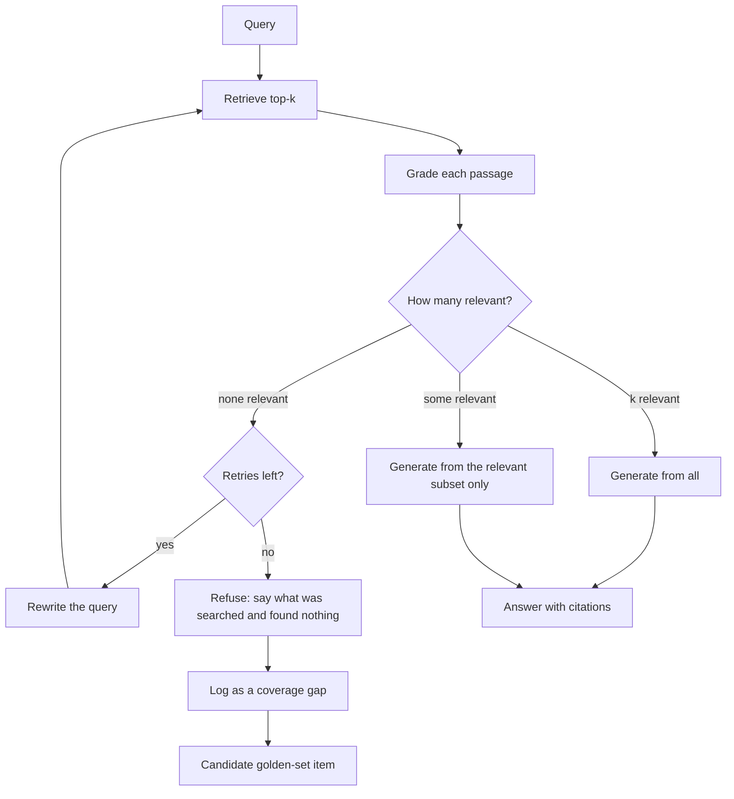
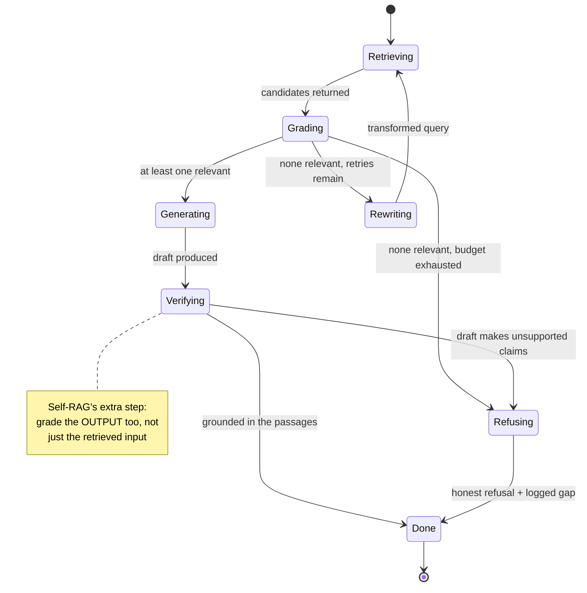

# Corrective & self-RAG

> **The one sentence:** plain RAG always answers, because nothing in it is
> allowed to say "what I found is not good enough".

A standard pipeline retrieves top-k and generates. If the top-k is irrelevant it
still generates — fluently, with citations, from passages that do not contain
the answer. Corrective RAG adds the one thing missing: **a decision point after
retrieval**.

---

## 1 · Diagram

```
   PLAIN RAG                          CORRECTIVE RAG

   query                              query
     |                                  |
   retrieve top-k                     retrieve top-k
     |                                  |
     |                                GRADE each passage: relevant?
     |                                  |
     |                     +------------+------------+
     |                     |            |            |
     |                  all good    some good      none good
     |                     |            |            |
     |                  generate    generate      DO NOT GENERATE
     |                              from the         |
     v                              good ones     +--+---------------+
   generate anyway                     |          |                  |
   (fluent, cited,                     |      rewrite query      say "I don't
    and wrong)                         |      and retry          know" / escalate
                                       v          |                  |
                                    answer <------+------------------+

   THE ENTIRE DIFFERENCE IS THE GRADE STEP AND THE "none good" BRANCH.
```

The "none good" branch is what people leave out, and it is the branch that
prevents the confident-fiction failure that gets RAG systems distrusted.

---

## 2 · Design

**Intermediate.** Three named variants, often conflated. They differ in *where*
the check sits:

| Variant | Checks | Acts on failure by |
|---|---|---|
| **CRAG** (corrective) | Retrieved passages, before generating | Rewriting the query, or falling back to web/broader search |
| **Self-RAG** | Both retrieval *and* its own output, via reflection tokens | Retrieving again, or revising the draft |
| **Adaptive RAG** | The query itself, before retrieving | Routing: no retrieval / one hop / multi-hop |

**The grader is the whole design.** It answers one question per passage — *does
this contain information that helps answer the query?* — and it must be cheap,
because it runs k times per request. Options, in increasing cost:

1. **Retrieval score threshold.** Free. Crude, and score scales differ per
   model, so the threshold needs calibrating per index.
2. **Cross-encoder relevance score.** Cheap, fast, already in your stack if you
   rerank. Usually the right answer.
3. **Small LLM binary classifier.** More accurate on subtle relevance, adds a
   call per passage — batch them into one call.

**Advanced — the trap.** The grader is a classifier, so it has a precision/recall
trade-off, and the two errors are not symmetric:

- **Grader too strict** → discards usable context → the system says "I don't
  know" when it could have answered. Users experience this as *useless*.
- **Grader too loose** → passes junk through → confident fiction. Users
  experience this as *untrustworthy*.

**Untrustworthy is far more expensive than useless**, because a user who gets a
wrong answer they believed stops trusting every answer, including the right
ones. Bias the grader toward strictness and make the refusal path good.

---

## 3 · Flow



Two details that matter more than the diagram suggests:

**The retry needs a bound.** A rewrite loop with no cap is an unbounded latency
and cost multiplier on exactly the queries that are already failing. One retry
is usually right; two is the most anyone should allow.

**`K → L` is where the value compounds.** A refusal is not a dead end — it is
the highest-quality signal you will ever get about a gap in your corpus. Every
refusal should be logged with its query and become a candidate golden-set item
or a documentation ticket.

---

## 4 · UML — the state machine



`Verifying` is what distinguishes self-RAG from corrective RAG. It catches the
case where the passages *were* relevant but the model still drifted beyond them
— which is a different failure from bad retrieval and needs a different fix.

---

## 5 · Example

```python
GRADER = """For each numbered passage, decide whether it contains information
that helps answer the question.

Be strict. "Related topic" is not "helps answer". If a passage is merely about
the same subject without addressing the question, mark it false.

Return JSON only: {"verdicts": [{"i": 0, "relevant": true|false}, ...]}"""


def grade_passages(client, query, passages) -> list[bool]:
    """One call for all k passages, not k calls.

    Grading is on the critical path of every request, so per-passage calls
    would multiply latency by k for no accuracy gain that matters.
    """
    numbered = "\n\n".join(f"[{i}] {p}" for i, p in enumerate(passages))
    raw = complete(client, GRADER, f"Question: {query}\n\n{numbered}")
    verdicts = json.loads(raw)["verdicts"]
    keep = [False] * len(passages)
    for v in verdicts:
        if 0 <= v["i"] < len(passages):
            keep[v["i"]] = bool(v["relevant"])
    return keep


def corrective_retrieve(client, index, query, k=6, max_retries=1):
    """Retrieve, grade, and rewrite once before refusing."""
    attempts = []
    current = query

    for attempt in range(max_retries + 1):
        passages = index.search(current, k)
        keep = grade_passages(client, query, passages)   # always grade against
        relevant = [p for p, ok in zip(passages, keep) if ok]  # the ORIGINAL query
        attempts.append({"query": current, "kept": len(relevant)})

        if relevant:
            return {"status": "ok", "passages": relevant, "attempts": attempts}

        if attempt < max_retries:
            current = rewrite_for_retrieval(client, query)

    # Refusing is a real outcome, not an error. It is returned with enough
    # context for the caller to explain itself and for us to log the gap.
    return {"status": "no_relevant_context", "passages": [], "attempts": attempts}
```

**Grade against the original query, never the rewrite.** The rewrite exists to
find documents; the user's actual question is what relevance is defined by. Grade
against the rewrite and a bad rewrite validates its own bad results.

---

## 6 · Depth — the senior layer

**Every added stage is added latency on the critical path.** Grading adds a call
before generation; a retry doubles retrieval and grading. A pipeline with
transformation, retrieval, grading, a retry and reranking can spend more time
deciding than answering. Budget it explicitly:

```
   plain RAG          retrieve 40ms  + generate 800ms                 ~ 840ms
   + grading          retrieve 40ms  + grade 250ms + generate 800ms   ~ 1090ms
   + one retry        (worst case, on failures only)                  ~ 1380ms
```

The retry cost only lands on queries that were already failing, which is the
right place to spend it — but it does mean **your p99 is set by your failure
path**, and that is the number people forget to measure.

**Refusal rate is your most important operational metric, in both directions.**
Rising refusal rate means corpus drift, a broken index, or a change in what users
are asking. A refusal rate of zero means the grader is not doing anything. Alarm
on both ends.

| Failure mode | Symptom | Fix |
|---|---|---|
| **Grader too loose** | Confident answers from irrelevant context | Strictness in the rubric; grade against the original query |
| **Grader too strict** | Frequent "I don't know" on answerable questions | Loosen, and check you are not grading against a rewrite |
| **Unbounded retries** | Latency spikes on hard queries | Cap at one, maybe two |
| **Refusals not logged** | The same gap fails forever | Every refusal is a candidate golden-set item |
| **Grading with the big model** | Cost doubles | Cross-encoder or a small model; batch the passages |
| **Refusal message is unhelpful** | Users perceive the system as broken | Say what was searched and suggest a reformulation |

**Where this stops being worth it.** If your retrieval hit rate is already 0.95,
grading adds latency and cost to catch 5% of queries — and its own false
negatives may cost you more than it saves. Corrective RAG earns its place when
retrieval is genuinely unreliable, when the corpus has real coverage gaps, or
when a wrong answer is expensive. Measure your hit rate before adding it.

**The honest limitation:** the grader is itself a model with the same failure
modes as the generator. It can be confidently wrong about relevance. It reduces
confident fiction; it does not eliminate it, and anyone claiming otherwise has
not measured their grader's agreement with humans.

---

## 7 · From each seat

| Seat | What corrective RAG looks like from here |
|---|---|
| **User** | Sometimes it says it does not know — and that is the feature. A system that admits its limits gets trusted on the answers it does give. The refusal must say what it searched, or it reads as broken. |
| **Coder** | Grade in one batched call against the original query. Cap retries. Return the refusal as a status, not an exception. Log every refusal with the query and both attempts. |
| **Tester** | You now have two systems to test: the pipeline and the grader. Label a set of (query, passage) pairs and measure grader precision and recall separately, because those two errors have very different costs. |
| **System designer** | Grading is on the critical path; retries make the failure path the slowest path. Set a total time budget for the whole loop, and degrade to plain RAG under load rather than dropping requests. |
| **Architect** | This turns a linear pipeline into a state machine with loops — that is a real architectural change. It is where a graph framework starts earning its keep over a chain, and where you need per-stage tracing to debug anything. |
| **CEO** | This buys trust at the cost of latency and some usable answers withheld. The trade is worth making when a wrong answer is expensive — regulated advice, medical, financial. For low-stakes search it is over-engineering. |
| **Market** | Shipped as a pattern in LangGraph and LlamaIndex; the papers are public and the implementations are days of work. No moat in the technique. The moat is a corpus good enough that you rarely refuse. |

---

## 8 · Interview questions

| Question | What they are testing | Answer sketch |
|---|---|---|
| "How do you stop RAG answering from irrelevant context?" | Whether you know the failure exists | Grade retrieved passages before generating, generate only from the ones that pass, and refuse when none do. The refusal branch is the point — plain RAG has no way to decline. |
| "CRAG vs self-RAG?" | Precision of vocabulary | CRAG grades retrieval and corrects before generating. Self-RAG also grades its own output with reflection tokens, catching the case where context was fine but the model drifted beyond it. |
| "Your grader is wrong sometimes." | Whether you understand the trade-off | Of course — it is a classifier. The two errors are asymmetric: too loose gives confident fiction, too strict gives unnecessary refusals. Untrustworthy costs more than useless, so bias strict and make refusals informative. |
| "How many retries?" | Cost discipline | One, maybe two. Unbounded rewriting multiplies latency and spend on the queries already failing, and your p99 becomes your failure path. |
| "When would you *not* add this?" | Judgement | When retrieval hit rate is already high — you add latency to catch a few percent, and grader false negatives may cost more than the fiction it prevents. Measure hit rate first. |
| "What do you do with a refusal?" | Operational maturity | Log it with the query. It is the highest-quality signal you get about a corpus gap: it becomes a golden-set item or a documentation ticket. Refusal rate is monitored in both directions — zero means the grader is inert. |

---

## Stop condition

You are done when you can:

1. draw the branch plain RAG is missing,
2. explain why the two grader errors are asymmetric and which way to bias,
3. justify a retry cap in terms of p99,
4. say why grading uses the original query rather than the rewrite, and
5. name a case where corrective RAG is not worth adding.

---

## Sources worth reading

| Topic | Source |
|---|---|
| CRAG | *Corrective Retrieval Augmented Generation* (Yan et al., 2024) |
| Self-RAG | *Self-RAG: Learning to Retrieve, Generate and Critique through Self-Reflection* (Asai et al., 2023) |
| Adaptive RAG | *Adaptive-RAG* (Jeong et al., 2024) — query-complexity routing |
| Implementation | LangGraph's CRAG and self-RAG example graphs; the state machine above maps onto them directly |
