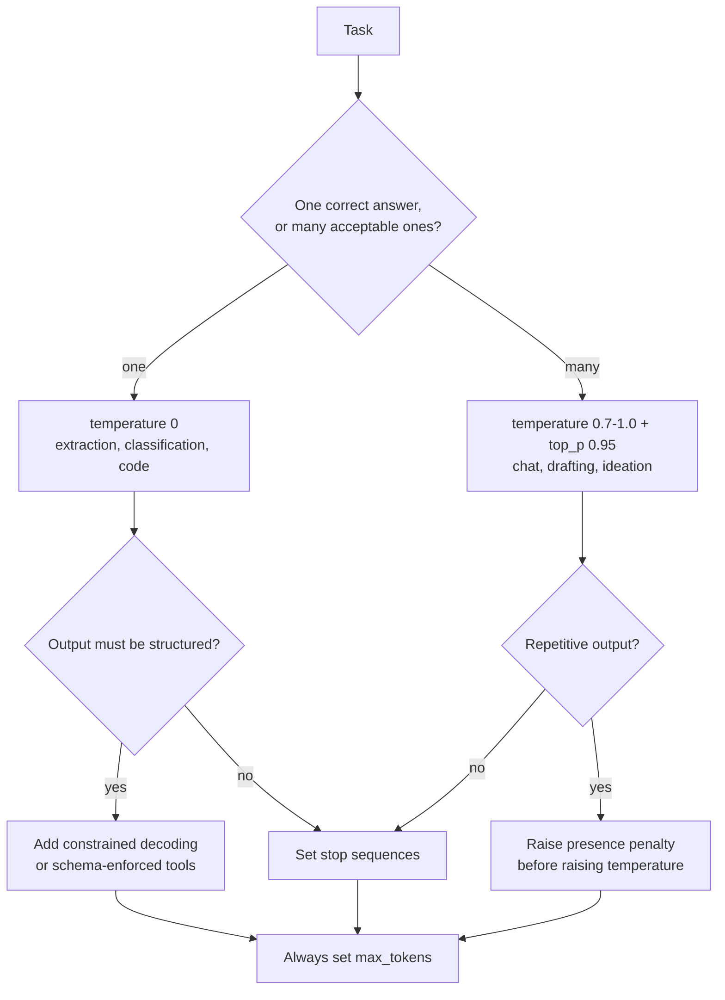
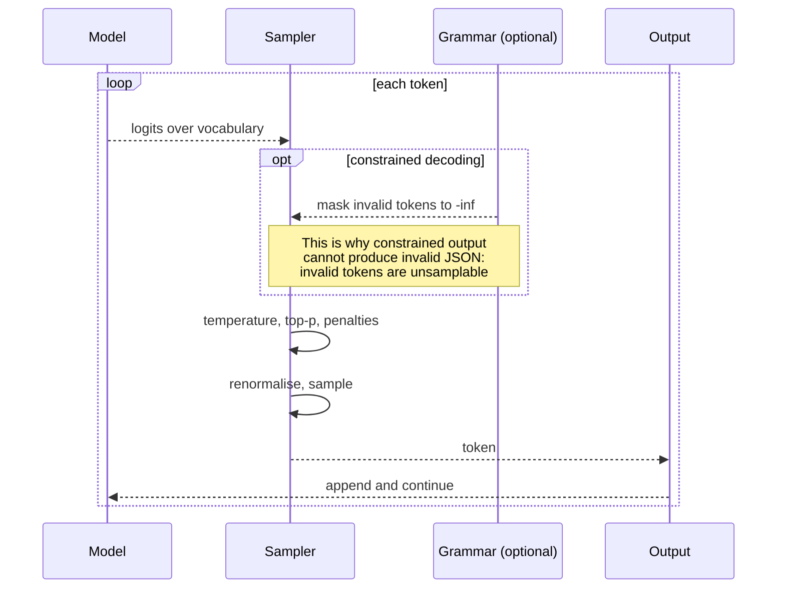

# Decoding & sampling

> **The one sentence:** the model does not produce text — it produces a
> probability distribution over the vocabulary, once per token, and decoding is
> the policy you apply to turn that into a choice.

Two systems with the same model and the same prompt can behave completely
differently because of settings most people copy from a tutorial without reading.

---

## 1 · Diagram

```
   ONE STEP OF GENERATION

   logits over the full vocabulary (~100k numbers)
        │
        ├── temperature ──► sharpen (T<1) or flatten (T>1) the distribution
        │
        ├── top-k ────────► keep only the k most likely
        │
        ├── top-p ────────► keep the smallest set summing to p  (nucleus)
        │
        ├── penalties ────► push down tokens already used
        │
        ▼
   renormalise ──► sample one token ──► append ──► repeat


   THE SHAPE OF THE CHOICE

   greedy (T=0)         always the top token. Repetitive, but reproducible-ish
   low T (0.1-0.3)      focused. Extraction, classification, code
   mid T (0.7-1.0)      natural. Chat, general use
   high T (>1.2)        erratic. Rarely what you want
```

---

```sim
decodestep
```

---

## 2 · Design

**Basic — the parameters and what each actually does.**

| Parameter | Effect | Sensible default |
|---|---|---|
| **temperature** | Divides logits before softmax. Lower = sharper | 0 for extraction, 0.7 for chat |
| **top_k** | Keep the k highest-probability tokens | 40, or off |
| **top_p** | Keep the smallest set whose mass reaches p | 0.9–0.95 |
| **frequency_penalty** | Reduce tokens by how often they have appeared | 0 unless looping |
| **presence_penalty** | Reduce tokens that appeared at all | 0 unless repetitive |
| **max_tokens** | Hard stop | **Always set it** |
| **stop** | Sequences that end generation | Structure-dependent |

**Top-p beats top-k**, and the reason is worth internalising. Top-k always keeps
exactly k candidates regardless of how confident the model is. When it is
certain — the next token is obviously `"("` — top-k still admits 39 wrong
alternatives. When it is genuinely uncertain across 200 plausible continuations,
top-k truncates to 40 and discards good options. Top-p adapts: it keeps few
candidates when confident and many when not, which is the behaviour you actually
want. Use top-p; leave top-k off unless you have a specific reason.

**Intermediate — beam search, and why chat models do not use it.** Beam search
keeps the *b* highest-probability partial sequences and returns the most likely
complete one. It genuinely helps where a single correct output exists —
translation, structured extraction. For open-ended generation it produces bland,
repetitive text, because the highest-probability sequence is the least
surprising one. Human-sounding text is not maximum-likelihood text, which is a
genuinely interesting finding and the reason sampling won for chat.

**Advanced — temperature 0 is not determinism, and this matters more than it
sounds.** Even at temperature 0 you can get different outputs from identical
inputs. Causes:

1. **Floating-point non-associativity** — GPU reductions sum in nondeterministic
   order, so near-ties in logits can flip.
2. **Batch composition** — kernels select different code paths by batch shape,
   changing rounding.
3. **Mixture-of-experts routing** — expert assignment can depend on other
   sequences in the batch.
4. **Silent infrastructure changes** — different GPU generation, different kernel
   version.

So "temperature 0 for reproducibility" is a reduction in variance, not a
guarantee. Any test asserting exact string equality on model output is a flaky
test waiting to happen — which is precisely why the evaluation module scores
rather than asserts.

---

## 3 · Flow



**`I` is a common misdiagnosis.** Repetition loops are usually better fixed with
a presence or frequency penalty than by raising temperature — raising temperature
fixes the loop by making *everything* less predictable, including the parts that
were fine.

---

## 4 · UML — where sampling sits in the loop



Constrained decoding is a **mask applied to the logits**, not a validation step
afterwards. That is why its guarantee is absolute rather than probabilistic.

---

The code above is the order the operations must happen in; the lab below is that order running, with the filters fighting over twelve fixed logits so you can see exactly which token each one takes.

```lab
sampler
```

## 5 · Example

```python
import numpy as np


def sample(logits, temperature=1.0, top_p=0.95, penalties=None):
    """One decoding step, in the order the operations must happen.

    Penalties are applied to raw logits BEFORE temperature: applying them after
    scaling makes their strength depend on the temperature, so tuning one
    silently changes the other.
    """
    logits = logits.astype(np.float64).copy()

    if penalties:
        for token_id, count in penalties.items():
            logits[token_id] -= count       # frequency-style: proportional to use

    if temperature <= 0:
        return int(np.argmax(logits))       # greedy; no sampling at all

    logits /= temperature
    probs = np.exp(logits - logits.max())
    probs /= probs.sum()

    if top_p < 1.0:
        order = np.argsort(probs)[::-1]
        cumulative = np.cumsum(probs[order])
        # Keep everything up to and INCLUDING the token that crosses p, so the
        # nucleus is never empty when one token already exceeds p on its own.
        cutoff = int(np.searchsorted(cumulative, top_p) + 1)
        keep = order[:cutoff]
        filtered = np.zeros_like(probs)
        filtered[keep] = probs[keep]
        probs = filtered / filtered.sum()

    return int(np.random.choice(len(probs), p=probs))
```

**Settings by task, as a table you can act on:**

```python
PRESETS = {
    # One right answer: remove variance entirely.
    "extraction":     {"temperature": 0.0, "max_tokens": 500},
    "classification": {"temperature": 0.0, "max_tokens": 10},
    "code":           {"temperature": 0.2, "top_p": 0.95, "max_tokens": 2000},

    # Many acceptable answers: sample.
    "chat":           {"temperature": 0.7, "top_p": 0.95, "max_tokens": 1000},
    "brainstorm":     {"temperature": 1.0, "top_p": 0.98, "max_tokens": 800},

    # Judges must be as reproducible as possible -- a ruler that varies run to
    # run cannot measure a change.
    "judge":          {"temperature": 0.0, "max_tokens": 200},
}
```

---

## 6 · Depth — the senior layer

**Structured output and sampling interact, and the interaction is easy to get
wrong.** High temperature raises the chance of a malformed JSON token. But
clamping to temperature 0 *and* a tight grammar can hurt reasoning quality,
because the model cannot express intermediate thinking. The pattern that works:
low temperature, a free-text reasoning field first, then constrained fields —
`{"reasoning": "...", "answer": "..."}` in that order.

**Penalties are blunt instruments applied to token ids, not meanings.** A
frequency penalty suppresses a token regardless of whether repeating it is
correct. In code generation this is actively harmful — `return`, `self` and `def`
are *supposed* to repeat. Penalties on code, or on structured output, cause
subtle corruption. Default to 0 and reach for them only for a demonstrated
repetition loop.

| Failure mode | Symptom | Fix |
|---|---|---|
| **No `max_tokens`** | One request consumes a huge budget | Always set it; it is a capacity control |
| **Penalties on code** | Broken syntax, missing keywords | Penalties 0 for structured output |
| **top_k instead of top_p** | Bland when uncertain, wrong when confident | Use top_p |
| **Temperature to fix repetition** | Everything gets less reliable | Presence penalty instead |
| **Asserting exact output in tests** | Flaky suite | Score, do not assert equality |
| **High temperature with a schema** | Occasional invalid JSON | Low temperature plus constrained decoding |

**Speculative decoding is one member of a family**, and the others are worth
recognising because they trade the draft *model* for something cheaper:

| Method | Where the guess comes from | Needs a second model? |
|---|---|---|
| **Prompt / lookup decoding** | n-grams copied out of the prompt or the history — excellent when output repeats input, as in editing, summarising or code refactoring | No |
| **Blockwise parallel decoding** | Extra output heads predicting several positions at once | No — extra heads |
| **Medusa** | Multiple decoding heads on the same backbone, verified as a tree | No — extra heads |
| **Lookahead decoding** | Jacobi-style parallel refinement plus an n-gram pool built as it goes | No |
| **Eagle** | A small trained draft head over the backbone's own features | A head, not a model |
| **Self-speculative** | The model's own shallower layers as the drafter | No |
| **Tree speculative** | Several candidate continuations verified in one pass | Either |

What they all share is the property that makes speculative decoding safe in the
first place: **the large model verifies, so the output distribution is
unchanged.** Guessing badly costs throughput, never correctness — which is why
this family is unusually safe to deploy and why lookup decoding, requiring no
model at all, is worth trying before anything with a draft model in it.

The one to reach for first is **prompt lookup**: on any task where the output
substantially quotes the input, copying n-grams from the prompt is a
near-free 2–3×, and it needs nothing but a dictionary.

**Speculative decoding** deserves a mention here because it is a decoding-time
optimisation that changes nothing about the output distribution. A small draft
model proposes several tokens; the large model verifies them in one forward pass
and accepts the longest correct prefix. Because verification is parallel and
decode is bandwidth-bound, this is often a two-to-three-times speedup with
**mathematically identical** output. That last property is what makes it safe to
deploy without re-running your evals — worth saying explicitly, because it is
unusual among optimisations.

**FR-Spec is the refinement worth knowing**, because it fixes a bottleneck that
only appears at modern vocabulary sizes. Methods like EAGLE compress the draft
model down to roughly one layer plus an LM head — at which point, with a 128k
vocabulary, *the LM head is most of the draft cost*. FR-Spec shrinks the
**draft's** vocabulary to a frequency-ranked shortlist, exploiting the long tail
of token frequency: a small high-frequency subset covers most of what a drafter
proposes. Reported: LM-head compute down about 75%, and roughly 1.12× over
EAGLE-2. The property that makes it safe is the same one that makes speculative
decoding safe — **verification still runs over the full vocabulary**, so the
output distribution is unchanged. The draft is allowed to be narrow because the
draft is only ever a guess.

**Logprobs are underused.** Most APIs can return per-token log-probabilities,
which give you a free confidence signal: low mean logprob on a generated answer
correlates with the model being unsure. It is not calibrated and should not be
presented to users as a probability, but as a routing signal — escalate low
confidence to a larger model or to a human — it costs nothing and works.

---

## 7 · From each seat

| Seat | What decoding means from here |
|---|---|
| **User** | Why the same question gives different answers, which reads as unreliability unless the product explains it. For anything users expect to be stable, use temperature 0 and say so. |
| **Coder** | Always set `max_tokens`. Default penalties to 0. Use top_p, not top_k. Never assert exact string equality on output in a test. |
| **Tester** | Temperature 0 reduces variance but does not guarantee determinism — floating-point order and batch composition still flip near-ties. Score outputs; do not compare strings. |
| **System designer** | `max_tokens` is a capacity control: unbounded output length means one request can consume the throughput of many. Speculative decoding is a free speedup with identical output. |
| **Architect** | Decoding settings are part of the model contract and belong in version control with the prompt. A settings change is a behaviour change and deserves the same review. |
| **CEO** | Output tokens are the expensive half of the bill, and `max_tokens` is the direct control on it. "Why is the bill high" is often "nobody capped output". |
| **Market** | Fully commoditised — every provider exposes the same knobs. The only differentiator is knowing which to use, which is why this is a page and not a product. |

---

## 8 · Interview questions

| Question | What they are testing | Answer sketch |
|---|---|---|
| "Temperature 0 versus 0.7?" | Whether you can justify a default | 0 where one answer is correct — extraction, classification, judging. 0.7 where many are acceptable — chat, drafting. The question is whether variance is a feature or a defect for this task. |
| "top_k or top_p?" | Depth | top_p. It adapts to the model's confidence: few candidates when certain, many when not. top_k keeps a fixed number regardless, which is wrong in both directions. |
| "Is temperature 0 deterministic?" | The misconception that matters | No. Floating-point non-associativity in GPU reductions, batch composition and expert routing can all flip near-ties. It reduces variance; it does not eliminate it — which is why tests score rather than assert equality. |
| "Why don't chat models use beam search?" | Understanding, not recall | Beam search maximises sequence likelihood, and the most likely text is the least surprising — bland and repetitive. Human-sounding text is not maximum-likelihood text. Beam still wins where one correct output exists, like translation. |
| "The output repeats itself." | Diagnosis | Presence or frequency penalty first, not temperature — raising temperature fixes the loop by making everything less predictable. And check the prompt is not inviting repetition. |
| "What is speculative decoding?" | Currency | A draft model proposes several tokens; the large model verifies them in one pass and accepts the longest correct prefix. Two to three times faster with mathematically identical output — so it needs no re-evaluation, unlike quantization. |

---

## Stop condition

You are done when you can:

1. explain temperature, top-k and top-p and why top-p is preferred,
2. say why temperature 0 is not determinism and name a cause,
3. explain why beam search lost for chat but not for translation,
4. give the right settings for extraction, chat and judging, and
5. describe speculative decoding and why it needs no re-evaluation.

---

## Sources worth reading

| Topic | Source |
|---|---|
| Nucleus sampling | *The Curious Case of Neural Text Degeneration* (Holtzman et al., 2019) — the paper that established top-p |
| Speculative decoding | Leviathan et al. (2022); Chen et al. (2023) |
| Constrained generation | The Outlines library; vLLM guided decoding |
| Determinism | Any write-up on GPU floating-point reproducibility — the problem is not LLM-specific |
