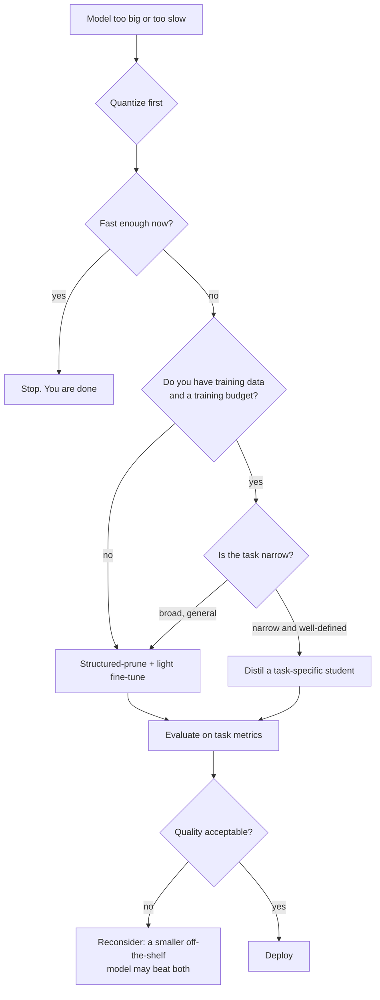
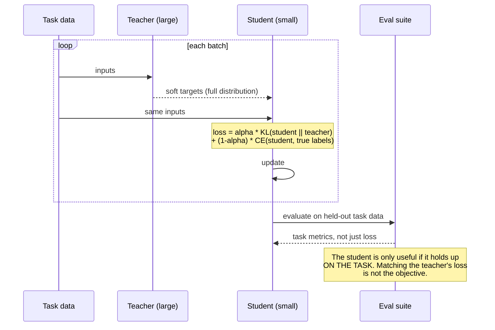

# Distillation & pruning

> **The one sentence:** quantization keeps every weight and stores it in fewer
> bits; distillation and pruning change how many weights there are at all.

They are grouped together because they answer the same question — *can this be a
smaller model?* — and because the honest comparison between them, and against
quantization, is what an interviewer is actually probing.

---

## 1 · Diagram

```
   THREE WAYS TO MAKE A MODEL CHEAPER, AND WHAT EACH ONE SACRIFICES

   QUANTIZATION          same architecture, same weights, fewer bits each
                         |####|####|####|  ->  |##|##|##|
                         cheap, reversible, no training
                         sacrifices: numerical precision

   PRUNING               same architecture, FEWER weights
                         |####|####|####|  ->  |#  #|#  #|#  #|
                         needs fine-tuning to recover
                         sacrifices: capacity, unevenly

   DISTILLATION          NEW smaller architecture, trained to imitate
                         |####|####|####|  ->  |##|##|
                         needs a full training run + data
                         sacrifices: generality outside the training distribution


   COST TO DO IT           quantization  <<  pruning  <  distillation
   QUALITY YOU KEEP        depends entirely on the task
   WHO SHOULD DO IT        everyone         few          fewer still
```

---

## 2 · Design

**Intermediate — distillation.** A large **teacher** produces outputs; a smaller
**student** is trained to reproduce them. What the student learns from matters:

| Signal | What the student sees | Notes |
|---|---|---|
| **Hard labels** | The teacher's chosen token | Wastes most of the signal |
| **Soft labels (logits)** | The full probability distribution | The classic method; carries the teacher's uncertainty |
| **Intermediate states** | Hidden layers, attention maps | Stronger, needs architectural compatibility |
| **Generated data** | Teacher-written examples | What most "distillation" means in practice today |

**The reason soft labels work is the interesting part.** A teacher saying
`{cat: 0.7, dog: 0.25, car: 0.001}` tells the student that cats resemble dogs
and not cars. That relational information — Hinton called it *dark knowledge* —
is absent from the hard label `cat`, and it is why a student trained on
distributions beats the same student trained on the same data's ground truth.

> **What "distillation" usually means in 2026.** Most teams calling it
> distillation are doing *synthetic data generation*: use a strong model to
> write training examples, fine-tune a small model on them. That is practical
> and effective, but it is training on hard labels — the dark knowledge is gone.
> Worth naming the difference precisely, because interviewers notice.

**Intermediate — pruning.** Remove weights and keep the rest. The split that
decides whether you get a speedup at all:

| Type | Removes | Speedup on normal hardware |
|---|---|---|
| **Unstructured** | Individual weights, anywhere | **None** without sparse kernels — you get a sparse matrix stored densely |
| **Semi-structured (2:4)** | 2 of every 4 weights | Real, on Ampere and newer with sparse tensor cores |
| **Structured** | Whole heads, channels, layers | Real everywhere — the matrix is genuinely smaller |

**This is the trap.** Unstructured pruning reaches far higher sparsity with far
less quality loss, and delivers *no speedup at all* on a normal GPU. You get a
model that is 90% zeros, stored as dense FP16, running at exactly the original
speed. Structured pruning hurts quality more and is the one that actually makes
inference faster.

**Advanced — what pruning tells you about the model.** Prune by magnitude and
you discover transformers are wildly uneven: some attention heads can be removed
with no measurable effect, while others are load-bearing. Middle layers tend to
be more redundant than the first and last. Depth pruning — dropping whole layers
— often beats width pruning at the same parameter reduction, which is a genuinely
surprising result worth knowing.

---

## 3 · Flow



**Two branches carry most of the judgement.**

`B` first, always: quantization is hours of work, no training, and reversible.
Pruning and distillation are projects. Doing them before quantizing is skipping
the cheap option to start with the expensive one.

`G` is where distillation succeeds or fails. Distillation works when the task is
narrow — classification, extraction, routing, one domain of question answering.
A student trained to imitate a general model *in general* mostly reproduces a
worse general model, and an off-the-shelf small model probably beats it for
none of the effort.

---

## 4 · UML — distillation as a sequence



The two-term loss matters: pure imitation inherits the teacher's mistakes, pure
ground truth throws away the dark knowledge. `alpha` around 0.5–0.9 is typical,
and it is worth tuning.

---

## 5 · Example

```python
import torch
import torch.nn.functional as F


def distillation_loss(student_logits, teacher_logits, labels, alpha=0.7, T=2.0):
    """Combine imitation of the teacher with the ground truth.

    Temperature T softens both distributions so the student sees the teacher's
    relative preferences among the WRONG answers -- that ranking is the useful
    signal a hard label throws away.

    The T*T factor restores the gradient magnitude, which softening otherwise
    scales down by 1/T^2. Omitting it is a common bug: training silently
    becomes a very low learning rate on the distillation term.
    """
    soft = F.kl_div(
        F.log_softmax(student_logits / T, dim=-1),
        F.softmax(teacher_logits / T, dim=-1),
        reduction="batchmean",
    ) * (T * T)

    hard = F.cross_entropy(student_logits, labels)
    return alpha * soft + (1 - alpha) * hard


@torch.no_grad()
def head_importance(model, batches) -> torch.Tensor:
    """Rank attention heads by how much the loss depends on them.

    Magnitude alone is a poor guide: a small weight in a sensitive position
    matters more than a large one in a redundant head. This masks each head and
    measures the loss it costs, which is expensive but honest.

    Run it before structured pruning; the spread is usually far wider than
    people expect, and some heads cost essentially nothing.
    """
    baseline = evaluate_loss(model, batches)
    scores = torch.zeros(model.config.num_hidden_layers, model.config.num_attention_heads)

    for layer in range(scores.shape[0]):
        for head in range(scores.shape[1]):
            with mask_head(model, layer, head):
                scores[layer, head] = evaluate_loss(model, batches) - baseline
    return scores
```

**The check that stops you shipping a useless prune:**

```python
def will_pruning_actually_be_faster(sparsity_pattern: str, gpu: str) -> bool:
    """Sparsity only becomes speed if the hardware and kernels support it.

    An unstructured 90%-sparse model stored densely runs at exactly the speed
    of the dense original. This is the single most common disappointment in
    pruning work, and it is knowable in advance.
    """
    if sparsity_pattern == "structured":
        return True                      # the matrices are genuinely smaller
    if sparsity_pattern == "2:4":
        return gpu in {"A100", "H100", "L40S", "RTX-30xx", "RTX-40xx"}
    return False                         # unstructured: no speedup without sparse kernels
```

---

## 6 · Depth — the senior layer

**The comparison that decides the whole question.** Before distilling or
pruning, check whether someone has already released a good small model:

| Path | Effort | Typical outcome |
|---|---|---|
| Off-the-shelf small model + fine-tune | Days | Usually the best quality-per-effort |
| Quantize the big model | Hours | Best first move; often sufficient |
| Structured prune + recover | Weeks | Worth it when the architecture must stay fixed |
| Distil a task-specific student | Weeks–months | Best result **on a narrow task**, worst on a broad one |

A 3B model trained by a well-resourced lab has seen more data than your
distillation run ever will. Distilling a general-purpose student to compete with
it is a losing race. Distilling a *narrow* student that beats it on your one task
is very winnable.

**Distillation inherits the teacher's flaws, including its biases and its
confident errors.** The student cannot exceed the teacher on the distribution it
was distilled on — it can only get closer to it, more cheaply. If the teacher is
wrong about something in your domain, the student will be wrong about it too,
with less capacity to be argued out of it.

**Legal reality, and it is not a footnote.** Many commercial model licences
explicitly prohibit using outputs to train competing models. Distilling from a
hosted API can breach the terms you agreed to. Check the licence before the
architecture — an architect who does not raise this is not doing the job.

| Failure mode | Symptom | Fix |
|---|---|---|
| **Unstructured pruning for speed** | 90% sparse, identical latency | Structured or 2:4; check kernel support first |
| **Distilling a general model** | Student is a worse generalist | Narrow the task, or use an off-the-shelf small model |
| **Pruning without fine-tuning** | Sharp quality drop | Always recover afterwards; even a short run helps |
| **Uniform pruning across layers** | Avoidable damage | Measure per-head and per-layer importance; the spread is large |
| **Distilling on the wrong distribution** | Great offline, poor live | Generate teacher outputs on real production inputs |
| **Ignoring the licence** | Legal exposure | Read it before you start |

**What to actually reach for.** For most application teams, in order: quantize;
if that is not enough, take a smaller off-the-shelf model and fine-tune it; only
then consider pruning or distillation. That ordering is unglamorous and it is
correct — and saying it plainly in an interview reads as experience, not as a
lack of ambition.

---

## 7 · From each seat

| Seat | What this looks like from here |
|---|---|
| **User** | A faster, cheaper model that is usually slightly worse in ways they cannot articulate. The failure is silent: the student sounds exactly as confident as the teacher. |
| **Coder** | Do not skip the `T*T` factor. Check sparse kernel support before pruning. Version the student against the teacher's exact checkpoint — a re-distilled student from a different teacher build is a different model. |
| **Tester** | The compressed model needs the *full* regression suite, not a spot check. Compare student against teacher per item, not in aggregate — the interesting failures are concentrated in specific buckets, usually the rare ones. |
| **System designer** | A smaller model changes memory, batch size and throughput together. It may also change your hardware tier, which is where the real money is — dropping from A100 to L4 saves more than the token maths suggests. |
| **Architect** | Distillation creates a model you now own and must maintain: retraining when the teacher improves, drift monitoring, a data pipeline. That is a permanent commitment traded for per-token cost. And check the teacher's licence. |
| **CEO** | Distillation is an R&D project with a several-week horizon and an uncertain outcome; quantization is an afternoon. Ask why the cheap option was not enough before funding the expensive one. There is genuine legal risk in distilling from a commercial API. |
| **Market** | Small strong models are released constantly, and each release makes in-house distillation less attractive. The moat was never the technique — it is proprietary task data. If your student's advantage is data nobody else has, it holds; otherwise next quarter's open release erases it. |

---

## 8 · Interview questions

| Question | What they are testing | Answer sketch |
|---|---|---|
| "Quantization, pruning or distillation?" | Judgement and cost sense | Quantize first — hours, no training, reversible. Then a smaller off-the-shelf model. Pruning and distillation are week-to-month projects and are only right when those fail or the task is narrow. |
| "Why do soft labels beat hard labels?" | Whether you understand the mechanism | The distribution encodes relationships between classes — that cats resemble dogs and not cars. Hard labels discard it. That relational signal is why a student on distributions beats the same student on ground truth. |
| "You pruned to 90% sparsity and it is not faster." | The classic trap | Unstructured sparsity gives no speedup without sparse kernels; the model is stored densely. You need structured pruning, or 2:4 semi-structured on hardware with sparse tensor cores. |
| "When does distillation fail?" | Realism | When the task is broad. A general student mostly reproduces a worse generalist, and a released small model beats it for none of the effort. Distillation wins on narrow, well-defined tasks with proprietary data. |
| "What is the risk in distilling from a commercial API?" | Commercial awareness | Most licences prohibit training competing models on their outputs. It is a licence question before it is a technical one, and it belongs in the design review. |
| "How do you decide what to prune?" | Depth | Not magnitude alone. Measure per-head and per-layer importance by masking and observing the loss — the spread is wide, middle layers are more redundant, and depth pruning often beats width at equal reduction. |

---

## Stop condition

You are done when you can:

1. state what each of the three techniques sacrifices,
2. explain why unstructured pruning gives no speedup,
3. say what dark knowledge is and why soft labels carry it,
4. give the ordering you would actually recommend and defend it, and
5. raise the licensing issue unprompted.

---

## Sources worth reading

| Topic | Source |
|---|---|
| Distillation | *Distilling the Knowledge in a Neural Network* (Hinton, Vinyals & Dean, 2015) — still the clearest statement |
| Pruning | *The Lottery Ticket Hypothesis* (Frankle & Carbin, 2018); *SparseGPT* (Frantar & Alistarh, 2023) for one-shot LLM pruning |
| Head redundancy | *Are Sixteen Heads Really Better than One?* (Michel et al., 2019) |
| Depth pruning | *The Unreasonable Ineffectiveness of the Deeper Layers* (Gromov et al., 2024) |
| Practical | NVIDIA's 2:4 structured sparsity docs — what the hardware actually accelerates |
