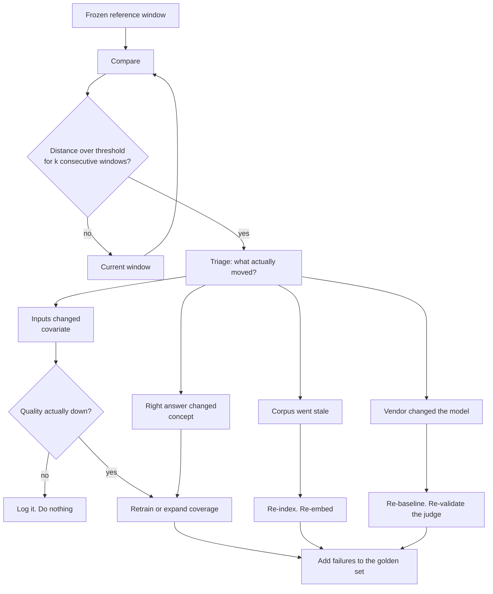
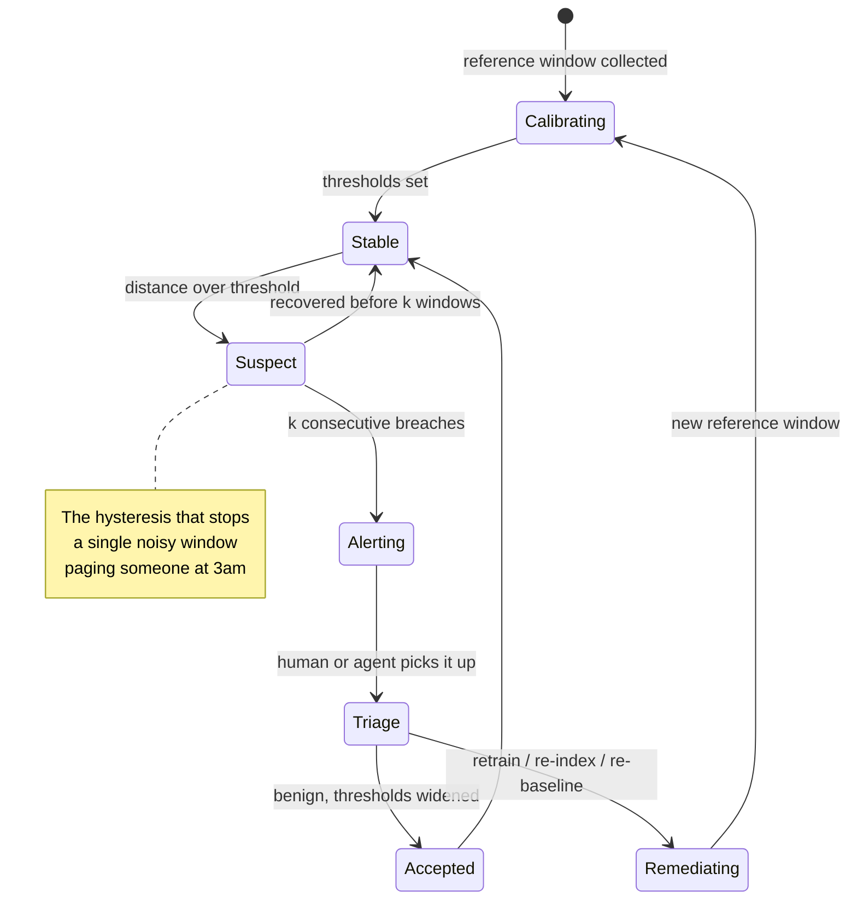

# Drift detection

> **The one sentence:** a model does not get worse — the world moves, and the
> model stays where it was.

Drift is the only failure mode in this handbook where **nothing breaks**. No
exception, no alert, no failed test. The system keeps returning confident
answers at the same latency, and they get quietly less right. That is what makes
it a monitoring problem rather than a testing one.

---

## 1 · Diagram

```
   THE THREE THINGS THAT CAN MOVE, AND WHAT EACH ONE MEANS

   P(X)          the inputs                -> DATA / COVARIATE DRIFT
                 new vocabulary, new customers, a new sensor
                 model may still be fine

   P(Y|X)        the input->output rule    -> CONCEPT DRIFT
                 the same question now has a different right answer
                 model is now wrong. This is the one that hurts

   P(Y)          the label mix             -> PRIOR / LABEL SHIFT
                 failures got rarer because you fixed things
                 thresholds are now miscalibrated


   AND THE ONE THAT IS NOT DRIFT AT ALL:

   the vendor silently upgraded the model    -> YOUR SYSTEM MOVED
                                                not the world.
                                                Different fix entirely.
```

**Distinguishing these four is the whole skill.** Every one of them shows up in
a dashboard as "the numbers changed", and every one has a different remedy.
Retraining fixes concept drift. It does nothing for a vendor model swap, and it
actively wastes money on benign covariate drift.

---

```sim
driftwatch
```

---

## 2 · Design

**Basic.** A drift detector is a **reference window**, a **current window**, a
**distance measure**, and a **threshold**. You are asking one question: is what
I am seeing now plausibly from the same distribution as what I saw then?

**Intermediate.** Which distance you pick depends entirely on what you are
comparing:

| What you are watching | Measure | Why this one |
|---|---|---|
| A numeric feature | Kolmogorov–Smirnov, or PSI | Distribution-free, no assumption of normality |
| A categorical feature | Chi-square, or PSI | Handles unordered categories |
| Embeddings / text | MMD, or distance-to-centroid | Works in high dimensions where per-feature tests fall apart |
| Model confidence | KS on the score distribution | A label-free proxy — see below |
| Output length, refusal rate | Simple rate + control chart | Cheap and startlingly effective |

**Population Stability Index** is the one you will meet most in industry
because it is simple and has conventional bands:

| PSI | Conventional reading |
|---|---|
| < 0.1 | No meaningful shift |
| 0.1 – 0.25 | Moderate — investigate |
| > 0.25 | Significant — act |

Treat those bands as folklore with a useful shape, not as physics. They come
from credit scoring and they are not calibrated for your data.

**Advanced — the point most people miss.** For an LLM system, per-feature
statistical drift is usually the *wrong instrument*. There are no tidy tabular
features; the input is text. What actually works:

1. **Embed the inputs and watch the embedding distribution.** Distance from the
   reference centroid, or MMD between windows. Catches "users started asking
   about a product that did not exist last quarter".
2. **Watch cheap behavioural proxies.** Refusal rate, retrieval score
   distribution, answer length, tool-call frequency, "no relevant documents
   found" rate. These need no labels, cost nothing, and move before quality does.
3. **Watch the retrieval layer separately from the model.** In RAG, the most
   common real drift is that the *corpus* went stale, not that the model did. No
   amount of model monitoring finds that.

---

## 3 · Flow

What actually happens, in order, and where teams stop too early:

1. **Freeze a reference window.** Usually the data the current model was
   validated on. Store it, do not recompute it — a rolling reference silently
   normalises away slow drift, which is the drift you most want to catch.
2. **Compute the same statistics on a current window.** Size it by volume, not
   by time: "1,000 requests" is stable; "one day" is not, when traffic is
   seasonal.
3. **Compare and score.** Distance measure per monitored signal.
4. **Alert on persistence, not on a single breach.** Require *k* consecutive
   windows. One bad window is a Monday, not a trend.
5. **Triage: which of the four things moved?** This is the step that gets
   skipped, and skipping it is why so many drift alerts end in a pointless
   retrain.
6. **Decide.** Retrain, re-embed the corpus, adjust a threshold, or do nothing
   and write down why.
7. **Feed confirmed failures into the golden set.** The eval set only ever
   grows. This is the ratchet that stops the same drift surprising you twice.



**Branch `J → K` is the mature one.** Covariate drift with no quality impact is
extremely common and needs no action beyond a note. A team that retrains on
every drift alert burns money and introduces risk for nothing.

---

## 4 · UML — detector as a state machine



The `Suspect` state is what separates a usable detector from one the team mutes
within a fortnight.

---

## 5 · Example

Two detectors: PSI for a numeric signal, and an embedding-centroid detector for
text, which is the one that matters for LLM inputs.

```python
import numpy as np


def psi(reference: np.ndarray, current: np.ndarray, bins: int = 10) -> float:
    """Population Stability Index between two samples.

    Bin edges come from the REFERENCE only. Re-binning on the current window
    would move the goalposts with the data and hide the very shift being
    measured.
    """
    edges = np.quantile(reference, np.linspace(0, 1, bins + 1))
    edges[0], edges[-1] = -np.inf, np.inf

    ref_frac = np.histogram(reference, bins=edges)[0] / len(reference)
    cur_frac = np.histogram(current, bins=edges)[0] / len(current)

    # An empty bin sends the log to infinity; the usual floor keeps one unlucky
    # bin from dominating a score that is otherwise fine.
    floor = 1e-4
    ref_frac = np.clip(ref_frac, floor, None)
    cur_frac = np.clip(cur_frac, floor, None)

    return float(np.sum((cur_frac - ref_frac) * np.log(cur_frac / ref_frac)))


def embedding_drift(reference: np.ndarray, current: np.ndarray) -> dict:
    """Drift in text inputs, measured in embedding space.

    Per-feature tests are the wrong tool on 384 correlated dimensions: with
    enough features something is always 'significant'. Comparing each window to
    the reference centroid collapses that to one interpretable number.
    """
    centroid = reference.mean(axis=0)
    centroid /= np.linalg.norm(centroid)

    def cosines(batch):
        norms = batch / np.linalg.norm(batch, axis=1, keepdims=True)
        return norms @ centroid

    ref_sim, cur_sim = cosines(reference), cosines(current)
    return {
        # How far the typical input has moved from what we validated on.
        "centroid_shift": float(ref_sim.mean() - cur_sim.mean()),
        # Widening spread means a broader mix of topics, even if the mean holds.
        "spread_change": float(cur_sim.std() - ref_sim.std()),
        "psi_on_similarity": psi(ref_sim, cur_sim),
    }
```

And the part that keeps it from paging people at 3am:

```python
class PersistentDetector:
    """Alerts only after k consecutive breaches.

    A single window over threshold is noise: with weekly seasonality and
    modest volume, some window is always unusual. Requiring persistence trades
    a little detection latency for an alert people still trust in month three.
    """

    def __init__(self, threshold: float, k: int = 3) -> None:
        self.threshold, self.k, self.streak = threshold, k, 0

    def observe(self, distance: float) -> str:
        self.streak = self.streak + 1 if distance > self.threshold else 0
        if self.streak >= self.k:
            return "ALERT"
        return "SUSPECT" if self.streak else "STABLE"
```

---

## 6 · Depth — the senior layer

**Delayed labels are the real problem, and in some domains the label never
arrives.** In predictive maintenance the truth appears when the machine fails —
or never, because you intervened and prevented it. So you monitor proxies:
alert dismissal rate, work orders raised, mean time between false alarms.

**Successful intervention destroys its own evidence.** You warned, they fixed
it, the machine did not fail, and the label reads "no failure" — which looks
exactly like a false positive. This is a genuine, well-known problem, and naming
it unprompted is a strong signal in any predictive-maintenance interview. The
mitigations are both uncomfortable: hold out a control group where alerts are
logged but not acted on (usually politically impossible), or change the label to
"inspection confirmed the fault" instead of "machine failed".

**Drift detection has a false-positive economy.** With 40 monitored features at
p < 0.05, you expect two significant results per window from pure chance. Teams
respond by raising thresholds until nothing fires, which is muting with extra
steps. Better: monitor a *small* number of signals you would actually act on,
correct for multiplicity, and require persistence.

| Failure mode | What you see | Fix |
|---|---|---|
| **Rolling reference** | Slow drift never detected | Freeze the reference at validation time |
| **Alert fatigue** | Everything is amber; nobody looks | Fewer signals, persistence requirement, act-or-widen discipline |
| **Retrain reflex** | Cost rises, quality does not | Triage first: no quality impact means no retrain |
| **Window too small** | Constant false alarms | Size by volume, not by clock |
| **Watching the model, not the corpus** | RAG quality falls, all model metrics green | Monitor index freshness and retrieval scores separately |
| **Vendor version change read as drift** | Step change on a specific date | Pin model versions; annotate the trend when you upgrade |

**At scale, drift is per-segment.** Aggregate stability routinely hides a
segment falling apart: one language, one customer, one device type. The
aggregate moves 1%, the segment moves 40%, and the complaints all come from that
segment. Monitor by segment for the segments you have SLAs on — which is also
where bias monitoring and drift monitoring turn out to be the same machinery.

**What to actually retrain on.** If you retrain on recent data alone you get
catastrophic forgetting of the long tail; if you retrain on everything you dilute
the shift you were trying to capture. The usual answer is a weighted mix, plus a
holdout from *before* the drift so you can confirm you did not lose the old
behaviour while gaining the new.

---

## 7 · From each seat

| Seat | What drift looks like from here |
|---|---|
| **User** | Nothing announces itself. Answers just start feeling slightly off, and they stop trusting it before anyone files a ticket. That silent trust decay is the actual cost. |
| **Coder** | Log inputs and outputs with a schema version and a model version from day one. You cannot detect drift retroactively without a reference window, and nobody ever wishes they had logged less. |
| **Tester** | Drift is out of scope for tests and you should say so. Your job is the golden set and the ratchet: every confirmed drift failure becomes a permanent regression case. |
| **System designer** | It is a batch job over logged traffic, not an inline check. Budget storage for the reference window, decide the retention period, and make the alert route somewhere a human actually reads. |
| **Architect** | Committing to a model means committing to a retraining pipeline and the data platform under it. If there is no path to retrain, drift monitoring only tells you how bad things are getting. |
| **CEO** | This is the difference between finding out from a dashboard and finding out from a customer. The cost is storage plus a monitoring job; the thing it protects is renewal. Ask what the trigger-to-remediation time is — a detector nobody acts on is theatre. |
| **Market** | Heavily tooled: Evidently, Arize, WhyLabs, Fiddler, plus the cloud vendors' built-ins. Buy the detector. The part nobody can sell you is knowing which signal matters in your domain and what to do when it fires. |

---

## 8 · Interview questions

| Question | What they are testing | Answer sketch |
|---|---|---|
| "How would you detect drift in a live ML system?" | Structure | Frozen reference window, current window sized by volume, a distance measure suited to the signal type, persistence before alerting, then triage into covariate / concept / corpus / vendor before acting. |
| "Covariate versus concept drift?" | Vocabulary with meaning | Covariate is P(X) moving — inputs look different, model may still be right. Concept is P(Y\|X) moving — same input, different correct answer, model is now wrong. Only the second necessarily requires retraining. |
| "You have no labels. Now what?" | Realism | Label-free proxies: model confidence distribution, refusal rate, retrieval scores, output length, embedding distance from the reference centroid. Plus human review on a stratified sample, which is a slow, partial label pipeline. |
| "In predictive maintenance, how do you know an alert was right?" | Domain depth | Often you cannot — successful intervention erases the evidence. Use "inspection confirmed the fault" as the label, track dismissal rate as a false-positive proxy, and mention the control-group option and why it is rarely allowed. |
| "Your drift alarm fires every week and nobody looks." | Operational maturity | That is a design failure, not a discipline failure. Cut the number of monitored signals to those you would act on, require k consecutive breaches, and enforce act-or-widen — every alert either causes a change or moves the threshold. |
| "Drift detected. Do you retrain?" | Judgement | Not automatically. Triage first: if quality has not moved, log and widen. If the corpus is stale, re-index — retraining fixes nothing. If the vendor changed the model, re-baseline. Retrain only for genuine concept drift, and hold out pre-drift data to confirm you did not forget the old behaviour. |

---

## Stop condition

You are done when you can:

1. name the four things that can move and give a different remedy for each,
2. explain why the reference window must be frozen,
3. give two label-free drift proxies for an LLM system,
4. say why aggregate monitoring hides the failure that matters, and
5. describe a case where the correct response to a drift alert is to do nothing.

---

## Sources worth reading

| Topic | Source |
|---|---|
| Framing and taxonomy | *Learning under Concept Drift: A Review* (Lu et al., 2019) |
| Practical monitoring | Evidently AI's open-source docs — the best free treatment of which test to use when |
| Label-free monitoring | Papers on confidence-based and proxy-metric monitoring; Arize and WhyLabs both publish accessible write-ups |
| Statistical care | Any treatment of multiple-comparison correction — the false-positive economy above is just Bonferroni wearing a hat |
