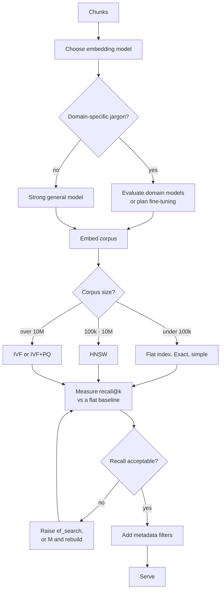
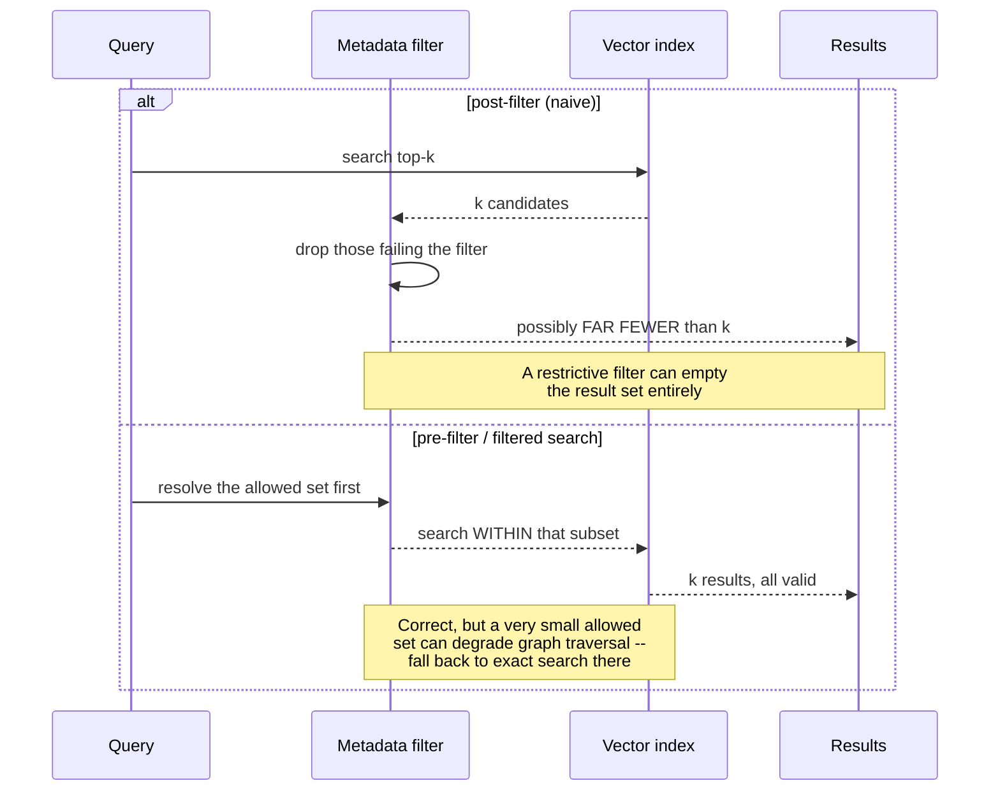

# Embeddings & vector databases

> **The one sentence:** approximate nearest-neighbour search is called
> *approximate* for a reason, and the fraction of true neighbours you are
> quietly missing is a number most teams have never measured.

Embeddings are the retrieval substrate; the database is how you search them at
scale. Both involve trade-offs that are invisible until you look for them.

---

## 1 · Diagram

```
   THE PIPELINE, and what each stage costs you

   text ──► EMBEDDING MODEL ──► vector (384 / 768 / 1536 / 3072 dims)
                                     │
                                     ▼
                              VECTOR INDEX
                                     │
              ┌──────────────────────┼──────────────────────┐
              │                      │                      │
          FLAT (exact)          HNSW (graph)            IVF (clusters)
          100% recall           ~95-99% recall          ~90-95% recall
          O(n) per query        O(log n)                O(n/clusters)
          fine to ~100k         the default             good for huge sets


   THE TRADE NOBODY MEASURES

   "our retrieval hit rate is 0.85"
      -> but is the index returning the TRUE nearest neighbours?
      -> at HNSW defaults you may be losing 3-8% of them before
         any of your retrieval logic runs.
      -> that loss is invisible unless you compare against a flat index.
```

---

```sim
annsearch
```

---

## 2 · Design

**Basic — what an embedding is.** A fixed-length vector positioned so that
semantically similar text lands nearby. Similarity is cosine (or dot product on
normalised vectors, which is the same thing). The model is trained so that
paraphrases converge and unrelated text diverges.

| Property | Consequence |
|---|---|
| **Dimensions** (384–3072) | Higher costs more memory and compute; gains diminish sharply |
| **Max sequence length** | Effective length is well below the stated one |
| **Symmetric vs asymmetric** | Trained for query↔document, or document↔document. They differ |
| **Domain** | General models underperform on specialised jargon |

**Asymmetric versus symmetric is a real and commonly-missed distinction.**
Retrieval models are trained on *(short query, long passage)* pairs — the two
sides are different shapes. Some models expect explicit prefixes (`"query: "` /
`"passage: "`) and lose measurable quality without them. Using a symmetric
similarity model for asymmetric retrieval is a silent quality loss.

**Intermediate — the index structures.**

| Index | Mechanism | Use when |
|---|---|---|
| **Flat** | Compare against everything | Under ~100k vectors, or as a recall baseline |
| **HNSW** | Navigable small-world graph, greedy descent | The default. Fast, high recall, memory-hungry |
| **IVF** | Cluster, then search nearest clusters | Very large sets, memory-constrained |
| **IVF+PQ** | Clusters plus compressed vectors | Billions of vectors; recall drops noticeably |

**HNSW's knobs**, and what each actually controls:

```
   M                 graph connectivity. Higher = better recall, more memory
   ef_construction   effort at BUILD time. Higher = better graph, slower build
   ef_search         effort at QUERY time. Higher = better recall, slower query
                     ^ the one you can tune live, per query
```

`ef_search` is the runtime recall/latency dial. It is the right thing to raise
when recall matters more than a few milliseconds, and it needs no reindexing.

**Advanced — measure your recall, because nobody ships with it measured.**
Approximate search trades recall for speed, and the default settings of most
libraries lose several percent of true neighbours. That loss happens *before*
your reranker, your query transformation and your prompt — it is a ceiling
underneath everything else.

Measuring it is straightforward and almost nobody does it: build a flat index
over a sample, compare the top-k against your production index, and report the
overlap. If it is 0.92, then eight percent of the time the best passage never
reached your reranker.

---

## 3 · Flow



**Node `H` is under-used.** Below about 100k vectors, exact search is fast enough
on modern hardware, gives 100% recall, and removes an entire category of
tuning and doubt. Many production systems do not need an ANN index at all and
adopt one because it feels professional.

---

## 4 · UML — filtered search, and why the order matters



**Post-filtering is the wrong default** and it is what a naive implementation
does. Searching top-10 then discarding those the user may not see can return two
results, or none, while perfectly good permitted documents sat at rank 11.

---

## 5 · Example

```python
import numpy as np


def recall_at_k(exact_index, approx_index, queries, k=10) -> float:
    """What fraction of the TRUE nearest neighbours the ANN index returns.

    This is the ceiling under the whole retrieval stack, and it is invisible
    without an exact baseline to compare against. Measure it once on a sample;
    it is usually the cheapest quality finding available.
    """
    total = 0.0
    for q in queries:
        truth = set(exact_index.search(q, k))
        got = set(approx_index.search(q, k))
        total += len(truth & got) / k
    return total / len(queries)


def normalise(vectors: np.ndarray) -> np.ndarray:
    """Unit-normalise so dot product IS cosine similarity.

    Most indexes are faster with inner product than with cosine. Normalising at
    write time makes the two identical, so you get cosine semantics at inner
    product speed -- provided queries are normalised too. Forgetting the query
    side is a classic bug: results are subtly wrong rather than obviously
    broken, because longer documents score higher regardless of relevance.
    """
    norms = np.linalg.norm(vectors, axis=1, keepdims=True)
    return vectors / np.maximum(norms, 1e-12)
```

**The dimension trade, made concrete:**

```python
def index_memory_gb(n_vectors, dims, bytes_per=4, hnsw_M=16):
    """Memory for vectors plus HNSW graph links.

    The graph is not free -- at M=16 the link structure adds meaningfully to
    the raw vector size, and it is the part people forget when sizing a box.
    """
    vectors = n_vectors * dims * bytes_per
    graph = n_vectors * hnsw_M * 2 * 8      # bidirectional links, 8 bytes each
    return (vectors + graph) / 1e9


for dims in (384, 768, 1536, 3072):
    print(f"{dims:>5} dims, 10M vectors -> {index_memory_gb(10_000_000, dims):6.1f} GB")
```

```
  384 dims, 10M vectors ->   17.9 GB
  768 dims, 10M vectors ->   33.3 GB
 1536 dims, 10M vectors ->   64.0 GB
 3072 dims, 10M vectors ->  125.4 GB
```

**Matryoshka embeddings** are the useful response to that table: models trained
so a vector can be truncated to fewer dimensions while keeping most of its
quality. Truncating 3072 to 768 often costs a small amount of recall for a
four-fold memory saving — and you can store the full vector for a rerank pass and
search on the truncated one.

---

That claim is testable, so test it: the lab below turns whatever you type into real vectors and scores them three ways, and the three metrics disagree until you normalise both sides.

```lab
similarity
```

## 6 · Depth — the senior layer

**Cosine similarity has no absolute meaning, and treating it as though it does
causes real bugs.** A score of 0.82 is not "82% relevant". Score distributions
differ per model, per domain, and per query length — a fixed relevance threshold
tuned on one model silently breaks on another. Use scores to *rank*, and if you
need a threshold, calibrate it on your data and re-calibrate whenever the
embedding model changes.

| Failure mode | Symptom | Fix |
|---|---|---|
| **Unmeasured ANN recall** | Ceiling nobody knows about | Compare against a flat index on a sample |
| **Post-filtering** | Empty or short result sets with filters | Pre-filter or use native filtered search |
| **Unnormalised queries** | Long documents win regardless of relevance | Normalise both sides |
| **Fixed score threshold** | Breaks on model change | Rank, or calibrate per model |
| **Symmetric model for retrieval** | Quietly worse quality | Use an asymmetric retrieval model, with its prefixes |
| **ANN below 100k vectors** | Tuning complexity for no gain | Use a flat index |
| **Ignoring index build time** | Ingestion far slower than expected | HNSW build is expensive; batch it |

**Choosing a database is mostly not about the algorithm.** Everyone implements
HNSW. The real differentiators are operational:

| Concern | Why it decides more than benchmarks |
|---|---|
| **Filtering** | Native filtered search versus post-filtering is a correctness difference |
| **Updates and deletes** | Some indexes handle deletion by tombstoning and degrade until rebuilt |
| **Persistence and backup** | An in-memory index that must be rebuilt on restart is an availability problem |
| **Hybrid search** | Built-in BM25 alongside vectors saves running a second system |
| **Operational fit** | `pgvector` in an existing Postgres is often the right answer purely because it is one fewer system |

**`pgvector` deserves more consideration than it gets.** If you already run
Postgres, you get transactions, backups, joins to your business data, permissions
and existing operational knowledge — and it handles millions of vectors
comfortably. A dedicated vector database earns its place at scale or when you
need features Postgres lacks, but "we need a vector database" is a conclusion
that should be argued rather than assumed.

**Fine-tuning the embedding model is the highest-ceiling retrieval improvement
and the least-attempted.** With a few thousand (query, relevant passage) pairs —
which you can mine from click logs or generate with a strong model — a
contrastive fine-tune of a small embedding model routinely beats a much larger
general one on your domain. It is covered in the retrieval-finetuning page.

---

## 7 · From each seat

| Seat | What this layer looks like from here |
|---|---|
| **User** | Whether the right document comes back. Nothing else here is visible to them. |
| **Coder** | Normalise both sides. Use the model's required prefixes. Never post-filter. Store the model name and version with the index, because vectors from two models are not comparable. |
| **Tester** | Measure ANN recall against an exact baseline — it is the ceiling under every other retrieval metric. Test filtered queries specifically; that is where naive implementations break. |
| **System designer** | Memory is set by vectors plus graph links. Index build is expensive and belongs offline. Decide what happens to search when the index is rebuilding. |
| **Architect** | The embedding model and the index are coupled: changing the model is a full re-embed and a dual-index cutover. Choosing a database is choosing an operational commitment, and `pgvector` may already be paid for. |
| **CEO** | Cost is memory, and memory scales with dimensions × documents. Dimension reduction and Matryoshka truncation are real savings. A separate vector database is a new system to run — ask whether Postgres would do. |
| **Market** | Crowded and commoditising: Pinecone, Qdrant, Weaviate, Milvus, pgvector, plus every cloud. Algorithms are shared; competition is on operations and price. Little lock-in beyond your own coupling — keep the interface thin. |

---

## 8 · Interview questions

| Question | What they are testing | Answer sketch |
|---|---|---|
| "How does HNSW work?" | Whether you know your tools | A layered navigable small-world graph. Search starts at a sparse top layer and greedily descends to denser ones. `M` sets connectivity, `ef_search` sets query-time effort and is the live recall/latency dial. |
| "What recall does your index get?" | The question almost nobody has answered | Compare top-k against a flat exact index on a sample. Defaults commonly lose several percent, and that loss sits underneath every downstream metric. |
| "Filtering with vector search?" | Correctness instinct | Pre-filter or use native filtered search. Post-filtering searches top-k then discards, which returns short or empty result sets while valid documents sat just below the cut. |
| "Which vector database?" | Pragmatism | Whichever fits operations. `pgvector` if Postgres is already there — transactions, backups, joins, one fewer system. A dedicated store at scale or for features Postgres lacks. Everyone implements the same algorithms. |
| "Is 0.82 cosine similarity good?" | Whether you over-trust a number | It has no absolute meaning. Distributions vary by model, domain and query length. Use scores to rank; calibrate any threshold per model and re-calibrate when the model changes. |
| "How would you cut index memory in half?" | Practical levers | Fewer dimensions — Matryoshka truncation if the model supports it — or quantised vectors, measuring recall loss each time. Check the ANN parameters too; `M` costs memory directly. |

---

## Stop condition

You are done when you can:

1. explain why ANN recall is a ceiling and how to measure it,
2. describe HNSW's three parameters and which is tunable at query time,
3. say why post-filtering is wrong,
4. explain why a cosine score has no absolute meaning, and
5. argue for a flat index or `pgvector` where they are the right answer.

---

## Sources worth reading

| Topic | Source |
|---|---|
| HNSW | Malkov & Yashunin (2016) — readable, and the diagrams carry it |
| Product quantization | Jégou et al. (2011) |
| Matryoshka | *Matryoshka Representation Learning* (Kusupati et al., 2022) |
| Benchmarks | ANN-Benchmarks — recall/latency curves for every library, which is the comparison that matters |
| Practical | The `pgvector` README, for an honest account of where it does and does not scale |
