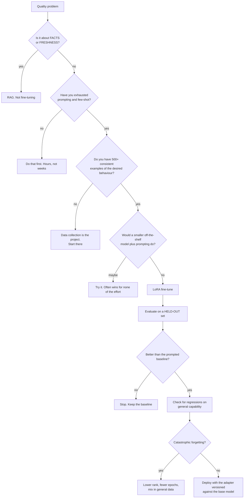
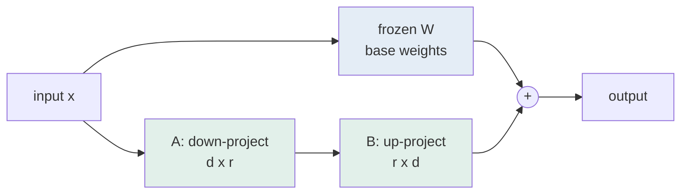

# Fine-tuning & adaptation

> **The one sentence:** fine-tuning teaches a model *how to behave*, not *what
> is true* — and almost every failed fine-tuning project confused the two.

The most valuable thing on this page is the decision procedure that concludes
"do not fine-tune", because that is the correct answer far more often than the
enthusiasm around it suggests.

---

## 1 · Diagram

```
   WHAT EACH TECHNIQUE ACTUALLY FIXES

   PROBLEM                              RIGHT TOOL
   -------                              ----------
   "it doesn't know our documents"      RAG            (knowledge -> retrieval)
   "it doesn't know last week's data"   RAG            (freshness -> retrieval)
   "it won't follow our format"         FINE-TUNE      (behaviour -> weights)
   "it doesn't understand our jargon"   FINE-TUNE or a domain model
   "it's too verbose / wrong register"  PROMPT first, then fine-tune
   "it's too slow / expensive"          smaller model, distillation, quantization
   "it's wrong about facts"             RAG. ALWAYS RAG.


   THE MISTAKE, drawn plainly

   fine-tuning on documents to teach FACTS
     -> the model learns the STYLE of your documents
     -> and hallucinates confidently in that style
     -> now it is wrong AND sounds exactly like your house voice
```

---

## 2 · Design

**Intermediate — the methods and what they cost.**

| Method | Trains | Memory for a 7B | Use when |
|---|---|---|---|
| **Full fine-tune** | All weights | ~80 GB+ | Rarely justified outside labs |
| **LoRA** | Small low-rank adapters | ~16 GB | The default choice |
| **QLoRA** | LoRA on a 4-bit base | ~6 GB | Consumer GPUs; slight quality cost |
| **Prompt/prefix tuning** | Soft prompt vectors | Tiny | Niche; largely superseded |

**LoRA is the one to understand.** Instead of updating a weight matrix `W`, you
learn a low-rank correction: `W + BA`, where `B` and `A` are much smaller. With
rank 16 you might train 0.1% of the parameters and match full fine-tuning on most
adaptation tasks.

Two consequences that matter operationally:

1. **Adapters are small** — tens of megabytes. You can serve one base model with
   many adapters, swapping per request or per tenant. That is a genuinely
   different deployment story from one fine-tuned model per customer.
2. **They are composable and reversible.** Reverting means not loading the
   adapter. Compare with a full fine-tune, which is a new checkpoint.

**The hyperparameters that matter**, in order:

```
   rank (r)        8-16 for style and format; 32-64 for harder adaptation
                   higher rank does not reliably mean better
   alpha           scaling; commonly set to 2x rank
   target modules  attention projections is the usual default; adding the MLP
                   projections increases capacity and cost
   learning rate   1e-4 to 2e-4 typical -- much higher than full fine-tuning
   epochs          1-3. More overfits fast on small sets
```

**Advanced — data quality dominates everything else.** A thousand carefully
curated, consistent examples beat fifty thousand scraped ones, reliably and by a
lot. The failure is almost never "not enough data"; it is inconsistent data.
If two examples show different formats for the same input type, you have taught
the model that both are acceptable and it will pick one at random.

| Data property | Why it matters more than volume |
|---|---|
| **Consistency** | Inconsistent targets teach randomness explicitly |
| **Coverage of edge cases** | The typical case is already handled |
| **Correct outputs** | Errors are learned faithfully, then reproduced |
| **Format uniformity** | The format *is* what is being learned |
| **Held-out split** | Without it you cannot tell learning from memorising |

---

## 3 · Flow



**`L → M` is the branch people skip.** A fine-tune that does not beat a
well-prompted baseline is a maintenance burden with no payoff, and the honest
move is to abandon it. The comparison must be against your *best* prompt, not
against the first one you tried.

---

## 4 · UML — LoRA in the forward pass



The base weights never move. Only `A` and `B` are trained, and at inference they
can be merged into `W` for zero added latency — or kept separate so adapters can
be swapped per request. That choice is a serving decision, not a training one.

---

## 5 · Example

```python
from peft import LoraConfig, get_peft_model

config = LoraConfig(
    r=16,                 # rank: capacity of the adaptation
    lora_alpha=32,        # scaling, conventionally 2x rank
    lora_dropout=0.05,
    bias="none",
    task_type="CAUSAL_LM",
    # Attention projections are the standard target. Adding the MLP projections
    # increases capacity and cost; start without them and only add if the
    # held-out score says the adaptation is capacity-limited.
    target_modules=["q_proj", "k_proj", "v_proj", "o_proj"],
)

model = get_peft_model(base_model, config)
model.print_trainable_parameters()
# trainable params: 8,388,608 || all params: 6,746,804,224 || trainable%: 0.124
```

**The check that decides whether it was worth doing:**

```python
def is_the_finetune_worth_keeping(baseline_prompted, finetuned, held_out, general):
    """Compare against the BEST prompt, and check for collateral damage.

    Two failure modes this catches. First, a fine-tune that loses to a good
    prompt -- all the maintenance cost, none of the benefit. Second,
    catastrophic forgetting: the model got better at your task and worse at
    everything else, which the task metric alone cannot see.
    """
    task_before = evaluate(baseline_prompted, held_out)
    task_after = evaluate(finetuned, held_out)
    general_before = evaluate(baseline_prompted, general)
    general_after = evaluate(finetuned, general)

    return {
        "task_gain": round(task_after - task_before, 4),
        "general_loss": round(general_before - general_after, 4),
        # A large task gain paid for with a large general loss is usually a bad
        # trade for anything but a single-purpose model.
        "keep": (task_after - task_before) > 0.05
                and (general_before - general_after) < 0.03,
    }
```

**Data preparation, which is most of the actual work:**

```python
def build_training_set(examples, min_examples=500):
    """Curate rather than collect.

    Consistency is the property being taught. Two examples with different
    formats for the same input type teach the model that both are acceptable,
    and it will then choose between them unpredictably -- which looks exactly
    like the problem you were trying to fix.
    """
    seen_formats = {}
    clean = []
    for ex in examples:
        shape = format_signature(ex["output"])
        seen_formats.setdefault(shape, 0)
        seen_formats[shape] += 1
        clean.append(ex)

    if len(seen_formats) > 1:
        raise ValueError(
            f"inconsistent output formats: {seen_formats}. "
            "Normalise before training -- the format IS the lesson."
        )
    if len(clean) < min_examples:
        raise ValueError(f"{len(clean)} examples; collect more before training")
    return clean
```

---

## 6 · Depth — the senior layer

**Catastrophic forgetting is real and routinely unmeasured.** Fine-tuning on a
narrow task degrades unrelated capability — the model gets better at your format
and worse at reasoning, other languages, or instruction-following in general.
Nobody notices because the evaluation only covers the target task. Always
evaluate on a general benchmark before and after, and treat a large general loss
as a cost, not a footnote.

| Failure mode | Symptom | Fix |
|---|---|---|
| **Fine-tuning for facts** | Confident hallucination in your house style | RAG |
| **Inconsistent training data** | Unpredictable output format | Normalise before training |
| **No held-out set** | Great training loss, poor deployment | Hold out from the start |
| **Not compared to a good prompt** | Maintenance burden, no gain | Compare against your best prompt |
| **Catastrophic forgetting** | Task better, everything else worse | Lower rank, fewer epochs, mix general data |
| **Too many epochs** | Memorises the training set | 1–3 epochs on small sets |
| **Base model version unpinned** | Adapter silently mismatched | Version adapter against the exact base |

**Adapters are tied to their exact base model.** A LoRA trained on one checkpoint
will load against a slightly different one and produce quietly degraded output
rather than an error. Pin the base model version in the adapter's metadata and
verify it at load time.

**The operational commitment is the part that is under-costed.** Choosing to
fine-tune means owning: a training pipeline, a data curation process, evaluation
before and after, drift monitoring, and a re-training decision every time the
base model improves. That is a permanent team responsibility traded for a
capability gain — which is why "would a smaller off-the-shelf model plus a good
prompt do this?" is a question worth answering honestly before starting.

**Where fine-tuning genuinely wins**, so this does not read as blanket
discouragement:

1. **Format and structure adherence** — reliable output shape, especially for a
   schema too complex to prompt reliably.
2. **Domain language** — specialised vocabulary and register the base model
   handles awkwardly.
3. **Latency and cost** — a fine-tuned small model matching a large prompted one
   on a narrow task, at a fraction of the cost.
4. **Classification at volume** — small fine-tuned classifiers routinely beat
   prompting large models, faster and far cheaper.

The fourth is the most under-used. For a high-volume classification task, a
fine-tuned small encoder is often better *and* cheaper than an LLM call by two
orders of magnitude, and reaching for an LLM there is a habit rather than a
decision.

---

## 7 · From each seat

| Seat | What fine-tuning looks like from here |
|---|---|
| **User** | Output that fits their domain and format. They cannot tell fine-tuning from good prompting, which is worth remembering before funding it. |
| **Coder** | Curate data before touching hyperparameters. Hold out a split from the start. Pin the base version in the adapter metadata. Evaluate general capability, not only the task. |
| **Tester** | Two evaluations: the target task, and a general set to detect forgetting. The baseline must be the *best prompted* version, not an untuned one, or the comparison flatters the fine-tune. |
| **System designer** | LoRA adapters swap per request, so one base model can serve many tenants. Merging removes latency but loses that flexibility — a real trade to make deliberately. |
| **Architect** | This is an ongoing commitment: pipeline, data, evaluation, retraining when the base improves. Take it on for a durable capability, not for a one-off quality bump. |
| **CEO** | Weeks of work with an uncertain outcome, against prompting which is hours. Ask what was tried first and what the comparison against a good prompt showed. Fine-tuned classifiers at volume are the clearest positive ROI case. |
| **Market** | Open weights plus LoRA has made adaptation cheap and non-differentiating. The moat is the curated dataset, not the technique — and that dataset is an asset worth protecting. |

---

## 8 · Interview questions

| Question | What they are testing | Answer sketch |
|---|---|---|
| "RAG or fine-tuning?" | The central distinction | RAG for knowledge and freshness; fine-tuning for behaviour, format and register. Fine-tuning on documents to teach facts produces confident hallucination in your house style. |
| "What is LoRA?" | Mechanism, not acronym | A low-rank correction `W + BA` with the base frozen. Around 0.1% of parameters trained, adapters tens of megabytes, swappable per request, and mergeable at inference for zero added latency. |
| "How much data?" | Whether you know what matters | Consistency over volume — 500–1000 curated consistent examples beat 50,000 scraped ones. Inconsistent formats teach the model that both are acceptable, which reproduces the original problem. |
| "How do you know it worked?" | Rigour | Held-out task evaluation against the *best prompted* baseline, plus a general benchmark to detect catastrophic forgetting. A task gain bought with a large general loss is usually a bad trade. |
| "When would you not fine-tune?" | Judgement | When the problem is facts or freshness, when prompting has not been exhausted, when the data is not consistent, or when a smaller off-the-shelf model with a good prompt does the job — which is often. |
| "Where does it clearly win?" | Balance | Format adherence, domain register, and above all high-volume classification, where a fine-tuned small model beats a prompted large one on quality, latency and cost simultaneously. |

---

## Stop condition

You are done when you can:

1. state the knowledge-versus-behaviour split in one sentence,
2. explain LoRA's mechanism and its two operational consequences,
3. say why consistency beats volume in training data,
4. name catastrophic forgetting and how you would detect it, and
5. give the case where fine-tuning is clearly correct.

---

## Sources worth reading

| Topic | Source |
|---|---|
| LoRA | *LoRA: Low-Rank Adaptation of Large Language Models* (Hu et al., 2021) |
| QLoRA | *QLoRA: Efficient Finetuning of Quantized LLMs* (Dettmers et al., 2023) |
| Practical | The Hugging Face PEFT documentation — the defaults are sensible and explained |
| Data quality | *LIMA: Less Is More for Alignment* (Zhou et al., 2023) — 1,000 curated examples, and the argument for curation |
| Forgetting | Any continual-learning survey; the problem long predates LLMs |
