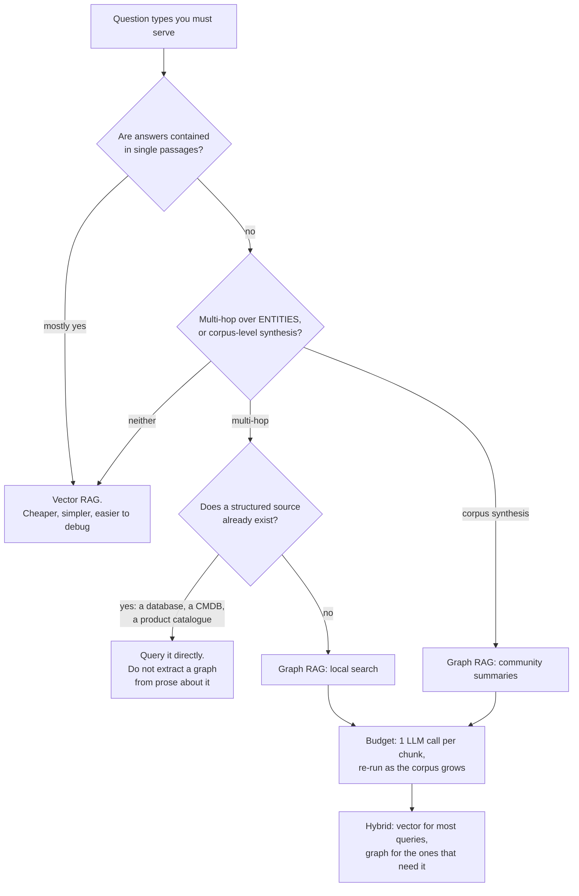
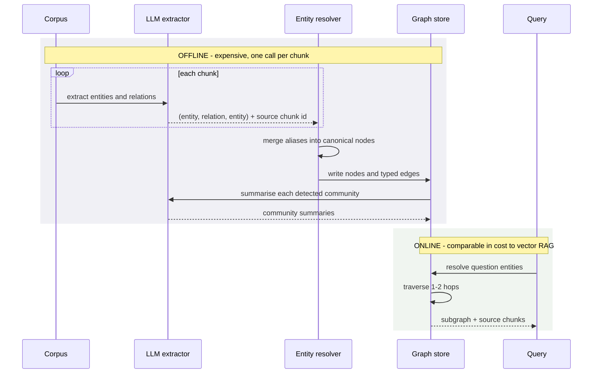

# GraphRAG & knowledge graphs

> **The one sentence:** vector RAG retrieves passages that *resemble* the query;
> graph RAG retrieves entities and the relationships *between* them — which is
> the only way to answer questions whose answer is not written down in any single
> passage.

It is genuinely more capable on a narrow class of question and considerably more
expensive on everything. Knowing which class is the entire decision.

---

## 1 · Diagram

```
   THE QUESTION VECTOR RAG CANNOT ANSWER

   "which of our suppliers are affected by the Kaohsiung plant closure?"

   VECTOR RAG                            GRAPH RAG
   ──────────                            ─────────
   embeds the question                   resolves entities: [Kaohsiung plant]
   finds passages about                  traverses:
   Kaohsiung, and passages                 plant --supplies--> component
   about suppliers                         component --used_by--> supplier
                                           supplier --serves--> us
   returns them                          returns the CONNECTED SET
        │                                      │
        ▼                                      ▼
   the model must infer the             the relationship was retrieved,
   connection -- if the chain is        not inferred
   spread over 4 documents,
   it cannot


   THE RULE OF THUMB

   answer IS in a passage        -> vector RAG. Cheaper, simpler, better
   answer is BETWEEN passages    -> graph RAG
   "summarise the whole corpus"  -> graph RAG (community summaries)
```

---

## 2 · Design

**The pipeline**, and note how much of it is offline work:

| Stage | What happens | Cost |
|---|---|---|
| **Entity extraction** | An LLM reads each chunk, extracts entities and relations | One LLM call **per chunk**. This dominates |
| **Entity resolution** | "IBM", "I.B.M.", "International Business Machines" → one node | Hard; the usual failure point |
| **Graph construction** | Nodes and typed edges, with source chunk provenance | Cheap once resolved |
| **Community detection** | Cluster the graph (Leiden or similar) | Cheap |
| **Community summaries** | An LLM summarises each cluster | Another pass of LLM calls |
| **Query time** | Resolve entities in the question, traverse, assemble context | Comparable to vector RAG |

**The indexing cost is the honest headline.** Building a graph over a corpus is
one or more LLM calls per chunk. On 100,000 chunks that is a real bill and hours
of wall clock, and it must be redone as the corpus grows. Vector indexing is an
embedding call per chunk — roughly two orders of magnitude cheaper.

**Two query modes, and they solve different problems:**

- **Local search** — start from entities mentioned in the question, traverse a
  hop or two, gather their neighbourhood. Good for "how are X and Y connected?"
- **Global search** — use the community summaries to answer questions about the
  corpus *as a whole*: "what are the main themes?", "what changed this year?"

**Global search is the capability vector RAG genuinely cannot match.** No top-k
retrieval answers "what are the recurring themes across these 10,000 documents",
because the answer is in the aggregate rather than in any passage. That is the
strongest argument for building a graph.

---

## 3 · Flow — should you build one?



**Node `F` is the branch most often missed.** If the relationships already exist
in a database — suppliers, parts, org charts, dependencies — extracting them
from prose with an LLM is strictly worse than querying the system of record.
Build the graph from structured data where you have it, and use the LLM only for
what is genuinely unstructured.

**Node `J` is the answer in practice.** Almost nobody should run graph RAG alone.
Route: most questions go to vector retrieval, and the small number that are
multi-hop or corpus-level go to the graph.

---

## 4 · UML — indexing versus query



**Every edge carries its source chunk id**, and that matters: it is what lets you
cite, and what lets you debug an extraction that went wrong. A graph without
provenance is unauditable.

---

## 5 · Example

```python
EXTRACT = """Extract entities and relationships from the passage.

Return JSON:
{"entities": [{"name": "...", "type": "..."}],
 "relations": [{"source": "...", "relation": "...", "target": "..."}]}

Use these entity types only: PERSON, ORG, PRODUCT, LOCATION, COMPONENT, EVENT.
Use a controlled relation vocabulary: SUPPLIES, USES, LOCATED_IN, OWNS,
REPORTS_TO, CAUSED_BY, PART_OF.

Do not invent relationships that are not stated. If the passage implies but
does not state a relationship, omit it."""
```

**The controlled vocabulary is the difference between a graph and a mess.**
Free-form extraction produces `supplies`, `provides`, `is_supplier_of` and
`delivers_to` as four distinct edge types meaning one thing, and traversal then
misses paths. Constrain the schema up front.

```python
def resolve_entities(extracted, embed, threshold=0.92):
    """Merge aliases into canonical nodes.

    This is the step that decides whether the graph is usable. 'IBM',
    'I.B.M.' and 'International Business Machines' must become one node, or
    traversal fragments and multi-hop queries silently return nothing.

    Embedding similarity plus a type check catches most of it; a curated alias
    table handles the domain-specific rest, and you will need one.
    """
    canonical, vectors = {}, {}
    for entity in extracted:
        v = embed(entity["name"])
        match = None
        for name, seen in vectors.items():
            if canonical[name]["type"] == entity["type"] and cosine(v, seen) > threshold:
                match = name
                break
        if match:
            canonical[match]["aliases"].add(entity["name"])
        else:
            canonical[entity["name"]] = {**entity, "aliases": {entity["name"]}}
            vectors[entity["name"]] = v
    return canonical


def local_search(graph, question, embed, hops=2, max_nodes=40):
    """Traverse from the question's entities, bounded.

    The bound matters: in a well-connected graph, two hops from a hub node can
    reach most of the corpus, which fills the context with noise and costs a
    fortune. Cap the frontier and prefer higher-weight edges.
    """
    seeds = graph.resolve_mentions(question, embed)
    seen, frontier = set(seeds), list(seeds)

    for _ in range(hops):
        next_frontier = []
        for node in frontier:
            for neighbour in graph.neighbours(node, order_by="weight", limit=8):
                if neighbour not in seen and len(seen) < max_nodes:
                    seen.add(neighbour)
                    next_frontier.append(neighbour)
        frontier = next_frontier

    # Return the source chunks, not just the graph -- the model needs the prose
    # to answer from, and the citations come from here.
    return graph.subgraph(seen), graph.source_chunks(seen)
```

---

## 6 · Depth — the senior layer

**Extraction errors compound through traversal.** A wrong edge in vector RAG is
one bad chunk among five. A wrong edge in a graph is a false path that multi-hop
queries will follow confidently to a fabricated conclusion. Precision of
extraction matters much more than recall — it is better to miss a relationship
than to invent one.

| Failure mode | Symptom | Fix |
|---|---|---|
| **Free-form relation vocabulary** | Four edge types meaning one thing; traversal misses paths | Controlled schema in the prompt |
| **Poor entity resolution** | Fragmented graph; multi-hop returns nothing | Embedding merge + curated alias table |
| **Unbounded traversal** | Context filled with the whole corpus | Cap hops and frontier size |
| **No provenance on edges** | Cannot cite or debug | Store the source chunk id on every edge |
| **Extracting from prose about structured data** | Worse than the database you already have | Build from the system of record |
| **Graph-only retrieval** | Expensive and worse on ordinary questions | Route; vector for most, graph for the few |
| **Re-indexing cost ignored** | Graph goes stale, or the bill surprises | Budget incremental extraction |

**Evaluate it against vector RAG, per question type.** The honest comparison is
bucketed: single-hop factual, multi-hop, corpus-level synthesis. Graph RAG
usually loses on the first — more context, more noise, more cost — and wins
decisively on the last two. An aggregate comparison hides both effects and leads
to the wrong conclusion in either direction.

**The cheaper alternative worth trying first.** Before building a graph, try
**metadata-filtered vector retrieval plus multi-hop query decomposition**: break
the question into sub-questions, retrieve for each, and combine. It handles a
good share of multi-hop questions at a fraction of the indexing cost. If that
fails on your question set, you have a real argument for the graph — and now you
have evidence rather than enthusiasm.

**Where graph RAG is clearly right**, stated so this reads as a judgement rather
than a dismissal: corpora where the *relationships are the content*. Legal and
regulatory documents with cross-references, incident and root-cause analysis,
supply chains, biomedical literature, org and dependency structures. In those
domains, questions are naturally about connections, and the graph is not an
optimisation — it is the correct data model.

---

## 7 · From each seat

| Seat | What graph RAG looks like from here |
|---|---|
| **User** | Answers to questions that previously returned "I could not find that" — because the answer was never in one document. |
| **Coder** | Controlled relation vocabulary. Provenance on every edge. Bounded traversal. Resolve entities properly; that step decides whether any of it works. |
| **Tester** | Evaluate bucketed by hop count against a vector baseline. Test entity resolution directly — a fragmented graph fails silently by returning nothing. |
| **System designer** | Indexing is an expensive batch pipeline that must handle incremental updates. Query time is fine; build time is the engineering problem. |
| **Architect** | A second index with its own build pipeline, staleness and cost. Justify it against the cheaper decomposition approach before committing to maintaining it. |
| **CEO** | Substantially more expensive to build than vector RAG, and it answers questions vector RAG cannot. Ask which questions those are and how many people actually ask them. |
| **Market** | Microsoft's GraphRAG made it visible and the implementations are open. The moat is not the technique — it is having a corpus where relationships carry the value. |

---

## 8 · Interview questions

| Question | What they are testing | Answer sketch |
|---|---|---|
| ⭐ "When does vector RAG fail?" | Whether you know its limits | When the answer is not in any single passage — multi-hop over entities, or corpus-level synthesis like "what are the main themes". Top-k retrieval cannot aggregate across ten thousand documents. |
| "What does graph RAG cost?" | Cost realism | An LLM call per chunk to extract, plus entity resolution, plus community summarisation — roughly two orders of magnitude more than embedding, and it must be re-run as the corpus grows. |
| ⭐ "What is the hardest part?" | Depth | Entity resolution. If "IBM" and "International Business Machines" stay separate nodes the graph fragments and multi-hop queries silently return nothing — a failure that looks like the technique not working. |
| "Would you try anything cheaper first?" | Judgement | Yes — query decomposition into sub-questions with vector retrieval per sub-question handles many multi-hop cases at a fraction of the indexing cost. If that fails on the question set, you have evidence for the graph. |
| "How would you evaluate it?" | Method | Bucketed by hop count against a vector baseline. Graph usually loses on single-hop factual and wins on multi-hop and synthesis; an aggregate comparison hides both. |
| "Relationships already exist in a database." | The trap | Then query the database. Extracting relationships from prose about structured data is strictly worse than the system of record. Build the graph from structured sources where they exist. |

---

## Stop condition

You are done when you can:

1. give the question type vector RAG cannot answer and why,
2. state the indexing cost honestly,
3. name entity resolution as the hard part and say what failure looks like,
4. give the cheaper alternative to try first, and
5. name a domain where the graph is the correct data model.

---

## Sources worth reading

| Topic | Source |
|---|---|
| The method | Microsoft's *From Local to Global: A Graph RAG Approach to Query-Focused Summarization* (Edge et al., 2024) |
| Community detection | The Leiden algorithm paper (Traag et al., 2019) |
| Entity resolution | The record-linkage literature; this problem long predates LLMs and is well studied |
| Implementations | Microsoft GraphRAG, LlamaIndex property-graph index, Neo4j's LLM integrations |
