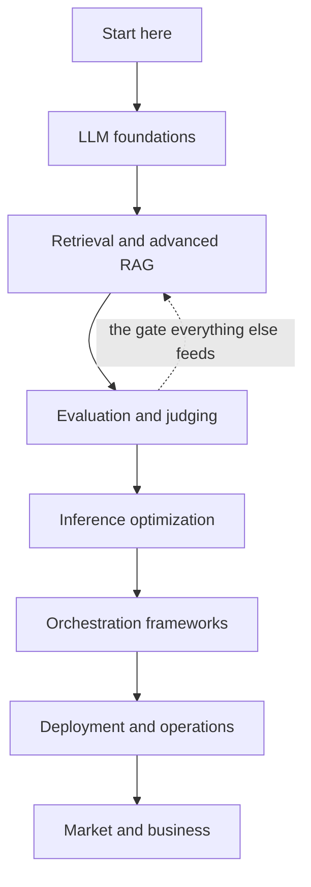

# The LLM Handbook

A working engineer's handbook for building, testing, operating and *arguing about*
LLM systems. Every topic is written at three depths, and every topic is examined
from every seat that has to live with the decision — not just the coder's.

> **This handbook does not repeat what you already have.** Where a subject is
> already covered well in the study folder (`02_AI_CORE/03_genai_rag_agents.md`
> covers transformers, RAG end-to-end, chunking, embeddings, reranking, agents,
> LangGraph, MCP, Text2SQL and guardrails), this handbook links there instead of
> writing it twice. What follows is the material that was *missing*.

---

## How each page is built

Every topic page follows the same eight-part shape, so you always know where to
look for the thing you need:

| Part | What it gives you |
|---|---|
| **1 · Diagram** | The mental model as a picture, before any prose |
| **2 · Design** | The components and why each one is load-bearing |
| **3 · Flow** | The sequence, in the order it actually happens |
| **4 · UML** | Structure: classes, states, or a sequence diagram |
| **5 · Example** | Code you can run, not pseudocode |
| **6 · Depth** | The senior layer — failure modes, scale, trade-offs |
| **7 · From each seat** | The same topic seen by seven different roles |
| **8 · Interview questions** | What gets asked, and the answer sketch |

Plus a **stop condition**: the sentence that tells you that you are done, so a
topic has an end rather than dissolving into endless reading.

### The three depths

Every topic is layered, and the layers are labelled inline:

- **Basic** — the definition and the one-sentence why. Enough to follow a
  conversation without nodding along blankly.
- **Intermediate** — how to build it, what the knobs are, what breaks first.
  Enough to ship it.
- **Advanced** — why the obvious approach is wrong at scale, what the research
  actually says, and where the trade-off genuinely bites.

### The seven seats

Section 7 of every page. The same technology looks completely different
depending on what you are accountable for, and being able to switch seats
mid-conversation is most of what "senior" means in an interview.

| Seat | The question they are asking |
|---|---|
| **User** | Does this help me, and can I tell when it is wrong? |
| **Coder** | What do I type, and what will bite me at 2am? |
| **Tester** | How do I prove this works when the output is non-deterministic? |
| **System designer** | What are the components, the failure modes, the budgets? |
| **Architect** | What does this commit us to for the next three years? |
| **CEO** | What does it cost, what does it earn, and what is the risk? |
| **Market** | Who else does this, what is commoditised, where is the moat? |

---

## Reading order

**Evaluation is deliberately early.** Every other decision in this handbook —
which chunker, which reranker, whether the quantised model is good enough,
whether the new prompt shipped an improvement — is unanswerable without it. It
is also the single most common gap in an LLM engineer's interview answers.

---

## Status

This handbook is written gap-first rather than front-to-back, because the
material it exists to replace is the material that is missing. Pages marked
**draft** in the sidebar are outlined but not yet written; nothing is padded
with filler to look finished.

| Module | Covers | State |
|---|---|---|
| Evaluation & judging | LLM-as-a-judge, regression gates, drift, bias, explainability | In progress |
| Retrieval & advanced RAG | HyDE, query transformation, corrective RAG, retrieval finetuning | Planned |
| Inference optimization | Quantization, distillation, pruning, serving maths | Planned |
| Orchestration frameworks | LangChain primitives, LlamaIndex, DSPy | Planned |
| LLM foundations | LLM APIs, open-source model selection, licensing, prompt engineering | Planned |
| Deployment & operations | Serving, monitoring, cost control | Planned |
| Market & business | Build vs buy, unit economics, vendor landscape | Planned |

---

## A note on honesty

Two things this handbook will keep doing, because they are what separates a
useful technical document from a confident one:

**It names what it does not know.** Where the research is contested, or a number
depends on your workload, it says so rather than picking a convenient figure.

**It shows the failure.** Every technique here has a regime where it is the
wrong choice, and that regime is stated as plainly as the benefits. A page that
only tells you when something works has not taught you how to decide.
