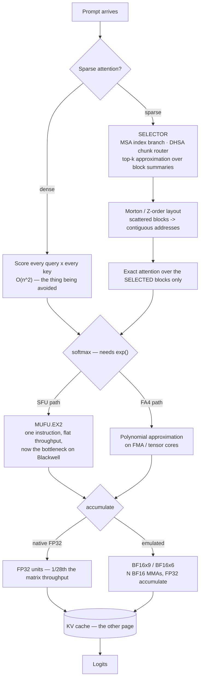

# Kernel & attention optimization

> **The one sentence:** everything else in this module changes *how much* work
> the model does; this layer changes *which arithmetic runs and how* — and
> almost none of it is yours to implement, which is exactly why you need to
> know what your server already does for you.

[KV cache optimization](kv-cache.html) is about bytes. [Reasoning inference
optimization](reasoning-inference-optimization.html) is about tokens. This page
is about the two layers underneath both: **which attention scores get computed
at all**, and **what instructions compute them**.

The reason it earns a page rather than a section: these are the techniques
where the honest advice is usually *"upgrade your server and read the release
notes"*, and knowing that is worth more than a tuning guide. You will be asked
about them anyway — they are where the 2025–2026 gains actually came from.

**A warning specific to this page.** Half of these are less than a year old, and
the vendor claims are ahead of the independent replications. Every number below
is attributed. Where a result is a company's own benchmark and nobody else has
reproduced it, this page says so rather than repeating the figure flat.

---

## 1 · Diagram

```
  WHAT A DECODE STEP ACTUALLY SPENDS

  ┌─────────────────────────────────────────────────────────────────┐
  │ 1. WHICH SCORES TO COMPUTE            <- sparse attention       │
  │    dense: every query x every key, O(n^2)                       │
  │    sparse: pick blocks first, then attend only to those         │
  │       Top-k approximation ... the primitive under all of them   │
  │       MSA / SSA / DHSA ...... three ways to choose the blocks   │
  │       Morton / Z-order ...... make the chosen blocks contiguous │
  ├─────────────────────────────────────────────────────────────────┤
  │ 2. HOW TO COMPUTE THEM                <- kernel numerics        │
  │    exp() for softmax: SFU unit, or polynomial on the FMA/TC?    │
  │    FP32 accuracy: native FP32 units, or N x BF16 tensor cores?  │
  │       approximate exp ....... skip the special-function unit    │
  │       polynomial approx ..... FlashAttention-4's version of it  │
  │       BF16x9 / BF16x6 ....... FP32 accuracy on BF16 hardware    │
  ├─────────────────────────────────────────────────────────────────┤
  │ 3. HOW MANY BYTES TO MOVE             <- the KV cache page      │
  │    OSCAR (2-bit KV), quantization, paging, prefix reuse         │
  ├─────────────────────────────────────────────────────────────────┤
  │ 4. WHETHER TO RUN AT ALL              <- elsewhere in the module│
  │    shared experts, FR-Spec, warm start, caching                 │
  └─────────────────────────────────────────────────────────────────┘


  WHY LAYER 2 SUDDENLY MATTERS — Blackwell is lopsided

    tensor core throughput      ~2x per generation
    exponential unit (MUFU.EX2) roughly flat
    shared memory bandwidth     roughly flat
                                ^^^^^^^^^^^^
       softmax used to be "the bit between the two matmuls".
       On Blackwell it is a bottleneck, because the matmuls got
       faster and the thing between them did not.
```

That asymmetry is the single idea that makes this page cohere. When one unit on
the die doubles and its neighbours do not, work migrates *toward* the fast unit
even when that means doing more arithmetic — a polynomial on the tensor cores
beats one instruction on a unit that is now the bottleneck. Nearly every
kernel-level result of the last two years is a variation on that trade.

---

## 2 · Design — sparse attention

Dense attention computes every query against every key. Sparse attention
computes a **selection** first, then attends only to what it selected. Every
scheme here is that same two-step shape; they differ in who does the selecting
and when.

### The primitive: top-k approximation

All of them reduce to *find the k most relevant blocks, cheaply*. Exact top-k
over a long sequence is itself expensive, so implementations approximate it —
score coarse summaries rather than tokens, accept an occasional wrong pick,
and rely on attention's own softmax to forgive a near-miss. Two consequences
worth holding on to:

- **The selector is the accuracy risk, not the attention.** Once a block is
  selected, the attention over it is usually exact. What you lose is whatever
  the selector failed to select — so failures are *retrieval* failures, and
  they are invisible to perplexity.
- **Sparsity buys prefill more than decode.** Prefill is where the quadratic
  term lives. At decode you attend to one query against the whole cache, which
  is already linear, so sparsity there saves bandwidth rather than compute.

### The three named schemes

| | **MSA** (MiniMax) | **DHSA** | **SSA** (Subquadratic) |
|---|---|---|---|
| Selects with | A lightweight **Index Branch** that scores KV blocks and picks a top-*k* per GQA group | A trained predictor over **variable-length chunks**, importance propagated chunk → token | Learned content-dependent selection |
| Trained in? | Yes — native to the model | **No.** Backbone stays frozen, no retraining | Yes — own architecture |
| Then | Main Branch does *exact* block-sparse attention over the selected blocks | Dense attention over routed chunks | — |
| Reported | On par with GQA, **28.4× less per-token attention compute at 1M context** on a 109B multimodal model | Matches dense on NIAH/LongBench; prefill latency −20–60%, peak memory −35%; **up to 10× prefill speedup at 128K** | 7.2× prefill at 128K, 52.2× at 1M, a 12M-token window |
| Evidence | Paper + a released production model | Paper, NeurIPS 2025, code public | **Vendor blog only.** Researchers have publicly asked for independent proof |

**MSA is the one to understand first**, because it is the cleanest statement of
the pattern: a cheap index branch chooses blocks, an exact branch attends over
them. It also sits *on top of GQA* rather than replacing it, which is why it
composes with everything on the KV cache page — the selection is per GQA group,
so the cache layout is unchanged.

**DHSA is the one you could actually deploy**, and for a specific reason: it
does not retrain the backbone. Everything else in this table is a property of
a checkpoint you either have or do not. DHSA is a predictor bolted onto a
frozen model, which makes it the only row here that is a *decision* rather than
a model-selection criterion.

**SSA is the one to be careful about.** The numbers in that column are the
company's own, the model is theirs, and the public response from researchers
has been a request for independent evaluation rather than agreement. The
underlying idea — content-dependent selection instead of fixed patterns — is
sound and shared with the other two. The 52× and the 12M-token window are not
yet things you should repeat in a design review without saying whose numbers
they are.

### Morton codes — making the selected blocks addressable

Selection produces a *scattered* set of blocks, and scattered is the worst
possible shape for a GPU. Morton order (Z-order curves) interleaves the bits of
multi-dimensional indices so that points near each other in 2-D stay near each
other in the 1-D memory layout.

```
  ROW-MAJOR                     MORTON / Z-ORDER
  0  1  2  3                    0  1  4  5
  4  5  6  7                    2  3  6  7
  8  9 10 11                    8  9 12 13
 12 13 14 15                   10 11 14 15

 a 2x2 tile touches 4 rows      a 2x2 tile is 4 consecutive addresses
```

Two uses, and they are different jobs:

- **Locality for tiled kernels.** Memory swizzling with Morton ordering keeps
  2-D locality in a 1-D layout and spreads accesses across memory banks, which
  is a bank-conflict fix. AMD's Composable Kernel documents it as exactly that.
- **Indexing for top-k selection.** ZETA uses Z-order curves to turn key/query
  matching into a 1-D locality problem, so candidate keys can be found by
  proximity in Morton space rather than by scoring everything.

It is worth knowing by name because it explains *why* a sparse attention kernel
is fast — selection alone would not be, if every selected block landed in a
different memory bank.

---

## 3 · Design — kernel numerics

Same mathematics, different instructions. This is the layer that exists because
of the hardware asymmetry in the diagram.

### Approximate exponential, and FlashAttention-4

Softmax needs `exp()`. On NVIDIA hardware the natural way to get it is the
special function unit (`MUFU.EX2`) — one instruction, low throughput, and on
Blackwell it did not get faster while the tensor cores did. So softmax stopped
being free.

**FlashAttention-4's answer is to stop using that unit.** It evaluates `exp()`
as a **polynomial approximation** on the FMA/tensor-core path instead — more
arithmetic, on hardware that has arithmetic to spare, rather than fewer
instructions on the unit that is now the constraint. Reported: up to
**1605 TFLOP/s BF16 on B200 (≈71% utilisation), 1.3× faster than cuDNN 9.13 and
2.7× faster than Triton.**

The generalisation is worth more than the specific kernel: **"approximate
exponential" and "polynomial approximation" are the same technique at two
levels of ambition.** Any time a special-function unit is the bottleneck, you
can trade it for a polynomial on the units that are not.

### BF16x9 and BF16x6 — FP32 accuracy on BF16 silicon

The same trade, applied to precision rather than to transcendentals.

Peak BF16 matrix throughput on GB200 is roughly **28× peak FP32 matrix
throughput**. So it is worth doing *several* BF16 matrix multiplies to
reconstruct one FP32-accurate result:

```
  split each FP32 matrix into BF16 pieces (high / mid / low),
  multiply the pieces pairwise, accumulate in FP32

  BF16x9   all 9 cross products      -> FP32-comparable accuracy
  BF16x6   6 of them                 -> cheaper, valid when the exponent
                                        range is known to be well behaved
                                        (roughly [-110, 111])

  9x the multiplies, but each is 28x cheaper -> up to ~3x net speedup
```

Three things to keep straight:

- **This is library emulation, not an instruction.** BF16x9 is built out of
  ordinary hardware BF16 tensor-core MMAs; it shipped in CUDA 12.9 for
  Blackwell and PyTorch exposes it as an FP32-matmul precision mode.
- **It is the Ozaki scheme**, the long-standing technique of splitting a
  high-precision mantissa into several low-precision pieces. The same idea is
  being used to emulate FP64 on FP8 tensor cores.
- **BF16x6 is the approximate one.** It drops the cross products that only
  matter for extreme exponents, so it is correct *conditionally* — which is
  fine inside a kernel that knows its own value range and wrong as a global
  default.

### Whole-layer fused kernels — megakernels

The launch-overhead version of the same asymmetry argument. At batch size 1 a
decode step is hundreds of small kernel launches, and each launch is fixed
overhead on work that is already bandwidth-bound. A **megakernel** fuses the
entire forward pass — all layers, sometimes all GPUs — into one persistent
kernel launch.

What that buys is not arithmetic, it is the gaps between arithmetic: no launch
overhead, fine-grained software pipelining across operations that used to be
separate kernels, and compute overlapped with communication rather than
sequenced after it. Reported results range from 1.2–6.7× end-to-end latency
depending on the shape; one published system takes per-token decode on a single
A100 from 14.5 ms to 12.5 ms, and HazyResearch's Llama megakernel reports
reaching 78% of H100 memory bandwidth at batch 1 — which is close to the
theoretical ceiling for a bandwidth-bound workload.

The catch is generality. A megakernel is compiled for a model shape, a batch
size and a GPU, so the work has moved into compilers that generate one on
demand rather than into kernels written by hand.

### Kernel synthesis

Which is the next step: **have a model write the kernel.** KernelBench framed
it as a benchmark — 250 PyTorch workloads, graded first on whether the generated
kernel compiles and matches the reference, then on whether it is actually
faster. That two-stage grading is the important part, because a kernel that is
fast and wrong is worse than no kernel.

It works better than it has any right to. NVIDIA reported automatically
generating attention kernels with an R1-based workflow plus inference-time
scaling, hitting 100% correctness on KernelBench Level 1 and 96% on Level 2;
Meta's KernelLLM fine-tuned an 8B model to translate PyTorch modules into Triton
and is competitive on the Triton variant despite its size.

For an application engineer this is not yet a tool, it is a trajectory — and the
relevant consequence is the one from the section above: **if kernels become
cheap to generate, "is there a kernel tuned for my exact shape and GPU" stops
being a question you answer by waiting for a library release.**

### A note on the algebraic integer number system

It appears on inference-optimization taxonomies and it is worth being clear:
this is a **digital signal processing** technique, not an LLM one. Algebraic
integer quantization represents values in a ring of algebraic integers so that
transforms like the DCT can be computed **error-free**, with rounding deferred
to a single conversion at the end — the same family as number-theoretic
transforms and Fermat number transforms.

The connection to this page is conceptual rather than practical: it is the
extreme version of the BF16xN trade, exact arithmetic bought by representing one
number as several cheaper ones. But there is no body of work applying it to
transformer inference, no kernel you can switch on, and nothing to evaluate. If
you meet it on a list, that is the honest thing to say about it.

---

## 4 · UML — where each one intervenes



Read the two forks in the middle as the same decision twice: **is the dedicated
unit still the fast path, or has the general-purpose one overtaken it?** On
Hopper the answer was "dedicated"; on Blackwell it flipped, and both FA4 and
BF16xN are consequences of that flip.

---

## 5 · Example

The arithmetic that decides whether sparsity is worth anything to you. It is
short because the conclusion is blunt.

```python
"""Where sparse attention pays, and where it does not.

Attention cost is quadratic in PREFILL and linear in DECODE. Sparsity attacks
the quadratic term, so the whole question is what fraction of your tokens are
prompt tokens. Run this before reading another sparse-attention paper.
"""


def attn_cost(prompt, generated, sparsity=1.0):
    """Relative attention work, in query-key pair units.

    sparsity: fraction of keys actually attended. 1.0 = dense.

    Prefill is the triangle over the prompt: ~p^2/2 pairs.
    Decode is one query against a growing cache: ~p*g + g^2/2 pairs.
    """
    prefill = prompt * prompt / 2
    decode = prompt * generated + generated * generated / 2
    return prefill * sparsity, decode * sparsity


SHAPES = [
    ("chat turn",        600,    400),
    ("RAG answer",     8_000,    500),
    ("doc analysis",  64_000,  1_000),
    ("repo-scale",   500_000,  2_000),
]

print(f"{'workload':<16}{'prefill %':>10}{'dense':>12}{'@10% sparse':>13}{'saving':>9}")
print("-" * 60)
for name, p, g in SHAPES:
    dpf, ddc = attn_cost(p, g)
    spf, sdc = attn_cost(p, g, sparsity=0.10)
    dense, sparse = dpf + ddc, spf + ddc      # sparsity helps prefill, not decode
    share = dpf / dense * 100
    print(f"{name:<16}{share:>9.0f}%{dense:>12.3e}{sparse:>13.3e}{dense / sparse:>8.1f}x")
```

```
workload         prefill %       dense  @10% sparse   saving
------------------------------------------------------------
chat turn              36%   5.000e+05    3.380e+05     1.5x
RAG answer             89%   3.612e+07    7.325e+06     4.9x
doc analysis           97%   2.112e+09    2.693e+08     7.8x
repo-scale             99%   1.260e+11    1.350e+10     9.3x
```

**The column that decides everything is "prefill %".** On a chat turn, 36% of
attention work is prefill, so even 10× sparsity returns 1.5× — and you have
taken on a retrieval-failure risk for it. At 64K context, prefill is 97% of the
work and the identical technique returns 7.8×.

This is why every sparse-attention paper reports prefill latency and why every
one of them benchmarks at 128K and above. It is also the fastest way to decide
whether the field applies to you: **if your prompts are short, none of §2 is for
you, and the KV cache page is where your wins are.**

Note the second-order point hiding in the code: `sparsity` multiplies `prefill`
only. Sparse attention at decode saves *bandwidth* — fewer KV bytes read — not
arithmetic, because decode was already linear. Papers that quote one number
usually quote the prefill one.

---

## 6 · Depth — the senior layer

**Sparse attention fails at retrieval, and perplexity cannot see it.** The
selector is a learned or heuristic guess about which blocks matter. When it
guesses wrong the model does not produce noise — it produces a fluent answer
computed without the one block that contained the answer. Average-case metrics
are unaffected because the average case did not need that block. This is the
same failure shape as KV eviction, and it needs the same gate: a needle probe at
your real context length, in CI. See [regression gates](regression-gates.html).

**Distinguish "no retraining" from "no evaluation".** DHSA's headline property
is that the backbone stays frozen, which removes the training cost. It does not
remove the evaluation cost, because the predictor still changes which tokens the
model can see. The pitch "drop-in, no retraining" is true and routinely
misheard as "drop-in, no risk".

**Vendor benchmarks and independent replication are different evidence, and the
gap is currently wide.** SSA's numbers come from the company that sells SSA, on
their own model, and the public researcher response has been a request for
proof. That is not an accusation — it is the normal state of a result that is
three months old. The professional move is to quote the source with the number
every time, and to treat anything unreplicated as a hypothesis about your
workload rather than a property of the technique.

**Kernel numerics are not yours, and pretending otherwise is expensive.** You
will not hand-write a polynomial exp approximation; you will get it by moving
from FlashAttention-3 to FlashAttention-4, which is a version bump in a
dependency. The actionable form of this whole section is: *know which kernel
your server uses, know what hardware it was tuned for, and read the release
notes*. A team that upgrades its GPU generation without upgrading its attention
kernel leaves most of the generational gain unclaimed — the hardware got
lopsided, and only the new kernel knows that.

**BF16x6 is conditionally correct, which is a category of bug worth naming.**
It drops the cross products that only matter when exponents are extreme. Inside
a kernel that knows its value range, that is a sound optimisation. Applied
globally as "the fast FP32 mode", it is a silent accuracy cliff that appears
only on inputs with unusual dynamic range — which, in an inference stack, means
it appears in production and not in testing.

| Failure | Looks like | Actual cause |
|---|---|---|
| Sparse model loses facts from long documents | Fluent, confident, wrong | Selector missed the block; perplexity unchanged |
| Sparsity gave 1.3× not 10× | "The paper said 10×" | Short prompts — prefill was never the dominant term |
| New GPU, same throughput | Generational upgrade did nothing | Old attention kernel, tuned for symmetric hardware |
| Accuracy cliff on rare inputs | Fine in eval, wrong in production | BF16x6 applied outside its valid exponent range |
| 2-bit KV collapsed the model | Near-zero accuracy at INT2 | Rotation not aligned to attention — see [OSCAR](kv-cache.html) |
| Long-context latency fine, cost unchanged | Faster, not cheaper | Sparsity cut prefill compute; the KV cache is still full size |

---

## 7 · From each seat

| Seat | What this layer means here |
|---|---|
| **User** | A long document gets answered in seconds instead of minutes. The risk they cannot see is that a sparse model may never have looked at the paragraph their question was about. |
| **Coder** | You consume this, you do not write it. Know your kernel version and what it was tuned for. Before chasing any of it, compute what fraction of your attention work is prefill — for most chat workloads the answer ends the conversation. |
| **Tester** | Sparse attention and 2-bit KV both fail as retrieval, silently, on the hard tail. Needle probes at production context length, stratified, gated. Aggregate accuracy is structurally blind to this class of failure. |
| **System designer** | Sparsity buys prefill latency and therefore TTFT; it does not shrink the KV cache, so it does not buy concurrency. Those are different budgets and conflating them is the usual planning error. |
| **Architect** | MSA and SSA are checkpoint properties — model-selection criteria, not knobs. DHSA is the rare one you can adopt against a model you already run. Write down which of your wins are inherited and which you chose. |
| **CEO** | The 2025–26 inference gains came mostly from this layer, and almost none of them required a research team — they required upgrading a dependency and a GPU generation together. The cheapest efficiency programme available is usually "stay current". |
| **Market** | Long-context claims are now made in millions of tokens on vendor benchmarks. The questions that separate a real capability from a press release: whose numbers, at what context, replicated by whom, and what does recall look like in the middle. |

---

## 8 · Interview questions

**"Why did softmax suddenly become an attention bottleneck?"**
Asymmetric hardware scaling. Tensor core throughput roughly doubled per
generation while the special function unit that computes `exp()` did not, so on
Blackwell the exponential is the constraint rather than the matmuls.
FlashAttention-4's response is to evaluate `exp()` as a polynomial on the
FMA/tensor-core path — more arithmetic, on the units that have headroom. The
general principle is the answer they want: when one unit doubles and its
neighbours do not, move work toward the fast unit even at the cost of doing more
of it.

**"How can nine BF16 multiplies be faster than one FP32 multiply?"**
Because on GB200 peak BF16 matrix throughput is about 28× peak FP32 matrix
throughput, so 9× the multiplies at 1/28th the cost is still a net win — up to
about 3×. That is BF16x9, library emulation built from ordinary BF16 tensor-core
MMAs, shipped in CUDA 12.9. It is the Ozaki scheme: split the mantissa into
low-precision pieces, multiply pairwise, accumulate in FP32. BF16x6 drops three
cross products and is cheaper but only valid when the exponent range is known to
be well behaved.

**"You enabled sparse attention and got 1.3×. The paper said 10×. What happened?"**
Your prompts are short. Sparsity attacks the quadratic prefill term; decode was
already linear in the cache. If prefill is a third of your attention work the
ceiling is about 1.5× no matter how good the selector is. The papers benchmark
at 128K and above because that is where prefill is 99% of the work. Compute your
prefill share before adopting anything in this area.

**"What is the failure mode of sparse attention, and how would you catch it?"**
Retrieval failure. The selector decides which blocks the model may see; when it
chooses wrong the model answers fluently without the block that mattered.
Perplexity and aggregate accuracy cannot see this because the average case did
not need that block. You need needle-in-a-haystack probing at your real context
length, stratified, and gated in CI — the same gate KV eviction needs, for the
same reason.

**"MSA, DHSA and SSA — what actually separates them?"**
Who selects, and whether the backbone has to be retrained. MSA has a lightweight
index branch trained into the model, picking a top-*k* of KV blocks per GQA
group, and then does exact block-sparse attention over them. DHSA predicts
sparsity online over variable-length chunks with the backbone **frozen**, which
makes it the only one of the three you can adopt against a model you already
serve. SSA is a startup's own architecture, and the honest thing to add is that
its headline numbers are unreplicated so far.

**"Is any of this actionable for an application engineer?"**
Mostly not directly, and saying so is the right answer. You get FA4 by upgrading
FlashAttention, BF16x9 by upgrading CUDA, sparse attention by choosing a model
that has it. The two decisions you genuinely own are keeping the kernel and the
hardware generation in step — a new GPU with an old attention kernel leaves most
of the generational gain on the table — and evaluating anything that changes
what the model can see.

---

## Stop condition

You are done with this page when you can:

- Explain asymmetric hardware scaling, and use it to derive both FA4's
  polynomial exp and BF16x9 from the same principle
- Say why nine BF16 multiplies beat one FP32 multiply, and what BF16x6 trades
- Compute your own prefill share and decide from it whether sparse attention
  applies to you
- Separate MSA, DHSA and SSA by who selects and whether the backbone is frozen
- Name the failure mode sparse attention shares with KV eviction, and the gate
  that catches it
- State which claims on this page are replicated and which are vendor-only,
  without having to look it up

---

## Sources worth reading

- **MSA** — [*MiniMax Sparse Attention*](https://arxiv.org/abs/2606.13392) (2026) — index branch plus exact block-sparse main branch, on top of GQA.
- **DHSA** — [Xiong et al., *Long-Context Modeling with Dynamic Hierarchical Sparse Attention for On-Device LLMs*](https://arxiv.org/abs/2510.24606) (NeurIPS 2025) — online sparsity prediction with a frozen backbone; [code](https://github.com/xiongsiheng/DHSA).
- **SSA** — the vendor's own material, and [VentureBeat's report of the researcher response](https://venturebeat.com/technology/miami-startup-subquadratic-claims-1-000x-ai-efficiency-gain-with-subq-model-researchers-demand-independent-proof) asking for independent proof. Read both, in that order.
- **FlashAttention-4** — [Dao et al., *Algorithm and Kernel Pipelining Co-Design for Asymmetric Hardware Scaling*](https://arxiv.org/abs/2603.05451) (2026) — the polynomial exp, and the clearest statement of the asymmetry argument.
- **Morton / Z-order** — [*ZETA: Leveraging Z-order Curves for Efficient Top-k Attention*](https://arxiv.org/abs/2501.14577) for the indexing use; AMD's Composable Kernel docs for the memory-swizzling use.
- **BF16xN emulation** — [*Exceeding the Numerical and Performance Characteristics of IEEE-754 SGEMM with BFloat16 Tensor Cores*](https://arxiv.org/abs/2605.16617) (2026), and the [PyTorch BF16x9 precision mode](https://github.com/pytorch/pytorch/pull/195301).
- **Ozaki scheme** — [*DGEMM without FP64 Arithmetic*](https://arxiv.org/abs/2508.00441) — the same splitting idea one precision further down.

Related: [KV cache optimization](kv-cache.html) for the bytes, including OSCAR ·
[KV reuse beyond the exact prefix](kv-reuse.html) for the work you can skip entirely ·
[Quantization](quantization.html) for the weight side and for what "lossless"
means · [Transformers](transformers.html) for why attention is quadratic in the
first place · [Long context](long-context.html) for what breaks at length ·
[Regression gates](regression-gates.html) for the needle probe this page keeps
demanding.
