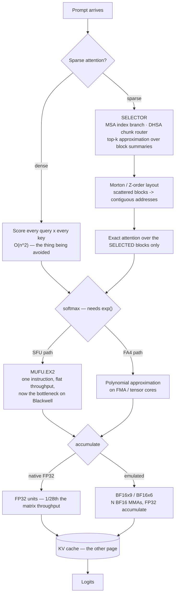

# Kernel & attention optimization

> **The one sentence:** everything else in this module changes *how much* work
> the model does; this layer changes *which arithmetic runs and how* — and
> almost none of it is yours to implement, which is exactly why you need to
> know what your server already does for you.

[KV cache optimization](kv-cache.html) is about bytes. [Reasoning inference
optimization](reasoning-inference-optimization.html) is about tokens. This page
is about the two layers underneath both: **which attention scores get computed
at all**, and **what instructions compute them**.

The reason it earns a page rather than a section: these are the techniques
where the honest advice is usually *"upgrade your server and read the release
notes"*, and knowing that is worth more than a tuning guide. You will be asked
about them anyway — they are where the 2025–2026 gains actually came from.

**A warning specific to this page.** Half of these are less than a year old, and
the vendor claims are ahead of the independent replications. Every number below
is attributed. Where a result is a company's own benchmark and nobody else has
reproduced it, this page says so rather than repeating the figure flat.

---

## 1 · Diagram

```
  WHAT A DECODE STEP ACTUALLY SPENDS

  ┌─────────────────────────────────────────────────────────────────┐
  │ 1. WHICH SCORES TO COMPUTE            <- sparse attention       │
  │    dense: every query x every key, O(n^2)                       │
  │    sparse: pick blocks first, then attend only to those         │
  │       Top-k approximation ... the primitive under all of them   │
  │       MSA / SSA / DHSA ...... three ways to choose the blocks   │
  │       Morton / Z-order ...... make the chosen blocks contiguous │
  ├─────────────────────────────────────────────────────────────────┤
  │ 2. HOW TO COMPUTE THEM                <- kernel numerics        │
  │    exp() for softmax: SFU unit, or polynomial on the FMA/TC?    │
  │    FP32 accuracy: native FP32 units, or N x BF16 tensor cores?  │
  │       approximate exp ....... skip the special-function unit    │
  │       polynomial approx ..... FlashAttention-4's version of it  │
  │       BF16x9 / BF16x6 ....... FP32 accuracy on BF16 hardware    │
  ├─────────────────────────────────────────────────────────────────┤
  │ 3. HOW MANY BYTES TO MOVE             <- the KV cache page      │
  │    OSCAR (2-bit KV), quantization, paging, prefix reuse         │
  ├─────────────────────────────────────────────────────────────────┤
  │ 4. WHETHER TO RUN AT ALL              <- elsewhere in the module│
  │    shared experts, FR-Spec, warm start, caching                 │
  └─────────────────────────────────────────────────────────────────┘


  WHY LAYER 2 SUDDENLY MATTERS — Blackwell is lopsided

    tensor core throughput      ~2x per generation
    exponential unit (MUFU.EX2) roughly flat
    shared memory bandwidth     roughly flat
                                ^^^^^^^^^^^^
       softmax used to be "the bit between the two matmuls".
       On Blackwell it is a bottleneck, because the matmuls got
       faster and the thing between them did not.
```

That asymmetry is the single idea that makes this page cohere. When one unit on
the die doubles and its neighbours do not, work migrates *toward* the fast unit
even when that means doing more arithmetic — a polynomial on the tensor cores
beats one instruction on a unit that is now the bottleneck. Nearly every
kernel-level result of the last two years is a variation on that trade.

---

```sim
sparsekernel
```

---

## 2 · Design — sparse attention

Dense attention computes every query against every key. Sparse attention
computes a **selection** first, then attends only to what it selected. Every
scheme here is that same two-step shape; they differ in who does the selecting
and when.

### The primitive: top-k approximation

All of them reduce to *find the k most relevant blocks, cheaply*. Exact top-k
over a long sequence is itself expensive, so implementations approximate it —
score coarse summaries rather than tokens, accept an occasional wrong pick,
and rely on attention's own softmax to forgive a near-miss. Two consequences
worth holding on to:

- **The selector is the accuracy risk, not the attention.** Once a block is
  selected, the attention over it is usually exact. What you lose is whatever
  the selector failed to select — so failures are *retrieval* failures, and
  they are invisible to perplexity.
- **Sparsity buys prefill more than decode.** Prefill is where the quadratic
  term lives. At decode you attend to one query against the whole cache, which
  is already linear, so sparsity there saves bandwidth rather than compute.

### The three named schemes

| | **MSA** (MiniMax) | **DHSA** | **SSA** (Subquadratic) |
|---|---|---|---|
| Selects with | A lightweight **Index Branch** that scores KV blocks and picks a top-*k* per GQA group | A trained predictor over **variable-length chunks**, importance propagated chunk → token | Learned content-dependent selection |
| Trained in? | Yes — native to the model | **No.** Backbone stays frozen, no retraining | Yes — own architecture |
| Then | Main Branch does *exact* block-sparse attention over the selected blocks | Dense attention over routed chunks | — |
| Reported | On par with GQA, **28.4× less per-token attention compute at 1M context** on a 109B multimodal model | Matches dense on NIAH/LongBench; prefill latency −20–60%, peak memory −35%; **up to 10× prefill speedup at 128K** | 7.2× prefill at 128K, 52.2× at 1M, a 12M-token window |
| Evidence | Paper + a released production model | Paper, NeurIPS 2025, code public | **Vendor blog only.** Researchers have publicly asked for independent proof |

**MSA is the one to understand first**, because it is the cleanest statement of
the pattern: a cheap index branch chooses blocks, an exact branch attends over
them. It also sits *on top of GQA* rather than replacing it, which is why it
composes with everything on the KV cache page — the selection is per GQA group,
so the cache layout is unchanged.

**DHSA is the one you could actually deploy**, and for a specific reason: it
does not retrain the backbone. Everything else in this table is a property of
a checkpoint you either have or do not. DHSA is a predictor bolted onto a
frozen model, which makes it the only row here that is a *decision* rather than
a model-selection criterion.

**SSA is the one to be careful about.** The numbers in that column are the
company's own, the model is theirs, and the public response from researchers
has been a request for independent evaluation rather than agreement. The
underlying idea — content-dependent selection instead of fixed patterns — is
sound and shared with the other two. The 52× and the 12M-token window are not
yet things you should repeat in a design review without saying whose numbers
they are.

### Morton codes — making the selected blocks addressable

Selection produces a *scattered* set of blocks, and scattered is the worst
possible shape for a GPU. Morton order (Z-order curves) interleaves the bits of
multi-dimensional indices so that points near each other in 2-D stay near each
other in the 1-D memory layout.

```
  ROW-MAJOR                     MORTON / Z-ORDER
  0  1  2  3                    0  1  4  5
  4  5  6  7                    2  3  6  7
  8  9 10 11                    8  9 12 13
 12 13 14 15                   10 11 14 15

 a 2x2 tile touches 4 rows      a 2x2 tile is 4 consecutive addresses
```

Two uses, and they are different jobs:

- **Locality for tiled kernels.** Memory swizzling with Morton ordering keeps
  2-D locality in a 1-D layout and spreads accesses across memory banks, which
  is a bank-conflict fix. AMD's Composable Kernel documents it as exactly that.
- **Indexing for top-k selection.** ZETA uses Z-order curves to turn key/query
  matching into a 1-D locality problem, so candidate keys can be found by
  proximity in Morton space rather than by scoring everything.

It is worth knowing by name because it explains *why* a sparse attention kernel
is fast — selection alone would not be, if every selected block landed in a
different memory bank.

---

## 3 · Design — kernel numerics

Same mathematics, different instructions. This is the layer that exists because
of the hardware asymmetry in the diagram.

### Approximate exponential, and FlashAttention-4

Softmax needs `exp()`. On NVIDIA hardware the natural way to get it is the
special function unit (`MUFU.EX2`) — one instruction, low throughput, and on
Blackwell it did not get faster while the tensor cores did. So softmax stopped
being free.

**FlashAttention-4's answer is to stop using that unit.** It evaluates `exp()`
as a **polynomial approximation** on the FMA/tensor-core path instead — more
arithmetic, on hardware that has arithmetic to spare, rather than fewer
instructions on the unit that is now the constraint. Reported: up to
**1605 TFLOP/s BF16 on B200 (≈71% utilisation), 1.3× faster than cuDNN 9.13 and
2.7× faster than Triton.**

The generalisation is worth more than the specific kernel: **"approximate
exponential" and "polynomial approximation" are the same technique at two
levels of ambition.** Any time a special-function unit is the bottleneck, you
can trade it for a polynomial on the units that are not.

### BF16x9 and BF16x6 — FP32 accuracy on BF16 silicon

The same trade, applied to precision rather than to transcendentals.

Peak BF16 matrix throughput on GB200 is roughly **28× peak FP32 matrix
throughput**. So it is worth doing *several* BF16 matrix multiplies to
reconstruct one FP32-accurate result:

```
  split each FP32 matrix into BF16 pieces (high / mid / low),
  multiply the pieces pairwise, accumulate in FP32

  BF16x9   all 9 cross products      -> FP32-comparable accuracy
  BF16x6   6 of them                 -> cheaper, valid when the exponent
                                        range is known to be well behaved
                                        (roughly [-110, 111])

  9x the multiplies, but each is 28x cheaper -> up to ~3x net speedup
```

Three things to keep straight:

- **This is library emulation, not an instruction.** BF16x9 is built out of
  ordinary hardware BF16 tensor-core MMAs; it shipped in CUDA 12.9 for
  Blackwell and PyTorch exposes it as an FP32-matmul precision mode.
- **It is the Ozaki scheme**, the long-standing technique of splitting a
  high-precision mantissa into several low-precision pieces. The same idea runs
  one precision further down: **FP64 emulation on FP8 tensor cores**, DGEMM
  without any FP64 arithmetic at all. That direction matters because FP64 units
  are the ones vendors are least motivated to grow — an AI-optimised die spends
  its area on low precision, so scientific workloads increasingly reach FP64
  accuracy by composition rather than by hardware. Same trade as everything else
  on this page, at the opposite end of the number line.
- **BF16x6 is the approximate one.** It drops the cross products that only
  matter for extreme exponents, so it is correct *conditionally* — which is
  fine inside a kernel that knows its own value range and wrong as a global
  default.

### Whole-layer fused kernels — megakernels

The launch-overhead version of the same asymmetry argument. At batch size 1 a
decode step is hundreds of small kernel launches, and each launch is fixed
overhead on work that is already bandwidth-bound. A **megakernel** fuses the
entire forward pass — all layers, sometimes all GPUs — into one persistent
kernel launch.

What that buys is not arithmetic, it is the gaps between arithmetic: no launch
overhead, fine-grained software pipelining across operations that used to be
separate kernels, and compute overlapped with communication rather than
sequenced after it. Reported results range from 1.2–6.7× end-to-end latency
depending on the shape; one published system takes per-token decode on a single
A100 from 14.5 ms to 12.5 ms, and HazyResearch's Llama megakernel reports
reaching 78% of H100 memory bandwidth at batch 1 — which is close to the
theoretical ceiling for a bandwidth-bound workload.

The catch is generality. A megakernel is compiled for a model shape, a batch
size and a GPU, so the work has moved into compilers that generate one on
demand rather than into kernels written by hand.

### Kernel synthesis

Which is the next step: **have a model write the kernel.** KernelBench framed
it as a benchmark — 250 PyTorch workloads, graded first on whether the generated
kernel compiles and matches the reference, then on whether it is actually
faster. That two-stage grading is the important part, because a kernel that is
fast and wrong is worse than no kernel.

It works better than it has any right to. NVIDIA reported automatically
generating attention kernels with an R1-based workflow plus inference-time
scaling, hitting 100% correctness on KernelBench Level 1 and 96% on Level 2;
Meta's KernelLLM fine-tuned an 8B model to translate PyTorch modules into Triton
and is competitive on the Triton variant despite its size.

For an application engineer this is not yet a tool, it is a trajectory — and the
relevant consequence is the one from the section above: **if kernels become
cheap to generate, "is there a kernel tuned for my exact shape and GPU" stops
being a question you answer by waiting for a library release.**

### Prefill micro-optimisations

Three small ones that share a premise: **prefill computes a great deal it never
uses.** They are worth knowing mostly because they are easy to overlook and each
one is free.

- **Last-layer FFN skipping.** Prefill runs the full stack over every prompt
  token, but only the *final* position's logits are needed to produce the first
  output token. The final layer's FFN, computed for every other position, is
  discarded. Skipping it is exact — the discarded values are provably unused —
  and on a long prompt it removes a full FFN pass over thousands of tokens.
- **First-layer precomputation.** Layer 0 consumes embeddings directly, so for a
  fixed prefix its inputs are fixed. Anything derived from them can be computed
  once and stored rather than recomputed per request — the same reasoning as
  prefix caching, applied to the one layer whose input does not depend on
  anything upstream.
- **First-token handling.** Position 0 attends only to itself, so its softmax is
  degenerate and its attention output is just its own value vector. Kernels that
  special-case it skip a pass; it is a small win that matters mainly because the
  first token is also, on most models, the attention sink that nothing may evict.

The general shape is worth more than the three items: **prefill is a batch
computation being used for one scalar answer, so ask what is discarded.** Most
of the easy wins in prefill are the things that were computed and thrown away.

---

## 3b · The hardware underneath

Everything above assumes a machine. Three properties of the current one decide
what a kernel can do, and all three are new enough that libraries are still
catching up.

### Native FP4, and what "native" buys

Blackwell's fifth-generation tensor cores execute **FP4 matrix
multiply-accumulate natively** — not emulated, not upconverted. Paired with a
second-generation Transformer Engine that manages the format with **micro-tensor
scaling**, adjusting precision below the tensor level, the headline is a
doubling against FP8 on three axes at once: tensor-core throughput, parameter
bandwidth, and model size per GPU.

The reason that third one matters most: **4-bit weights halve what you stream
per decode step**, and decode is bandwidth-bound. Native FP4 is not primarily a
compute win; it is a bandwidth win that happens to also be a compute win.

Rubin continues the same line — dense FP4 and FP8 throughput roughly 3.5×
GB200 by NVIDIA's figures, plus an adaptive compression engine that computes
sparsity in flight rather than requiring it to be baked into the checkpoint.
Treat pre-release throughput multipliers as vendor numbers until independently
measured; the *direction* is the reliable part, and the direction has been
consistent for four generations: **low precision gets faster, everything else
roughly stands still.**

### Block-scaled versus block floating point

This is the distinction that makes 4-bit work at all, and it is routinely
blurred.

```
  PER-TENSOR SCALE        one scale for millions of values.
                          One outlier sets it, everything else
                          collapses toward zero. Useless at 4 bits.

  BLOCK FLOATING POINT    a block shares ONE EXPONENT; the elements
                          are integer mantissas. Classic DSP.
                          Cheap, but the block's dynamic range is
                          whatever its largest element allows.

  BLOCK-SCALED (MX, NVFP4) each small block carries its own SCALE, and
                          the elements are still floating point.
                          Two levels of exponent, so an outlier costs
                          you its block rather than the tensor.
```

The two shipped block-scaled formats differ in exactly the way that matters:

| | **MXFP4** | **NVFP4** |
|---|---|---|
| Standard | Open — OCP, supported by AMD, Intel, ARM | NVIDIA proprietary |
| Block | 32 elements | 16 elements — finer |
| Scale | power-of-two (E8M0) | floating point (E4M3) — more expressive |
| Portability | checkpoints move between vendors | **do not** |

NVIDIA's argument for NVFP4 is lower quantization error from the finer, more
expressive scaling; the counter-argument is a checkpoint you cannot move. That
is a procurement decision wearing a numerics costume, and it should be made by
whoever owns the hardware commitment rather than by whoever runs the quantizer.

Note how this connects upward: **[outlier handling](quantization.html) —
LLM.int8(), AWQ, SmoothQuant — is what you do when the format cannot express
outliers.** Block scaling attacks the same problem in the number system instead
of in the algorithm, which is why 4-bit became practical when the formats
arrived rather than when the algorithms did. The two still compose; they are
just no longer both mandatory.

### Fused epilogues and prologues

A GEMM kernel is a **mainloop** that does the tiled multiply-accumulate and an
**epilogue** that transforms the output tile and writes it to memory. Anything
the epilogue can absorb — bias, activation, scaling, and above all
**dequantization** — happens while the result is still in registers or shared
memory, instead of in a second kernel that reads the whole tensor back.

That matters disproportionately for low-bit serving. Quantize and dequantize are
elementwise operations that run on the CUDA cores while the GEMM runs on the
tensor cores, so unfused they are a full round trip to HBM for arithmetic that
is almost free. Fusing them is how a W4A8 or W4A16 kernel gets to be worth
having at all: dequantization folded into the mainloop, scaling folded into the
epilogue, one launch, one pass over the data. CUTLASS exposes this as **epilogue
visitor trees**, which is the vocabulary to know if you ever read one.

The prologue is the mirror image and gets less attention: transforming inputs on
the way *in* — layout swizzles, unpacking 4-bit weights, applying rotations of
the kind [OSCAR](kv-cache.html) needs — rather than materialising a converted
copy first.

**The engineering point is the same one this page keeps making.** Fusion does
not reduce arithmetic; it removes trips to memory, which is the scarce resource.
A quantization scheme with no fused kernel is a paper, not a deployment.

### Thread block clusters and distributed shared memory

Hopper added a level to the CUDA hierarchy and Blackwell keeps it: between the
thread block and the grid sits the **cluster**, a set of blocks guaranteed
co-resident on nearby SMs. Within a cluster, a block can read, write and do
atomics in *another block's* shared memory — **distributed shared memory**.

Why it exists: the gap between shared memory (fast, tiny) and global memory
(large, slow) had nothing in it. Data that did not fit in one block's shared
memory had to go to global, at global's cost. DSMEM is the missing middle, and
because it can be used *simultaneously* with L2, a kernel can draw on the
combined bandwidth of both rather than choosing.

For LLM kernels this is the enabling feature behind larger cooperative tiles —
a single B200 thread block can address up to 227 KB of shared memory, and a
cluster extends the working set further without leaving the SM neighbourhood.
It is also part of why the megakernels above are practical: cross-block
coordination that used to need a kernel boundary can now happen in hardware.

If you write kernels, the one operational note is to compute occupancy with
`cudaOccupancyMaxActiveClusters` and launch accordingly, rather than reasoning
about blocks as though clusters were not there.

---

### Normalization, and the cost of the small operations

RMSNorm is arithmetically trivial and operationally annoying, for the same
reason softmax became a bottleneck: it is a **memory-bound elementwise pass
between two compute-bound matmuls**. Unfused, each norm is a full read and write
of the activation tensor for a handful of flops per element.

So it gets fused — folded into the epilogue of the matmul before it or the
prologue of the one after, so the values are normalised while still in registers.
`fused LayerNorm` and its RMSNorm equivalent are in every serious kernel library,
and the win is entirely in trips to memory rather than in arithmetic.

Two related choices sit alongside it:

- **Pre-norm versus post-norm** is a training-stability decision that every
  modern model resolved the same way (pre-norm), and it changes where the fusion
  boundary falls.
- **Approximate and integer-only normalization** exist for the same reason
  approximate exp does — avoiding a slow operation on a unit that is not the
  fast path. RMSNorm needs a reciprocal square root; on hardware where that is a
  special-function instruction, the same substitution argument applies.

The general lesson is the one this page keeps repeating from a different angle:
**in a bandwidth-bound regime the cheap operations are the expensive ones**, and
an elementwise pass that does almost no arithmetic still costs a full trip to
HBM unless something fuses it away.

### Structured matrices — butterfly and Monarch

A dense matmul is `O(n²)` in the weights it must read. Structured matrices
replace the dense weight matrix with a product of sparse factors that has
`O(n log n)` parameters and a hardware-friendly access pattern — butterfly
matrices (the FFT's structure, generalised) and **Monarch** matrices, which are
block-diagonal factors with a permutation between them, chosen specifically
because they are expressible as batched dense matmuls rather than as irregular
sparsity.

That last point is what separates them from ordinary sparsity: **a Monarch
factorisation is fast on a GPU, where an unstructured sparse matrix of the same
density is not.** They remain more a training-time architectural choice than a
serving knob — you cannot factorise a dense checkpoint into one for free — but
they are the structured end of the same spectrum as
[low-rank factorisation](distillation-and-pruning.html), and the reason to know
them is that "sparse" and "fast" are not synonyms on this hardware.

### The exotica, and an honest verdict on it

Inference-optimization taxonomies carry a long tail of number systems and
multiplication-free architectures: posit, residue and logarithmic number
systems, dyadic and double-base representations, tropical/max-plus and lattice
algebra, and the zero-multiplication family — adder networks, XNOR networks,
bitshift-add, morphological and log-sum-exp networks, table-lookup
multiplication.

They share a premise worth understanding, because it is the same one behind
BF16xN and native FP4: **multiplication is the expensive primitive, so represent
numbers such that you need less of it.** In a logarithmic number system
multiplication becomes addition. In a residue system large-integer arithmetic
decomposes into independent small ones. Adder and XNOR networks remove the
multiply from the network rather than from the number system.

The honest verdict for an inference engineer in 2026 is that **almost none of
this has a path onto the hardware you have.** Tensor cores implement
floating-point and integer MMA; a number system the silicon does not implement is
emulated, and emulation gives back what the representation saved. The techniques
that crossed over — low-bit integer quantization, power-of-two/bitshift scaling,
block-scaled formats — crossed over precisely because vendors put them in
hardware.

Know the family, know why it is attractive, and treat a specific scheme as
deployable only when you can name the instruction that executes it. Same test as
the algebraic integer note below.

## 3c · A note on the algebraic integer number system

It appears on inference-optimization taxonomies and it is worth being clear:
this is a **digital signal processing** technique, not an LLM one. Algebraic
integer quantization represents values in a ring of algebraic integers so that
transforms like the DCT can be computed **error-free**, with rounding deferred
to a single conversion at the end — the same family as number-theoretic
transforms and Fermat number transforms.

The connection to this page is conceptual rather than practical: it is the
extreme version of the BF16xN trade, exact arithmetic bought by representing one
number as several cheaper ones. But there is no body of work applying it to
transformer inference, no kernel you can switch on, and nothing to evaluate. If
you meet it on a list, that is the honest thing to say about it.

---
## 3d · RoPE efficiency

Rotary position embedding is the one operation on this page whose cost is
entirely about **memory traffic rather than arithmetic**. Rotating a query or
key is roughly four FLOPs per element — two multiplies and an add, against a
cosine and sine that were computed long ago. Run it as its own kernel and you
read Q and K out of HBM, touch each value once, and write them back. That round
trip costs far more than the rotation does.

Everything below follows from that one fact.

**The tables are data-independent, so they are computed once.** The angle for
position *m* and dimension pair *i* is `m · base^(-2i/d)` — it depends on the
position and the head dimension, never on the activations. So engines
precompute `cos` and `sin` for every position up to `max_position_embeddings`
at startup. That is not free: at 128k positions and head_dim 128 there are 64
pairs per head, so the two tables hold `2 × 131,072 × 64 ≈ 16.8M` values —
**67 MB in fp32, 34 MB in fp16**. Big enough that engines cache them per
scaling configuration and rebuild only when the factor changes.

The angles themselves are computed in **fp32 even when the model runs in
bf16**, because `m · base^(-2i/d)` at m = 100,000 needs more mantissa than bf16
has. Compute in fp32, cast the table once. This is a correctness cost you pay
at startup rather than a throughput cost you pay per token.

**The pairing layout decides whether it vectorises.** RoPE rotates *pairs* of
dimensions, and there are two conventions for which dimensions pair up:

| | Interleaved (GPT-J style) | Split-half (NeoX style) |
|---|---|---|
| Pairs | `(x₀,x₁) (x₂,x₃) …` adjacent | `(x₀, x_{d/2}) (x₁, x_{1+d/2}) …` |
| Access | strided, stride 2 | two contiguous halves |
| Rotation | per-pair shuffle | `x·cos + rotate_half(x)·sin` |
| Vectorises | poorly | well |

Split-half wins because `rotate_half` is a slice, a negate and a concatenate
over contiguous memory — it maps onto wide vector loads, where the interleaved
form needs a strided gather or a shuffle per pair. The two are not
interchangeable: a checkpoint trained one way produces garbage read the other
way, which is why vLLM carries an explicit `is_neox_style` flag rather than
picking one.

**The real win is fusion.** Since the operation is memory-bound, the fix is to
never give it its own pass over the data. Fold the rotation into the
**epilogue of the QKV projection** — the tile is already in registers after the
GEMM, so rotate it there and write it out once — or into the **prologue of the
attention kernel**, which is about to read Q and K anyway. This is the same
trade as [fused epilogues](#fused-epilogues-and-prologues) above, applied to the
cheapest possible operation, and it is where nearly all of RoPE's cost
disappears.

**Rotate less.** Two independent reductions, both free of the kernel:

- **Only Q and K are rotated, never V.** Position enters through the dot
  product, and V is not part of one. Two of the three projections, not three.
- **Partial RoPE** applies the rotation to only the first *r* dimensions of
  each head and leaves the rest unrotated. Work falls proportionally, and the
  unrotated dimensions behave like NoPE — which is a length-extrapolation
  choice as much as a speed one. See [model shape](model-shape.html) for what it
  does to the model rather than to the kernel.

**Store post-rotation.** Decode reads the cache far more often than prefill
writes it, so engines cache K *after* rotation and never re-apply it. That
choice is what makes position-shifted reuse hard, and
[KV reuse](kv-reuse.html) is the page about the consequences.

### What you actually set

The knobs are split across the checkpoint config and the serving flag, and the
first three change the model's behaviour, not just its speed:

| Setting | Where | What it does |
|---|---|---|
| `rope_theta` | `config.json` | The base. 10,000 originally; long-context models raise it (Llama 3 uses 500,000) to slow the angle sweep |
| `rope_scaling` | `config.json` / `--rope-scaling` | `{"rope_type": "linear" \| "dynamic" \| "yarn" \| "llama3", "factor": N}` — how positions are remapped past the trained length |
| `partial_rotary_factor` / `rotary_pct` | `config.json` | Fraction of each head that gets rotated. Below 1.0 is partial RoPE |
| `is_neox_style` | engine | Split-half (`true`) or interleaved (`false`). **Must match the checkpoint** — this is a correctness flag that happens to have a performance consequence |
| `max_position_embeddings` | `config.json` | Sizes the precomputed tables, so it sets their memory cost |
| `--max-model-len` | serving flag | Caps positions actually served, which is what bounds the table in practice |

Only the last two are purely about efficiency. The rest change what the model
computes, so a "RoPE optimisation" that touches them needs an eval, not a
benchmark.

## 3e · The layer below the kernel

Inference-optimization taxonomies bottom out in classical compiler and
computer-architecture techniques — loop transformations, arithmetic tricks,
data structures. They belong on the list, but they are not all levers you can
pull, and the honest split matters more than the enumeration: **most are done
for you by the compiler, a handful are the entire reason a kernel is fast, and
a few are research directions that have not paid off for transformers.**

### Loop transformations

A GPU kernel *is* a loop nest, so every classical loop transformation has a
meaning here. Four of them carry almost all the value:

| Transformation | What it does | Status for LLM inference |
|---|---|---|
| **Loop tiling** (blocking) | Process in cache-sized blocks instead of whole rows | **The one that matters.** FlashAttention is a tiling transformation — it never materialises the N×N score matrix because it tiles the loop and keeps the running softmax in SRAM |
| **Loop fusion** | Merge adjacent loops into one pass | **Kernel fusion is loop fusion** at coarser grain — the whole subject of the fused-epilogue section above |
| **Loop unrolling** | Emit *k* iterations per trip | Real and manual: `#pragma unroll` cuts branch overhead and exposes instruction-level parallelism |
| **Loop strip mining** (sectioning) | Split a loop into vector-width chunks | The basis of vectorisation — it is how a scalar loop becomes SIMD |

Three more come up occasionally:

- **Loop interchange** swaps nesting order, which changes the memory access
  pattern. On a GPU this is the difference between coalesced and scattered
  loads — the same arithmetic at several times the cost.
- **Loop fission** (distribution) splits one loop into two, usually to fit
  registers or shared memory. It is the inverse of fusion, and you reach for it
  when a fused kernel spills.
- **Loop peeling** pulls the ragged first or last iterations out. This is how
  variable-length batching handles a tail that does not fill a tile.

The rest — **loop reversal, skewing, coalescing, spreading, normalization,
interleave, splitting, sentinel, collapsing**, and **loop-invariant code
motion** — are either applied automatically by the compiler or are HPC
techniques aimed at dependence patterns transformers do not have. Knowing the
names is worth something; hand-applying them is not.

**Loop perforation** deserves separate mention because it is different in kind:
deliberately skipping iterations to trade accuracy for speed. It is real
approximate computing, and in LLM inference it reappears under other names —
skipping low-scoring blocks in sparse attention is loop perforation with a
learned predicate.

### Code-level optimizations

**Constant folding, common subexpression elimination, strength reduction,
algebraic identities, lazy evaluation, compile-time evaluation** — every one is
performed by `nvcc`, LLVM or the deep-learning compiler, at optimisation levels
you already use. The reason to know them is diagnostic rather than prescriptive:
when a kernel is slower than its arithmetic says it should be, the cause is
essentially never instruction count. It is memory movement, occupancy, or a
launch you did not need. Optimising the arithmetic of a memory-bound kernel is
the most common wasted afternoon in this field.

One genuine exception: **reciprocal multiplication**. Division is far more
expensive than multiplication, so normalization kernels compute a reciprocal
square root once (`rsqrt`) and multiply, rather than dividing per element.

### Arithmetic

- **Integer dot product** is real silicon, not a trick — `DP4A` and the integer
  tensor-core paths are what make INT8 inference fast. This is the hardware that
  [quantization](quantization.html) is cashing in.
- **Approximate multiplication** leads somewhere specific: replace a multiply
  with an add in the log domain, and you arrive at logarithmic number systems
  and adder networks. See the number-systems material below.
- **Approximate addition, approximate division, bitserial operations** are
  edge-and-FPGA techniques. They assume you control the datapath, which on a GPU
  you do not.

### Matrix algebra beyond the dense GEMM

| Approach | Idea | Honest verdict for transformers |
|---|---|---|
| **Strassen** | Fewer multiplies via recursion | Asymptotically better, numerically worse, and irrelevant when tensor cores are already at peak on the dense form |
| **Winograd** | Fewer multiplies for small convolutions | Genuinely useful for 3×3 CNN kernels; a transformer has no such convolution |
| **Butterfly / Monarch matrices** | Structured, FFT-like factorisations | The live research direction — a structured matrix can be sub-quadratic *and* hardware-efficient, which sampling-based methods never managed |
| **Approximate matrix multiplication** | Sample or sketch the product | Rarely survives the accuracy bar at inference |

**Low-rank factorisation** is the one that ships: replace `W (d×d)` with `A (d×r)`
and `B (r×d)`. It is the mechanism behind [LoRA](fine-tuning.html), behind
[MLA's](model-shape.html) compressed KV, and behind embedding compression.
**Tensor and Tucker decompositions** generalise it to more than two dimensions
and are common in CNN compression, uncommon in transformers.

### Data structures that actually appear

| Structure | Where it shows up |
|---|---|
| **Radix tree** (compressed trie) | **RadixAttention** — prefix KV cache sharing across requests, the structure that makes [prefix caching](kv-reuse.html) work for branching conversations |
| **Trie** | Tokenizer vocabulary lookup, and grammar masks for constrained decoding |
| **Hash table / perfect hashing** | Block tables in paged attention; exact prefix-cache keys |
| **Locality-sensitive hashing** | Approximate nearest neighbour, and the routing step in some sparse-attention schemes |
| **Bloom filter** | Cheap negative lookups before an expensive cache probe |
| **Bit vectors / bit signatures** | Sparse attention masks and block-sparsity metadata |
| **Look-up tables** | Replacing arithmetic outright — dequantization tables, and the polynomial/LUT hybrids used to approximate `exp` in softmax |
| **K-means clustering** | Codebooks for vector and product quantization |

### Convolution

**Grouped convolutions** and **depthwise separable convolutions** are CNN
techniques, and a decoder-only transformer contains no convolution at all. They
reach LLM work through two doors: the **vision encoder** of a multimodal model,
and the **short 1-D causal convolution** inside Mamba-style
[state space model](transformers.html) blocks. If your stack has neither, this
row of the taxonomy does not apply to you — which is a more useful thing to know
than a description of the technique.

## 3f · Component optimizations — the parts around the matmuls

The GEMMs get the attention, but a transformer layer is a matmul sandwich with
normalization, an activation and a softmax between the slices. Every one of
those is **elementwise and memory-bound**, which means the same rule applies
throughout: the arithmetic is already free, so the only thing worth optimising
is whether the data gets read twice.

### Activation functions

- **Fused activation functions** — fused ReLU, fused GELU, fused SwiGLU. An
  activation reads a tensor, transforms each
  element, writes it back. On its own that is a full round trip to HBM for a few
  FLOPs per element. Folded into the GEMM epilogue it costs nothing — the tile
  is already in registers. This is the single highest-value item in this section
  and it is on by default in every serious kernel library.
- **Activation function approximation.** Exact GELU needs `erf`; the `tanh` approximation
  is accurate to well under quantization noise and much cheaper. Most frameworks
  ship the approximation as the default and the exact form as an option, which
  is the right way round.
- **Activation alternatives.** The lineage ReLU → GELU → SwiGLU traded a little
  speed for quality each step. It is now partly reversing: **ReLU is coming back
  specifically because it produces exact zeros**, and those zeros are
  exploitable activation sparsity — a quality cost taken deliberately to buy a
  structural speedup.
- **Activation removal (bilinear layers).** Drop the nonlinearity from a gated
  unit and the FFN becomes bilinear — two projections multiplied elementwise,
  no activation at all. Cheap, and less damaging than it sounds.
- **Activation function reordering** moves the nonlinearity relative to the
  operations around it. The deployed instance is quantization-driven rather
  than kernel-driven: AWQ's per-channel scaling has to be applied on the
  correct side of the activation, and folding it the wrong way silently
  changes the function being computed.
- **Integer-only activations** matter only if you are doing end-to-end integer
  inference, where a single float operation forces a dequantize/requantize pair
  and destroys the point.

### Normalization

- **Fused LayerNorm / RMSNorm** — the same round-trip argument, and the same
  answer.
- **RMSNorm as an alternative to LayerNorm** is itself the optimisation: it
  drops the mean subtraction, which removes one full pass over the data. Nearly
  every modern LLM uses it.
- **Pre-norm versus post-norm** is a placement choice with a training
  consequence rather than an inference one: pre-norm keeps the residual stream
  clean and is what makes 32+ layers trainable without warmup tricks. Every
  current LLM is pre-norm, and it is why the residual add in
  [transformers](transformers.html) is never normalised directly.
- **Approximate and integer-only normalization** exist for the same
  edge/integer reasons as above.

### Softmax

- **Fused softmax** is not just a fusion — the **online softmax** formulation
  computes the running maximum and sum in a single pass, which is precisely what
  lets FlashAttention tile attention without materialising the score matrix.
  The numerics of that pass are covered in §3.
- **Softmax alternatives** are the interesting ones. `sparsemax` and `entmax`
  produce *exact zeros* instead of tiny probabilities, so the attention output
  becomes genuinely sparse rather than merely concentrated — which is the
  mechanism behind adaptive-sparsity schemes like ASEntmax.
- **Softmax pruning** drops the low tail before normalising; top-k attention is
  this idea with a fixed cut.
- **Integer-only softmax** completes an integer pipeline, at real accuracy cost
  around the exponential.

### Feed-forward network

The MLP holds ~80% of a layer's parameters, so structural wins here are worth
more than anywhere else.

- **FFN matrix merging / intra-FFN fusion.** SwiGLU's gate and up projections
  read the same input and have the same shape, so they are concatenated into one
  GEMM and split afterwards. One launch, one read of the activation. Standard.
- **Inter-FFN fusion** merges FFNs across layers that share parameters — only
  available if the model was built that way.
- **Bias vector pruning** is the rare optimisation that is already finished:
  Llama, PaLM and most modern LLMs **have no bias vectors at all** in their
  projections. The fused add-bias kernel exists for architectures that do.
- **FFN sparsity** follows from ReLU-family activations — if most intermediate
  values are zero, the down-projection can skip those columns. This is what
  makes the ReLU revival worth its quality cost.
- **FFN pruning and approximation** are the width-axis techniques from
  [distillation and pruning](distillation-and-pruning.html).

### Parameter and weight sharing

Sharing is compression without approximation: the weights are exact, there are
just fewer of them.

| Technique | What is shared | Where you have met it |
|---|---|---|
| **Weight tying** | Embedding and unembedding matrices | Saves `V × d` — ~525M parameters on an 8B model |
| **KV head fusion** | K/V heads across query heads | This is exactly what **GQA** is |
| **KV cache layer fusion** | K/V across *layers* | Cross-layer attention (CLA) — cuts the cache by the sharing factor |
| **Attention head fusion** | Projections across heads | Merging Q/K/V into one packed GEMM |
| **Layer fusion** | Whole layers reused at several depths | Universal-transformer style; rare in deployed LLMs |
| **Activation sharing** | Recomputed activations across steps | Overlaps with caching rather than compression |

### Quantization granularity

How wide a region shares one scale factor is the central accuracy/size trade in
[quantization](quantization.html):

**Per-tensor** → **layerwise** → **per-channel** → **blockwise** (a block of 32
or 128 weights, which is what `K-quant` formats and MXFP4/NVFP4 use) →
**vector quantization** (a learned codebook, as in AQLM). Finer granularity
costs more scale-factor storage and buys more accuracy; blockwise is where
almost everything has landed, because it is fine enough to contain outliers and
coarse enough that the scales stay small.

### Hardware

- **Hardware–software co-design** is the honest description of the whole modern
  stack: NVFP4 exists because the hardware added a datapath for it, and
  2:4 sparsity exists because sparse tensor cores do.
- **Multi-GPU** execution is covered properly in [parallelism](parallelism.html)
   — the four ways to split a model and what each costs in communication.
- **SIMD — AVX / AVX-512 on x86, NEON on ARM** — is where CPU inference lives.
  `llama.cpp`'s performance is largely a story about hand-written SIMD kernels
  per instruction set.
- **NPUs** ship in current phones and laptops and are built for low-precision
  integer throughput at low power, which is why on-device models are quantized
  aggressively rather than merely for memory.
- **Overclocking** appears on taxonomies. In a datacentre you are thermally and
  power limited already; it is not an inference optimisation.


## 4 · UML — where each one intervenes



Read the two forks in the middle as the same decision twice: **is the dedicated
unit still the fast path, or has the general-purpose one overtaken it?** On
Hopper the answer was "dedicated"; on Blackwell it flipped, and both FA4 and
BF16xN are consequences of that flip.

---

## 5 · Example

The arithmetic that decides whether sparsity is worth anything to you. It is
short because the conclusion is blunt.

Set this to your own prompt and output lengths before reading any further. A chat-shaped workload caps out under 2× however good the selector is, and that answer takes ten seconds to get.

```widget
prefill-share
```

```python
"""Where sparse attention pays, and where it does not.

Attention cost is quadratic in PREFILL and linear in DECODE. Sparsity attacks
the quadratic term, so the whole question is what fraction of your tokens are
prompt tokens. Run this before reading another sparse-attention paper.
"""


def attn_cost(prompt, generated, sparsity=1.0):
    """Relative attention work, in query-key pair units.

    sparsity: fraction of keys actually attended. 1.0 = dense.

    Prefill is the triangle over the prompt: ~p^2/2 pairs.
    Decode is one query against a growing cache: ~p*g + g^2/2 pairs.
    """
    prefill = prompt * prompt / 2
    decode = prompt * generated + generated * generated / 2
    return prefill * sparsity, decode * sparsity


SHAPES = [
    ("chat turn",        600,    400),
    ("RAG answer",     8_000,    500),
    ("doc analysis",  64_000,  1_000),
    ("repo-scale",   500_000,  2_000),
]

print(f"{'workload':<16}{'prefill %':>10}{'dense':>12}{'@10% sparse':>13}{'saving':>9}")
print("-" * 60)
for name, p, g in SHAPES:
    dpf, ddc = attn_cost(p, g)
    spf, sdc = attn_cost(p, g, sparsity=0.10)
    dense, sparse = dpf + ddc, spf + ddc      # sparsity helps prefill, not decode
    share = dpf / dense * 100
    print(f"{name:<16}{share:>9.0f}%{dense:>12.3e}{sparse:>13.3e}{dense / sparse:>8.1f}x")
```

```
workload         prefill %       dense  @10% sparse   saving
------------------------------------------------------------
chat turn              36%   5.000e+05    3.380e+05     1.5x
RAG answer             89%   3.612e+07    7.325e+06     4.9x
doc analysis           97%   2.112e+09    2.693e+08     7.8x
repo-scale             99%   1.260e+11    1.350e+10     9.3x
```

**The column that decides everything is "prefill %".** On a chat turn, 36% of
attention work is prefill, so even 10× sparsity returns 1.5× — and you have
taken on a retrieval-failure risk for it. At 64K context, prefill is 97% of the
work and the identical technique returns 7.8×.

This is why every sparse-attention paper reports prefill latency and why every
one of them benchmarks at 128K and above. It is also the fastest way to decide
whether the field applies to you: **if your prompts are short, none of §2 is for
you, and the KV cache page is where your wins are.**

Note the second-order point hiding in the code: `sparsity` multiplies `prefill`
only. Sparse attention at decode saves *bandwidth* — fewer KV bytes read — not
arithmetic, because decode was already linear. Papers that quote one number
usually quote the prefill one.

---

## 6 · Depth — the senior layer

**Sparse attention fails at retrieval, and perplexity cannot see it.** The
selector is a learned or heuristic guess about which blocks matter. When it
guesses wrong the model does not produce noise — it produces a fluent answer
computed without the one block that contained the answer. Average-case metrics
are unaffected because the average case did not need that block. This is the
same failure shape as KV eviction, and it needs the same gate: a needle probe at
your real context length, in CI. See [regression gates](regression-gates.html).

**Distinguish "no retraining" from "no evaluation".** DHSA's headline property
is that the backbone stays frozen, which removes the training cost. It does not
remove the evaluation cost, because the predictor still changes which tokens the
model can see. The pitch "drop-in, no retraining" is true and routinely
misheard as "drop-in, no risk".

**Vendor benchmarks and independent replication are different evidence, and the
gap is currently wide.** SSA's numbers come from the company that sells SSA, on
their own model, and the public researcher response has been a request for
proof. That is not an accusation — it is the normal state of a result that is
three months old. The professional move is to quote the source with the number
every time, and to treat anything unreplicated as a hypothesis about your
workload rather than a property of the technique.

**Kernel numerics are not yours, and pretending otherwise is expensive.** You
will not hand-write a polynomial exp approximation; you will get it by moving
from FlashAttention-3 to FlashAttention-4, which is a version bump in a
dependency. The actionable form of this whole section is: *know which kernel
your server uses, know what hardware it was tuned for, and read the release
notes*. A team that upgrades its GPU generation without upgrading its attention
kernel leaves most of the generational gain unclaimed — the hardware got
lopsided, and only the new kernel knows that.

**BF16x6 is conditionally correct, which is a category of bug worth naming.**
It drops the cross products that only matter when exponents are extreme. Inside
a kernel that knows its value range, that is a sound optimisation. Applied
globally as "the fast FP32 mode", it is a silent accuracy cliff that appears
only on inputs with unusual dynamic range — which, in an inference stack, means
it appears in production and not in testing.

| Failure | Looks like | Actual cause |
|---|---|---|
| Sparse model loses facts from long documents | Fluent, confident, wrong | Selector missed the block; perplexity unchanged |
| Sparsity gave 1.3× not 10× | "The paper said 10×" | Short prompts — prefill was never the dominant term |
| New GPU, same throughput | Generational upgrade did nothing | Old attention kernel, tuned for symmetric hardware |
| Accuracy cliff on rare inputs | Fine in eval, wrong in production | BF16x6 applied outside its valid exponent range |
| 2-bit KV collapsed the model | Near-zero accuracy at INT2 | Rotation not aligned to attention — see [OSCAR](kv-cache.html) |
| Long-context latency fine, cost unchanged | Faster, not cheaper | Sparsity cut prefill compute; the KV cache is still full size |

---

## 7 · From each seat

| Seat | What this layer means here |
|---|---|
| **User** | A long document gets answered in seconds instead of minutes. The risk they cannot see is that a sparse model may never have looked at the paragraph their question was about. |
| **Coder** | You consume this, you do not write it. Know your kernel version and what it was tuned for. Before chasing any of it, compute what fraction of your attention work is prefill — for most chat workloads the answer ends the conversation. |
| **Tester** | Sparse attention and 2-bit KV both fail as retrieval, silently, on the hard tail. Needle probes at production context length, stratified, gated. Aggregate accuracy is structurally blind to this class of failure. |
| **System designer** | Sparsity buys prefill latency and therefore TTFT; it does not shrink the KV cache, so it does not buy concurrency. Those are different budgets and conflating them is the usual planning error. |
| **Architect** | MSA and SSA are checkpoint properties — model-selection criteria, not knobs. DHSA is the rare one you can adopt against a model you already run. Write down which of your wins are inherited and which you chose. |
| **CEO** | The 2025–26 inference gains came mostly from this layer, and almost none of them required a research team — they required upgrading a dependency and a GPU generation together. The cheapest efficiency programme available is usually "stay current". |
| **Market** | Long-context claims are now made in millions of tokens on vendor benchmarks. The questions that separate a real capability from a press release: whose numbers, at what context, replicated by whom, and what does recall look like in the middle. |

---

## 8 · Interview questions

**"Why did softmax suddenly become an attention bottleneck?"**
Asymmetric hardware scaling. Tensor core throughput roughly doubled per
generation while the special function unit that computes `exp()` did not, so on
Blackwell the exponential is the constraint rather than the matmuls.
FlashAttention-4's response is to evaluate `exp()` as a polynomial on the
FMA/tensor-core path — more arithmetic, on the units that have headroom. The
general principle is the answer they want: when one unit doubles and its
neighbours do not, move work toward the fast unit even at the cost of doing more
of it.

**"How can nine BF16 multiplies be faster than one FP32 multiply?"**
Because on GB200 peak BF16 matrix throughput is about 28× peak FP32 matrix
throughput, so 9× the multiplies at 1/28th the cost is still a net win — up to
about 3×. That is BF16x9, library emulation built from ordinary BF16 tensor-core
MMAs, shipped in CUDA 12.9. It is the Ozaki scheme: split the mantissa into
low-precision pieces, multiply pairwise, accumulate in FP32. BF16x6 drops three
cross products and is cheaper but only valid when the exponent range is known to
be well behaved.

**"You enabled sparse attention and got 1.3×. The paper said 10×. What happened?"**
Your prompts are short. Sparsity attacks the quadratic prefill term; decode was
already linear in the cache. If prefill is a third of your attention work the
ceiling is about 1.5× no matter how good the selector is. The papers benchmark
at 128K and above because that is where prefill is 99% of the work. Compute your
prefill share before adopting anything in this area.

**"What is the failure mode of sparse attention, and how would you catch it?"**
Retrieval failure. The selector decides which blocks the model may see; when it
chooses wrong the model answers fluently without the block that mattered.
Perplexity and aggregate accuracy cannot see this because the average case did
not need that block. You need needle-in-a-haystack probing at your real context
length, stratified, and gated in CI — the same gate KV eviction needs, for the
same reason.

**"MSA, DHSA and SSA — what actually separates them?"**
Who selects, and whether the backbone has to be retrained. MSA has a lightweight
index branch trained into the model, picking a top-*k* of KV blocks per GQA
group, and then does exact block-sparse attention over them. DHSA predicts
sparsity online over variable-length chunks with the backbone **frozen**, which
makes it the only one of the three you can adopt against a model you already
serve. SSA is a startup's own architecture, and the honest thing to add is that
its headline numbers are unreplicated so far.

**"Is any of this actionable for an application engineer?"**
Mostly not directly, and saying so is the right answer. You get FA4 by upgrading
FlashAttention, BF16x9 by upgrading CUDA, sparse attention by choosing a model
that has it. The two decisions you genuinely own are keeping the kernel and the
hardware generation in step — a new GPU with an old attention kernel leaves most
of the generational gain on the table — and evaluating anything that changes
what the model can see.

---

## Stop condition

You are done with this page when you can:

- Explain asymmetric hardware scaling, and use it to derive both FA4's
  polynomial exp and BF16x9 from the same principle
- Say why nine BF16 multiplies beat one FP32 multiply, and what BF16x6 trades
- Compute your own prefill share and decide from it whether sparse attention
  applies to you
- Separate MSA, DHSA and SSA by who selects and whether the backbone is frozen
- Name the failure mode sparse attention shares with KV eviction, and the gate
  that catches it
- State which claims on this page are replicated and which are vendor-only,
  without having to look it up

---

## Sources worth reading

- **MSA** — [*MiniMax Sparse Attention*](https://arxiv.org/abs/2606.13392) (2026) — index branch plus exact block-sparse main branch, on top of GQA.
- **DHSA** — [Xiong et al., *Long-Context Modeling with Dynamic Hierarchical Sparse Attention for On-Device LLMs*](https://arxiv.org/abs/2510.24606) (NeurIPS 2025) — online sparsity prediction with a frozen backbone; [code](https://github.com/xiongsiheng/DHSA).
- **SSA** — the vendor's own material, and [VentureBeat's report of the researcher response](https://venturebeat.com/technology/miami-startup-subquadratic-claims-1-000x-ai-efficiency-gain-with-subq-model-researchers-demand-independent-proof) asking for independent proof. Read both, in that order.
- **FlashAttention-4** — [Dao et al., *Algorithm and Kernel Pipelining Co-Design for Asymmetric Hardware Scaling*](https://arxiv.org/abs/2603.05451) (2026) — the polynomial exp, and the clearest statement of the asymmetry argument.
- **Morton / Z-order** — [*ZETA: Leveraging Z-order Curves for Efficient Top-k Attention*](https://arxiv.org/abs/2501.14577) for the indexing use; AMD's Composable Kernel docs for the memory-swizzling use.
- **BF16xN emulation** — [*Exceeding the Numerical and Performance Characteristics of IEEE-754 SGEMM with BFloat16 Tensor Cores*](https://arxiv.org/abs/2605.16617) (2026), and the [PyTorch BF16x9 precision mode](https://github.com/pytorch/pytorch/pull/195301).
- **Ozaki scheme** — [*DGEMM without FP64 Arithmetic*](https://arxiv.org/abs/2508.00441) — the same splitting idea one precision further down.

Related: [KV cache optimization](kv-cache.html) for the bytes, including OSCAR ·
[KV reuse beyond the exact prefix](kv-reuse.html) for the work you can skip entirely ·
[Quantization](quantization.html) for the weight side and for what "lossless"
means · [Transformers](transformers.html) for why attention is quadratic in the
first place · [Long context](long-context.html) for what breaks at length ·
[Regression gates](regression-gates.html) for the needle probe this page keeps
demanding.
