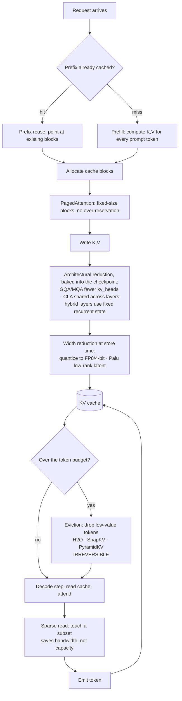

# KV cache optimization

> **The one sentence:** at production context lengths the KV cache, not the
> weights, is what runs you out of memory — and every technique for shrinking it
> is a multiplier on exactly one term of a formula you can write from memory.

[Transformers](transformers.html) explains *what* the KV cache is and why it
exists. This page is about what to do when it becomes the thing standing between
you and a bigger batch size.

The framing that makes all of this tractable: there is one formula, it has six
terms, and **almost every optimisation multiplies exactly one of them.** Once
you see which term a technique attacks, you know what it costs and what it
composes with, without memorising a list.

Two sets of things sit outside that formula and are worth naming up front so you
know where they fit. MLA changes the *shape* of what gets cached rather than
scaling a term. And the whole scheduling group — continuous batching, chunked
prefill, preemption, cache-aware routing — shrinks nothing at all; it decides
whether the memory you freed ever becomes throughput. Teams routinely halve
their cache and see no gain because the answer was in that second set.

---

## 1 · Diagram

```
  KV bytes = 2  ×  layers  ×  kv_heads  ×  head_dim  ×  seq_len  ×  bytes_per_value  ×  batch
             ^      ^           ^            ^           ^             ^
             |      |           |            |           |             |
          K and V  CLA       MQA / GQA     low-rank   sliding      quantization
          (fixed)  shares    fewer KV      (Palu)     window,      FP16 -> FP8 -> 4-bit
                   across    heads         projects   eviction,
                   layers                  smaller    recurrent
                                                      layers
                            └──────┬──────┘
                                MLA — caches a latent instead, so neither
                                term applies in its original form

  ...and the ones that change no term at all:

     PagedAttention  ->  removes ALLOCATION WASTE   (same bytes, less slack)
     Prefix reuse    ->  removes DUPLICATE bytes    (one copy, many requests)
     Sparse reads    ->  removes READ volume        (same bytes, fewer touched)

     Continuous batching -> keeps the freed memory BUSY  (occupancy, not size)
     Chunked prefill     -> stops one long prompt stalling everyone
     Preempt / swap      -> lets you admit optimistically and recover
     Cache-aware routing -> decides whether prefix reuse ever actually fires


  WHY IT DOMINATES — a 70B model at long context

    weights (FP16)                            ~140 GB   fixed, paid once
    KV cache @ 8k ctx, batch 1                  ~2.4 GB
    KV cache @ 128k ctx, batch 1                 ~39 GB
    KV cache @ 128k ctx, batch 32              ~1,250 GB   <-- the wall
                                                           weights are now a
                                                           rounding error
```

The shape to internalise: **weights are a constant, KV is a rectangle that grows
in two directions at once.** Context length and batch size multiply. Doubling
context halves the concurrency you can serve on the same card — which is why
"support 128k context" and "serve 200 concurrent users" are the same budget
argued from two ends.

And the reason the *placement* techniques are worth as much as the shrinking
ones: identical free memory, two allocators, one of which cannot use it.

<figure class="fig-anim">
<svg viewBox="0 0 510 232" role="img" aria-label="Animated comparison: a request needing four blocks probes contiguous memory, finds only two-block gaps, and is rejected; the same request immediately claims four scattered blocks in paged memory">
  <text class="lbl-b" x="20" y="18">CONTIGUOUS — needs 4 blocks in a row</text>
  <g>
    <rect class="k" x="20"  y="30" width="30" height="26" rx="3"/>
    <rect class="k" x="54"  y="30" width="30" height="26" rx="3"/>
    <rect class="k" x="88"  y="30" width="30" height="26" rx="3"/>
    <rect class="k" x="122" y="30" width="30" height="26" rx="3"/>
    <rect class="slot" x="156" y="30" width="30" height="26" rx="3"/>
    <rect class="slot" x="190" y="30" width="30" height="26" rx="3"/>
    <rect class="v" x="224" y="30" width="30" height="26" rx="3"/>
    <rect class="v" x="258" y="30" width="30" height="26" rx="3"/>
    <rect class="v" x="292" y="30" width="30" height="26" rx="3"/>
    <rect class="v" x="326" y="30" width="30" height="26" rx="3"/>
    <rect class="slot" x="360" y="30" width="30" height="26" rx="3"/>
    <rect class="slot" x="394" y="30" width="30" height="26" rx="3"/>
  </g>
  <g class="probe">
    <rect class="probe-body" x="156" y="26" width="132" height="34" rx="4"/>
    <text class="lbl" x="222" y="47" text-anchor="middle" fill="currentColor">need 4</text>
  </g>
  <g class="reject">
    <text class="lbl-b" x="20" y="80" fill="currentColor">4 blocks free — but only in runs of 2. REQUEST REJECTED.</text>
  </g>
  <text class="lbl" x="20" y="98">external fragmentation: the memory exists, the shape is wrong</text>

  <line x1="20" y1="114" x2="490" y2="114" stroke="currentColor" stroke-width="1" opacity=".18"/>

  <text class="lbl-b" x="20" y="140">PAGED — takes any 4, wherever they are</text>
  <g>
    <rect class="k" x="20"  y="152" width="30" height="26" rx="3"/>
    <rect class="k" x="54"  y="152" width="30" height="26" rx="3"/>
    <rect class="k" x="88"  y="152" width="30" height="26" rx="3"/>
    <rect class="k" x="122" y="152" width="30" height="26" rx="3"/>
    <rect class="slot" x="156" y="152" width="30" height="26" rx="3"/>
    <rect class="ok claim" style="animation-delay:0s"   x="156" y="152" width="30" height="26" rx="3"/>
    <rect class="slot" x="190" y="152" width="30" height="26" rx="3"/>
    <rect class="ok claim" style="animation-delay:.25s" x="190" y="152" width="30" height="26" rx="3"/>
    <rect class="v" x="224" y="152" width="30" height="26" rx="3"/>
    <rect class="v" x="258" y="152" width="30" height="26" rx="3"/>
    <rect class="v" x="292" y="152" width="30" height="26" rx="3"/>
    <rect class="v" x="326" y="152" width="30" height="26" rx="3"/>
    <rect class="slot" x="360" y="152" width="30" height="26" rx="3"/>
    <rect class="ok claim" style="animation-delay:.5s"  x="360" y="152" width="30" height="26" rx="3"/>
    <rect class="slot" x="394" y="152" width="30" height="26" rx="3"/>
    <rect class="ok claim" style="animation-delay:.75s" x="394" y="152" width="30" height="26" rx="3"/>
  </g>
  <text class="lbl" x="20" y="196">block table:  logical 0→p4   1→p5   2→p10   3→p11</text>
  <text class="lbl" x="20" y="214">contiguous to the kernel, scattered in memory. Waste &lt;1 block.</text>
</svg>
<figcaption>Neither allocator has more memory than the other. Fixed-size blocks make every free block interchangeable, which is what turns 20–40% utilisation into 96%+ — and utilisation is batch size, and batch size is throughput.</figcaption>
</figure>

---

## 2 · Design — the thirteen techniques

Counted as thirteen by splitting the two pairs that behave differently in practice:
MQA and GQA are separate design points (one is a special case of the other, and
the quality cliff sits between them), and sparse *storage* is a different
decision from sparse *reads*.

### Group A — architectural: fewer heads, fewer layers, shorter state

These are **training-time** decisions. You cannot retrofit them to a checkpoint
without retraining, so for an application engineer they are model-selection
criteria, not knobs.

| # | Technique | Term attacked | Typical factor | The cost |
|---|---|---|---|---|
| 1 | **MQA** — one KV head for all query heads | `kv_heads` | up to 64× | Sharpest quality drop of the group; largely superseded by GQA |
| 2 | **GQA** — query heads grouped over few KV heads | `kv_heads` | 4–8× | Near-lossless at 8 groups; the default in modern models |
| 3 | **CLA** — adjacent layers share one KV cache | `layers` | 2× | Composes *on top of* MQA/GQA; validated at 1B–3B scale |
| 4 | **Hybrid recurrent layers** — some layers keep fixed-size state instead of a growing cache | `seq_len`, per layer | Depends on ratio | Recurrent layers have finite recall; you are trading exact long-range attention for constant memory |
| 13 | **MLA** — cache one small shared latent per token, reconstruct K and V from it during attention | `kv_heads` × `head_dim`, jointly | ~10× vs GQA, far more vs MHA | Extra decode compute to reconstruct, and it needs fused kernels to be a net win. Numbered last because it arrived last, not because it matters least |

**GQA is the one that matters most in practice**, because it is already in
everything you are likely to serve. Llama-3-70B uses 64 query heads over 8 KV
heads — an 8× cut before you do anything at all. Check `num_key_value_heads`
against `num_attention_heads` in any model's config; that ratio is your baseline.

**CLA** (Brandon et al., NeurIPS 2024) shares KV activations *between* layers
rather than within one. The configuration that worked best is **CLA2** — sharing
across pairs of consecutive layers — giving another 2× on top of MQA with
near-identical accuracy. It is the cleanest example of the composition principle:
it attacks `layers`, MQA attacks `kv_heads`, so they multiply.

**MLA** (multi-head latent attention, DeepSeek-V2/V3) is the most aggressive
architectural answer currently deployed at scale, and it reframes the problem
rather than tuning a term. Instead of caching keys and values, it caches a
single low-rank *latent* vector per token and reconstructs the full per-head K
and V from it inside the attention kernel. The cache stops scaling with
`kv_heads × head_dim` and starts scaling with the latent width, which is far
smaller — DeepSeek-V2 reports roughly a 93% cut against the MHA equivalent.

The reason it is worth knowing even if you never train a model: it is the
clearest demonstration that the six-term formula is a description of one
*design*, not a law. Palu (row 12) does the same thing bolted onto an existing
checkpoint; MLA does it as the architecture. Both trade decode FLOPs for cache
bytes, which is exactly the right trade given that decode is bandwidth-bound and
has FLOPs to spare — see the first paragraph of the depth section.

### Group B — token & memory management: fewer tokens, less waste

These are **inference-time** and you control them. This is where an application
engineer actually operates.

| # | Technique | What it removes | Typical factor | The cost |
|---|---|---|---|---|
| 5 | **Sliding window** — keep only the last *W* tokens in some layers | `seq_len` → constant | Unbounded at long context | Anything outside the window is gone. Interleave with full-attention layers or lose long-range recall entirely |
| 6 | **Eviction** — drop low-value tokens to hold a fixed budget (H2O, SnapKV, PyramidKV) | `seq_len` | 2–10× | **Irreversible.** An evicted token cannot be recovered if a later query needed it. Failure is silent and input-dependent |
| 7 | **PagedAttention** — virtual-memory paging for the cache | allocation waste | 2–4× more batch | Kernel complexity. This is the vLLM idea and it is nearly free — take it |
| 8 | **Prefix reuse** — share cache blocks across requests with an identical prefix | duplicate bytes | Huge for shared system prompts | Only helps on *exact* prefix match; needs cache-aware routing to pay off |
| 9 | **Sparse attention (storage)** — group or cluster tokens, keep representatives | `seq_len` | 2–8× | Approximation error concentrated in whatever the grouping got wrong |
| 10 | **Compressed sparse (reads)** — store everything, selectively *read* | nothing — read volume | Latency, not memory | Does not lower peak memory. Solves a bandwidth problem, not a capacity one |

**PagedAttention is the one to do first** and the one with the least
justification needed. It does not shrink a single byte of real cache — it removes
*fragmentation*. Classic contiguous allocation reserves the worst-case sequence
length per request, so most of the reservation sits unused. Paging it in fixed
blocks turns that slack into batch size. Same memory, more concurrency, no
quality risk at all. If you serve on vLLM you already have it.

**The word "fragmentation" is hiding two different problems**, and knowing which
one fixed-size blocks solve is the whole insight:

| | External fragmentation | Internal fragmentation |
|---|---|---|
| What | Free memory exists, but no single run of it is long enough. 88 slots free here, 40 there, 200 there — a request needing 300 *contiguous* slots fails despite 328 being free | Waste *inside* an allocated block. A request holding 37 tokens at block size 16 occupies 3 blocks = 48 slots, wasting 11 |
| Under contiguous allocation | Unbounded, and gets worse as request lengths diversify | Enormous — the whole unused tail of a `max_seq_len` reservation |
| Under paging | **Eliminated.** Every block is the same size and a request accepts any block, so there is no such thing as a hole of the wrong shape | **Bounded** at strictly less than one block per request per layer |

That is the answer to "are the blocks fixed size?" — yes, and the fixity is the
point. It converts an unbounded, allocation-order-dependent problem into a
bounded one you can put a number on. Measured utilisation goes from 20–40% under
contiguous allocation to above 96%.

Block size is a genuine trade: smaller blocks (8) waste less but mean longer
block tables and more indirection per kernel launch; larger blocks (32) are
kernel-friendlier but waste more and make prefix sharing coarser. vLLM defaults
to 16.

```lab
paged
```

**Paging is bit-exact, and this is worth being firm about**, because "does
blocking lose data or accuracy?" is the most common misconception on the topic.
It does not. Paging changes only the *addressing* of the bytes: the same fp16
keys and values participate in the same dot products, in the same order, at the
same scale. The kernel consults a block table to find each 16-token chunk
instead of striding through one flat array, and the arithmetic never sees the
difference. Contrast the genuinely lossy rows in this table — quantization
rounds the numbers, eviction deletes positions, sliding window refuses to look
past *W*. Those change results. Paging and prefix reuse do not.

The one honest caveat: enabling prefix caching can make outputs differ in the
last decimal place, because a cache hit changes matmul batch shapes and
floating-point addition is not associative. That is non-determinism at the 1e-5
level, not degradation. At temperature 0 it can occasionally tip a near-tie
between two tokens; it never makes the model worse. Teams chasing bit-identical
reproducibility across runs need to know this exists.

**Eviction is the one to be most careful with.** Rows 5, 6 and 9 all discard
information, and the failure mode is not a crash — it is a model that answers
confidently having silently lost the token it needed. Whatever eviction policy
you pick, it must be evaluated against a **long-context recall probe**, not
average perplexity. See [regression gates](regression-gates.html).

**And whatever you evict, do not evict the first few tokens.** StreamingLLM's
finding is that the earliest positions act as *attention sinks*: heads dump
surplus probability mass onto them precisely because softmax must sum to one and
something has to absorb the weight when nothing in the window is relevant. Drop
those four or so tokens and the distribution has nowhere to put its slack,
attention redistributes onto content that should have been ignored, and
generation degenerates — not gracefully, but into repetition and gibberish.
Keeping four sink tokens plus a sliding window is what lets a fixed-size cache
stream indefinitely without collapse. Any eviction policy you write yourself
needs the same carve-out, and this is the most common way a home-grown one
fails.

### Group C — data width: fewer bits per value

| # | Technique | Term attacked | Typical factor | The cost |
|---|---|---|---|---|
| 11 | **Quantization** — FP16 → FP8 → 4-bit KV | `bytes_per_value` | 2–4× | Recall degradation at long context, and it hits the early tokens hardest |
| 12 | **Low-rank projection (Palu)** — cache a compressed latent, reconstruct K/V on the fly | `head_dim` | Reported >90% at the aggressive end | Reconstruction compute per attention step; needs fused kernels to be a net win |

**OSCAR is the current answer to "is INT2 KV actually possible?"** and it is
worth knowing because of *why* it works. Rotating the cache before quantizing is
standard — a Hadamard transform spreads outliers so they stop dominating the
scale. But a Hadamard is chosen to flatten the cache, and flattening the cache
is not the objective; surviving *attention* is. OSCAR estimates attention-aware
covariance offline and derives fixed rotations aligned to `QᵀQ` for keys and
`VᵀSᵀSV` for values, rather than to raw cache reconstruction. Naive rotation at
INT2 collapses to near-zero accuracy; OSCAR reports a BF16 gap of 1.42 points on
Qwen3-8B, roughly 8× less KV memory, up to 7× throughput at large batch, and up
to 3× faster batch-1 decode because decode is bandwidth-bound. It keeps sink and
recent tokens in BF16 and applies the rotate–clip–INT2 path only to history,
inside the paged cache — which is the shape every serious eviction and
quantization scheme converges on, for the attention-sink reason above.

**KV quantization is not weight quantization** and the intuition does not
transfer. INT8 KV is generally safe. **INT4 KV degrades long-context recall
specifically** — the model still scores well on short prompts and falls apart on
the thing you bought the long context window for. [Quantization](quantization.html)
covers the weight side; the rule here is: quantize KV one step less aggressively
than you quantize weights, and always probe recall afterwards.

**Palu** (Chang et al., ICLR 2025) is the least widely deployed and the most
architecturally interesting: it decomposes the K and V projection layers into
low-rank matrices, caches the small intermediate state, and reconstructs full
keys and values during attention. It is the only technique here that attacks
`head_dim` on a checkpoint you did not train — MLA (row 13) does the same thing
architecturally — which is why it composes with everything else.

### Group D — scheduling: same bytes, better occupancy

Nothing in this group shrinks a single byte. They decide whether the savings
from Groups A–C ever turn into throughput, and a team that gets the arithmetic
right and the scheduling wrong ships a server that is half idle while requests
queue. They belong on this page because every one of them is a policy over the
*cache* — what to admit, what to hold, what to give back.

| Technique | The policy | What it buys | The cost |
|---|---|---|---|
| **Continuous batching** | Re-form the batch every decode step instead of running one to completion: finished requests leave, queued ones join immediately | The single largest throughput win in serving — often 2–3× over static batching | Only possible because a request's entire state *is* its KV blocks, so joining and leaving is free |
| **Chunked prefill** | Split a long prompt into fixed chunks and interleave them with ongoing decode steps | Stops one 32k prompt stalling every other user's tokens; large improvement in tail TTFT | Slightly worse TPOT for everyone, because decode steps now share the batch with prefill work |
| **Layered prefill** | Pipeline prefill *by layer group* rather than by token chunk: some layer groups process the incoming prefill while the rest run decode-only, and the prefill advances group by group across iterations | Keeps decode stall-free without token-level partitioning | Each layer sees the prompt once, so it avoids the memory amplification chunking causes — at the cost of a more complex scheduler |
| **Preemption — swap** | Under pressure, move a low-priority request's blocks to CPU RAM and bring them back later | Keeps the request alive; no recompute | PCIe is roughly 30× slower than HBM, so the round trip is visible |
| **Preemption — recompute** | Discard the blocks entirely and re-prefill the prompt when the request resumes | No memory held at all while preempted | Pays full prefill again. Usually cheaper than swapping for short prompts, worse for long ones |
| **Cache-aware routing** | Send a request to the replica that already holds its prefix | Turns prefix reuse from a mechanism into an actual hit rate | Fights load balancing: the replica with the cache may not be the least loaded one |

**Continuous batching is the one to check first**, before any of the shrinking
techniques, because it is where the memory you free actually becomes money.
Static batching pads every request in the batch to the longest one and holds the
whole batch until the slowest finishes, so a batch of 32 where one request
generates 2,000 tokens and the rest generate 50 spends most of its life running
at effective batch size 1. Continuous batching removes that entirely.

**Cache-aware routing is the quietest failure on this page.** Prefix reuse
without it is a mechanism that works perfectly and never fires: requests scatter
across replicas, each replica sees a cold prefix, and the hit-rate metric —
measured per replica — reports something reassuring. The symptom is a prefix
cache that "works" in every test and delivers no TTFT improvement in production.

**Preemption is a policy decision, not a failure.** A server that never preempts
is a server that under-admits: it holds enough headroom for every resident
request's worst case, which is exactly the over-reservation PagedAttention
exists to kill. Admitting optimistically and preempting occasionally gets higher
utilisation than admitting conservatively and never preempting — but only if you
watch the preemption rate, because a high one means you are thrashing rather
than scheduling.

---

## 3 · Flow — how to actually choose

Do them in this order. The ordering is by *risk*, not by size of win: everything
above the line is free, everything below trades quality for memory.

```
  1. What model?           -> GQA is probably already there. Check the config.
     |                        num_key_value_heads vs num_attention_heads.
     |                        This is 4-8x you already have.
     v
  2. What server?          -> PagedAttention + continuous batching. vLLM/TGI/
     |                        SGLang give you both. No quality cost, 2-4x
     |                        effective batch, and the batching is what turns
     |                        freed memory into throughput. Before anything else.
     v
  3. Shared prompts?       -> Prefix reuse. Free if your system prompt is shared.
     |                        Needs prefix-aware routing to actually hit --
     |                        without it you get the mechanism and no benefit.
     v
  3b. Long prompts hurting -> Chunked prefill. Costs a little TPOT, protects
     |  everyone's TTFT?      tail TTFT. Pure scheduling, no quality cost.
     v
  =========== everything above is LOSSLESS. Measure here. ===========
     |
     v
  4. Still OOM?            -> FP8 KV quantization. 2x. Probe recall.
     |
     v
  5. Still OOM?            -> Sliding window on some layers, OR eviction with
     |                        a real long-context eval gate. NOT both blind.
     v
  6. Still OOM?            -> You have an architecture problem, not a tuning
                              problem. Smaller model, shorter context, or
                              more cards. Say so rather than compressing
                              until quality quietly dies.
```

Step 6 is the one people skip. There is a point past which every remaining
technique is buying memory with accuracy, and the honest engineering answer is
to change the requirement instead.

---

## 4 · UML — where each technique intervenes



Note where the boxes sit: **architectural reductions are upstream of everything**
(they are properties of the checkpoint), width reduction happens at write time,
eviction happens under memory pressure, and sparse reads happen at read time
without changing what is stored. That layering is why they compose.

---

## 5 · Example

Move the sliders before reading the code. The one to reach for first is **KV heads** — take it from 32 to 8 and three quarters of the memory disappears. That is GQA, that is row 2, and no amount of paging or eviction below it comes close.

```widget
kv-cache
```

```python
"""KV cache sizing, and what each technique does to it.

The formula is the whole topic. Run this against your own model config before
reaching for any optimisation -- most capacity arguments are settled by
arithmetic, not by benchmarking.
"""

BYTES = {"fp16": 2, "fp8": 1, "int4": 0.5}


def kv_gb(layers, kv_heads, head_dim, seq_len, batch=1, dtype="fp16", cla_share=1):
    """Bytes held by the KV cache, in GiB.

    Args:
        layers:     transformer layers
        kv_heads:   KEY-VALUE heads, not query heads. This is the GQA term --
                    read num_key_value_heads from the model config.
        head_dim:   hidden_size / num_attention_heads
        seq_len:    tokens resident per sequence (context, or window if sliding)
        batch:      concurrent sequences
        dtype:      KV storage precision
        cla_share:  layers sharing one cache. 1 = none, 2 = CLA2.
    """
    effective_layers = layers / cla_share
    return (
        2                       # K and V
        * effective_layers
        * kv_heads
        * head_dim
        * seq_len
        * batch
        * BYTES[dtype]
    ) / 1024**3


# Llama-3-70B geometry: 80 layers, 64 query heads over 8 KV heads, head_dim 128.
CFG = dict(layers=80, kv_heads=8, head_dim=128)

baseline = kv_gb(**CFG, seq_len=128_000, batch=32)
print(f"baseline (GQA, fp16)      {baseline:7.1f} GB")

# Each technique, applied alone, against the same baseline.
print(f"+ FP8 KV                  {kv_gb(**CFG, seq_len=128_000, batch=32, dtype='fp8'):7.1f} GB")
print(f"+ CLA2                    {kv_gb(**CFG, seq_len=128_000, batch=32, cla_share=2):7.1f} GB")
print(f"+ 32k sliding window      {kv_gb(**CFG, seq_len=32_000, batch=32):7.1f} GB")

# They multiply, because each attacks a different term.
combined = kv_gb(**CFG, seq_len=128_000, batch=32, dtype="fp8", cla_share=2)
print(f"CLA2 + FP8 together       {combined:7.1f} GB   ({baseline / combined:.1f}x)")

# The comparison that actually decides the architecture:
weights_fp16_gb = 70 * 2
print(f"\nweights (70B @ fp16)      {weights_fp16_gb:7.1f} GB  <- constant")
print(f"KV at 128k x 32           {baseline:7.1f} GB  <- grows in two directions")
```

```
baseline (GQA, fp16)       1250.0 GB
+ FP8 KV                    625.0 GB
+ CLA2                      625.0 GB
+ 32k sliding window        312.5 GB
CLA2 + FP8 together         312.5 GB   (4.0x)

weights (70B @ fp16)        140.0 GB  <- constant
KV at 128k x 32            1250.0 GB  <- grows in two directions
```

The 4× from CLA2 + FP8 is the composition result usually quoted as
"40 GB → 10 GB", and this geometry is where that figure comes from: **one**
128k sequence on a 70B model is 39.1 GB of KV, and CLA2 + FP8 takes it to
9.8 GB. Two independent 2× reductions on different terms multiply.

That is the whole reason the formula framing is worth learning — it tells you in
advance which techniques stack and which overlap. CLA2 and FP8 stack because one
divides `layers` and the other divides `bytes_per_value`. MQA and GQA do not,
because both divide `kv_heads`: you pick one.

### Prefix reuse, in the three parts it actually decomposes into

Row 8 is a one-liner in the table and a whole subsystem in practice. It is
always these three pieces, and each owns one data structure:

**1 · Content hashing — decide what "the same prefix" means.** Hash each
aligned block of token ids, chaining in the previous block's hash so that
*position* is part of the identity. Two requests share a block only if every
token before it also matched.

```python
def block_hashes(token_ids, block_size=16):
    """Chained hashes: block i's identity includes all of blocks 0..i-1."""
    hashes, parent = [], None
    for i in range(0, len(token_ids) - block_size + 1, block_size):
        chunk = tuple(token_ids[i:i + block_size])
        parent = hash((parent, chunk))   # chained -> prefix identity,
        hashes.append(parent)            # not chunk identity
    return hashes
    # The partial trailing block is deliberately never hashed: it is not full,
    # so it is not final, so it is not safe to share.
```

**2 · A refcounted block table — decide who owns what.** Each physical block
carries a reference count. A hit increments it and points the new request's
table at the existing block instead of allocating; eviction is legal only at
refcount 0, normally LRU.

```python
def allocate_prefix(req_tokens, cache_index, pool):
    table, hits = [], 0
    for h in block_hashes(req_tokens):
        blk = cache_index.get(h)
        if blk is None:
            break                    # prefixes are contiguous by definition:
        blk.refcount += 1            # the first miss ends the shared region
        table.append(blk.id)
        hits += 1
    for _ in range(needed_blocks(req_tokens) - hits):
        table.append(pool.alloc().id)   # the divergent suffix, prefilled normally
    return table, hits * 16             # tokens skipped entirely
```

**3 · Copy-on-write — handle the fork safely.** Two requests share blocks 0–4
then diverge, and neither may write into a block someone else is reading. When a
shared block needs a write, copy it first. This is also how parallel sampling
(`n=4`) shares one prompt cache across four divergent continuations.

```python
def prepare_write(blk, pool):
    if blk.refcount == 1:
        return blk                   # sole owner -- write in place
    new = pool.alloc()
    new.data[:] = blk.data           # copy-on-write
    blk.refcount -= 1
    return new
```

Three requests sharing a 64-token system prompt pay 64 prefill tokens once
instead of 192. At a realistic 2,000-token system prompt and a thousand users,
that ratio is the difference between a viable unit economics and a bankrupt one
— which is why row 8 sits above the lossless line in the flow.

---

## 6 · Depth — the senior layer

**The KV cache is a bandwidth problem before it is a capacity problem.** Decode
is memory-bound: every generated token re-reads the entire cache. At 100 GB of
resident cache and 3 TB/s of HBM, you cannot exceed ~30 decode steps per second
no matter how much compute is idle. This is why sparse *reads* (#10) exist as a
separate technique from sparse *storage* — they solve different bottlenecks, and
a team that conflates them optimises the wrong one.

**Eviction failures are silent, input-dependent, and invisible to your usual
metrics.** A model with an over-aggressive eviction policy has normal perplexity,
normal latency, normal throughput, and occasionally cannot recall a fact that was
in its context. Average-case evals will not find it. You need a needle-style probe
at your real context length, and it belongs in CI — see
[regression gates](regression-gates.html).

**KIVI is where the K/V asymmetry became actionable.** The distributions are
not alike: key-cache outliers cluster along **channels**, value-cache outliers
do not. So KIVI quantizes **keys per-channel and values per-token** — different
grouping axes for the two tensors, from one analysis of where the outliers
actually sit. Tuning-free and plug-and-play at 2-bit, reporting ~2.6× lower peak
memory, up to 4× larger batches and 2.35–3.47× throughput. Read it alongside
OSCAR above: KIVI found the right *axes*, OSCAR found the right *rotation*, and
both are answers to the same question of what INT2 destroys.

**Quantization asymmetry: keys tolerate less than values.** Keys go through the
softmax, so error in a key perturbs the entire attention *distribution*, while
error in a value is averaged over the attended set. Implementations that quantize
K and V to the same width leave quality on the table; per-tensor scaling on K with
more aggressive V quantization is usually the better split.

**Prefix reuse is a routing problem wearing a caching hat.** The cache hit only
happens if the request lands on the replica that holds the prefix. Without
prefix-aware routing you have implemented the mechanism and will observe almost
none of the benefit — and the metric will say the cache "works", because hit rate
is measured per replica.

**Speculative decoding needs a cache that can be truncated cheaply.** A draft
model proposes *k* tokens and the target model verifies all *k* in one forward
pass, turning *k* bandwidth-bound decode steps into one that is closer to
compute-bound. Two consequences land on the cache: you append *k* speculative
K/V entries and then **roll back** to the first rejected position, which is
trivial with paged blocks and awkward with a flat contiguous slab; and you are
now holding two caches, the draft's and the target's, advancing and rewinding
together. That second cache is real memory and has to be in the budget. The
reason the technique works at all is the bottleneck above — at batch 1 you read
every weight to produce one token, so verifying five costs nearly the same
bytes. It spends idle FLOPs to buy latency, and it is the one optimisation on
this page that gets *worse* as batch size rises, because a full batch has no
idle FLOPs left to spend.

**Disaggregated serving separates the two phases onto different hardware.**
Prefill is compute-bound and decode is bandwidth-bound, so they want different
GPUs, different batch policies and different scaling curves; co-locating them
means each interferes with the other's latency, which is what chunked prefill
mitigates rather than solves. The cost of splitting them is that the KV cache
now has to cross a network between prefill and decode pools — which makes cache
transfer bandwidth a first-class capacity term, and is the main reason the
approach only pays off at scale.

**KV sharding is the axis the formula leaves out.** Everything above sizes the
cache for one device. Across a tensor-parallel group the KV heads are split with
the attention heads, so each rank holds its own slice and per-rank memory falls
with the degree — which is why a model that will not fit at TP=1 may fit
comfortably at TP=4 with no compression at all. Two caveats: with GQA the KV
heads may be fewer than the TP degree, in which case ranks duplicate rather than
divide and the saving stops; and sharding moves the cost to interconnect, so the
win is real on NVLink and much less so across nodes.

**"Support 128k context" and "serve N concurrent users" are one budget.** The
most common planning failure is treating them as separate requirements owned by
separate people. They multiply in the same formula. Any conversation about
raising the context window is also a conversation about lowering concurrency,
and it should be had once, with the arithmetic visible.

| Failure | Looks like | Actual cause |
|---|---|---|
| OOM under load, fine in testing | Crashes at high concurrency | KV grows with batch × context; single-request testing never sees it |
| Throughput collapses past a batch size | Sharp cliff, not a curve | Cache exceeded HBM; decode became bandwidth-bound |
| Long-context recall dies after a "safe" change | Short prompts fine, long ones wrong | INT4 KV, or eviction, dropping early tokens |
| Prefix caching shows no gain | Hit rate looks fine per replica | No prefix-aware routing; requests scatter |
| Memory freed slower than requests finish | Steady growth under churn | Fragmentation — the problem PagedAttention exists to solve |

---

## 7 · From each seat

| Seat | What KV cache optimization means here |
|---|---|
| **User** | Why a long conversation gets slower and eventually forgets the middle. Every optimisation on this page is a trade someone made between how much the model remembers and how many people it can serve at once. |
| **Coder** | Read `num_key_value_heads` before you benchmark. Do not implement eviction by hand — use the server's. Your leverage is prompt length: every token you trim is paid back at prefill *and* for the whole generation. |
| **Tester** | Average-case evals cannot see eviction or INT4 damage. Test recall at your real context length, probe the *middle* and the *start*, and gate on it. A green suite on short prompts proves nothing about the thing you compressed. |
| **System designer** | KV is the concurrency limit, so it is the capacity model. Context length and batch size trade directly. Order of work: PagedAttention, then prefix reuse, then FP8 — everything after that costs accuracy. |
| **Architect** | GQA and CLA are model-selection criteria, not tuning knobs; you inherit them at checkpoint time. Choosing a model is partly choosing a KV budget, and that should be explicit in the decision record. |
| **CEO** | This is the difference between serving 8 customers and 32 on the same GPU. PagedAttention plus FP8 is typically a 4–8× effective capacity gain for no quality loss, which is a direct multiple on gross margin per card. |
| **Market** | Long-context claims are cheap to advertise and expensive to serve. A vendor quoting a context window without quoting concurrency at that window has told you the easy half. Ask for both. |

---

## 8 · Interview questions

**"Your 70B model OOMs at 128k context but is fine at 8k. Why?"**
The weights did not change — the KV cache did, and it scales linearly in both
context and batch. Give the formula, do the arithmetic out loud (80 layers × 8 KV
heads × 128 dim × 2 × 2 bytes × 128k ≈ 39 GB *per sequence*), and point out that
at batch 32 this is ~1.25 TB against 140 GB of weights. Then fix it in risk order:
PagedAttention, prefix reuse, FP8, and only then anything lossy.

**"Difference between MQA, GQA and MHA?"**
Number of KV heads per query head. MHA: one each — best quality, largest cache.
MQA: one KV head for all — up to 64× smaller, noticeable quality cost. GQA:
groups in between — 8 groups is near-lossless and is why it is the modern
default. The interesting part is that all three attack the same single term, so
you pick one, you do not stack them.

**"Does PagedAttention reduce KV cache size?"**
No — and this catches people. It reduces *waste*. Contiguous allocation reserves
worst-case length per sequence and most of that reservation goes unused. Paging
turns that slack into batch capacity. Same real bytes, higher utilisation, zero
quality risk.

**"Does blocking the cache lose data, or change the answer?"**
No. Paging changes the *addressing* of the bytes, not the bytes: the same fp16
keys and values go through the same dot products in the same order, with the
kernel consulting a block table instead of striding a flat array. Bit-exact.
Name the contrast to show you know where loss actually comes from —
quantization rounds, eviction deletes, sliding window refuses to look. The one
honest caveat is that a prefix-cache hit changes matmul batch shapes, and
floating-point addition is not associative, so outputs can differ at the 1e-5
level. That is non-determinism, not degradation.

**"Fixed-size blocks waste memory in the last block. Why is that a good trade?"**
Because it swaps an unbounded problem for a bounded one. Contiguous allocation
suffers *external* fragmentation — free memory that no request can use because
no run of it is long enough, and it worsens as request lengths diversify. Fixed
blocks make every hole interchangeable, so external fragmentation goes to zero
and the only remaining waste is *internal*: strictly less than one block per
request per layer. Utilisation goes from 20–40% to above 96%, which is 2–4×
batch size.

**"When would you NOT quantize the KV cache?"**
When long-context recall is the product. INT8 is usually safe; INT4 degrades
early-token recall specifically, so the model passes short-prompt evals and fails
at exactly the length you bought the context window for. Also note keys are more
sensitive than values, because key error perturbs the whole softmax.

**"You halved your KV cache and throughput barely moved. What went wrong?"**
Almost certainly scheduling, not memory. Freeing cache raises the batch size you
*could* run; it does nothing on its own. Check continuous batching is on — under
static batching the whole batch waits for its slowest request, so a batch of 32
with one long generation runs at an effective batch of about 1 for most of its
life. Then check admission: a scheduler holding worst-case headroom per resident
request will not spend the memory you just freed. Then check whether you are
now bandwidth-bound rather than capacity-bound, in which case more batch buys
nothing and the next move is quantization or a different card.

**"You have CLA and FP8. What's the combined saving, and why?"**
4×. They multiply because CLA attacks `layers` and FP8 attacks
`bytes_per_value` — different terms of the same product. Two techniques on the
*same* term do not stack, which is why you would not run MQA and GQA together.

**"Eviction dropped your memory 4× and evals are unchanged. Ship it?"**
No, not on that evidence. Ask what the evals measure. Eviction damage is
input-dependent and invisible to averages; you need a long-context recall probe
at production context length, gated in CI. "Unchanged average perplexity" is
consistent with having silently broken retrieval from early context.

---

## Stop condition

You are done with this page when you can:

- Write the KV size formula from memory and name which technique attacks each term
- Explain why CLA and FP8 multiply but MQA and GQA do not
- Say why PagedAttention reduces no bytes yet raises batch size
- Distinguish internal from external fragmentation, and say which one fixed blocks eliminate
- Name the three parts prefix reuse decomposes into, and what each one owns
- Say which techniques on this page are bit-exact and which trade accuracy, without hedging
- Name the one failure mode that average-case evals cannot detect, and how you would gate it
- Do the arithmetic that shows KV overtaking weights, and use it to argue a capacity plan

---

## Sources worth reading

- **GQA** — [Ainslie et al., *GQA: Training Generalized Multi-Query Transformer Models*](https://arxiv.org/abs/2305.13245) (2023) — the paper behind the default.
- **CLA** — [Brandon et al., *Reducing Transformer Key-Value Cache Size with Cross-Layer Attention*](https://arxiv.org/abs/2405.12981) (NeurIPS 2024) — CLA2, sharing across pairs of adjacent layers.
- **PagedAttention** — [Kwon et al., *Efficient Memory Management for LLM Serving with PagedAttention*](https://arxiv.org/abs/2309.06180) (SOSP 2023) — the vLLM paper.
- **Palu** — [Chang et al., *Palu: Compressing KV-Cache with Low-Rank Projection*](https://arxiv.org/abs/2407.21118) (ICLR 2025).
- **MLA** — [*DeepSeek-V2*](https://arxiv.org/abs/2405.04434) (2024) — multi-head latent attention, the largest architectural cut currently deployed at scale.
- **Attention sinks** — [Xiao et al., *Efficient Streaming Language Models with Attention Sinks*](https://arxiv.org/abs/2309.17453) (2023) — why the first four tokens must never be evicted.
- **Continuous batching** — [Yu et al., *Orca: A Distributed Serving System for Transformer-Based Generative Models*](https://www.usenix.org/conference/osdi22/presentation/yu) (OSDI 2022) — iteration-level scheduling, the idea every modern server implements.
- **H2O** — [Zhang et al., *Heavy-Hitter Oracle*](https://arxiv.org/abs/2306.14048) (2023) — the eviction line of work.
- **Survey** — [*A Survey on Large Language Model Acceleration based on KV Cache Management*](https://arxiv.org/abs/2412.19442) (2024) — the map of the whole field.

Related: [Transformers](transformers.html) for what the cache is ·
[Quantization](quantization.html) for the weight side ·
[Long context](long-context.html) for what breaks at length ·
[Serving & operations](serving-and-operations.html) for the latency budget it sits in ·
[Reasoning inference optimization](reasoning-inference-optimization.html) for the
workload that fills this cache fastest — a 32k reasoning chain is 32k of KV ·
[Kernel & attention optimization](kernel-and-attention-optimization.html) for the
layer under rows 9 and 10: the sparse-attention schemes that decide which scores
get computed at all ·
[KV reuse beyond the exact prefix](kv-reuse.html) for what to do when row 8 does
not fire — shifting, correction, infill, and pinning ·
[Reading a model config](model-shape.html) for the architectures that break the
formula above: cross-layer KV sharing, K=V, and variable width.
