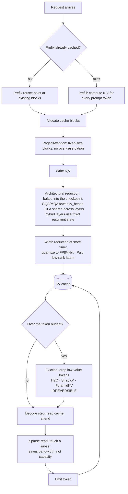

# KV cache optimization

> **The one sentence:** at production context lengths the KV cache, not the
> weights, is what runs you out of memory — and every technique for shrinking it
> is a multiplier on exactly one term of a formula you can write from memory.

[Transformers](transformers.html) explains *what* the KV cache is and why it
exists. This page is about what to do when it becomes the thing standing between
you and a bigger batch size.

The framing that makes all of this tractable: there is one formula, it has six
terms, and **every optimisation multiplies exactly one of them.** Once you see
which term a technique attacks, you know what it costs and what it composes
with, without memorising a list.

---

## 1 · Diagram

```
  KV bytes = 2  ×  layers  ×  kv_heads  ×  head_dim  ×  seq_len  ×  bytes_per_value  ×  batch
             ^      ^           ^            ^           ^             ^
             |      |           |            |           |             |
          K and V  CLA       MQA / GQA     low-rank   sliding      quantization
          (fixed)  shares    fewer KV      (Palu)     window,      FP16 -> FP8 -> 4-bit
                   across    heads         projects   eviction,
                   layers                  smaller    recurrent
                                                      layers

  ...and three that do not change the formula at all:

     PagedAttention  ->  removes ALLOCATION WASTE   (same bytes, less slack)
     Prefix reuse    ->  removes DUPLICATE bytes    (one copy, many requests)
     Sparse reads    ->  removes READ volume        (same bytes, fewer touched)


  WHY IT DOMINATES — a 70B model at long context

    weights (FP16)                            ~140 GB   fixed, paid once
    KV cache @ 8k ctx, batch 1                  ~2.4 GB
    KV cache @ 128k ctx, batch 1                 ~39 GB
    KV cache @ 128k ctx, batch 32              ~1,250 GB   <-- the wall
                                                           weights are now a
                                                           rounding error
```

The shape to internalise: **weights are a constant, KV is a rectangle that grows
in two directions at once.** Context length and batch size multiply. Doubling
context halves the concurrency you can serve on the same card — which is why
"support 128k context" and "serve 200 concurrent users" are the same budget
argued from two ends.

---

## 2 · Design — the twelve techniques

Counted as twelve by splitting the two pairs that behave differently in practice:
MQA and GQA are separate design points (one is a special case of the other, and
the quality cliff sits between them), and sparse *storage* is a different
decision from sparse *reads*.

### Group A — architectural: fewer heads, fewer layers, shorter state

These are **training-time** decisions. You cannot retrofit them to a checkpoint
without retraining, so for an application engineer they are model-selection
criteria, not knobs.

| # | Technique | Term attacked | Typical factor | The cost |
|---|---|---|---|---|
| 1 | **MQA** — one KV head for all query heads | `kv_heads` | up to 64× | Sharpest quality drop of the group; largely superseded by GQA |
| 2 | **GQA** — query heads grouped over few KV heads | `kv_heads` | 4–8× | Near-lossless at 8 groups; the default in modern models |
| 3 | **CLA** — adjacent layers share one KV cache | `layers` | 2× | Composes *on top of* MQA/GQA; validated at 1B–3B scale |
| 4 | **Hybrid recurrent layers** — some layers keep fixed-size state instead of a growing cache | `seq_len`, per layer | Depends on ratio | Recurrent layers have finite recall; you are trading exact long-range attention for constant memory |

**GQA is the one that matters most in practice**, because it is already in
everything you are likely to serve. Llama-3-70B uses 64 query heads over 8 KV
heads — an 8× cut before you do anything at all. Check `num_key_value_heads`
against `num_attention_heads` in any model's config; that ratio is your baseline.

**CLA** (Brandon et al., NeurIPS 2024) shares KV activations *between* layers
rather than within one. The configuration that worked best is **CLA2** — sharing
across pairs of consecutive layers — giving another 2× on top of MQA with
near-identical accuracy. It is the cleanest example of the composition principle:
it attacks `layers`, MQA attacks `kv_heads`, so they multiply.

### Group B — token & memory management: fewer tokens, less waste

These are **inference-time** and you control them. This is where an application
engineer actually operates.

| # | Technique | What it removes | Typical factor | The cost |
|---|---|---|---|---|
| 5 | **Sliding window** — keep only the last *W* tokens in some layers | `seq_len` → constant | Unbounded at long context | Anything outside the window is gone. Interleave with full-attention layers or lose long-range recall entirely |
| 6 | **Eviction** — drop low-value tokens to hold a fixed budget (H2O, SnapKV, PyramidKV) | `seq_len` | 2–10× | **Irreversible.** An evicted token cannot be recovered if a later query needed it. Failure is silent and input-dependent |
| 7 | **PagedAttention** — virtual-memory paging for the cache | allocation waste | 2–4× more batch | Kernel complexity. This is the vLLM idea and it is nearly free — take it |
| 8 | **Prefix reuse** — share cache blocks across requests with an identical prefix | duplicate bytes | Huge for shared system prompts | Only helps on *exact* prefix match; needs cache-aware routing to pay off |
| 9 | **Sparse attention (storage)** — group or cluster tokens, keep representatives | `seq_len` | 2–8× | Approximation error concentrated in whatever the grouping got wrong |
| 10 | **Compressed sparse (reads)** — store everything, selectively *read* | nothing — read volume | Latency, not memory | Does not lower peak memory. Solves a bandwidth problem, not a capacity one |

**PagedAttention is the one to do first** and the one with the least
justification needed. It does not shrink a single byte of real cache — it removes
*fragmentation*. Classic contiguous allocation reserves the worst-case sequence
length per request, so most of the reservation sits unused. Paging it in fixed
blocks turns that slack into batch size. Same memory, more concurrency, no
quality risk at all. If you serve on vLLM you already have it.

**Eviction is the one to be most careful with.** Rows 5, 6 and 9 all discard
information, and the failure mode is not a crash — it is a model that answers
confidently having silently lost the token it needed. Whatever eviction policy
you pick, it must be evaluated against a **long-context recall probe**, not
average perplexity. See [regression gates](regression-gates.html).

### Group C — data width: fewer bits per value

| # | Technique | Term attacked | Typical factor | The cost |
|---|---|---|---|---|
| 11 | **Quantization** — FP16 → FP8 → 4-bit KV | `bytes_per_value` | 2–4× | Recall degradation at long context, and it hits the early tokens hardest |
| 12 | **Low-rank projection (Palu)** — cache a compressed latent, reconstruct K/V on the fly | `head_dim` | Reported >90% at the aggressive end | Reconstruction compute per attention step; needs fused kernels to be a net win |

**KV quantization is not weight quantization** and the intuition does not
transfer. INT8 KV is generally safe. **INT4 KV degrades long-context recall
specifically** — the model still scores well on short prompts and falls apart on
the thing you bought the long context window for. [Quantization](quantization.html)
covers the weight side; the rule here is: quantize KV one step less aggressively
than you quantize weights, and always probe recall afterwards.

**Palu** (Chang et al., ICLR 2025) is the least widely deployed and the most
architecturally interesting: it decomposes the K and V projection layers into
low-rank matrices, caches the small intermediate state, and reconstructs full
keys and values during attention. It is the only technique that attacks
`head_dim`, which is why it composes with everything else.

---

## 3 · Flow — how to actually choose

Do them in this order. The ordering is by *risk*, not by size of win: everything
above the line is free, everything below trades quality for memory.

```
  1. What model?           -> GQA is probably already there. Check the config.
     |                        num_key_value_heads vs num_attention_heads.
     |                        This is 4-8x you already have.
     v
  2. What server?          -> PagedAttention. vLLM/TGI/SGLang. No quality cost.
     |                        2-4x effective batch. Do this before anything else.
     v
  3. Shared prompts?       -> Prefix reuse. Free if your system prompt is shared.
     |                        Needs prefix-aware routing to actually hit.
     v
  =========== everything above is LOSSLESS. Measure here. ===========
     |
     v
  4. Still OOM?            -> FP8 KV quantization. 2x. Probe recall.
     |
     v
  5. Still OOM?            -> Sliding window on some layers, OR eviction with
     |                        a real long-context eval gate. NOT both blind.
     v
  6. Still OOM?            -> You have an architecture problem, not a tuning
                              problem. Smaller model, shorter context, or
                              more cards. Say so rather than compressing
                              until quality quietly dies.
```

Step 6 is the one people skip. There is a point past which every remaining
technique is buying memory with accuracy, and the honest engineering answer is
to change the requirement instead.

---

## 4 · UML — where each technique intervenes



Note where the boxes sit: **architectural reductions are upstream of everything**
(they are properties of the checkpoint), width reduction happens at write time,
eviction happens under memory pressure, and sparse reads happen at read time
without changing what is stored. That layering is why they compose.

---

## 5 · Example

```python
"""KV cache sizing, and what each technique does to it.

The formula is the whole topic. Run this against your own model config before
reaching for any optimisation -- most capacity arguments are settled by
arithmetic, not by benchmarking.
"""

BYTES = {"fp16": 2, "fp8": 1, "int4": 0.5}


def kv_gb(layers, kv_heads, head_dim, seq_len, batch=1, dtype="fp16", cla_share=1):
    """Bytes held by the KV cache, in GiB.

    Args:
        layers:     transformer layers
        kv_heads:   KEY-VALUE heads, not query heads. This is the GQA term --
                    read num_key_value_heads from the model config.
        head_dim:   hidden_size / num_attention_heads
        seq_len:    tokens resident per sequence (context, or window if sliding)
        batch:      concurrent sequences
        dtype:      KV storage precision
        cla_share:  layers sharing one cache. 1 = none, 2 = CLA2.
    """
    effective_layers = layers / cla_share
    return (
        2                       # K and V
        * effective_layers
        * kv_heads
        * head_dim
        * seq_len
        * batch
        * BYTES[dtype]
    ) / 1024**3


# Llama-3-70B geometry: 80 layers, 64 query heads over 8 KV heads, head_dim 128.
CFG = dict(layers=80, kv_heads=8, head_dim=128)

baseline = kv_gb(**CFG, seq_len=128_000, batch=32)
print(f"baseline (GQA, fp16)      {baseline:7.1f} GB")

# Each technique, applied alone, against the same baseline.
print(f"+ FP8 KV                  {kv_gb(**CFG, seq_len=128_000, batch=32, dtype='fp8'):7.1f} GB")
print(f"+ CLA2                    {kv_gb(**CFG, seq_len=128_000, batch=32, cla_share=2):7.1f} GB")
print(f"+ 32k sliding window      {kv_gb(**CFG, seq_len=32_000, batch=32):7.1f} GB")

# They multiply, because each attacks a different term.
combined = kv_gb(**CFG, seq_len=128_000, batch=32, dtype="fp8", cla_share=2)
print(f"CLA2 + FP8 together       {combined:7.1f} GB   ({baseline / combined:.1f}x)")

# The comparison that actually decides the architecture:
weights_fp16_gb = 70 * 2
print(f"\nweights (70B @ fp16)      {weights_fp16_gb:7.1f} GB  <- constant")
print(f"KV at 128k x 32           {baseline:7.1f} GB  <- grows in two directions")
```

```
baseline (GQA, fp16)       1250.0 GB
+ FP8 KV                    625.0 GB
+ CLA2                      625.0 GB
+ 32k sliding window        312.5 GB
CLA2 + FP8 together         312.5 GB   (4.0x)

weights (70B @ fp16)        140.0 GB  <- constant
KV at 128k x 32            1250.0 GB  <- grows in two directions
```

The 4× from CLA2 + FP8 is the composition result usually quoted as
"40 GB → 10 GB", and this geometry is where that figure comes from: **one**
128k sequence on a 70B model is 39.1 GB of KV, and CLA2 + FP8 takes it to
9.8 GB. Two independent 2× reductions on different terms multiply.

That is the whole reason the formula framing is worth learning — it tells you in
advance which techniques stack and which overlap. CLA2 and FP8 stack because one
divides `layers` and the other divides `bytes_per_value`. MQA and GQA do not,
because both divide `kv_heads`: you pick one.

---

## 6 · Depth — the senior layer

**The KV cache is a bandwidth problem before it is a capacity problem.** Decode
is memory-bound: every generated token re-reads the entire cache. At 100 GB of
resident cache and 3 TB/s of HBM, you cannot exceed ~30 decode steps per second
no matter how much compute is idle. This is why sparse *reads* (#10) exist as a
separate technique from sparse *storage* — they solve different bottlenecks, and
a team that conflates them optimises the wrong one.

**Eviction failures are silent, input-dependent, and invisible to your usual
metrics.** A model with an over-aggressive eviction policy has normal perplexity,
normal latency, normal throughput, and occasionally cannot recall a fact that was
in its context. Average-case evals will not find it. You need a needle-style probe
at your real context length, and it belongs in CI — see
[regression gates](regression-gates.html).

**Quantization asymmetry: keys tolerate less than values.** Keys go through the
softmax, so error in a key perturbs the entire attention *distribution*, while
error in a value is averaged over the attended set. Implementations that quantize
K and V to the same width leave quality on the table; per-tensor scaling on K with
more aggressive V quantization is usually the better split.

**Prefix reuse is a routing problem wearing a caching hat.** The cache hit only
happens if the request lands on the replica that holds the prefix. Without
prefix-aware routing you have implemented the mechanism and will observe almost
none of the benefit — and the metric will say the cache "works", because hit rate
is measured per replica.

**"Support 128k context" and "serve N concurrent users" are one budget.** The
most common planning failure is treating them as separate requirements owned by
separate people. They multiply in the same formula. Any conversation about
raising the context window is also a conversation about lowering concurrency,
and it should be had once, with the arithmetic visible.

| Failure | Looks like | Actual cause |
|---|---|---|
| OOM under load, fine in testing | Crashes at high concurrency | KV grows with batch × context; single-request testing never sees it |
| Throughput collapses past a batch size | Sharp cliff, not a curve | Cache exceeded HBM; decode became bandwidth-bound |
| Long-context recall dies after a "safe" change | Short prompts fine, long ones wrong | INT4 KV, or eviction, dropping early tokens |
| Prefix caching shows no gain | Hit rate looks fine per replica | No prefix-aware routing; requests scatter |
| Memory freed slower than requests finish | Steady growth under churn | Fragmentation — the problem PagedAttention exists to solve |

---

## 7 · From each seat

| Seat | What KV cache optimization means here |
|---|---|
| **User** | Why a long conversation gets slower and eventually forgets the middle. Every optimisation on this page is a trade someone made between how much the model remembers and how many people it can serve at once. |
| **Coder** | Read `num_key_value_heads` before you benchmark. Do not implement eviction by hand — use the server's. Your leverage is prompt length: every token you trim is paid back at prefill *and* for the whole generation. |
| **Tester** | Average-case evals cannot see eviction or INT4 damage. Test recall at your real context length, probe the *middle* and the *start*, and gate on it. A green suite on short prompts proves nothing about the thing you compressed. |
| **System designer** | KV is the concurrency limit, so it is the capacity model. Context length and batch size trade directly. Order of work: PagedAttention, then prefix reuse, then FP8 — everything after that costs accuracy. |
| **Architect** | GQA and CLA are model-selection criteria, not tuning knobs; you inherit them at checkpoint time. Choosing a model is partly choosing a KV budget, and that should be explicit in the decision record. |
| **CEO** | This is the difference between serving 8 customers and 32 on the same GPU. PagedAttention plus FP8 is typically a 4–8× effective capacity gain for no quality loss, which is a direct multiple on gross margin per card. |
| **Market** | Long-context claims are cheap to advertise and expensive to serve. A vendor quoting a context window without quoting concurrency at that window has told you the easy half. Ask for both. |

---

## 8 · Interview questions

**"Your 70B model OOMs at 128k context but is fine at 8k. Why?"**
The weights did not change — the KV cache did, and it scales linearly in both
context and batch. Give the formula, do the arithmetic out loud (80 layers × 8 KV
heads × 128 dim × 2 × 2 bytes × 128k ≈ 39 GB *per sequence*), and point out that
at batch 32 this is ~1.25 TB against 140 GB of weights. Then fix it in risk order:
PagedAttention, prefix reuse, FP8, and only then anything lossy.

**"Difference between MQA, GQA and MHA?"**
Number of KV heads per query head. MHA: one each — best quality, largest cache.
MQA: one KV head for all — up to 64× smaller, noticeable quality cost. GQA:
groups in between — 8 groups is near-lossless and is why it is the modern
default. The interesting part is that all three attack the same single term, so
you pick one, you do not stack them.

**"Does PagedAttention reduce KV cache size?"**
No — and this catches people. It reduces *waste*. Contiguous allocation reserves
worst-case length per sequence and most of that reservation goes unused. Paging
turns that slack into batch capacity. Same real bytes, higher utilisation, zero
quality risk.

**"When would you NOT quantize the KV cache?"**
When long-context recall is the product. INT8 is usually safe; INT4 degrades
early-token recall specifically, so the model passes short-prompt evals and fails
at exactly the length you bought the context window for. Also note keys are more
sensitive than values, because key error perturbs the whole softmax.

**"You have CLA and FP8. What's the combined saving, and why?"**
4×. They multiply because CLA attacks `layers` and FP8 attacks
`bytes_per_value` — different terms of the same product. Two techniques on the
*same* term do not stack, which is why you would not run MQA and GQA together.

**"Eviction dropped your memory 4× and evals are unchanged. Ship it?"**
No, not on that evidence. Ask what the evals measure. Eviction damage is
input-dependent and invisible to averages; you need a long-context recall probe
at production context length, gated in CI. "Unchanged average perplexity" is
consistent with having silently broken retrieval from early context.

---

## Stop condition

You are done with this page when you can:

- Write the KV size formula from memory and name which technique attacks each term
- Explain why CLA and FP8 multiply but MQA and GQA do not
- Say why PagedAttention reduces no bytes yet raises batch size
- Name the one failure mode that average-case evals cannot detect, and how you would gate it
- Do the arithmetic that shows KV overtaking weights, and use it to argue a capacity plan

---

## Sources worth reading

- **GQA** — [Ainslie et al., *GQA: Training Generalized Multi-Query Transformer Models*](https://arxiv.org/abs/2305.13245) (2023) — the paper behind the default.
- **CLA** — [Brandon et al., *Reducing Transformer Key-Value Cache Size with Cross-Layer Attention*](https://arxiv.org/abs/2405.12981) (NeurIPS 2024) — CLA2, sharing across pairs of adjacent layers.
- **PagedAttention** — [Kwon et al., *Efficient Memory Management for LLM Serving with PagedAttention*](https://arxiv.org/abs/2309.06180) (SOSP 2023) — the vLLM paper.
- **Palu** — [Chang et al., *Palu: Compressing KV-Cache with Low-Rank Projection*](https://arxiv.org/abs/2407.21118) (ICLR 2025).
- **H2O** — [Zhang et al., *Heavy-Hitter Oracle*](https://arxiv.org/abs/2306.14048) (2023) — the eviction line of work.
- **Survey** — [*A Survey on Large Language Model Acceleration based on KV Cache Management*](https://arxiv.org/abs/2412.19442) (2024) — the map of the whole field.

Related: [Transformers](transformers.html) for what the cache is ·
[Quantization](quantization.html) for the weight side ·
[Long context](long-context.html) for what breaks at length ·
[Serving & operations](serving-and-operations.html) for the latency budget it sits in.
