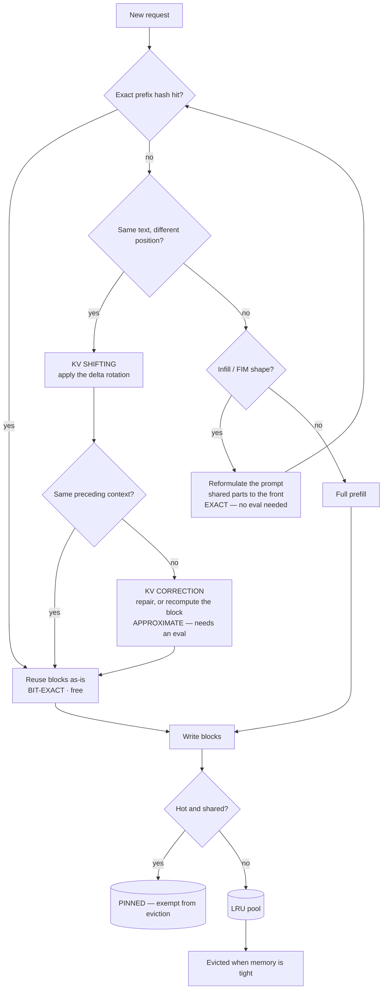

# KV reuse beyond the exact prefix

> **The one sentence:** a cached KV block is only valid for the position and
> the history it was computed at — so every technique here is a different
> answer to "can we use it anyway?", and RoPE is what makes the answer hard.

[KV cache optimization](kv-cache.html) covers prefix reuse as row 8: hash the
blocks, match the chain, share the physical pages. That works perfectly and
fires less often than you would like, because it requires an **exact** prefix.
Change one token near the front and every block after it is a miss.

This page is about the cases just outside that boundary, and they are most of
real traffic: a system prompt that must survive eviction, a code completion
whose suffix moves every keystroke, a conversation whose middle turns got
trimmed, a document that appears at a different offset in two different prompts.

---

## 1 · Diagram

```
  WHY A CACHED BLOCK IS NOT PORTABLE

  K for token t = RoPE( W_k · x_t , position=t )
                  ^^^^^^^^^^^^^^^^^^^^^^^^^^^^^
                  the rotation is baked in at position t

     block cached at positions 100..115
            |
            |  move it to positions 500..515?
            v
     keys carry the WRONG rotation          -> KV SHIFTING fixes this
     and were computed with the wrong
     preceding context                      -> KV CORRECTION tries to fix this


  THE FOUR THINGS THAT CAN DIFFER, AND WHAT ANSWERS EACH

    position differs ............. KV shifting · RoPE alignment · post-RoPE storage
    structure differs (FIM) ...... prompt reformulation (EFIM) · suffix correction
    the block must not be lost ... KV pinning
    the LAYER differs ............ KV layer propagation · cross-layer fusion


  WHAT IT IS WORTH

    exact prefix hit ........... the whole prefill, free
    shifted/corrected hit ...... the prefill, minus a correction pass
    miss ....................... the whole prefill, paid
```

Everything on this page trades **exactness for hit rate**. The prefix cache is
bit-exact and rarely fires; each step down this page fires more often and is
less obviously safe. That ordering is the thing to carry away.

---

```lab
prefix
```

```sim
prefixhit
```


## 2 · Design — position: RoPE is the whole problem

A key is not a property of a token. It is a property of a token **at a
position**, because RoPE rotates it by an angle derived from that position.
Move the block and the rotation is wrong; the model reads it as though the text
were somewhere it is not.

### Store post-RoPE, or pre-RoPE?

The first decision, and it is not obvious.

| | **Post-RoPE** (store rotated) | **Pre-RoPE** (store unrotated) |
|---|---|---|
| Decode cost | None — read and use | Re-apply RoPE on every read |
| Reuse at a new position | Needs an explicit shift | Free — just rotate to the new position |
| Who does it | Nearly every serving stack, for the decode cost | Systems built around aggressive reuse |

Most engines store **post-RoPE**, because decode happens far more often than
reuse and re-rotating the whole cache every step is not worth it. That choice is
what makes everything below necessary: once the rotation is baked in, moving a
block means *undoing and redoing* it.

### KV shifting

Apply the delta rotation that takes a block from its cached position to its new
one. Because RoPE is a rotation, composing two of them is a rotation — so the
correction is cheap and, for the positional part, **exact**.

This is what lets a cached segment be reused at an arbitrary offset, and it is
the mechanism behind "RoPE alignment" in segment-sharing systems: the same
document cached once can serve prompts that place it third, fifth or tenth. It
is also what StreamingLLM-style rolling caches do when they renumber positions
after dropping tokens from the front.

**What shifting does not fix** is the other half of the problem. `x_t` — the
hidden state the key was computed from — depended on every token *before* it.
Shift a block into a prompt with a different preamble and the rotation is now
right and the content is still wrong.

### KV correction, and KV reversal

**KV correction** is the family of methods that try to repair that second error
rather than recompute. The published work under this name is mostly about
repairing *quantization* damage rather than *position* damage — KVLinC pairs a
Hadamard rotation with lightweight linear correction adapters that compensate
for the error introduced by quantized keys; other work identifies which pages
went wrong and selectively recalls them head-wise rather than fixing everything.
The shared shape is: cheap detector, targeted repair, avoid the full recompute.

**KV reversal** is the one entry on this page with no body of literature behind
it. Read literally it means undoing a transform already applied to a cached
block — un-rotating post-RoPE keys back to their pre-RoPE form so they can be
re-rotated elsewhere, which is the natural implementation of shifting. Treat it
as a description of that step rather than as a named technique with results, and
do not go looking for a paper.

---

## 3 · Design — structure: infill is where prefix caching breaks

Fill-in-the-middle is the workload that defeats prefix caching most completely,
and code assistants are almost entirely FIM.

```
  a FIM prompt is assembled, not concatenated:

     <PRE> prefix tokens <SUF> suffix tokens <MID> -> model generates here

  so the SUFFIX sits in the middle of the sequence.

  the user types one character in the prefix
     -> prefix tokens change
     -> the suffix now follows different text
     -> the suffix's KV is invalid
     -> and the suffix may be thousands of tokens

  changes to prefix and suffix invalidate each other's cache. Every keystroke
  is close to a full miss, on the workload with the tightest latency budget
  anyone has.
```

**Suffix KV correction** is the direct attack: keep the suffix's KV and repair
it for its new preceding context. **EFIM is the indirect one, and it is the one
that shipped.** Rather than correcting the cache, it reformulates the prompt so
the shared parts stay at the front and new tokens are appended at the end — the
shape ordinary prefix caching already handles. Reported: **52% average latency
reduction and roughly double the throughput** in multi-user serving, with no
infilling degradation, plus fragment tokenization at training time so subtoken
generation stays correct.

The lesson generalises past FIM: **when the cache cannot serve your prompt
shape, changing the prompt shape is often cheaper and safer than teaching the
cache new tricks.** A correction scheme is an approximation with a failure mode;
a reformulation is exact and needs no new evaluation.

---

## 4 · Design — lifetime and depth

### KV pinning

Prefix caching is only as good as its eviction policy, and LRU cannot tell the
difference between a system-prompt block touched by ten thousand requests and a
block used once. Pinning marks blocks as protected so they survive.

This turns out to matter more than the cleverness of the evictor. Work from
Salesforce Research and UIUC found that **pinning the prompt and evicting
everything else uniformly at random matched the strongest published eviction
scorers** across four models and six reasoning tasks, at 32–43% higher vLLM
throughput. That result is now a baseline any "intelligent cache compression"
claim has to beat — and it is a useful piece of scepticism to carry into a
vendor conversation.

It is also becoming a first-class feature rather than a hack: vLLM has an open
design for a pluggable block-eviction policy with protected positions, using
**attention-sink protection** as the reference implementation — the same sinks
the [KV cache page](kv-cache.html) warns you never to evict.

**Pin the system prompt. It is one line of policy and it is close to free.**

### KV layer propagation

The last axis. Adjacent layers produce similar KV states, so some of them can be
derived rather than computed. [CLA](kv-cache.html) shares one cache between
adjacent layers; cross-layer *fusion* goes further and reconstructs upper-layer
KV from lower ones — one published design reuses top-half keys from a middle
layer and values from a bottom layer, cutting I/O by about a third, with
reported KV memory halved at perplexity no worse than a standard decoder.

Note where RoPE reappears: because keys are rotated, a reconstruction cannot be
folded into a matrix multiply the way values can, so it needs its own kernel.
Every technique on this page eventually runs into the same fact.

---

## 5 · Flow — which reuse applies to you

```
  1. Is your prefix genuinely shared and unchanging?
     |    yes -> plain prefix caching. Exact, free, already in your server.
     |           PIN the system prompt while you are there.
     v    no
  2. Is it the same TEXT at a different POSITION?
     |    yes -> KV shifting / RoPE alignment. Exact for position,
     |           NOT exact for preceding context. Evaluate it.
     v    no
  3. Is it an infill / FIM workload?
     |    yes -> reformulate the prompt (EFIM) before attempting
     |           suffix correction. Cheaper and exact.
     v    no
  4. Are you evicting things you keep needing?
     |    yes -> pinning, and measure against random-plus-pinning
     |           before believing any scorer.
     v    no
  5. Out of memory rather than out of hit rate?
          -> this is the wrong page. KV cache optimization is.
```

Step 5 is the common mistake. Reuse raises **hit rate** and cuts **TTFT**; it
does not shrink a resident cache. If your problem is that you cannot fit enough
concurrent requests, nothing here helps.

---

## 6 · UML — a cached block meeting a new request



The two edges worth tracing are the ones that reach `SERVE`. One arrives
bit-exact and needs nothing from you. The other arrives through `CORR`, carrying
an approximation — which is why the boxes are labelled with their exactness
rather than their speed.

---

## 7 · Depth — the senior layer

**A cached block encodes two things, and everyone remembers one of them.**
Position is the visible one, RoPE is the obvious culprit, and shifting fixes it
cleanly because rotations compose. The invisible one is that `x_t` was computed
from the entire preceding context — so a block is only truly valid after the
*same history*. Any scheme that reuses a block under a different prefix is
approximating, whatever it says on the label, and the approximation is worst
exactly where the preceding context mattered most.

**Reuse and capacity are different budgets.** Everything here improves hit rate,
which improves TTFT and reduces prefill compute. None of it makes a resident
cache smaller. Teams routinely adopt aggressive reuse to fix an OOM and are
surprised when the OOM is unchanged — the blocks they now share were never the
ones exhausting memory.

**Prefer reformulation to correction.** EFIM is the model case: faced with a
prompt shape the cache could not serve, the winning move was to change the shape
so the existing exact mechanism applied, not to build an approximate mechanism
for the old shape. A reformulation needs no new evaluation because it changes no
arithmetic. Reach for correction only when you cannot control the prompt.

**Pinning beats scoring, and that should update your priors.** The strongest
result on this page is that protecting the prompt and evicting the rest at
random matched the best published eviction scorers. Structural knowledge you
already have — *this block is the system prompt, it will be used again* — is
worth more than a learned estimate of importance. Before evaluating any
sophisticated eviction policy, implement pinning and make the policy beat it.

**FP16 divergence is lurking under all of this.** Reusing a block instead of
recomputing it changes matmul shapes, and floating-point addition is not
associative, so a cache hit and a cache miss can produce outputs that differ in
the last decimal place even when the reuse is "exact". That is the same caveat
the [KV cache page](kv-cache.html) raises for prefix caching, and it bites
harder here because there are more paths to the same answer.

| Failure | Looks like | Actual cause |
|---|---|---|
| Prefix cache hit rate near zero on a code assistant | Mechanism works in tests, never fires live | FIM — prefix and suffix invalidate each other every keystroke |
| Shifted block gives subtly wrong answers | Fluent, plausible, wrong detail | Rotation corrected, preceding context was not |
| Aggressive reuse did not fix the OOM | Hit rate up, memory unchanged | Reuse raises hit rate; it does not shrink a resident cache |
| Clever evictor beats LRU but not by much | Modest gain for a lot of machinery | Compare against random-plus-pinning, not LRU |
| System prompt keeps getting evicted | TTFT spikes under load | No pinning; LRU cannot see that a block is structural |
| Outputs differ run to run at temperature 0 | Non-determinism nobody asked for | Different reuse paths, different matmul shapes, FP non-associativity |

---

## 8 · From each seat

| Seat | What KV reuse means here |
|---|---|
| **User** | The second question about the same document is fast, and the first is not. On a code assistant it is the difference between a completion that feels instant and one that does not. |
| **Coder** | Two things you own: pin the system prompt, and do not fight your cache over prompt shape — put the stable parts first and append. That is most of the available win and neither needs a paper. |
| **Tester** | Anything downstream of a correction step is approximate and needs its own eval. Also assert on *scores*, not exact strings: reuse paths change matmul shapes and outputs can differ in the last decimal. |
| **System designer** | Reuse is a TTFT and prefill-compute lever, not a capacity lever. Budget it separately from KV memory, and remember a hit only happens if routing sends the request to the replica holding the block. |
| **Architect** | Post-RoPE versus pre-RoPE storage is a real fork: it trades decode cost against reuse flexibility, and it is hard to reverse once the kernels assume one. Decide it deliberately. |
| **CEO** | On shared-prompt workloads this is the cheapest large win available — the prefill you do not repeat. The FIM number is the striking one: roughly half the latency, double the throughput, by rewriting the prompt. |
| **Market** | "Intelligent cache compression" is a crowded claim. The question that separates the real ones: did you beat random eviction with the prompt pinned? Several published scorers do not. |

---

## 9 · Interview questions

**"Why can't you move a cached KV block to a different position?"**
Two reasons, and most people give one. The visible one is RoPE: the key was
rotated by an angle derived from its position, so at a new position the rotation
is wrong — fixable by composing the delta rotation, which is what KV shifting
does, and exact because rotations compose. The invisible one is that the hidden
state the key came from depended on every preceding token, so a block moved into
a different context is wrong in a way no rotation fixes. Anything that reuses
across different histories is approximating.

**"Your code-completion product has a 2% prefix cache hit rate. Why?"**
It is almost certainly FIM. The suffix sits in the middle of the assembled
sequence, so a single keystroke in the prefix invalidates the suffix's KV and
vice versa — near-total miss on every edit, on the workload with the tightest
latency budget. The fix that shipped is reformulation rather than correction:
restructure the prompt so shared parts stay at the front and new tokens append,
which is the shape ordinary prefix caching already serves. Roughly half the
latency and double the throughput, reported, with no infilling degradation.

**"Rank pinning against a state-of-the-art eviction policy."**
Pinning first, and the evidence is stronger than it sounds: protecting the
prompt and evicting everything else uniformly at random matched the best
published scorers across four models and six reasoning tasks at 32–43% higher
throughput. Structural knowledge beats learned importance here. The correct
professional response to any cache-compression pitch is "did you beat
random-plus-pinning", because several published methods do not.

**"Post-RoPE or pre-RoPE KV storage?"**
Post-RoPE for almost everyone: decode reads the cache constantly and reuse is
comparatively rare, so you do not want to re-rotate on every read. Pre-RoPE
makes reuse at arbitrary positions free, which is worth it only if aggressive
segment sharing is your main workload. It is a hard fork to reverse, because the
kernels get written against one assumption.

**"Does KV reuse help with out-of-memory?"**
No, and this is the common planning error. Reuse raises hit rate, which cuts
TTFT and prefill compute. The blocks that get shared were not the ones
exhausting memory. If you are OOM, the levers are on the KV cache page —
GQA, quantization, paging, eviction — not this one.

---

## Stop condition

You are done with this page when you can:

- Name the two things a cached block encodes, and say which one shifting fixes
- Explain why FIM defeats prefix caching, and why reformulation beat correction
- Say why pinning is the first eviction policy to implement, and what it beat
- Argue post-RoPE versus pre-RoPE storage from the decode/reuse trade
- Separate the techniques on this page into exact and approximate without hedging
- Say why none of this fixes an OOM

---

## Sources worth reading

- **EFIM** — [*Efficient Serving of LLMs for Infilling Tasks with Improved KV Cache Reuse*](https://arxiv.org/abs/2505.21889) — the prompt reformulation, and the clearest statement of why FIM breaks prefix caching.
- **Pinning** — [*Protection Is (Nearly) All You Need: Structural Protection Dominates Scoring in Globally Capped KV Eviction*](https://arxiv.org/abs/2605.18053) (2026) — the random-plus-pinning baseline.
- **KV shifting** — [*KV Shifting Attention Enhances Language Modeling*](https://arxiv.org/abs/2411.19574) (2024) for the architectural sense of the term; segment-sharing systems for the RoPE-alignment sense.
- **KV correction** — [*KVLinC: KV Cache Quantization with Hadamard Rotation and Linear Correction*](https://arxiv.org/abs/2510.05373), and [*FreeKV*](https://arxiv.org/abs/2505.13109) for query-based identification and head-wise recall.
- **Cross-layer reuse** — [*Reconstructing KV Caches with Cross-Layer Fusion*](https://arxiv.org/abs/2512.03870), and [CLA](kv-cache.html) for the simpler sharing version.
- **FP divergence** — [*The Illusion of Equivalence: Systematic FP16 Divergence in KV-Cached Autoregressive Inference*](https://arxiv.org/abs/2604.15409) (2026) — why "exact" reuse still moves the last decimal.

Related: [KV cache optimization](kv-cache.html) for capacity, paging and the
sinks this page keeps pinning · [Kernel & attention optimization](kernel-and-attention-optimization.html)
for the layer below · [Transformers](transformers.html) for RoPE itself ·
[Caching](caching.html) for the application-level cache above all of this.
