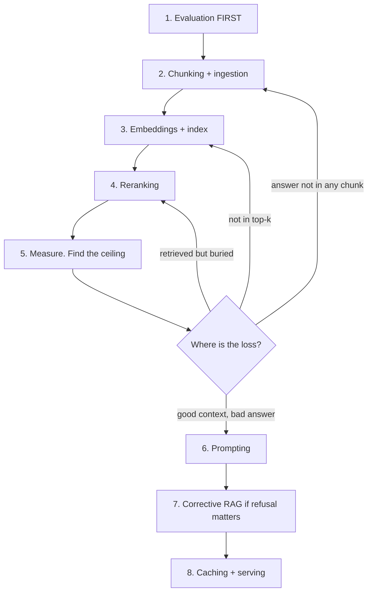

# Learning paths

Thirty-five pages is not a reading order. This page gives four, depending on
why you are here — plus the build tasks that turn reading into something you
can defend.

> **The premise of every path below:** you do not learn this by reading. You
> learn it by building a small thing and measuring it. Each path is roughly
> half reading and half building, and the building half is the part that
> survives into an interview.

---

## Path 1 · Interview in two weeks

You have limited time and a specific goal. Read for gaps, not for completeness.

### Days 1–2 · Find out what you cannot answer

Open the [question bank](interview-questions.html) and answer the ⭐ questions
out loud, cold, without reading the pages first. Mark every one you cannot
finish in ninety seconds. **That list is your curriculum** — not the table of
contents.

### Days 3–7 · Close the gaps

Read only the pages behind your marked questions. For most people the gaps
cluster in:

| Likely gap | Page |
|---|---|
| "How did you evaluate it?" | [LLM as a judge](llm-as-a-judge.html), [Regression gates](regression-gates.html) |
| Why quantization is faster | [Quantization](quantization.html) |
| Why agents fail | [Agents](agents.html) |
| Prompt injection | [Guardrails](guardrails-and-security.html) |
| RAG vs fine-tuning | [Fine-tuning](fine-tuning.html) |

### Days 8–10 · Rehearse the system design round

Work the five [system design walkthroughs](system-design-walkthroughs.html) —
out loud, with a whiteboard, doing the arithmetic. Then do
[numbers to know](numbers-to-know.html) until the five key calculations are
automatic.

### Days 11–14 · Consolidate

- Re-do the ⭐ questions. They should now take sixty seconds each.
- Read [anti-patterns](anti-patterns.html) once — it is a fast way to catch
  yourself about to give a confidently wrong answer.
- Prepare **one story** per area from work you actually did. A real story beats
  any amount of theory, and interviewers can tell the difference immediately.

**What to skip entirely:** papers, market and business (unless the role is
senior), GraphRAG, multimodal (unless relevant to the role). Coverage is not the
goal in two weeks.

---

```sim
pathweeks
```

---

## Path 2 · Building your first RAG system

You have a corpus and a requirement. This is the order that avoids the usual
month of wasted work.



**Evaluation genuinely comes first**, before you have a system to evaluate. Fifty
questions with known answers takes an afternoon — [synthetic
data](synthetic-data.html) shows how to bootstrap them — and without it every
subsequent decision is a guess.

**The build task:** a working pipeline with a golden set, a committed baseline,
and a gate that fails your build. Not a notebook — a repository with CI. That
artefact answers more interview questions than any amount of reading.

**Reading order:** [Chunking](chunking.html) → [Embeddings](embeddings-and-vector-databases.html)
→ [Reranking](reranking.html) → [LLM as a judge](llm-as-a-judge.html) →
[Regression gates](regression-gates.html) → [Query transformation](query-transformation.html)
→ [Corrective RAG](corrective-rag.html) → [Caching](caching.html) →
[Serving](serving-and-operations.html).

---

## Path 3 · Coming from classical ML or computer vision

You already understand training, evaluation, deployment and drift. What is
genuinely new is smaller than it looks — and some of your instincts transfer
better than the field's own conventional wisdom.

| You already know | The LLM version |
|---|---|
| Train/val/test splits | Golden sets and holdouts — same discipline, fewer labels |
| Precision/recall trade-offs | Retrieval recall vs reranking precision |
| Model drift | [Drift detection](drift-detection.html) — same taxonomy, worse labels |
| Quantization and pruning | [Quantization](quantization.html) — same ideas, the outlier problem is new |
| Distillation | [Distillation](distillation-and-pruning.html) — familiar, plus a licence problem |
| Feature engineering | Prompting and retrieval, which is where the leverage moved |

**What is genuinely new:**

1. **Non-determinism as a first-class problem** — you cannot assert equality,
   so you score. [Regression gates](regression-gates.html).
2. **Token economics** — inference cost scales with usage in a way classical ML
   deployment does not. [Numbers to know](numbers-to-know.html).
3. **Prompt injection** — a security class with no equivalent in a classifier.
   [Guardrails](guardrails-and-security.html).
4. **Retrieval as the main quality lever** — most quality work is data
   plumbing, not modelling. [Chunking](chunking.html).

**Your advantage, and it is real:** you are already comfortable saying "that
improvement is inside the confidence interval." Much of this field is not, and
saying it in an interview separates you immediately.

**Reading order:** [Transformers](transformers.html) →
[Tokenization](tokenization.html) → [Chunking](chunking.html) →
[Embeddings](embeddings-and-vector-databases.html) →
[LLM as a judge](llm-as-a-judge.html) → [Guardrails](guardrails-and-security.html)
→ [Serving](serving-and-operations.html). Skip quantization and distillation
theory; read only their LLM-specific sections.

---

## Path 4 · Teaching this to someone else

The order that works for a learner with no background, and it is *not* the order
of the sidebar.

### Block 1 · What is actually happening (3 hours)

[Tokenization](tokenization.html) → [Transformers](transformers.html) →
[Decoding](decoding.html)

Start with tokenization, not transformers. It is concrete, it immediately
explains famous failures like counting letters, and it earns attention before
anything abstract arrives.

**Exercise:** tokenize the same sentence in three languages. Count the tokens.
The multilingual cost difference makes the abstraction real in five minutes.

### Block 2 · Making it useful (4 hours)

[Prompt engineering](prompt-engineering.html) →
[Model selection](model-selection.html) → [Chunking](chunking.html) →
[Embeddings](embeddings-and-vector-databases.html)

**Exercise:** build a RAG pipeline over ten documents in plain code — no
framework. Roughly 100 lines. Every abstraction they meet later will make sense
because they have seen what it wraps.

### Block 3 · Knowing whether it works (4 hours)

[LLM as a judge](llm-as-a-judge.html) → [Regression gates](regression-gates.html)
→ [Numbers to know](numbers-to-know.html)

**Exercise:** write twenty golden questions for their pipeline and measure it.
Then change the chunk size and measure again. The moment they see a change move
the number less than the confidence interval is the moment evaluation stops
being abstract.

### Block 4 · Making it real (4 hours)

[Serving](serving-and-operations.html) → [Caching](caching.html) →
[Guardrails](guardrails-and-security.html) →
[Market & business](market-and-business.html)

**Exercise:** cost their pipeline at a million requests a month. Then halve it.

### Block 5 · Depth, chosen by interest

Agents, fine-tuning, quantization, GraphRAG, multimodal — as needed. By this
point they can read any page unaided.

---

## The build tasks, ranked

If you do nothing else from this handbook, do these. Each is a day or less and
each answers a family of interview questions with evidence rather than theory.

| # | Task | What it proves |
|---|---|---|
| 1 | **A golden set and a gate that fails CI** | You can evaluate a non-deterministic system |
| 2 | **A RAG pipeline in plain code**, no framework | You know what the abstractions hide |
| 3 | **Measure your retrieval ceiling** | You diagnose before optimising |
| 4 | **A failure-injection test** — kill a worker, prove recovery | You test distributed systems properly |
| 5 | **An LLM judge validated against your own labels** | You do not trust unmeasured instruments |
| 6 | **Cost your system at 10× volume** | You think about the business |

**Number 1 is the highest-value single thing in this handbook.** It is the direct
answer to *"how did you evaluate it?"*, which is the question most candidates
answer with "manual review and monitoring" — and that answer loses the round.

---

## How to know you are done

Not "I have read everything". The honest tests:

- You can answer the twelve ⭐ questions in sixty seconds each, out loud, cold.
- You can do the five whiteboard calculations without notes.
- You have **built** at least tasks 1 and 3, and can talk through the numbers
  they produced.
- When someone proposes something from [anti-patterns](anti-patterns.html), you
  notice.
- You can say "I do not know, here is how I would find out" without discomfort —
  which is, in the end, the most senior thing on this page.
