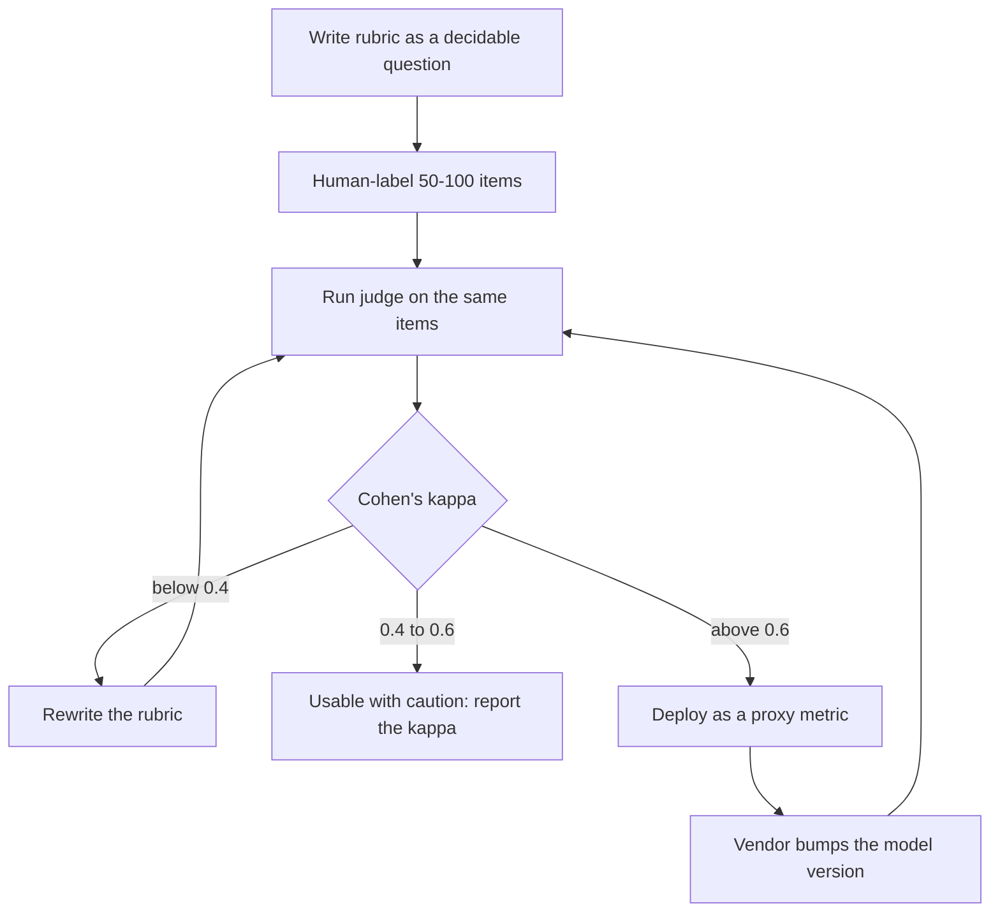
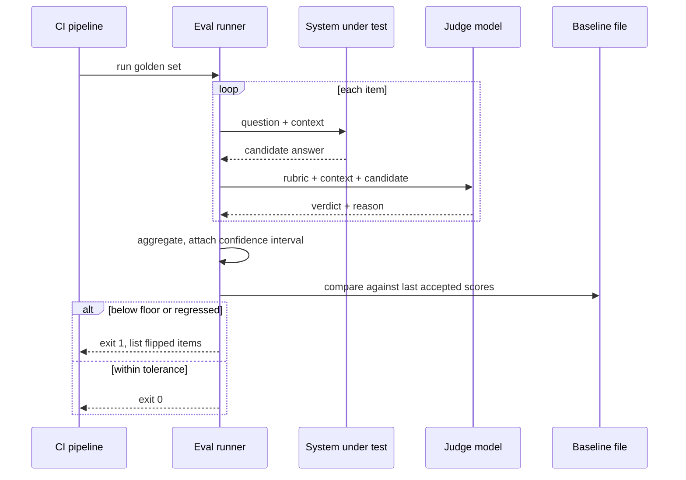

# LLM as a judge

> **The one sentence:** an LLM judge is a measuring instrument you built
> yourself, and an instrument nobody calibrated is not a measurement — it is a
> number with a decimal point.

Most teams get the first half right and skip the second. They write a scoring
prompt, run it over 200 outputs, get 0.83, and ship. The question that separates
an engineer from someone quoting a dashboard is: **how do you know 0.83 is
true?**

---

## 1 · Diagram

```
   WHAT YOU ARE ACTUALLY BUILDING

   candidate output ──┐
                      ├──> [ JUDGE MODEL + RUBRIC ] ──> score
   question + context ┘                                   │
                                                          │
                          ┌───────────────────────────────┘
                          │
                          ▼
              ┌───────────────────────────┐
              │  IS THE JUDGE ANY GOOD?   │   <-- the step everyone skips
              └───────────────────────────┘
                          │
      human labels ───────┤
                          ▼
           agreement (Cohen's kappa / % agreement)
                          │
            ┌─────────────┴─────────────┐
            │                           │
      kappa >= 0.6                 kappa < 0.4
      judge is usable          the judge is noise;
      as a proxy               fix the rubric, not the model
```

The left half is a two-hour build. The right half is what makes it evidence.

---

## 2 · Design

**Basic.** A judge is three things: a **model**, a **rubric**, and an **output
contract**. The rubric is the part that carries the quality; the model is
mostly interchangeable above a certain capability floor.

**Intermediate.** There are three judge shapes, and picking the wrong one is the
most common design error:

| Shape | Prompt | Returns | Use when |
|---|---|---|---|
| **Pointwise** | one output + rubric | a score, 1–5 | You need an absolute number to gate on |
| **Pairwise** | two outputs, A vs B | which is better | You are comparing two systems |
| **Reference-based** | output + a gold answer | matches / does not | You have gold answers |

**Pairwise is far more reliable than pointwise**, and this is the single most
useful practical fact on this page. Models are poor at absolute calibration —
ask for 1–5 and you get 4s for everything — but good at relative comparison.
If your real question is "is the new prompt better than the old one", ask that
question directly rather than scoring both and subtracting.

**Advanced.** The rubric must define the *failure*, not the *virtue*. "Rate the
helpfulness 1–5" produces noise. "Score 0 if the answer contains any claim not
supported by the provided context; otherwise 1" produces a signal, because it
names a specific, checkable event. Every vague criterion you add costs you
agreement with humans.

| Rubric | Kappa you can expect |
|---|---|
| "Rate the quality 1–10" | ~0.1–0.3. Effectively noise |
| "Rate helpfulness 1–5 with anchors per level" | ~0.4–0.6 |
| "Is every claim supported by the context? yes/no" | ~0.7–0.85 |

Binary and near-binary rubrics agree with humans far better than fine-grained
scales, for the same reason a 5-point Likert scale collapses to "3 or 4" in
human raters too.

---

## 3 · Flow

The order matters, and the mistake is doing steps 1 and 6 while skipping 2–5.

1. **Write the rubric** as a decidable question, not an adjective.
2. **Label 50–100 items by hand.** This is the calibration set. It is tedious
   and it is the whole point.
3. **Run the judge** over those same items.
4. **Measure agreement** with your labels — Cohen's kappa, not raw percentage
   (raw percentage flatters any imbalanced set).
5. **Iterate the rubric** until kappa clears your bar. Change the *prompt*, not
   the labels — moving the labels to match the judge is circular and it happens
   more than anyone admits.
6. **Only now** run it at scale, and re-check agreement whenever the judge model
   version changes.



That loop from **H back to C** is the one people forget. A judge is pinned to a
model *version*; when the vendor silently upgrades it, your historical scores
stop being comparable and your trend line lies.

---

## 4 · UML — where the judge sits



**Note the `reason` in the judge's response.** Always ask the judge to state
its reason *before* its verdict. Two reasons: it measurably improves accuracy
(the model conditions its answer on its own reasoning), and it makes
disagreements debuggable — you can read why it was wrong instead of guessing.

---

## 5 · Example

A judge with the three things that make it usable: a decidable rubric, a
structured output, and a caching key that makes re-runs free.

```python
import hashlib, json

JUDGE_MODEL = "claude-sonnet-4-5-20250929"   # pin the VERSION, not the alias

RUBRIC = """You are scoring whether an answer is grounded in its context.

Return JSON only: {"reason": "<one sentence>", "grounded": true|false}

Rules:
- grounded = false if ANY factual claim in the answer is absent from the context.
- Fluency, tone and completeness are irrelevant. Judge grounding only.
- If the answer says it cannot answer from the context, grounded = true.

Give the reason BEFORE deciding."""


def cache_key(context: str, answer: str) -> str:
    """Identical inputs must never be paid for twice.

    Keyed on the model version and rubric as well as the data: changing either
    is a different measurement and must not silently reuse old verdicts.
    """
    blob = json.dumps([JUDGE_MODEL, RUBRIC, context, answer], sort_keys=True)
    return hashlib.sha256(blob.encode()).hexdigest()


def judge(client, context: str, answer: str, cache: dict) -> dict:
    key = cache_key(context, answer)
    if key in cache:
        return cache[key]

    response = client.messages.create(
        model=JUDGE_MODEL,
        max_tokens=200,
        temperature=0,          # a judge that varies run to run is a broken ruler
        system=RUBRIC,
        messages=[{
            "role": "user",
            "content": f"<context>{context}</context>\n<answer>{answer}</answer>",
        }],
    )
    verdict = json.loads(response.content[0].text)
    cache[key] = verdict
    return verdict
```

And the part that makes it a measurement rather than a number:

```python
def cohens_kappa(human: list[bool], model: list[bool]) -> float:
    """Agreement corrected for the agreement you would get by chance.

    Raw agreement is misleading on imbalanced sets: if 90% of items are
    grounded, a judge that always says "grounded" scores 90% and has learned
    nothing. Kappa scores that judge at 0.0, which is the honest answer.
    """
    n = len(human)
    observed = sum(h == m for h, m in zip(human, model)) / n

    p_true = (sum(human) / n) * (sum(model) / n)
    p_false = (1 - sum(human) / n) * (1 - sum(model) / n)
    expected = p_true + p_false

    return (observed - expected) / (1 - expected) if expected < 1 else 1.0
```

**Read the kappa scale honestly.** Below 0.4 the judge is not measuring your
construct. 0.4–0.6 is usable if you report it alongside every number it
produces. Above 0.6 you can gate on it. Above 0.8 is rare and usually means the
task is nearly mechanical — in which case ask whether you needed an LLM at all.

---

## 6 · Depth — the senior layer

**Position bias is real and large.** In pairwise judging, models prefer whichever
answer came first — sometimes by 10–20 points. The fix is cheap and mandatory:
run every comparison twice with the order swapped, and count it as a tie unless
both orders agree. If you present a pairwise number without saying you did this,
an informed interviewer will assume you did not.

**Self-preference bias.** A model judging its own family's output scores it
higher. If you generate with a model and judge with the same one, the number
flatters you. Use a different family for the judge where you can, and say so
when you cannot.

**Verbosity bias.** Judges reward longer answers roughly independent of content.
If your change made answers longer, some of your gain is length, not quality.
Control for it: bucket by response length, or state length alongside the score.

| Bias | Direction | Cheap mitigation |
|---|---|---|
| Position | Prefers first | Swap order, require agreement |
| Self-preference | Prefers own family | Different judge family |
| Verbosity | Prefers longer | Report length with score |
| Formatting | Prefers markdown, lists | Normalise before judging |

**Cost forces tiering.** A judge over 500 items on every pull request is a real
monthly bill and the team will disable it within a month. The tiering that
survives:

| Lane | What runs | When |
|---|---|---|
| PR | deterministic scorers only — exact match, retrieval hit rate, schema checks | every push |
| Nightly | judge over the full set | scheduled |
| Release | judge + human review of a stratified sample | before shipping |

**A judge is a proxy, and proxies drift from the thing they proxy.** Track the
correlation between your judge score and whatever real outcome you care about
(complaints, escalations, thumbs-down). If they have never moved together, the
judge is measuring something — just not the thing you are being paid to improve.

---

## 7 · From each seat

| Seat | What this topic looks like from here |
|---|---|
| **User** | Never sees the judge, but feels it: fewer confidently wrong answers reach them. If the product exposes a confidence signal, the judge is often what backs it. |
| **Coder** | Pin the model version, set temperature 0, cache on `hash(prompt + model + version + input)`, ask for reason-before-verdict, parse JSON defensively — judges return prose when they panic. |
| **Tester** | The judge is the system under test as much as the product is. Unit-test the parsing, hold out a labelled set the rubric was not tuned on, and keep a regression suite for the judge itself. |
| **System designer** | It is a network call in a hot loop: bound concurrency, cache aggressively, set a timeout and a fallback. Decide what happens when the judge is down — usually "skip the gate and mark the run incomplete", never "pass". |
| **Architect** | Committing to a judge is committing to a vendor's model versioning policy. Budget for re-baselining when they deprecate. Keep the rubric and the labelled set in your repo — those are the durable assets, not the prompt. |
| **CEO** | This is what replaces "the team says it feels better" with a number in a pull request. It costs model spend and a day of labelling per rubric. Frame it as insurance against shipping a regression to customers, and note the fixed cost is the labelling, not the inference. |
| **Market** | Commoditised at the tooling layer — Ragas, DeepEval, Braintrust, LangSmith, Arize all do this. Nobody's moat is the judge harness. The moat is the labelled data and the rubric, because those encode your domain's definition of correct. |

---

## 8 · Interview questions

| Question | What they are testing | Answer sketch |
|---|---|---|
| "How do you know your LLM judge is any good?" | Whether you closed the loop | Human-label 50–100 items, measure Cohen's kappa against the judge, iterate the rubric until kappa clears the bar. Report the kappa alongside every number the judge produces. Below 0.4 it is noise. |
| "Pointwise or pairwise?" | Practical depth | Pairwise where possible — models are bad at absolute calibration, good at comparison. Pointwise only when you need an absolute gate. And swap the order to control position bias. |
| "Your judge score went up 4 points. Ship?" | Statistical literacy | Not on its own. Check n and the interval, check it is not verbosity, compare paired per-item rather than aggregates, and look at the items that flipped. |
| "The vendor updated the judge model. What now?" | Operational thinking | Historical scores are no longer comparable. Re-run the agreement check, re-baseline deliberately as a reviewed diff, and annotate the trend line at that date. This is why the version is pinned, not the alias. |
| "When would you *not* use an LLM judge?" | Judgement | When a deterministic check exists — schema validation, exact numeric match, retrieval hit rate. A cheap exact assertion beats a judge every time. Also when you cannot afford to label, because then you cannot validate it. |
| "Your judge and your users disagree." | Seniority | The users are right. Judge measures the construct in the rubric; if that construct is not what users value, the rubric is wrong. Go read 30 bad sessions, find what the rubric is missing, and add it as a criterion. |

---

## Stop condition

You are done with this topic when you can, without notes:

1. explain why an unvalidated judge is not a measurement,
2. state the kappa bands and what you do in each,
3. name three judge biases and the cheap mitigation for each,
4. say why pairwise beats pointwise, and
5. describe the tiering that keeps a judge affordable in CI.

---

## Sources worth reading

| Topic | Source |
|---|---|
| Judge agreement and biases | *Judging LLM-as-a-Judge with MT-Bench and Chatbot Arena* (Zheng et al., 2023) — the paper that established position, verbosity and self-enhancement bias |
| Rubric design | Anthropic and OpenAI evaluation cookbooks; both argue for binary, decidable criteria |
| Agreement statistics | Cohen (1960) for kappa; Krippendorff's alpha when you have more than two raters or missing labels |
| Tooling | Ragas, DeepEval, Braintrust, LangSmith — read one implementation before writing your own |
