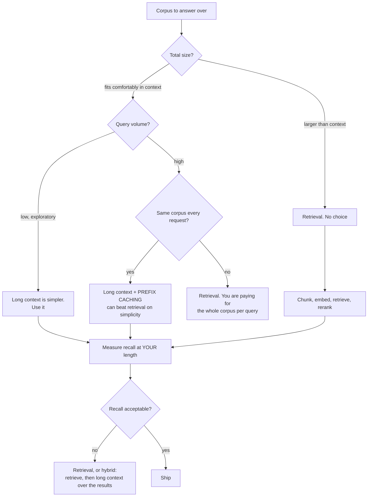
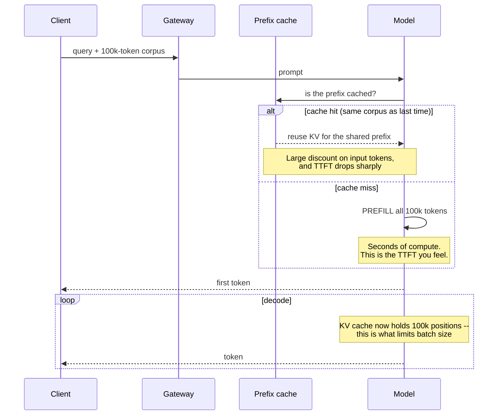

# Long context

> **The one sentence:** the advertised context length is what the model will
> *accept*, not what it will reliably *use* — and the gap between those is where
> most "we don't need RAG any more" projects fail.

Every context-window expansion revives the claim that retrieval is obsolete. The
claim is testable, the test is cheap, and it has so far come out the same way
each time.

---

## 1 · Diagram

```
   WHAT ACTUALLY HAPPENS AS CONTEXT GROWS

   recall of a fact placed at position X in a long context

   1.0 ┤███                                              ███
       │███                                              ███
   0.8 ┤███                                              ███
       │  ███                                          ███
   0.6 ┤    ███                                      ███
       │       ████                              ████
   0.4 ┤           ██████                  ██████
       │                 ██████████████████
   0.2 ┤
       └────┬──────────┬──────────┬──────────┬──────────┬────
          start                 middle                  end

   THE "LOST IN THE MIDDLE" SHAPE. Beginning and end are recovered well;
   the middle is not. And the dip DEEPENS as the context grows.


   THE THREE COSTS OF A LONG PROMPT, all paid on every request

   MONEY      every token billed, every time
   LATENCY    prefill is quadratic-ish -- TTFT grows with prompt length
   MEMORY     KV cache grows linearly with context AND batch
```

---

## 2 · Design

**Intermediate — how long context is achieved.** Models are rarely trained at
their full advertised length; that would be prohibitively expensive. Instead:

| Technique | What it does |
|---|---|
| **Position interpolation** | Squeeze trained positions to cover a longer range |
| **NTK / YaRN scaling** | Frequency-aware RoPE scaling that extrapolates better |
| **Continued pretraining** | Further training on genuinely long documents |
| **Sparse / sliding attention** | Attend to a window plus selected global tokens |

**This is why quality degrades in the extended region.** Positions beyond the
original training length were *interpolated into*, not learned from data. A
model advertised at 128k may have been trained at 8k and stretched. It will
accept 128k tokens; whether it uses them well is an empirical question about
that specific model.

Those four are **context extension** — stretching a model past what it was
trained on. Worth separating from *architectural* long context: extension takes
a checkpoint and reinterprets its positions, so the quality question is always
"how far past its training length has this been pushed", while an architecture
built for length has a different failure mode entirely.

**Advanced — measure it yourself, because vendor claims are about acceptance.**
The standard probe is **needle in a haystack**: place a specific fact at varying
depths in contexts of varying lengths, then ask for it. It gives a two-dimensional
map of recall by (length, position).

Its limitation matters too: retrieving one distinctive sentence is much easier
than *reasoning over* dispersed information. A model can score perfectly on
needle-in-a-haystack and still fail to compare three facts scattered through the
same document. Test with the multi-fact variant if that is your use case.

**"Infinite context" is a claim about memory, not about recall.** The
architectures marketed this way — compressive-memory schemes that fold older
tokens into a fixed-size state alongside a local attention window, streaming
caches that keep attention sinks plus a rolling window — all share one property:
**bounded state**. They will accept an unbounded stream without running out of
memory, which is genuinely useful for a long-running agent or a transcript.

What they do not offer is unbounded *recall*. Once a token has been folded into
a fixed-size summary it cannot be recovered verbatim, so the failure mode is a
model that keeps answering fluently about material it can no longer actually
see. Read "infinite context" as "never OOMs", and then probe recall separately —
it is a different claim and it is the one you were buying.

**Shallow prefill is the newer idea worth knowing**, because it exploits an
asymmetry nobody used for years: deeper layers hold progressively more redundant
KV, and upper-layer attention contributes less to *gathering* prefill
information than lower-layer attention does. So run prefill over fewer layers
than decode — shallow prefill, deep decoding. It attacks all three coupled
long-context costs at once, because prefill depth drives TTFT, and the KV you
never computed is KV you never store or read.

Note how it composes with the rest of this page: sparsity cuts prefill *width*
(which keys), shallow prefill cuts prefill *depth* (which layers). Different
terms, so they multiply.

---

## 3 · Flow — long context or retrieval?



**Branch `G` is the genuinely interesting case.** If every request shares the
same large prefix, prompt caching makes long context far cheaper than the naive
arithmetic suggests — sometimes cheaper than running a retrieval stack. That is
a real architectural option, not a compromise, and it is under-considered.

**Branch `L` is the answer that usually wins:** retrieval to narrow from millions
of tokens to tens of thousands, then long context to reason over what came back.
They compose. The framing of "RAG versus long context" is a false choice.

---

## 4 · UML — where the cost lands



---

## 5 · Example

```python
def context_cost(tokens_in: int, tokens_out: int, in_price=3.0, out_price=15.0,
                 cached_fraction=0.0, cache_discount=0.1):
    """Cost of a request, with prefix caching accounted for.

    Caching is what makes long context economically viable for a fixed corpus.
    Without it, you pay for the entire corpus on every single query, which is
    the arithmetic that usually decides the question.
    """
    uncached = tokens_in * (1 - cached_fraction)
    cached = tokens_in * cached_fraction * cache_discount
    return ((uncached + cached) * in_price + tokens_out * out_price) / 1e6


corpus = 100_000
print(f"no cache : ${context_cost(corpus, 500):.3f}/query")
print(f"90% cached: ${context_cost(corpus, 500, cached_fraction=0.9):.3f}/query")
print(f"RAG (5 chunks, ~2.5k tokens): ${context_cost(2_500, 500):.3f}/query")
```

```
no cache  : $0.308/query          <- 100k tokens, every time
90% cached: $0.038/query          <- caching changes the answer
RAG (5 chunks, ~2.5k tokens): $0.015/query
```

The grid above is the one you should run. Before you do, here is the grid your own assumptions already imply — state the recall curve you believe in and watch it decide, at every (length, depth), what a needle test would have reported.

```lab
needle
```

**The measurement that should decide it:**

```python
def needle_test(model, filler_corpus, needle, question, depths, lengths):
    """Recall of a known fact by (context length, position).

    Run this on YOUR model at YOUR lengths before designing around a big
    window. Vendor claims describe what the model ACCEPTS. This measures what
    it uses -- and the two diverge, usually in the middle.
    """
    results = {}
    for length in lengths:
        for depth in depths:                       # 0.0 = start, 1.0 = end
            context = _insert_at(filler_corpus[:length], needle, depth)
            answer = model.ask(context, question)
            results[(length, depth)] = _contains_answer(answer, needle)
    return results
```

Run it once. The resulting grid is worth more than any published benchmark,
because it is your model, your document style, and your question type.

---

## 6 · Depth — the senior layer

**Long context does not remove the need for retrieval; it moves where the
selection happens.** With a 200k window and a 50-million-token corpus, you still
must choose what goes in. The only question is whether that choice is made by a
retriever you can measure and debug, or implicitly by whatever truncation rule
your code happens to apply.

| Consideration | Long context | Retrieval |
|---|---|---|
| **Setup complexity** | Very low | Chunking, embedding, index, reranking |
| **Cost per query** | Proportional to corpus | Proportional to top-k |
| **Latency** | High TTFT, grows with prompt | Low, roughly constant |
| **Corpus size ceiling** | The window | Effectively unbounded |
| **Freshness** | Trivial — just send new text | Re-index required |
| **Attribution** | Weak; the model may cite loosely | Strong; you know which chunks |
| **Debuggability** | Poor — "why did it miss that?" | Good — inspect the retrieved set |

**Attribution and debuggability are the under-rated columns.** When a RAG system
answers wrongly you can look at what it retrieved. When a long-context system
answers wrongly you have a 100k-token prompt and a shrug.

| Failure mode | Symptom | Fix |
|---|---|---|
| **Designing for advertised length** | Recall much worse than expected | Needle-test your model at your length |
| **Important content in the middle** | Consistently missed | Place critical material at the ends |
| **No prefix caching on a fixed corpus** | Cost 10× what it needs to be | Restructure so the stable part is a cacheable prefix |
| **Ignoring TTFT** | Users wait seconds before the first token | Measure prefill separately |
| **KV cache exhaustion** | OOM at moderate concurrency | Long context and batch size trade directly — see [KV cache optimization](kv-cache.html) |
| **Assuming needle-test success generalises** | Fails on multi-fact reasoning | Test the task you actually have |

**Position the important material at the ends.** Given the recall shape, put the
instruction last and the most relevant retrieved chunks first and last, not
buried in the middle. This is nearly free and measurably helps — and it is a
concrete, unusual thing to say in an interview.

**Where long context genuinely wins:** a single large document that must be
reasoned over as a whole — a contract, a codebase module, a long transcript.
Chunking actively destroys the cross-references that make those documents
coherent. That is the case where retrieval is the wrong tool and the window is
the right one.

---

## 7 · From each seat

| Seat | What long context looks like from here |
|---|---|
| **User** | They can paste a whole document, which is genuinely better UX than managing a corpus — and it is slower and sometimes misses things in the middle. |
| **Coder** | Put critical content at the ends. Structure prompts so the stable part is a cacheable prefix. Measure TTFT separately from total latency. |
| **Tester** | Needle-test at your real lengths, and test multi-fact reasoning, not just single-fact retrieval. Recall at 8k tells you nothing about 100k. |
| **System designer** | Prompt length drives TTFT and KV cache, and the cache limits concurrency. Long context and high batch size are in direct competition for memory. |
| **Architect** | "Long context replaces RAG" is a false choice. The durable design is retrieval to narrow, long context to reason. Attribution and debuggability are architectural properties you lose by going all-in on the window. |
| **CEO** | A long-context request can cost twenty times a retrieval one. Prefix caching changes that arithmetic substantially, so ask whether it is being used before accepting the cost. |
| **Market** | Windows keep growing and each expansion revives the "RAG is dead" claim. It has not been true yet, because selection, cost, attribution and debuggability do not disappear with window size. |

---

## 8 · Interview questions

| Question | What they are testing | Answer sketch |
|---|---|---|
| ⭐ "Does long context make RAG obsolete?" | Whether you follow hype | No. Selection still has to happen — the only question is whether a retriever you can measure does it, or an implicit truncation rule. Plus cost, TTFT, attribution and debuggability. They compose: retrieve to narrow, long context to reason. |
| "Your window is 200k. Use it all?" | Measurement instinct | Not without testing. Advertised length is what the model accepts; recall degrades before it, worst in the middle. Needle-test at your lengths with your document type first. |
| "Why does the middle get lost?" | Mechanism | Positions in the extended range were interpolated rather than trained on, and attention is diluted across many positions. The effect deepens as context grows. |
| "How would you make long context affordable?" | Cost levers | Prefix caching on the stable portion — often a ten-fold reduction on a fixed corpus. Then reduce what is sent at all, which is retrieval by another name. |
| ⭐ "When is long context clearly right?" | Balance | A single coherent document reasoned over as a whole — a contract, a transcript, a code module. Chunking destroys the cross-references that make those documents work. |
| "What does long context cost you operationally?" | Systems thinking | TTFT grows with prompt length, and the KV cache grows with context and batch together — so long context directly limits concurrency. It is a capacity decision, not a configuration one. |

---

## Stop condition

You are done when you can:

1. draw the lost-in-the-middle recall shape,
2. explain why extended context degrades in terms of position interpolation,
3. give the cost, latency and memory consequences of a long prompt,
4. argue the retrieve-then-reason composition rather than the either/or, and
5. name the case where long context is clearly the right tool.

---

## Sources worth reading

| Topic | Source |
|---|---|
| Position effects | *Lost in the Middle: How Language Models Use Long Contexts* (Liu et al., 2023) |
| Context extension | *YaRN* (Peng et al., 2023); the RoPE interpolation literature |
| Probing | Greg Kamradt's needle-in-a-haystack methodology, and its multi-fact critiques |
| Efficiency | *Longformer* (Beltagy et al., 2020) for sparse attention patterns |
