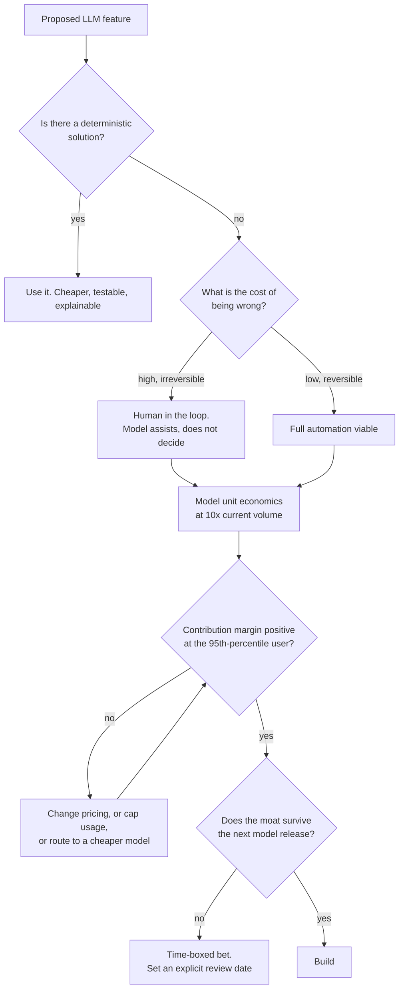
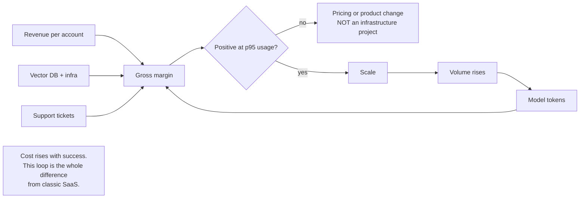

# Market & business of LLMs

> **The one sentence:** the model is a depreciating commodity, so anything you
> build that depends on having the best one is a rented advantage.

Engineers are asked business questions in senior interviews and mostly answer
them technically. This page is the vocabulary and the arithmetic for answering
them properly.

---

## 1 · Diagram

```
   WHERE THE VALUE SITS, and how durable each layer is

   layer                      example                     durability
   -----                      -------                     ----------
   SILICON                    NVIDIA, TPU                 very high, capital-defended
   FOUNDATION MODELS          Anthropic, OpenAI, Meta     high, but converging fast
   INFRASTRUCTURE / SERVING   vLLM, Bedrock, Databricks   medium, commoditising
   FRAMEWORKS / TOOLING       LangChain, vector DBs       LOW. Free alternatives, no lock-in
   APPLICATIONS               your product                depends entirely on the below

   WHAT MAKES AN APPLICATION DURABLE
     proprietary data nobody else can obtain
     workflow integration that is painful to rip out
     distribution and trust in a specific market
     regulatory position, certifications, approvals
     an evaluation suite encoding domain expertise

   WHAT DOES NOT
     a prompt          copied in an afternoon
     a model choice    obsolete next quarter
     a RAG pipeline    ~200 lines, in every tutorial
     being early       only counts if it bought one of the above
```

---

## 2 · Design

**Basic — the unit economics.** One number decides whether a business exists:
**gross margin per request**.

```
   revenue per request        subscription / requests, or per-seat / usage
   − model cost               input + output tokens at their different prices
   − retrieval + infra        vector DB, compute, storage
   − support cost             the one everyone forgets
   = contribution margin
```

The trap specific to this industry: **cost scales with usage, and your best
customers use it most.** In classic SaaS, marginal cost is near zero and heavy
users are pure profit. With LLMs, a power user on a flat subscription can be
loss-making. Anyone pricing flat-rate without modelling the heavy tail will
discover this from their most enthusiastic customers.

| Pricing model | Works when | Fails when |
|---|---|---|
| **Flat subscription** | Usage is predictable and capped | Power users exceed their price |
| **Per seat** | Value tracks headcount | One seat automates a whole team's work |
| **Usage-based** | Costs pass through cleanly | Customers cannot forecast their bill and disengage |
| **Outcome-based** | The outcome is measurable | Attribution is arguable, and it usually is |
| **Hybrid (base + usage)** | Most real cases | Requires explaining two numbers |

**Intermediate — build versus buy, honestly.** The question is rarely "can we
build it" and always "what does owning it cost for three years".

| | Buy (hosted API / vendor) | Build (self-hosted / in-house) |
|---|---|---|
| **Time to value** | Days | Months |
| **Unit cost at low volume** | Lower | Much higher — idle GPUs still bill |
| **Unit cost at high sustained volume** | Higher | Lower |
| **Data boundary** | Leaves your perimeter | Stays put |
| **Quality ceiling** | Frontier | Whatever you can serve |
| **Hidden cost** | Vendor roadmap, rate limits | On-call, upgrades, expertise, capacity planning |

The hidden costs are where the decision actually turns, and they are the ones
absent from the spreadsheet. Self-hosting is not a licence saving; it is hiring.

**Advanced — the value migration.** Each foundation-model release absorbs a
layer of tooling into the base capability. Products that were "a prompt plus a
wrapper" in one release are a checkbox feature in the next. The strategic
question for anything you build is: **does this get better or worse when the
model improves?**

- **Better with model improvement:** anything where the model is an input to a
  workflow you own — your data, your integrations, your compliance position.
- **Worse with model improvement:** anything compensating for a model
  limitation. Elaborate prompt scaffolding, chunking cleverness, and
  orchestration to route around weak reasoning all become dead weight the moment
  the limitation disappears.

Building in the second category is not always wrong — it can be the right
short-term answer — but it should be a knowing bet with an expiry date, not an
accident.

---

## 3 · Flow



**`B` is the question most often skipped.** A regex, a lookup table or a
classical classifier is cheaper, faster, testable and explainable. Reaching for
an LLM where a deterministic solution exists is a cost and reliability decision
made by default.

**`H` is deliberately the 95th-percentile user, not the average.** Averages hide
the heavy tail that determines whether the pricing model survives.

---

## 4 · UML — where the money goes



---

## 5 · Example

```python
def unit_economics(price_per_month, requests, in_tok, out_tok,
                   in_price=3.0, out_price=15.0, infra=0.40, support=1.20):
    """Contribution margin per account per month.

    Support is included because it is real and routinely omitted. An LLM
    feature that produces confident wrong answers generates tickets, and those
    tickets cost more per incident than the inference that caused them.
    """
    model = requests * (in_tok * in_price + out_tok * out_price) / 1_000_000
    total = model + infra + support
    return {
        "revenue": price_per_month,
        "model_cost": round(model, 2),
        "total_cost": round(total, 2),
        "margin": round(price_per_month - total, 2),
        "margin_pct": round(100 * (price_per_month - total) / price_per_month, 1),
    }


# The comparison that decides the pricing model.
average = unit_economics(29.00, requests=300,   in_tok=2_000, out_tok=400)
power   = unit_economics(29.00, requests=4_000, in_tok=2_000, out_tok=400)

print("average user:", average)   # margin  ~ 22.76  (78.5%)
print("power user  :", power)     # margin  ~ -19.40 (loss-making)
```

```
average user: margin  22.76  (78.5%)
power user  : margin -19.40  (LOSS)
```

**That is the entire argument for usage caps, tiering or hybrid pricing**, on one
screen. A flat $29 plan is healthy for the median user and loses money on the
customer who loves the product most — and that customer is the one who tells
others about it.

```python
def routing_saving(requests, easy_fraction=0.7, large=15.0, small=1.25, out_tok=400):
    """What routing the easy majority to a small model saves.

    Almost always the largest single cost lever, and it needs no infrastructure
    change -- which is why it belongs before quantization or self-hosting in any
    cost conversation.
    """
    baseline = requests * out_tok * large / 1_000_000
    routed = requests * out_tok * (easy_fraction * small + (1 - easy_fraction) * large) / 1_000_000
    return round(100 * (1 - routed / baseline), 1)

print(f"routing 70% to a small model saves {routing_saving(100_000)}%")   # ~64.3%
```

---

## 6 · Depth — the senior layer

**Model prices fall, and that changes strategy, not just budgets.** Capability
per dollar has improved by more than an order of magnitude over recent years and
continues to. Two consequences:

1. **Do not build a business whose only advantage is efficiency at today's
   prices.** That advantage evaporates on someone else's release schedule.
2. **Features that are uneconomic today may be viable in a year.** Keep a list
   of things rejected on cost and revisit it, rather than treating each rejection
   as permanent.

**The demo-to-production gap is where most projects die**, and it is predictable.
A demo needs to work once, on a chosen example, watched by someone hoping it
works. Production needs to work on the long tail, unattended, at a price, with
evidence. The gap between those is evaluation, monitoring, cost control, and
failure handling — which is why the technically unglamorous half of this handbook
is the half that determines whether anything ships.

| Business failure mode | What it looks like | What was missing |
|---|---|---|
| **Flat pricing, usage costs** | Best customers are loss-making | Heavy-tail modelling |
| **No deterministic baseline** | Expensive, unreliable solution to a solved problem | Asking whether an LLM was needed |
| **Moat is a prompt** | Competitor matches it in a week | Anything proprietary |
| **Success is unmeasured** | Cannot tell if it helped; funding dries up | Evaluation from day one |
| **Compliance discovered late** | Launch blocked at review | Traceability designed in |
| **Built around a limitation** | Next release makes the work worthless | Asking which way the model trend runs |

**Regulation is a competitive position, not only a cost.** In regulated sectors
— finance, health, industrial safety — the evaluation suite, audit trail and
documented limitations are what let you sell at all. Competitors without them
cannot enter. Framing compliance work as a moat rather than a tax is both more
accurate and more persuasive internally.

**What to say when asked "should we use AI for this?"** The honest structure:

1. Is there a deterministic solution? Use it.
2. What does being wrong cost? That sets the automation level.
3. What is the margin at the 95th-percentile user?
4. Does the advantage survive the next model release?
5. Can we measure whether it worked?

If question five has no answer, the project has no way to prove it succeeded —
and unprovable projects get cancelled in the first budget review regardless of
how well they work.

---

## 7 · From each seat

| Seat | What the business view looks like from here |
|---|---|
| **User** | They do not care that it is AI. They care whether it saves them time and whether they can trust it. "AI-powered" is not a benefit and stopped being a differentiator some time ago. |
| **Coder** | Your token choices are someone's margin. Capping output, routing and caching are engineering decisions with direct financial consequences — which makes them worth raising, not just implementing. |
| **Tester** | The eval suite is a commercial asset. In regulated sales it is part of the answer to a due-diligence questionnaire, and it is the reason a buyer believes the quality claim. |
| **System designer** | Cost per request is a design constraint on the same footing as latency. A design that is fast and unaffordable has not met its requirements. |
| **Architect** | Build-versus-buy is a three-year commitment about where data lives and what your team operates. The hidden costs — on-call, upgrades, expertise — decide it more often than the per-token arithmetic. |
| **CEO** | Cost rises with success, so model at 10×. Ask what the margin is at the 95th-percentile user, and what remains valuable when the model is free. If the answer to the second is "nothing", it is a feature, not a company. |
| **Market** | Capability converges, prices fall, tooling commoditises. The durable layers are proprietary data, workflow lock-in, distribution and regulatory position. Everything else is rented from a vendor's roadmap. |

---

## 8 · Interview questions

| Question | What they are testing | Answer sketch |
|---|---|---|
| "Should we build or buy?" | Whether you see hidden costs | Hosted below sustained high volume. Self-host for data residency, control or genuine scale. The decision usually turns on on-call, upgrades and expertise, not per-token price — self-hosting is hiring, not a licence saving. |
| "How would you price this?" | Whether you know cost scales | Not flat, unless usage is capped. Cost rises with usage and heavy users can be loss-making, so hybrid — a base plus usage — or tiering with caps. Model margin at the 95th-percentile user, not the average. |
| "What is our moat?" | Strategic honesty | Not the prompt, the model choice or the pipeline. Proprietary data, workflow integration, distribution, regulatory position, and an eval suite encoding domain expertise. Everything else is copied in a week or obsoleted next quarter. |
| "The demo works. Why isn't it shipped?" | Production realism | A demo works once on a chosen example; production works on the long tail, unattended, at a price, with evidence. The gap is evaluation, monitoring, cost control and failure handling. |
| "Model prices fell 10×. What changes?" | Strategic thinking | Rejected features become viable, so revisit the list. Any advantage based on efficiency evaporates. And it raises the real question: what is still valuable when the model is free? |
| "When should we NOT use an LLM?" | Judgement | When a deterministic solution exists — cheaper, testable, explainable. When being wrong is expensive and irreversible without a human. And when nobody can say how we would measure whether it worked. |

---

## Stop condition

You are done when you can:

1. explain why LLM economics differ from classic SaaS,
2. compute contribution margin and say why the p95 user is the one that matters,
3. name the durable layers and the rented ones,
4. give the hidden costs of self-hosting, and
5. answer "should we use AI for this" with the five-question structure.

---

## Sources worth reading

| Topic | Source |
|---|---|
| Value capture | a16z and Sequoia's writing on the AI stack — read critically; they are talking their book, and the layer analysis is still useful |
| Unit economics | Any SaaS gross-margin primer, then adjust for marginal cost being non-zero. That adjustment is the whole story |
| Pricing | Discussions of usage-based pricing in developer tools; the heavy-tail problem is not new, only newly acute |
| Regulation | EU AI Act risk tiers — which category your product falls into changes the cost and the moat |
