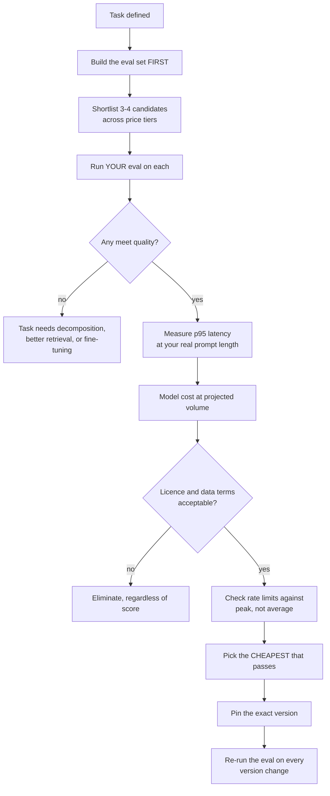
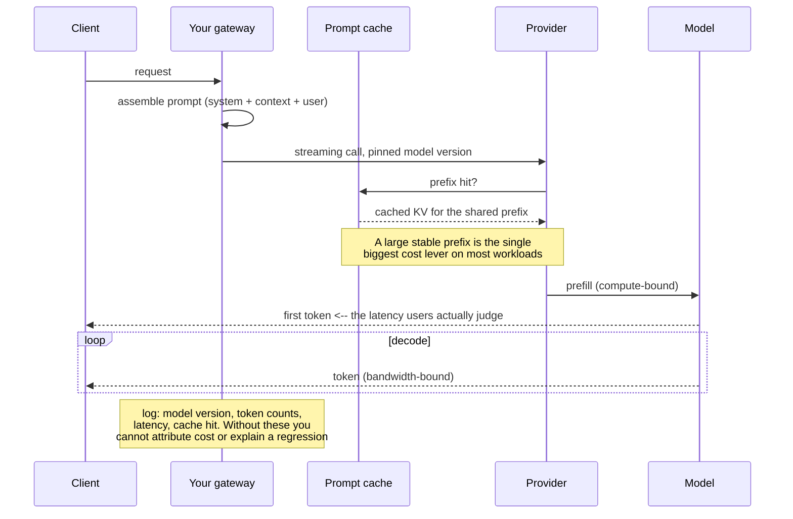

# LLM APIs & model selection

> **The one sentence:** model choice is a procurement decision wearing an
> engineering costume — the benchmark number is the least important input.

Teams pick a model from a leaderboard, then spend a year discovering that
latency, rate limits, licence terms and version stability were what actually
mattered.

---

## 1 · Diagram

```
   WHAT ACTUALLY DECIDES THE CHOICE, in the order it bites

   1. CAN IT DO THE TASK?        your eval set, not a leaderboard
   2. LATENCY                    p95 under YOUR prompt length, not the marketing figure
   3. COST AT YOUR VOLUME        input and output priced differently. Output is dearer
   4. LICENCE / DATA TERMS       where does the data go, may you train on outputs
   5. RATE LIMITS                the ceiling on your growth, not on your demo
   6. VERSION STABILITY          can the model change under you without warning
   7. BENCHMARK SCORE            the number everyone leads with. It is seventh


   HOSTED API                              SELF-HOSTED OPEN WEIGHTS
   ----------                              ------------------------
   per-token cost, no ops                  fixed GPU cost, all the ops
   best frontier quality                   full control of version + data
   rate limits, vendor roadmap             you own uptime, scaling, upgrades
   data leaves your boundary               data stays put
   scales to zero                          idle GPUs still bill

   CROSSOVER: roughly when sustained load keeps a GPU busy.
   Below that, hosted wins on cost as well as effort.
```

---

## 2 · Design

**Basic — the mechanics you are actually buying.** Every hosted API exposes
roughly the same surface, and the differences matter more than the model:

| Feature | Why it decides things |
|---|---|
| **Streaming** | Changes *perceived* latency more than any model swap. Time-to-first-token is the number users feel |
| **Structured output** | Native JSON-schema enforcement beats parsing and retrying |
| **Tool calling** | Quality here varies far more between models than chat quality does |
| **Context window** | Advertised length is not usable length — recall degrades well before the limit |
| **Prompt caching** | Large repeated prefixes get much cheaper; can dominate your bill |
| **Batch API** | Roughly half price for work that tolerates hours of delay |

**Intermediate — the cost model people get wrong.** Output tokens usually cost
several times input tokens. A summariser (long input, short output) and a
generator (short input, long output) at the same total token count have very
different bills. Estimate them separately:

```
   monthly cost = requests
                × (input_tokens × input_price + output_tokens × output_price)
```

Then apply the two multipliers that actually move it: **prompt caching** on a
repeated system prompt or corpus prefix, and **batch pricing** for anything
asynchronous.

**Advanced — the licence is the part with teeth.** "Open source" is doing a lot
of work in most announcements:

| Category | Example terms | What it means for you |
|---|---|---|
| **True open source** | Apache 2.0, MIT | Commercial use, modification, redistribution. No conditions worth worrying about |
| **Open weights, restricted** | Llama Community License | Commercial use permitted below a user threshold; naming and use-policy conditions attached |
| **Non-commercial** | CC-BY-NC, many research releases | Research only. Not for your product, whatever the benchmark says |
| **Hosted, terms of service** | Commercial APIs | Usually prohibits training a competing model on outputs; check data-retention terms |

**Two clauses to read before any architecture discussion:** may you use outputs
to train another model, and is your data retained or used for training. Both
have defaults that surprise people, and both are procurement questions an
engineer is expected to raise.

---

## 3 · Flow



**`L` is the discipline that saves the most money.** The goal is not the best
model; it is the cheapest model that passes your bar. Teams routinely serve a
frontier model for a task a mid-tier model handles identically, because they
never ran the comparison on their own data.

**`M` is the discipline that saves the most debugging.** Pin the dated version,
never the floating alias. An alias that silently moves under you turns every
quality investigation into archaeology.

---

## 4 · UML — the request path and where time goes



---

## 5 · Example

```python
PRICING = {                      # USD per 1M tokens; verify before relying on it
    "frontier":  {"in": 3.00,  "out": 15.00},
    "mid":       {"in": 0.80,  "out": 4.00},
    "small":     {"in": 0.25,  "out": 1.25},
}


def monthly_cost(tier, requests, in_tok, out_tok, cached_frac=0.0, batch=False):
    """Cost at volume, with the two levers that actually move it.

    Input and output are priced differently -- often 4-5x apart -- so a
    summariser and a generator with identical total tokens have very different
    bills. Estimating with a blended rate is the usual mistake.
    """
    p = PRICING[tier]
    # A cached prefix is charged at a large discount; on a long stable system
    # prompt this frequently halves the bill on its own.
    effective_in = in_tok * (1 - cached_frac) + in_tok * cached_frac * 0.1
    cost = requests * (effective_in * p["in"] + out_tok * p["out"]) / 1_000_000
    return cost * (0.5 if batch else 1.0)


def crossover_requests_per_month(tier, in_tok, out_tok, gpu_monthly=1_500):
    """Roughly where self-hosting stops being more expensive.

    Deliberately generous to the hosted side: it ignores the engineering time
    to build and run serving, which is usually the larger number and the one
    that does not appear on any invoice.
    """
    per_request = monthly_cost(tier, 1, in_tok, out_tok)
    return int(gpu_monthly / per_request) if per_request else 0


for tier in PRICING:
    n = crossover_requests_per_month(tier, in_tok=2_000, out_tok=400)
    print(f"{tier:<9} break-even vs one GPU: ~{n:,} requests/month")
```

```
frontier  break-even vs one GPU: ~125,000 requests/month
mid       break-even vs one GPU: ~468,750 requests/month
small     break-even vs one GPU: ~1,714,285 requests/month
```

**Read that table honestly.** Below roughly a hundred thousand requests a month
on a frontier model, self-hosting is not a cost decision — it is a control,
latency or data-residency decision, and it should be argued on those grounds.

---

## 6 · Depth — the senior layer

**Benchmark scores are the weakest signal you will be given.** Contamination is
widespread, benchmarks measure averages over distributions unlike yours, and a
two-point MMLU difference predicts nothing about your task. A 50-item eval set
built from your own traffic outperforms every leaderboard for this decision.
That is also why the evaluation module comes first in this handbook.

**Advertised context length is not usable context length.** Recall degrades well
before the stated limit, and it degrades unevenly — material in the middle of a
long context is recovered far less reliably than material at either end. If you
plan to use 100k tokens, test retrieval at 100k tokens on your data before
designing around it.

**Rate limits shape architecture more than model choice does.** Limits are
usually per-minute on both requests and tokens, and they bind at peak, not
average. A workload with a 10× daily peak needs headroom for the peak. Design a
queue with backpressure from the start; discovering the limit in production
means discovering it as a user-visible outage.

| Failure mode | Symptom | Fix |
|---|---|---|
| **Floating alias** | Quality shifts with no deploy | Pin the dated version; re-baseline deliberately |
| **Chose on benchmarks** | Great scores, poor product | Choose on your eval set |
| **Blended token pricing** | Bill several times the estimate | Model input and output separately |
| **No prompt caching** | Paying full price for a fixed prefix | Restructure so the stable part is a cacheable prefix |
| **Rate limits at peak** | 429s in the busiest hour | Queue with backpressure; request higher limits early |
| **Licence unchecked** | Legal exposure found late | Read the two clauses before the design review |
| **One provider, no abstraction** | An outage is your outage | Thin interface; a tested fallback model |

**Multi-provider is worth less than it sounds and more than nothing.** A thin
interface plus a tested fallback is cheap insurance against an outage. But
prompts do not transfer cleanly between model families, so a true hot-swap needs
its own eval run per provider. Budget for that rather than assuming portability.

**Self-hosting's real cost is not the GPU.** It is serving expertise, on-call,
capacity planning, upgrades, and a quantization pipeline. Those costs are
invisible on a spreadsheet and dominant in practice. Self-host for control, data
residency, or genuinely high sustained volume — not because the per-token
arithmetic looked good.

---

## 7 · From each seat

| Seat | What model selection looks like from here |
|---|---|
| **User** | Time-to-first-token, and whether the answer is right. Streaming a mid-tier model usually feels better than waiting for a frontier one. |
| **Coder** | Pin versions. Log model version, token counts and cache hits on every call. Wrap the SDK behind a thin interface. Handle 429 and 529 with backoff from day one, not after the first incident. |
| **Tester** | Model choice is an eval-suite question. Keep per-model baselines so a switch is a measured diff. Treat a provider version bump as a change requiring a full re-run. |
| **System designer** | Rate limits and p95 latency drive the architecture: queueing, backpressure, timeouts, fallbacks. The model is one component with a published SLA — design for it being slow or absent. |
| **Architect** | Hosted versus self-hosted is a three-year commitment about data boundaries and operational scope. The licence clauses on output use and data retention belong in that decision, not after it. |
| **CEO** | Cost scales with usage, so success raises the bill — model it at 10× before celebrating growth. The right question is not "which model is best" but "what is the cheapest thing that passes our bar", and whether anyone has actually measured that. |
| **Market** | Capability is converging and prices fall in steps. Anything built on being on today's best model is not a moat. Assume the model is a commodity that improves and cheapens; build the parts that do not — data, evals, distribution, workflow. |

---

## 8 · Interview questions

| Question | What they are testing | Answer sketch |
|---|---|---|
| "How would you choose a model?" | Whether you lead with benchmarks | Eval set first, then a shortlist across price tiers scored on my data, then p95 latency at real prompt length, cost at projected volume, licence and data terms, and rate limits at peak. Pick the cheapest that passes. Benchmarks barely feature. |
| "Hosted or self-hosted?" | Cost realism | Hosted below sustained high volume — the break-even against one GPU is around a hundred thousand requests a month on a frontier model, and that ignores serving engineering, which is the larger cost. Self-host for control, data residency or genuine scale. |
| "How do you control cost?" | Practical levers | Route easy requests to a smaller model, cache the stable prefix, use batch pricing where latency allows, cap output tokens, and estimate input and output separately since output is several times dearer. |
| "The provider updated the model and quality changed." | Operational maturity | That is why versions are pinned rather than aliased. Re-run the eval suite, compare per-item against the baseline, and re-baseline deliberately as a reviewed change with the date annotated on the trend. |
| "What licence questions matter?" | Commercial awareness | Whether outputs may train another model, and whether your data is retained or trained on. Also whether "open" means Apache-style or a community licence with conditions. These eliminate candidates regardless of score. |
| "Your context window is 200k. Use it?" | Depth | Not without testing. Usable recall degrades well before the advertised limit and is worst in the middle. Retrieval over a smaller, better-chosen context usually beats stuffing the window, and costs less. |

---

## Stop condition

You are done when you can:

1. list the seven selection criteria and explain why benchmarks come last,
2. do the hosted-versus-self-hosted break-even arithmetic,
3. name the two licence clauses that matter and why,
4. explain why output tokens dominate a generation workload's bill, and
5. say what pinning a version protects you from.

---

## Sources worth reading

| Topic | Source |
|---|---|
| Context degradation | *Lost in the Middle: How Language Models Use Long Contexts* (Liu et al., 2023) |
| Licensing | Read the Llama Community License and one commercial ToS end to end. It is an hour, and it is the hour most engineers skip |
| Pricing mechanics | Provider docs on prompt caching and batch APIs — the two largest cost levers, and both are documented |
| Contamination | Any recent survey on benchmark contamination; it explains why leaderboards over-promise |
