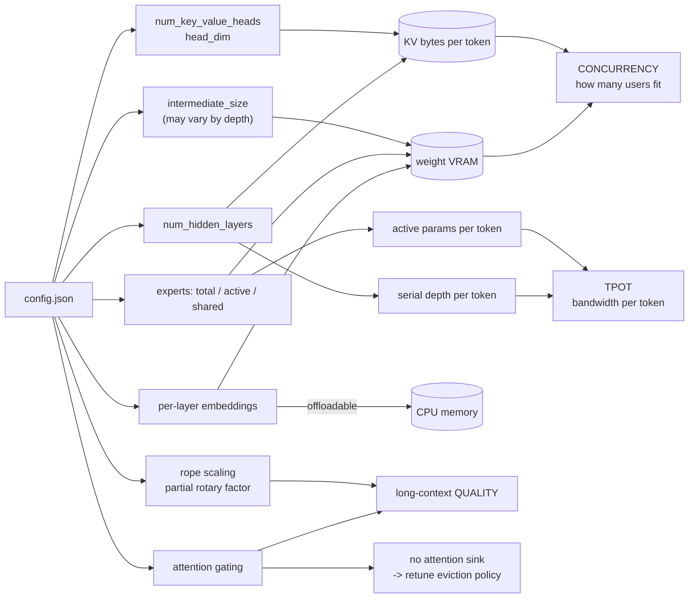

# Reading a model config

> **The one sentence:** you can tune the server, but you inherit the
> architecture — so the highest-leverage optimisation decision most teams make
> is which checkpoint they pick, and it is usually made without reading the
> config file.

Every other page in this module is about a knob. This one is about the numbers
that were fixed before you arrived. [KV cache optimization](kv-cache.html)
already tells you to check `num_key_value_heads` against
`num_attention_heads` — this is the full version of that advice, including the
fields that are new enough that most people skip them.

The reason it matters now specifically: **the uniformity assumption is
breaking.** For eight years a transformer was N identical blocks, and you could
describe one and multiply. Recent architectures vary width by depth, apply RoPE
to a fraction of dimensions, share KV between layers, keep some experts always
on, and hold embeddings per layer. A config read as "N identical blocks" now
gives the wrong cost.

---

## 1 · Diagram

```
  WHAT A CONFIG COSTS YOU, AND WHERE IT LANDS

  FIELD                           WHAT IT DECIDES                LANDS ON
  ------------------------------  -----------------------------  -----------
  num_attention_heads             attention compute              TTFT
  num_key_value_heads             KV CACHE SIZE (GQA/MQA)        concurrency
  head_dim x num_key_value_heads  bytes per token per layer      concurrency
  num_hidden_layers               depth, serial decode steps     TPOT
  intermediate_size               most of the weights            VRAM
  vocab_size                      unembed + draft LM head cost   TPOT
  max_position_embeddings         what it was TRAINED at         quality
  rope_scaling                    how far it has been STRETCHED  quality

  ...and the newer ones that break the "N identical blocks" read:

  partial rotary factor    RoPE on a FRACTION of head dims   -> smaller rope cache
  per-layer embeddings     embeddings per layer, offloadable -> VRAM != params
  variable width           intermediate_size differs by depth-> cannot multiply
  cross-layer KV sharing   some layers have no KV at all     -> cache != layers
  shared / dense experts   some experts always active        -> active != total
  attention gate           a sigmoid gate after SDPA         -> quality, ~2% cost


  THE READ THAT MATTERS MOST

     total parameters  is a marketing number
     ACTIVE parameters is your compute bill
     KV bytes/token    is your concurrency bill
     none of the three can be derived from the other two
```

---

```sim
shapecost
```

---

## 2 · Design — the six that are new

### Gated attention

A head-specific, elementwise **sigmoid gate applied to the SDPA output**. One
line of architecture; the 2025 NeurIPS best-paper result, and shipped in
Qwen3-Next.

What it buys is not speed — it costs **under 2% latency**. It buys training
stability at higher learning rates, better behaviour at very long context, and,
most interestingly for this module, it **removes the attention sink**. The
gate gives the model somewhere to put surplus attention mass, so it stops
dumping it on the first few tokens.

That has a direct consequence for everything on the [KV cache](kv-cache.html)
and [KV reuse](kv-reuse.html) pages: **sink-preservation logic is tuned for
models that have sinks.** An eviction policy that religiously protects the first
four tokens is protecting nothing in particular on a gated-attention model. Not
a bug, but worth knowing before you port a policy between architectures.

### Per-layer embeddings

Gemma 3n's answer to running a 5B model in a 2B memory budget. Instead of one
embedding table consumed at the input, each layer has embeddings of its own —
and crucially, **they can live somewhere other than the accelerator.** PLE data
is generated separately, cached to fast storage, and streamed per layer: load
from cache into CPU memory, compute the enhancement, pass the enhanced input to
the layer on the accelerator, discard, move on.

The number that makes the point: **E2B has 5B real parameters and occupies about
as much accelerator memory as a 2B model.** Parameter count and VRAM have come
apart, which breaks the oldest sizing heuristic in the book.

### Variable width — "bulging" attention and FFNs

The assumption that every layer is the same width was never load-bearing, and
recent work is dismantling it. Two findings, and they do not fully agree:

- **Variable-Width Transformers** use a bowtie profile — wide at the start and
  end, narrow in the middle — and report parameter-matched models beating
  uniform baselines while *reducing* both FLOPs and KV memory.
- **Tapered language models** report that wider-early is best (perplexity 15.96,
  0.32 better than uniform) and that **wider-late substantially hurts** — over a
  full point of perplexity.

The consistent part is **wide early**; the disagreement is about the tail. Work
on geometry-guided FFN width allocation lands on the same side: capacity demand
is front-loaded, highest in the earliest layers and decreasing through the
middle.

For an inference engineer the takeaway is not which profile wins. It is that
**you can no longer compute a model's cost from one layer times N.** A config
with per-layer `intermediate_size` has to be summed, and any capacity tool that
assumes uniformity will be wrong in a direction you cannot predict.

### Partial RoPE

Rotate only a fraction of each head's dimensions and pass the rest through
unchanged. The fraction is a real dial: 0% is NoPE, 100% is standard RoPE.

The finding that makes it interesting: **around 10% converges comparably to full
RoPE**, with up to 10× savings on the rotary cache. DeepSeek-V3's MLA is a
production instance — `qk_rope_head_dim = 64` inside a 192-dimension head, so
two thirds of each head is a scaled passthrough.

It also interacts with [KV reuse](kv-reuse.html) in a pleasant way: the fewer
dimensions carry position, the less of a cached block is position-locked, and
the cheaper a shift is.

### Cross-layer KV sharing, and K = V

Two separate ideas that get filed together.

**Sharing across layers** is CLA and MLKV: compute KV projections for only some
layers and have the others reuse them. MLKV pushes it far enough that total KV
heads can be *fewer than the number of layers*, reporting up to 6× smaller cache
than MQA at a reasonable quality trade.

**K = V** is the more radical claim — that maintaining three distinct
projections per token is mathematically redundant, and keys and values can share
one. It halves the cache by construction, since the leading 2 in the size
formula becomes a 1.

The practical consequence is a warning about the formula on the
[KV cache page](kv-cache.html): it assumes every layer has its own K and V. On a
cross-layer-sharing model, **`num_hidden_layers` is not the number of caches**,
and using it will overstate your memory by whatever the sharing factor is.

### Hybrid MoE — a dense FFN alongside the routed experts

The generalisation of [shared experts](transformers.html). A hybrid MoE keeps a
dense FFN path that every token traverses, with routed experts on top. Same
reasoning as shared experts: the dense path carries what every token needs so
the routed ones can specialise, rather than each expert independently relearning
the basics.

For costing, this is the field that makes **active parameters** diverge hardest
from total. The dense path is always on and always paid; the routed path is paid
per-token at the top-k rate. A config that reports only a total is telling you
about VRAM and nothing about compute.

---

## 3 · Flow — reading a config as a bill

```
  1. KV bytes per token   -> 2 x layers_with_kv x num_key_value_heads
     |                         x head_dim x dtype_bytes
     |                      CHECK: is layers_with_kv the same as
     |                      num_hidden_layers? Cross-layer sharing says no.
     v
  2. Active parameters    -> dense path + (top_k x expert size) + shared experts
     |                      NOT total parameters. This is your compute bill.
     v
  3. Accelerator memory   -> total params MINUS anything offloadable
     |                      Per-layer embeddings live off-accelerator.
     v
  4. Is the width uniform?-> if intermediate_size varies by depth, SUM it.
     |                      Do not multiply one layer by N.
     v
  5. Trained length vs    -> max_position_embeddings AND rope_scaling.
     |  advertised length     A model trained at 8k and stretched to 128k
     |                        is a different risk from one trained long.
     v
  6. Anything unusual?    -> partial rotary factor, attention gates,
                             PLE, hybrid MoE. Each one breaks a default
                             assumption in some tool you are using.
```

Step 1 is the one that decides concurrency and the one most often computed
wrong. Step 2 is the one that decides throughput. Neither is on the model card.

---

## 4 · UML — where each field lands



The two sinks at the bottom are the only things you actually sell: how many
people fit on the card, and how fast each of them gets a token. Every field
routes to one of them, or to a quality risk.

---

## 5 · Example

```lab
config
```

```python
"""Cost a checkpoint from its config, including the non-uniform cases.

The naive version of this function -- layers x heads x dim -- is wrong on every
architecture in section 2. Each keyword below exists because some real model
broke the assumption it replaces.
"""


def kv_bytes_per_token(layers, kv_heads, head_dim, dtype_bytes=2,
                       kv_share_factor=1, k_equals_v=False):
    """
    kv_share_factor: layers per KV cache. 1 = every layer has its own,
                     2 = CLA2, higher for MLKV-style sharing.
    k_equals_v:      keys and values share one tensor, so the leading 2 -> 1.
    """
    caches = layers / kv_share_factor
    kv_multiplier = 1 if k_equals_v else 2
    return kv_multiplier * caches * kv_heads * head_dim * dtype_bytes


def active_params(dense_ffn, expert_size, top_k, shared_experts, attn, layers):
    """Active parameters per token -- the compute bill, not the VRAM bill."""
    per_layer = attn + dense_ffn + (top_k + shared_experts) * expert_size
    return per_layer * layers


GiB = 1024 ** 3
CONFIGS = [
    # name,                layers, kv_heads, head_dim, share, k=v
    ("Llama-3-8B (GQA)",       32,        8,      128,     1, False),
    ("Llama-2-7B (MHA)",       32,       32,      128,     1, False),
    ("+ CLA2",                 32,        8,      128,     2, False),
    ("+ MLKV-style (4x)",      32,        8,      128,     4, False),
    ("+ K=V on top",           32,        8,      128,     4, True),
]

print(f"{'config':<22}{'KiB/token':>11}{'@32k ctx':>11}{'x64 users':>12}")
print("-" * 56)
for name, L, kvh, hd, share, kv in CONFIGS:
    b = kv_bytes_per_token(L, kvh, hd, kv_share_factor=share, k_equals_v=kv)
    print(f"{name:<22}{b / 1024:>10.0f} {b * 32_768 / GiB:>9.2f} GiB"
          f"{b * 32_768 * 64 / GiB:>8.1f} GiB")

# The read that catches people out: total vs active on a hybrid MoE.
total = 235e9
act = active_params(dense_ffn=0.06e9, expert_size=0.04e9, top_k=8,
                    shared_experts=1, attn=0.05e9, layers=48)
print(f"\n{'hybrid MoE: total params':<34}{total / 1e9:>7.0f} B   <- VRAM")
print(f"{'            active per token':<34}{act / 1e9:>7.1f} B   <- compute")
print(f"{'            ratio':<34}{total / act:>7.1f}x")
```

```
config                  KiB/token   @32k ctx   x64 users
--------------------------------------------------------
Llama-3-8B (GQA)             128      4.00 GiB   256.0 GiB
Llama-2-7B (MHA)             512     16.00 GiB  1024.0 GiB
+ CLA2                        64      2.00 GiB   128.0 GiB
+ MLKV-style (4x)             32      1.00 GiB    64.0 GiB
+ K=V on top                  16      0.50 GiB    32.0 GiB

hybrid MoE: total params              235 B   <- VRAM
            active per token         22.6 B   <- compute
            ratio                    10.4x
```

Two things that do not come across in prose. **The sharing techniques stack
multiplicatively** — GQA, then cross-layer sharing, then K=V, each dividing a
different factor, taking the same model from 512 to 16 KiB per token, a 32×
range on the number that sets your concurrency. And on the hybrid MoE, **total
and active differ by about 10×**: you buy VRAM for 235B and compute for 23B.
A capacity plan built on either number alone is wrong, in opposite directions.

---

## 6 · Depth — the senior layer

**The formula on the KV cache page assumes uniformity, and that assumption is
now optional.** `2 × layers × kv_heads × head_dim × bytes` presumes every layer
holds its own K and V, at the same width, with both tensors present. Cross-layer
sharing breaks the first, variable width breaks the second, K=V breaks the
third. The formula is still right; you just have to feed it the real numbers
rather than the ones on the model card.

**Parameter count stopped predicting VRAM, and nobody updated the heuristic.**
Per-layer embeddings are offloadable, MoE weights are resident but mostly
inactive, and quantized weights are stored at a width that is not their compute
width. "How much GPU do I need for a 5B model" no longer has an answer that
depends only on the 5.

**A quality feature can invalidate a serving policy, silently.** Gated attention
is the clean example: it exists to improve training stability and long-context
behaviour, and one of its effects is that the model no longer produces attention
sinks. Every eviction and streaming policy that carefully preserves the first
four tokens is, on such a model, preserving four ordinary tokens. Nothing
crashes; you just paid for a protection that protects nothing, and a policy you
validated on one architecture does not transfer.

**"Wide early" is the part of the variable-width literature you can rely on.**
Bowtie and taper disagree about the last few layers, and the honest summary is
that the tail is unsettled. Front-loaded capacity is the consistent finding
across three independent lines of work. If you are evaluating a non-uniform
model, that is the shape to expect and the claim to be suspicious of when a
config does the opposite.

**Partial RoPE quietly makes reuse cheaper.** If only 10% of each head carries
position, then 90% of a cached block is position-independent, and the correction
needed to move it is proportionally smaller. Nobody markets it this way, but for
a workload built on [KV reuse](kv-reuse.html) it is a genuine selection
criterion.

| Failure | Looks like | Actual cause |
|---|---|---|
| Capacity plan overstates KV by 2–4× | Provisioned too much, wondering why | Used `num_hidden_layers`; model shares KV across layers |
| MoE "needs 8× the GPU" | Sticker shock on a config | Read total params as compute; active is a fraction |
| Eviction policy transferred and helped nothing | Worked on the old model | Gated attention — the sinks it protected do not exist |
| Cost model wrong on a non-uniform model | Off by an unpredictable amount | Multiplied one layer by N instead of summing |
| 5B model does not fit a 2B budget, or does | VRAM does not track params | Per-layer embeddings are offloadable |
| Extended-context model degrades at length | Fine at 8k, poor at 100k | `rope_scaling` present — stretched, not trained |

---

## 7 · From each seat

| Seat | What reading the config means here |
|---|---|
| **User** | Nothing directly — but it is why two models with the same advertised size cost wildly different amounts to serve, and why one of them forgets the middle of a long document. |
| **Coder** | Open `config.json` before you benchmark. `num_key_value_heads`, `rope_scaling`, and whether `intermediate_size` is a scalar or a list will tell you more in a minute than an afternoon of profiling. |
| **Tester** | Architecture changes invalidate policies, not just weights. A gated-attention model needs its eviction policy re-validated, not ported. Re-run the long-context probe on every architecture change, not just every fine-tune. |
| **System designer** | Two numbers set capacity: KV bytes per token and active parameters per token. Neither is on the model card and neither derives from the other. Compute both before committing to hardware. |
| **Architect** | This is where the leverage is. Choosing a checkpoint is choosing a KV budget, a compute bill and a long-context risk profile for the life of the deployment — a far larger decision than any serving flag. |
| **CEO** | The same capability at 4× lower serving cost is usually an architecture choice made at procurement, not an engineering win found later. Ask which checkpoint, and why, before funding an optimisation programme. |
| **Market** | Parameter counts are marketing and increasingly meaningless — active parameters and KV bytes per token are the honest numbers. A vendor quoting only a total is quoting the one that flatters. |

---

## 8 · Interview questions

**"Two 8B models, same benchmark scores. One costs 4× more to serve. Why?"**
Almost certainly `num_key_value_heads` — MHA versus GQA is a 4× difference in KV
cache at identical parameter count, and KV cache is what caps concurrency. After
that, check cross-layer sharing, since `num_hidden_layers` may not be the number
of caches, and check whether it is MoE, where total and active parameters can
differ by an order of magnitude.

**"What breaks the standard KV cache size formula?"**
It assumes every layer holds its own K and V, at uniform width, with both
tensors present. Cross-layer sharing means fewer caches than layers. Variable
width means you have to sum rather than multiply. K=V means the leading 2 becomes
a 1. The formula is fine — the inputs are what people get wrong.

**"Why might a good eviction policy stop working on a new model?"**
If the new model uses gated attention it may have no attention sinks. The gate
gives the model somewhere to put surplus attention mass, so it stops dumping it
on the first few tokens — and a policy built to protect those tokens is now
protecting nothing. It is a quality feature that silently invalidates a serving
assumption, which is a category worth naming.

**"What does partial RoPE buy, and what does it cost?"**
Rotating only a fraction of head dimensions. Around 10% converges comparably to
full RoPE with up to 10× savings on the rotary cache — DeepSeek-V3's MLA is a
shipped example at 64 of 192 dimensions. The second-order benefit is that less
of a cached block is position-locked, so reuse at a shifted position is cheaper.

**"A 5B model that fits in 2B of VRAM — how?"**
Per-layer embeddings, offloaded. Each layer's embeddings are cached outside the
accelerator, streamed in, used, and discarded, so only the core transformer
weights stay resident. It is the clearest example of parameter count and VRAM
coming apart, and it breaks the sizing heuristic most people still use.

---

## Stop condition

You are done with this page when you can:

- Name the two numbers that set capacity, and say why neither is on the model card
- List three architectural features that break the standard KV size formula
- Explain why gated attention can invalidate an eviction policy
- Say what partial RoPE buys, in both memory and reuse terms
- Separate total, active and resident parameters without hesitating
- Read an unfamiliar `config.json` and say where the cost will land

---

## Sources worth reading

- **Gated attention** — [*Gated Attention for Large Language Models: Non-linearity, Sparsity, and Attention-Sink-Free*](https://github.com/qiuzh20/gated_attention) (NeurIPS 2025 best paper) — and note the sink-free property, which is the operationally relevant one.
- **Per-layer embeddings** — [Gemma 3n model overview](https://ai.google.dev/gemma/docs/gemma-3n) — PLE offload, and the 5B-params-in-2B-VRAM claim.
- **Variable width** — [*Variable-Width Transformers*](https://arxiv.org/abs/2606.18246) for the bowtie, [*Tapered Language Models*](https://arxiv.org/abs/2606.23670) for the wider-early result, [*Geometry-Guided Layerwise FFN Width Allocation*](https://arxiv.org/abs/2608.02064) for where capacity demand actually sits.
- **Partial RoPE** — [*Fractional Rotation, Full Potential?*](https://arxiv.org/abs/2603.11611) (2026) — the 10% finding.
- **Cross-layer KV sharing** — [CLA](https://arxiv.org/abs/2405.12981) and [MLKV](https://arxiv.org/abs/2406.09297).

Related: [KV cache optimization](kv-cache.html) for the formula this page keeps
qualifying · [KV reuse](kv-reuse.html) for why partial RoPE matters to reuse ·
[Transformers](transformers.html) for GQA, MoE and shared experts ·
[LLM APIs & model selection](model-selection.html) for choosing a vendor rather
than a shape · [Long context](long-context.html) for `rope_scaling` risk.
