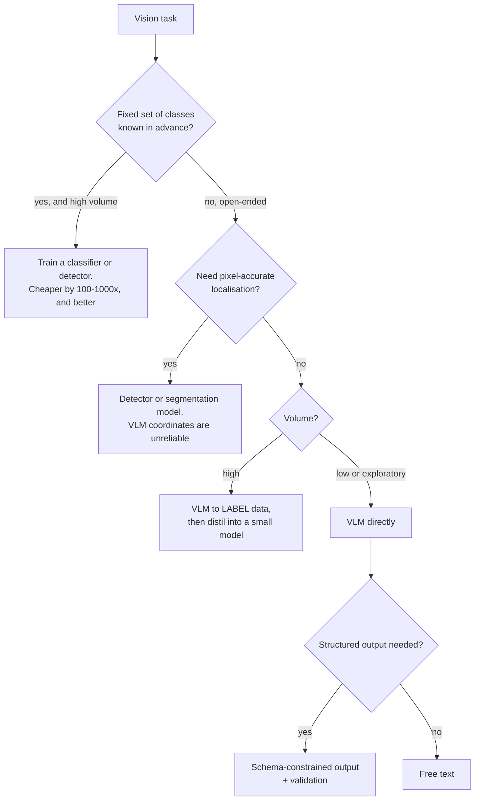
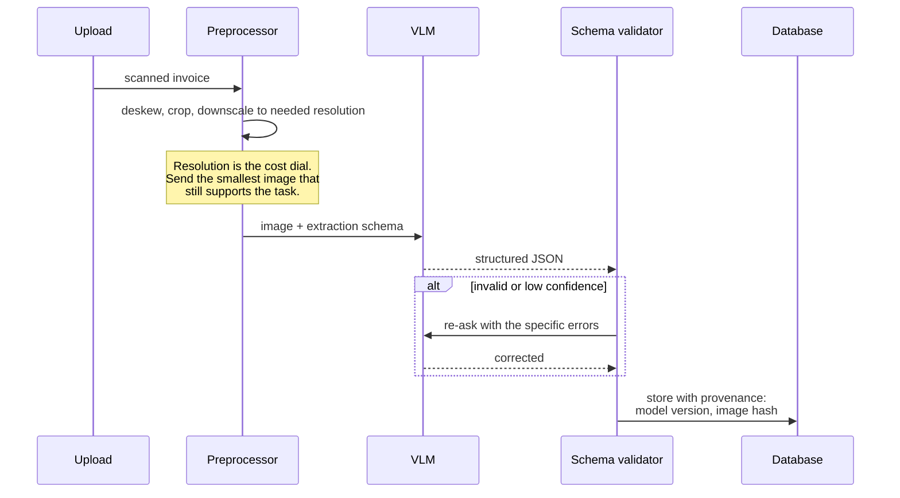

# Multimodal & vision-language

> **The one sentence:** a vision-language model turns an image into tokens and
> puts them in the context window — which explains both its remarkable
> generality and its terrible economics for anything high-volume.

If you already work in computer vision, the useful framing is this: a VLM is not
a replacement for a detector. It is a zero-shot generalist that costs a thousand
times more per image and cannot tell you where anything is to the pixel.

---

## 1 · Diagram

```
   HOW AN IMAGE ENTERS A LANGUAGE MODEL

   image ──► VISION ENCODER (usually a ViT) ──► patch embeddings
                                                     │
                                                     ▼
                                          PROJECTION into the LM's
                                          token embedding space
                                                     │
                                                     ▼
             [img][img][img]...[img] [text][text][text]
             └────── ~1000+ tokens ──┘ └── your prompt ──┘
                          │
                          ▼
                    ordinary decoder LLM


   THE CONSEQUENCE, and it is the whole economic story

   one 1024x1024 image  ≈  1,000-1,600 tokens
                        ≈  the same cost as ~4 pages of text
                        ≈  ~$0.005 per image at frontier input pricing

   at 1,000 images/second that is $5/second. It is not a serving design.
```

---

## 2 · Design

**Intermediate — the architecture that won.** Almost every current VLM follows
the same shape:

1. A pretrained **vision encoder** (a ViT, often CLIP-initialised) turns the
   image into patch embeddings.
2. A **projection layer** — sometimes just a linear map, sometimes a small
   resampler — maps those into the language model's embedding space.
3. The language model treats them as **tokens it can attend to**, indistinguishable
   in mechanism from text tokens.

The elegance is that step 3 requires no architectural change. That is why
multimodal capability arrived so quickly: it is mostly a projection layer and
training data, not a new model family.

| Approach | Mechanism | Trade-off |
|---|---|---|
| **Linear projection** (LLaVA-style) | Patch embeddings mapped directly | Simple, many tokens per image |
| **Resampler / Q-Former** | Cross-attention compresses to fixed tokens | Fewer tokens, some detail lost |
| **Native multimodal** | Trained multimodal from the start | Best quality, not something you build |

**Advanced — tiling is where the token cost explodes.** High-resolution images
are usually split into tiles, each encoded separately, plus a downscaled
overview. A large document scan can become several thousand tokens. This is why:

- image cost is **non-linear in resolution**,
- sending a full-page screenshot when a crop would do is a real and common
  waste,
- and *"resize before sending"* is the single most effective cost control in any
  vision pipeline.

---

## 3 · Flow — choosing the right tool



**Branch `G` is the pattern worth knowing.** A VLM is an excellent *annotator*
and a poor *production classifier*. Use it to label ten thousand images, train a
small supervised model on the labels, and serve that. You get the VLM's
generality at the small model's cost — and this is exactly the distillation
argument applied to vision.

---

## 4 · UML — a document-understanding pipeline



---

## 5 · Example

```python
def estimate_image_tokens(width: int, height: int, tile: int = 512) -> int:
    """Approximate token cost of an image. Providers differ; the SHAPE is the point.

    Cost is roughly linear in the number of tiles, and tiles grow with the
    square of the dimension -- so doubling resolution roughly quadruples cost.
    That non-linearity is why resizing before sending is the biggest single
    lever in any vision pipeline.
    """
    tiles = ((width + tile - 1) // tile) * ((height + tile - 1) // tile)
    per_tile = 170          # order-of-magnitude figure
    overview = 85           # the downscaled whole-image pass
    return tiles * per_tile + overview


for w, h in [(512, 512), (1024, 1024), (2048, 2048), (3000, 4000)]:
    print(f"{w}x{h:<5} -> ~{estimate_image_tokens(w, h):,} tokens")
```

```
512x512   -> ~  255 tokens
1024x1024 -> ~  765 tokens
2048x2048 -> ~2,805 tokens
3000x4000 -> ~8,245 tokens      <- one page scan, at full resolution
```

```python
def right_size(image, task: str):
    """Downscale to the smallest resolution the task actually needs.

    Reading a title needs far less resolution than reading a table of
    part numbers. Sending everything at full scan resolution is the vision
    equivalent of a 3,000-token system prompt nobody has tested trimming.
    """
    needed = {
        "classify": 512,        # is this an invoice or a receipt
        "read_headings": 1024,  # large text only
        "extract_fields": 1536, # form fields, moderate density
        "read_dense_table": 2048,
    }[task]
    if max(image.size) <= needed:
        return image
    return image.resize(_scaled_to(image.size, needed))
```

---

## 6 · Depth — the senior layer

**Where VLMs are genuinely weak**, stated plainly because the marketing does not:

| Weakness | What it looks like |
|---|---|
| **Precise localisation** | Bounding boxes are approximate; "third row" is often wrong |
| **Counting** | Reliable to about five objects, then degrades |
| **Dense text** | Small print in tables is misread with confidence |
| **Spatial relations** | Left/right, above/below are inconsistent |
| **Fine-grained discrimination** | Similar part numbers, near-identical components |
| **Consistency** | The same image can be described differently across calls |

**For anything where a bounding box matters, use a detector.** A YOLO-class model
gives pixel-accurate boxes, runs in milliseconds on a CPU, costs nothing per
inference, and is deterministic. A VLM gives you a plausible description of
roughly where something is. These are not competing tools.

**The hybrid pattern that works in practice**, and the one worth describing in
an interview: **detector for *where*, VLM for *what it means*.** Detect the
regions with a purpose-built model, crop them, and send only the crops to the
VLM for interpretation. You get accuracy and grounding from the detector,
generality from the VLM, and you cut the token cost by an order of magnitude
because you are no longer sending whole frames.

| Failure mode | Symptom | Fix |
|---|---|---|
| **Full-resolution everything** | Cost 10× what it needed to be | Right-size per task |
| **VLM for high-volume classification** | Unaffordable at scale | Label with the VLM, train a small model |
| **Trusting coordinates** | Boxes subtly wrong | Detector for localisation |
| **No structured output** | Unparseable free text | Schema-constrained extraction |
| **Image prompt injection** | Instructions embedded in the image | Treat image content as untrusted input |
| **No provenance** | Cannot audit an extraction | Store model version and image hash |

**Prompt injection through images is real** and under-discussed. Text embedded
in an image — visible or faint — is read by the encoder and enters the context
as instruction-shaped tokens. Every control from the security page applies, and
the input filtering that is already weak for text is weaker still here, because
you cannot regex an image.

**Video is images plus a sampling problem.** There is no video-native handling in
most systems: frames are sampled, encoded, and stacked into context. So the real
design question is *which frames* — uniform sampling, scene-change detection, or
detector-triggered. Sampling too densely is unaffordable; too sparsely and you
miss the event. That choice, not the model, determines whether it works.

---

## 7 · From each seat

| Seat | What multimodal looks like from here |
|---|---|
| **User** | It can look at a photo and answer, which feels magical — right up to the confident misreading of a number in a table. |
| **Coder** | Resize before sending. Use schema-constrained extraction. Store the image hash and model version. Never trust returned coordinates. |
| **Tester** | Test with low-quality inputs: blurred, rotated, poorly lit, dense tables. Test counting and localisation explicitly, because those degrade first and silently. |
| **System designer** | Images are large payloads and slow requests. Preprocess before the model, cache on image hash, and expect much higher per-request cost than text. |
| **Architect** | Decide early where the boundary sits between purpose-built vision models and VLMs. The hybrid — detector for location, VLM for meaning — is usually right and is hard to retrofit. |
| **CEO** | Roughly a thousand times the per-item cost of a trained classifier. Justified for open-ended or low-volume work, rarely for high-volume classification. Ask what the volume is before approving. |
| **Market** | Capability is converging fast and open VLMs are strong. The durable advantage is labelled domain imagery — which, if you have industrial or inspection data, you already have. |

---

## 8 · Interview questions

| Question | What they are testing | Answer sketch |
|---|---|---|
| "How does a VLM process an image?" | Mechanism | A vision encoder produces patch embeddings, a projection maps them into the language model's embedding space, and the LM attends to them as ordinary tokens. No architectural change to the LM — which is why it arrived so fast. |
| ⭐ "VLM or a trained detector?" | Judgement | Detector for a fixed class set, high volume, or pixel-accurate localisation — cheaper by orders of magnitude and deterministic. VLM for open-ended interpretation and low volume. Often both: detector for where, VLM for what it means. |
| "Why are images so expensive?" | Cost awareness | Each image becomes a thousand or more tokens, tiled at higher resolution, so cost grows roughly with the square of the dimension. Resizing to the smallest resolution the task needs is the biggest single lever. |
| "Where do VLMs fail?" | Honesty | Precise localisation, counting beyond a handful, dense small text, spatial relations, and fine-grained discrimination — all with full confidence, which makes the failures hard to catch. |
| "High-volume image classification. Design it." | The pattern | Do not serve a VLM per image. Use it to label a training set, distil into a small supervised model, serve that. VLM generality at classifier cost. |
| ⭐ "Can images carry prompt injection?" | Depth | Yes — embedded text is read by the encoder and enters context as instructions. Same architectural controls as text, and input filtering is even weaker because you cannot pattern-match an image. |

---

## Stop condition

You are done when you can:

1. describe the encoder-projection-LM path in one breath,
2. estimate an image's token cost and say why it is non-linear in resolution,
3. name four things VLMs are unreliable at,
4. describe the detector-plus-VLM hybrid and why it wins, and
5. explain image-borne prompt injection.

---

## Sources worth reading

| Topic | Source |
|---|---|
| The projection approach | *Visual Instruction Tuning* (Liu et al., 2023) — the LLaVA paper |
| Resamplers | *BLIP-2* (Li et al., 2023) for the Q-Former |
| Vision encoders | *CLIP* (Radford et al., 2021); *An Image is Worth 16x16 Words* (Dosovitskiy et al., 2020) |
| Practical | Provider vision documentation on tiling and token counting — the pricing mechanics are documented and worth reading once |
