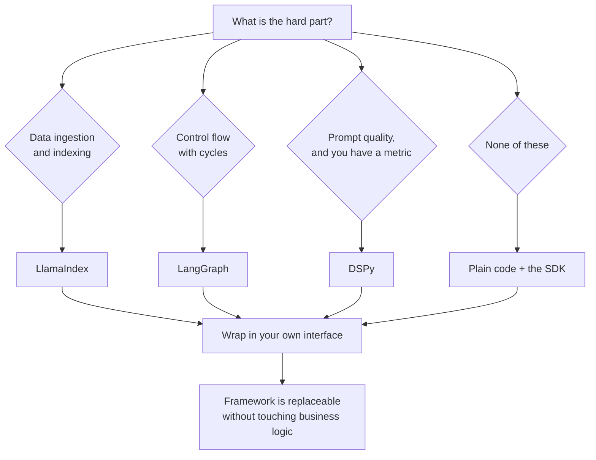

# Orchestration frameworks

> **The one sentence:** these frameworks are not competing implementations of
> the same idea — LangChain composes steps, LlamaIndex owns data, and DSPy
> refuses to let you write the prompt at all.

Most comparisons list features. The useful distinction is what each one takes
responsibility for, because that determines what you are stuck with.

---

## 1 · Diagram

```
   WHAT EACH FRAMEWORK OWNS

   LangChain / LangGraph        THE CONTROL FLOW
   ---------------------        prompt -> model -> parse -> branch -> loop
                                you still write the prompts
                                LangGraph adds: state, cycles, checkpoints

   LlamaIndex                   THE DATA PATH
   ----------                   load -> chunk -> index -> retrieve -> synthesise
                                strongest at ingestion and index abstractions
                                you still write the prompts

   DSPy                         THE PROMPTS THEMSELVES
   ----                         you declare SIGNATURES: question -> answer
                                a COMPILER writes and optimises the prompt
                                against a metric you define
                                you do NOT write prompts

   PLAIN CODE                   ALL OF IT
   ----------                   ~200 lines for a typical RAG pipeline
                                no abstraction to fight, no upgrade treadmill
```

**DSPy is the one that is categorically different**, and the one most people
cannot explain in an interview. The other two are plumbing; DSPy is a different
answer to "who writes the prompt".

---

## 2 · Design

**Basic — LangChain's primitives.** Four things account for most of what you
will touch:

| Primitive | What it is | Honest note |
|---|---|---|
| **Prompt templates** | Strings with variables and validation | Useful, ~30 lines to write yourself |
| **Runnables (LCEL)** | Composable units chained with `\|` | Elegant; the abstraction leaks when debugging |
| **Output parsers** | Structured extraction, with retries | Superseded by native structured output on most APIs |
| **Retrievers** | A uniform `get_relevant_documents` interface | Genuinely useful — swapping vector stores is one line |

**LangGraph** is the part worth taking seriously. A chain is a DAG: it runs
forward and finishes. Once you need **cycles** — retry, reflect, correct — you
need a state machine, and that is what LangGraph provides: typed state,
conditional edges, checkpointing, and human-in-the-loop interrupts. Corrective
RAG is a cycle; that is why it appears as a graph, not a chain.

**Intermediate — LlamaIndex.** Its centre of gravity is the data path. Where
LangChain gives you a retriever interface, LlamaIndex gives you an opinionated
ingestion pipeline, a large connector library, and index structures beyond flat
vector search — summary indices, tree indices, knowledge graphs, and multi-index
routing. If your hard problem is *getting heterogeneous documents into a usable
index*, it is the stronger tool.

**Advanced — DSPy, and why it exists.** Prompt engineering is manual
hill-climbing on a surface you cannot see. You change wording, run examples, and
keep whatever seemed better. DSPy makes that a compilation step:

1. Declare a **signature** — `context, question -> answer` — the types, not the
   words.
2. Choose a **module** — `Predict`, `ChainOfThought`, `ReAct` — the reasoning
   strategy.
3. Define a **metric** — a function scoring an output.
4. Run an **optimiser** (`BootstrapFewShot`, `MIPROv2`) over training examples.
   It generates candidate instructions and few-shot demonstrations, evaluates
   them against your metric, and keeps what wins.

The output is a prompt you did not write, selected by measurement rather than
taste. **DSPy requires an eval metric to function at all** — which is why it
belongs after the evaluation module, and why teams without a golden set cannot
adopt it even if they want to.

---

## 3 · Flow



**Node `J` is the load-bearing advice on this page.** Whatever you choose, put
your own thin interface in front of it. These libraries move fast and break
things; teams that called framework APIs directly from business logic have
rewritten their applications more than once for no product gain.

---

## 4 · UML — DSPy's compile step

```mermaid
sequenceDiagram
    participant Dev as You
    participant Sig as Signature
    participant Opt as Optimiser
    participant LM as Language model
    participant M as Metric

    Dev->>Sig: declare context, question -> answer
    Dev->>Opt: training examples + metric
    loop candidate prompts
        Opt->>LM: run a candidate instruction + demos
        LM-->>Opt: predictions
        Opt->>M: score them
        M-->>Opt: number
    end
    Opt-->>Dev: compiled program (the winning prompt + demos)
    Note over Dev,M: You never wrote the prompt.<br/>The metric chose it.
```

The consequence people miss: **your metric is now your prompt**. A weak metric
compiles a program optimised for the wrong thing, confidently and at scale.

---

## 5 · Example

The same task three ways, so the difference is visible rather than described.

```python
# --- plain code: the baseline everything should be measured against -----------
def answer(client, index, question: str) -> str:
    passages = index.search(question, k=5)
    context = "\n\n".join(passages)
    reply = client.messages.create(
        model="claude-sonnet-4-5-20250929",
        max_tokens=500,
        system="Answer using only the context. If it is not there, say so.",
        messages=[{"role": "user", "content": f"<context>{context}</context>\n\n{question}"}],
    )
    return reply.content[0].text
```

```python
# --- LangGraph: earns its place once there are cycles -------------------------
from langgraph.graph import StateGraph, END

def build_corrective_rag():
    """A chain cannot express 'retrieve, judge, and maybe go back'.

    This is the case where a graph framework is the right call: the retry edge
    is a real cycle, and the checkpointing means a long run can resume rather
    than restart.
    """
    graph = StateGraph(RagState)
    graph.add_node("retrieve", retrieve)
    graph.add_node("grade", grade_passages)
    graph.add_node("rewrite", rewrite_query)
    graph.add_node("generate", generate)

    graph.set_entry_point("retrieve")
    graph.add_edge("retrieve", "grade")
    graph.add_conditional_edges(
        "grade",
        lambda s: "generate" if s["relevant"] else ("rewrite" if s["tries"] < 2 else "refuse"),
        {"generate": "generate", "rewrite": "rewrite", "refuse": END},
    )
    graph.add_edge("rewrite", "retrieve")     # the cycle a chain cannot express
    graph.add_edge("generate", END)
    return graph.compile()
```

```python
# --- DSPy: you declare the shape, the compiler writes the prompt ---------------
import dspy

class AnswerFromContext(dspy.Signature):
    """Answer the question using only the retrieved context."""
    context: str = dspy.InputField()
    question: str = dspy.InputField()
    answer: str = dspy.OutputField(desc="grounded in the context, or an admission")

class GroundedRAG(dspy.Module):
    def __init__(self, k: int = 5):
        super().__init__()
        self.retrieve = dspy.Retrieve(k=k)
        # ChainOfThought adds a reasoning field. Note that no prompt text
        # appears anywhere in this file -- that is the entire point.
        self.generate = dspy.ChainOfThought(AnswerFromContext)

    def forward(self, question: str):
        context = self.retrieve(question).passages
        return self.generate(context="\n\n".join(context), question=question)

def groundedness_metric(example, prediction, trace=None) -> float:
    """The metric IS the prompt specification. A weak metric here compiles a
    program that is confidently optimised for the wrong objective."""
    return float(example.answer_span.lower() in prediction.answer.lower())

compiled = dspy.BootstrapFewShot(metric=groundedness_metric).compile(
    GroundedRAG(), trainset=train_examples
)
```

---

## 6 · Depth — the senior layer

**The framework tax is real and it is mostly paid at debugging time.** When a
chain returns something wrong, you are debugging your logic *and* the
framework's prompt assembly, and the second is usually undocumented. Every layer
between you and the API is a layer you will read the source of eventually.

| Situation | Reach for |
|---|---|
| Linear RAG, one model, stable requirements | Plain code |
| Many document sources and formats | LlamaIndex ingestion |
| Retry, reflect, human approval, cycles | LangGraph |
| A good metric and prompts you keep hand-tuning | DSPy |
| Swapping vector stores often | Any retriever abstraction, including your own |
| Learning what the pieces are | Read a framework's source, then write your own |

**Version churn is a real operational cost.** LangChain has restructured its
packages more than once; APIs deprecate on a timescale measured in months. That
is the price of a fast-moving ecosystem, and it is the reason for the thin
interface at node `J` above. It is also a legitimate argument for plain code in
a system expected to run unchanged for years.

**DSPy's honest limitations**, since it is the one people over-sell:

- It needs training examples and a metric. No golden set, no DSPy.
- Compilation costs model calls — often hundreds — so it is a build-time expense.
- The compiled prompt can be long, which costs tokens on every request forever.
- Debugging is genuinely harder: when output is wrong, the prompt is a
  compilation artefact rather than something you wrote and can reason about.
- It is most convincing on tasks with a crisp automatic metric, and least
  convincing on open-ended generation where the metric is the hard part.

**The argument for writing it yourself** is stronger than framework
documentation admits. A RAG pipeline is roughly 200 lines: chunk, embed, store,
retrieve, rerank, prompt, parse. Writing it once teaches you where the failures
actually live, and there is no abstraction to fight when something breaks at 2am.
Frameworks earn their keep on breadth — forty connectors, twenty vector stores —
and on genuinely hard machinery like LangGraph's checkpointing. They earn very
little on the happy path.

---

## 7 · From each seat

| Seat | What the framework choice looks like from here |
|---|---|
| **User** | Nothing. No user has ever preferred a product for its orchestration library, which is worth remembering when the choice starts feeling important. |
| **Coder** | The daily cost is debugging through a layer you did not write. Pin versions, wrap the framework in your own interface, and read the assembled prompt at least once — it is rarely what you assumed. |
| **Tester** | Frameworks make mocking harder because the seams are theirs, not yours. Test your own interface; treat the framework as a third-party dependency with contract tests around it. |
| **System designer** | Check what it does about timeouts, retries, concurrency and streaming before adopting. Convenient abstractions often hide unbounded retries and serial calls that should be parallel. |
| **Architect** | The real question is coupling, not features. Framework APIs deprecate on a monthly cadence; business logic should not. One thin interface is the difference between an upgrade and a rewrite. |
| **CEO** | Adopting a framework is faster to a demo and slower to a stable system. Ask what happens when it makes a breaking change — if the answer is "we rewrite", the abstraction boundary is in the wrong place. |
| **Market** | LangChain has mindshare, LlamaIndex owns data, DSPy has the research story. All are open source with no lock-in beyond your own coupling. There is no defensibility in the choice, so choose for engineering reasons and move on. |

---

## 8 · Interview questions

| Question | What they are testing | Answer sketch |
|---|---|---|
| "LangChain or LlamaIndex?" | Whether you know what each owns | Different centres of gravity. LlamaIndex for the data path — ingestion, connectors, index structures. LangChain for control flow, and LangGraph specifically once you need cycles. They compose. |
| "What is DSPy actually doing?" | Depth on the one that is different | Replacing hand-written prompts with a compilation step: declare a signature, pick a module, define a metric, and an optimiser searches instructions and few-shot demos against that metric. Your metric becomes your prompt specification. |
| "When would you use LangGraph over a chain?" | Practical judgement | When the flow has cycles — retry, reflect, correct — or needs durable state, checkpointing, or human-in-the-loop. A chain is a DAG; corrective RAG is a state machine. |
| "Would you use a framework at all?" | Independence | For a linear pipeline with stable requirements, plain code is about 200 lines and easier to debug. Frameworks earn their place on breadth of connectors and on hard machinery like checkpointing — not on the happy path. |
| "What is the risk in adopting one?" | Operational realism | Version churn and debugging through someone else's prompt assembly. Mitigate with a thin interface of your own, so a breaking change is an upgrade rather than a rewrite. |
| "DSPy sounds strictly better. Why isn't everyone using it?" | Whether you can criticise a favourite | It needs a metric and training examples, so it presupposes an eval suite most teams do not have. Compilation costs hundreds of calls, compiled prompts are long, and debugging a generated prompt is harder than debugging one you wrote. |

---

## Stop condition

You are done when you can:

1. say in one sentence what each of the three frameworks owns,
2. explain why cycles force a graph rather than a chain,
3. describe DSPy's compile loop and why the metric is the specification,
4. name three honest limitations of DSPy, and
5. defend writing the pipeline yourself without sounding contrarian.

---

## Sources worth reading

| Topic | Source |
|---|---|
| DSPy | *DSPy: Compiling Declarative Language Model Calls into Self-Improving Pipelines* (Khattab et al., 2023) |
| Prompt optimisation | The MIPROv2 write-up in the DSPy docs — the clearest account of what the optimiser searches |
| LangGraph | Official conceptual docs on state, checkpointing and human-in-the-loop |
| Perspective | Read one framework's RAG implementation, then write the same thing in plain code. The comparison teaches more than either alone |
