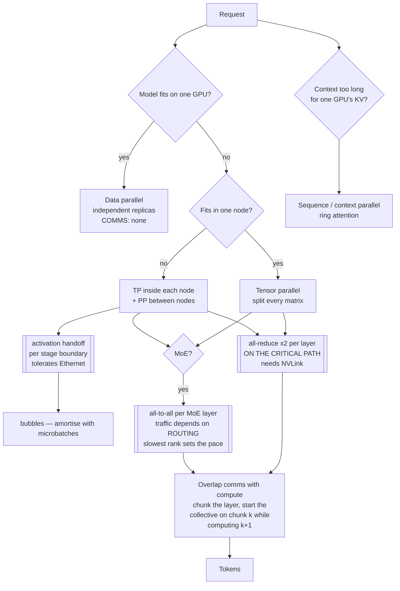

# Parallelism & distributed inference

> **The one sentence:** every parallelism axis trades memory for communication,
> and the only question that matters is whether the traffic it generates fits
> down the wire you actually have.

A 70B model in bf16 is ~140 GB. No single GPU holds that. So the model gets
split — and *how* you split it is not a performance detail, it is the decision
that determines whether your interconnect is adequate. The same model, split two
different ways, can be fast on NVLink and unusable on Ethernet.

This page is about that choice. [Serving & operations](serving-and-operations.html)
covers the layer above; [KV cache optimization](kv-cache.html) covers what you
do when the *cache* rather than the weights is what will not fit.

---

## 1 · Diagram

```
  FOUR AXES. EACH SPLITS SOMETHING DIFFERENT.

  DATA PARALLEL          replicate the model, split the REQUESTS
    GPU0 [full model]    comms: none between replicas
    GPU1 [full model]    memory: no saving at all -- every GPU holds everything
                         use: throughput, once the model already fits

  TENSOR PARALLEL        split every MATRIX across GPUs
    GPU0 [left half  ]   comms: ALL-REDUCE twice per layer, on the critical path
    GPU1 [right half ]   memory: weights / N, KV cache / N
                         use: making it fit, and cutting latency. NVLink only.

  PIPELINE PARALLEL      split the LAYERS across GPUs
    GPU0 [layers 0-39]   comms: one activation tensor per stage boundary
    GPU1 [layers 40-79]  memory: weights / N
                         use: crossing nodes. Tolerates a slow link. Bubbles.

  EXPERT PARALLEL        split the MoE EXPERTS across GPUs
    GPU0 [experts 0-31]  comms: ALL-TO-ALL per MoE layer, token-dependent
    GPU1 [experts 32-63] memory: expert weights / N
                         use: MoE only. Traffic depends on routing, so it is
                              bursty and imbalanced in a way the others are not.

  SEQUENCE / CONTEXT     split the SEQUENCE across GPUs
    GPU0 [tokens 0-32k]  comms: KV exchange during attention (ring)
    GPU1 [tokens 32k-64k] memory: activations and KV / N
                         use: context too long for one GPU's KV


  THE ONE NUMBER THAT DECIDES IT

     TP traffic is per LAYER and on the critical path
     PP traffic is per STAGE BOUNDARY and can be overlapped

     -> TP inside a node (NVLink, ~900 GB/s)
     -> PP between nodes (Ethernet/IB, ~50-400 Gb/s)

     doing it the other way round is the classic, expensive mistake.
```

---

## 2 · Design — the four axes

### Data parallelism — the one that saves no memory

Replicate the whole model on each GPU and send different requests to each. There
is no communication between replicas at inference, which makes it the simplest
and the cheapest to operate.

It is worth naming because it is **not a solution to "the model does not fit"** —
every replica holds the complete model. Data parallelism is a throughput
technique for a model that already fits. Teams reach for it when they mean
tensor parallelism and are confused when memory is unchanged.

### Tensor parallelism — split the matrices

Each weight matrix is partitioned across GPUs; every GPU computes a slice of
every layer. Attention splits by head (each rank owns some heads, so the KV
cache splits with them); the MLP splits column-wise then row-wise.

The cost is an **all-reduce twice per layer** — once after attention, once after
the MLP — and it sits directly on the critical path. Nothing proceeds until
every rank has contributed. On an 80-layer model that is 160 collective
operations per forward pass.

```
  TP=4, one layer:

    GPU0 ──┐
    GPU1 ──┤──> ALL-REDUCE ──> every GPU has the full result ──> next op
    GPU2 ──┤     (blocking)
    GPU3 ──┘

  latency of the layer = compute + all-reduce, not max(compute, all-reduce)
```

This is why **TP belongs inside a node.** Over NVLink the all-reduce is small
relative to the compute; over Ethernet it dominates, and adding GPUs makes the
model slower. It is also the axis that cuts *latency* as well as memory, because
each rank does less work per layer — the reason a latency-sensitive deployment
uses more TP than it strictly needs for memory.

One constraint that bites: **attention heads must divide by the TP degree.** With
GQA the binding number is `num_key_value_heads`, not `num_attention_heads` — at
8 KV heads and TP=16, ranks start duplicating KV instead of splitting it, and
the memory saving stops while the communication cost does not. See
[Reading a model config](model-shape.html).

### Pipeline parallelism — split the layers

GPU 0 holds layers 0–39, GPU 1 holds 40–79. An activation tensor crosses at the
boundary and nothing else does, so the traffic is tiny and tolerant of a slow
link. This is the axis that crosses nodes.

The cost is **bubbles**: while GPU 0 works on a batch, GPU 1 has nothing to do
until the handoff arrives.

```
  naive, 4 stages, 1 batch:
    GPU0  ████
    GPU1      ████
    GPU2          ████
    GPU3              ████        <- 75% of the machine idle at any moment

  with 8 microbatches:
    GPU0  ████████
    GPU1   ████████
    GPU2    ████████
    GPU3     ████████             <- bubble amortised across the microbatches
```

The bubble fraction is approximately `(P-1) / (M + P-1)` for `P` stages and `M`
microbatches, which is the formula worth remembering: **more microbatches, less
bubble**, and it is why pipeline parallelism is friendlier to throughput
workloads than to a latency-sensitive one with a small batch.

### Expert parallelism — split the experts

MoE-specific. Experts live on different GPUs, and every MoE layer needs an
**all-to-all**: tokens are shipped to whichever GPU holds their chosen expert,
then shipped back.

What makes it different from the other three is that **the traffic depends on the
data.** Routing is content-dependent, so one expert may receive far more tokens
than another in a given batch, and the all-to-all runs at the speed of the
slowest rank. Load balancing is therefore a *systems* problem here, not only a
training-quality one — and it is why MoE serving is more sensitive to batch
composition than dense serving.

### Sequence and context parallelism — split the tokens

The sequence itself is partitioned. Each GPU holds the KV for its own slice, and
attention becomes a communication pattern — ring attention passes KV blocks
around the ring so every query eventually sees every key.

This is the axis for **context that does not fit**, as distinct from weights that
do not fit. At 1M tokens the KV cache is the binding constraint and no amount of
tensor parallelism on the weights helps, because the cache scales with sequence
rather than with parameters.

---

## 3 · Design — hiding the cost

The axes above generate traffic. These techniques stop you paying for it in
wall-clock.

**Overlapping communication and computation.** A collective that runs while
compute proceeds is nearly free; one that blocks is pure latency. The standard
move is to break a layer into chunks and start the all-reduce on chunk *k* while
computing chunk *k+1*. This is the single largest software lever on a
TP deployment, and it is why a naive implementation and a tuned one can differ
by 2× on identical hardware.

**Prefetching.** Weights for layer *n+1* are fetched while layer *n* computes.
Relevant whenever weights are not resident — offloaded models, MoE with experts
on host memory, or a weight-streaming setup. The general form is: **the next
thing you will certainly need should already be in flight.**

**Offloading and partitioning.** Push what does not fit to CPU memory or NVMe and
stream it back. Exact, no quality cost, and bounded by PCIe — roughly 30× slower
than HBM, so it is worth it only for data that would otherwise be recomputed
from scratch or not served at all.

**Query parallelism / Skeleton-of-Thought.** The application-level version, and
the one an engineer actually controls. Rather than generating a long answer
serially, have the model emit a skeleton of points, then expand each point as an
*independent* request. Decode is latency-bound per request and the expansions do
not depend on each other, so the wall-clock is that of the longest point rather
than the sum. It costs more tokens and needs the answer to be genuinely
decomposable — it is wrong for anything where later parts depend on earlier ones.

---

## 4 · Flow — choosing the split

```
  1. Does the model fit on one GPU?
     |   yes -> DATA PARALLEL for throughput. Stop. Do not use TP.
     v   no
  2. Does it fit within one NODE?
     |   yes -> TENSOR PARALLEL inside the node. Highest TP degree the
     |          KV heads divide by, which also cuts latency.
     v   no
  3. Crossing nodes.
     |   -> TENSOR PARALLEL within each node
     |   -> PIPELINE PARALLEL between nodes
     |      Never TP across a node boundary if you can avoid it.
     v
  4. Is it MoE?
     |   yes -> EXPERT PARALLEL as well, and watch routing imbalance:
     |          the all-to-all runs at the slowest rank.
     v
  5. Is the CONTEXT what does not fit, rather than the weights?
         -> SEQUENCE / CONTEXT PARALLEL. Splitting the weights harder
            does nothing for a KV cache that scales with sequence length.
```

Step 1 is the one people skip, and it costs them twice: TP on a model that
already fits adds collective communication to every layer for no memory benefit,
so latency goes up and nothing else changes.

---

## 5 · UML — where the traffic goes



The three double-bordered boxes are the whole page: an all-reduce you cannot
hide, an activation handoff you can, and an all-to-all whose size you do not
control.

---

## 6 · Example

```python
"""Communication volume and pipeline bubbles, from model shape.

The point of this is step 2 of the flow: TP traffic is per LAYER and blocking,
PP traffic is per STAGE BOUNDARY and hideable. Those two facts decide which
axis goes inside the node and which goes between nodes.
"""

GB = 1e9


def tp_bytes_per_token(d_model, layers, tp_degree, dtype_bytes=2):
    """All-reduce volume for one token, one forward pass.

    Two all-reduces per layer (post-attention, post-MLP). A ring all-reduce
    moves about 2*(N-1)/N of the tensor per rank -- call it 2x the tensor.
    """
    tensor = d_model * dtype_bytes
    per_layer = 2 * 2 * tensor * (tp_degree - 1) / tp_degree
    return per_layer * layers


def pp_bytes_per_token(d_model, stages, dtype_bytes=2):
    """Activation handoff: one d_model vector per stage boundary."""
    return d_model * dtype_bytes * (stages - 1)


def bubble_fraction(stages, microbatches):
    """Share of pipeline time spent idle."""
    return (stages - 1) / (microbatches + stages - 1)


D, L = 8192, 80                       # Llama-3-70B shape
print(f"{'split':<26}{'bytes/token':>14}{'@2000 tok/s':>16}")
print("-" * 58)
for tp in (2, 4, 8):
    b = tp_bytes_per_token(D, L, tp)
    print(f"{'tensor parallel TP=' + str(tp):<26}{b/1e6:>11.1f} MB{b*2000/GB:>13.1f} GB/s")
for pp in (2, 4):
    b = pp_bytes_per_token(D, pp)
    print(f"{'pipeline parallel PP=' + str(pp):<26}{b/1e3:>11.1f} kB{b*2000/GB:>13.4f} GB/s")

print("\nlinks, for comparison")
print(f"  {'NVLink (intra-node)':<26}{'~900 GB/s':>14}")
print(f"  {'400 Gb InfiniBand':<26}{'~50 GB/s':>14}")
print(f"  {'100 Gb Ethernet':<26}{'~12.5 GB/s':>14}")

print("\npipeline bubbles")
for m in (1, 4, 16, 64):
    print(f"  {m:>3} microbatches, 4 stages -> {bubble_fraction(4, m)*100:>5.1f}% idle")
```

```
split                        bytes/token     @2000 tok/s
----------------------------------------------------------
tensor parallel TP=2              2.6 MB          5.2 GB/s
tensor parallel TP=4              3.9 MB          7.9 GB/s
tensor parallel TP=8              4.6 MB          9.2 GB/s
pipeline parallel PP=2           16.4 kB       0.0328 GB/s
pipeline parallel PP=4           49.2 kB       0.0983 GB/s

links, for comparison
  NVLink (intra-node)            ~900 GB/s
  400 Gb InfiniBand               ~50 GB/s
  100 Gb Ethernet               ~12.5 GB/s

pipeline bubbles
    1 microbatches, 4 stages ->  75.0% idle
    4 microbatches, 4 stages ->  42.9% idle
   16 microbatches, 4 stages ->  15.8% idle
   64 microbatches, 4 stages ->   4.5% idle
```

**The ratio is about 100×, and that is the whole argument.** Tensor parallelism
at TP=8 wants ~9 GB/s of collective bandwidth at a modest 2000 tokens/s;
pipeline parallelism at the same rate wants ~0.1 GB/s. NVLink absorbs the first
without noticing. 100 Gb Ethernet is *nominally* enough for TP=8 at this rate —
and it is still the wrong place for it, because the all-reduce is **blocking and
latency-sensitive**, not bandwidth-limited. Ethernet's problem is the round trip,
160 times per forward pass, not the volume.

And the bubble table is the reason pipeline parallelism is a throughput
technique: at one microbatch you idle 75% of the cluster. It only becomes
reasonable when you have enough concurrent work to fill the pipe, which is
exactly the condition a latency-sensitive deployment does not have.

---

## 7 · Depth — the senior layer

**The interconnect decides the topology, not the model size.** The question is
never "how many GPUs do I need" alone; it is "how many GPUs are on one NVLink
domain". Everything within that domain can use tensor parallelism; everything
across it should be pipeline or expert parallel. A team that provisions eight
GPUs across two nodes and runs TP=8 has built something slower than TP=4 on one
node, and the profile will show it as "communication overhead" rather than as
the topology error it is.

**TP degree is capped by KV heads, not by GPUs.** With GQA at 8 KV heads, TP
beyond 8 stops dividing the cache and starts duplicating it — you keep paying the
collective cost and stop getting the memory benefit. This surprises people
migrating from an MHA model, where the cap was 32 or 64.

**Expert parallelism has a failure mode the others do not: imbalance.** TP and PP
move a fixed amount of data every step. An all-to-all moves whatever the router
decided, so a batch whose tokens happen to favour a few experts runs at the speed
of the loaded rank while others idle. It is bursty, it is data-dependent, and it
means MoE throughput varies with batch *composition* and not just batch size.

**Overlap is where the implementation quality lives.** The same topology on the
same hardware can differ ~2× between a naive implementation that issues a
blocking all-reduce per layer and one that chunks the layer and overlaps. If you
are evaluating a serving stack, this is a more informative question than which
parallelism modes it supports.

**Splitting the weights harder does nothing for a KV problem.** At long context
the binding constraint scales with sequence length, not parameters. Teams
increase TP, see no improvement, and conclude parallelism does not work — when
the axis they needed was sequence parallelism, or the fix was on the
[KV cache page](kv-cache.html) entirely.

| Failure | Looks like | Actual cause |
|---|---|---|
| More GPUs, slower inference | Scaling backwards | TP across a node boundary; all-reduce on the slow link |
| TP=16 saves no memory over TP=8 | Memory flat, latency worse | Only 8 KV heads — ranks duplicate rather than divide |
| Pipeline cluster mostly idle | Low utilisation, good latency | Too few microbatches; bubble is (P-1)/(M+P-1) |
| MoE throughput swings batch to batch | Unpredictable, no code change | Routing imbalance; all-to-all runs at the slowest rank |
| Data parallel did not fix OOM | Memory unchanged after adding GPUs | DP replicates; it never splits the model |
| Long context still OOMs at high TP | Weights fit, cache does not | Wrong axis — KV scales with sequence, not parameters |

---

## 8 · From each seat

| Seat | What parallelism means here |
|---|---|
| **User** | Nothing visible — except that it is why a frontier model answers in seconds despite being far too large for any single chip. |
| **Coder** | You mostly set `tensor_parallel_size` and live with it. The one thing worth knowing: do not set it higher than your KV head count, and do not set it at all if the model already fits. |
| **Tester** | Parallelism should be output-neutral, but floating-point reduction order changes with TP degree, so outputs can differ in the last decimal between topologies. Assert on scores, not strings. |
| **System designer** | The NVLink domain is the unit of design. TP inside it, PP across it, and budget microbatches against the bubble formula before promising a latency number. |
| **Architect** | Interconnect is a bigger procurement decision than GPU count for anything that will not fit in one node. The wrong fabric cannot be fixed in software. |
| **CEO** | "We need more GPUs" and "we need them on the same fabric" are different purchases with different prices, and only the second one fixes a topology problem. |
| **Market** | Vendor throughput numbers assume a topology. A benchmark on an NVLink-connected node says little about the same model on commodity networking. |

---

## 9 · Interview questions

**"You moved from 4 GPUs on one node to 8 across two, and it got slower. Why?"**
Tensor parallelism crossed the node boundary. TP does an all-reduce twice per
layer, on the critical path — 160 blocking collectives per forward pass on an
80-layer model. Inside a node that is NVLink and nearly free; across nodes it is
a network round trip each time, and the round trip dominates regardless of
bandwidth. The fix is TP within each node and pipeline parallel between them.

**"Why cap tensor parallelism at the KV head count?"**
Attention splits by head, so the KV cache splits with the heads. Past
`num_key_value_heads` there is nothing left to divide and ranks duplicate the
cache instead — you keep the collective cost and lose the memory benefit. With
GQA at 8 KV heads the cap is 8 no matter how many GPUs are in the node.

**"When is pipeline parallelism the wrong choice?"**
Low-concurrency, latency-sensitive serving. The bubble is `(P-1)/(M+P-1)`, so
with one microbatch on four stages you idle 75% of the cluster. Pipelining
converts idle time into throughput only when there is enough concurrent work to
fill the pipe — which is precisely what a latency-sensitive deployment lacks.

**"What makes expert parallelism harder to operate than tensor parallelism?"**
The traffic is data-dependent. TP moves a fixed volume every step; expert
parallel's all-to-all moves whatever the router chose, so an imbalanced batch
runs at the speed of the most loaded rank. Throughput then varies with batch
composition rather than batch size, which makes capacity planning statistical
rather than arithmetic.

**"You added GPUs and the long-context OOM persisted. What did you get wrong?"**
The axis. Weights scale with parameters, and the KV cache scales with sequence
length and batch — splitting the weights harder does nothing for the second.
Either use sequence/context parallelism, or treat it as a KV capacity problem:
GQA, quantization, paging, eviction.

---

## Stop condition

You are done when you can:

- Name the four axes and say what each one splits and what it costs in comms
- Explain why TP goes inside a node and PP between them, in latency terms
- Give the bubble formula and use it to reject a topology
- Say what caps TP degree, and why it surprises people coming from MHA
- Explain why expert parallelism is bursty when the others are not
- Diagnose "added GPUs, still OOM at long context" without guessing

---

## Sources worth reading

- **Tensor parallelism** — [*Megatron-LM*](https://arxiv.org/abs/1909.08053) (2019) — the partitioning scheme everything still uses.
- **Pipeline parallelism** — [*GPipe*](https://arxiv.org/abs/1811.06965) and [*PipeDream*](https://arxiv.org/abs/1806.03377) — microbatching and the bubble.
- **Sharding** — [*ZeRO*](https://arxiv.org/abs/1910.02054) — partitioning states rather than replicating them.
- **Sequence parallelism** — [*Ring Attention*](https://arxiv.org/abs/2310.01889) — attention as a communication pattern.
- **Query parallelism** — [*Skeleton-of-Thought*](https://arxiv.org/abs/2307.15337) — the application-level version you control.

Related: [Serving & operations](serving-and-operations.html) for the layer above ·
[KV cache optimization](kv-cache.html) for when the cache is what will not fit ·
[Reading a model config](model-shape.html) for the KV head count that caps TP ·
[Transformers](transformers.html) for why attention splits by head.
