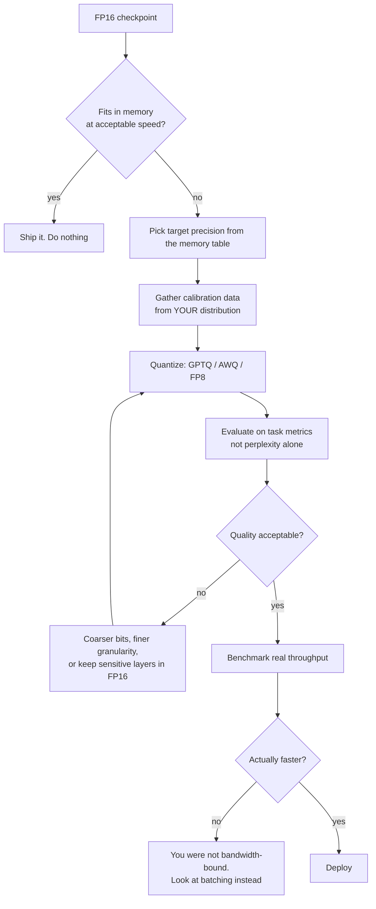
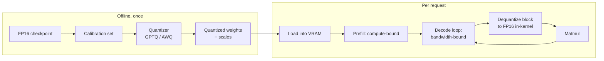

# Quantization

> **The one sentence:** token generation is limited by how many bytes you can
> pull out of memory, not by how fast you can multiply — so making the weights
> smaller makes the model faster.

That sentence is the whole topic. Almost everyone can define quantization;
far fewer can say *why* it produces a speedup, and the answer is not "smaller
numbers multiply faster".

---

## 1 · Diagram

```
   WHY GENERATION IS SLOW: THE TWO PHASES ARE NOT ALIKE

   PREFILL (reading the prompt)          DECODE (writing each token)
   ----------------------------          ---------------------------
   all prompt tokens at once             one token at a time
   big matrix x big matrix               big matrix x ONE vector
   arithmetic dominates                  MOVING THE WEIGHTS dominates
   -> COMPUTE-BOUND                      -> MEMORY-BANDWIDTH-BOUND


   DECODE, PER TOKEN:  read every weight once, do very little maths with it

     7B model, FP16   =  14 GB of weights read PER TOKEN
     at 2 TB/s HBM    =  ~7 ms/token   ->   ~140 tokens/s ceiling

     same model, INT4 =  3.5 GB read per token
     at 2 TB/s        =  ~1.75 ms/token ->  ~570 tokens/s ceiling

   The maths did not get faster. There is simply 4x less to carry.
```

**This is the reason quantization is the highest-leverage inference
optimization**, and the reason it helps decode far more than prefill.

---

## 2 · Design

**Basic.** Quantization maps high-precision floats to a smaller numeric type. A
tensor of FP16 values becomes INT8 or INT4 plus a **scale** (and often a
**zero-point**) so the original range can be approximately recovered.

```
   real value  ≈  scale × (quantized_int − zero_point)
```

The memory arithmetic everyone should be able to do in their head:

| Precision | Bytes/param | 7B model | 70B model |
|---|---|---|---|
| FP32 | 4 | 28 GB | 280 GB |
| FP16 / BF16 | 2 | 14 GB | 140 GB |
| INT8 / FP8 | 1 | 7 GB | 70 GB |
| INT4 | 0.5 | 3.5 GB | 35 GB |

Add roughly 15–20% for the KV cache, activations and framework overhead. That
table is what decides whether a model fits on the card you have — a 70B at INT4
fits on a single 40GB A100; at FP16 it does not fit on two.

**Intermediate — the axes that actually distinguish methods.**

| Axis | Options | Consequence |
|---|---|---|
| **What is quantized** | Weights only / weights + activations | Weight-only is far easier and safer; activations carry outliers |
| **When** | Post-training (PTQ) / during training (QAT) | PTQ takes minutes; QAT needs a training run |
| **Granularity** | Per-tensor / per-channel / per-group | Finer granularity, better accuracy, slightly more overhead |
| **Symmetry** | Symmetric / asymmetric | Asymmetric handles skewed distributions, costs a zero-point |

**Advanced — the finding that shaped the whole field.** Above roughly 6.7B
parameters, transformers develop **emergent outlier features**: a small number
of dimensions whose activations are 10–100× larger than the rest. Naive INT8
quantization of activations destroys the model, because those outliers dominate
the scale and everything else collapses into a couple of quantization levels.

The responses to that discovery *are* the modern method landscape:

| Method | Core idea | Where it fits |
|---|---|---|
| **LLM.int8()** | Keep outlier dimensions in FP16, quantize the rest to INT8 | The original fix; simple, some overhead |
| **GPTQ** | Layer-by-layer, second-order-informed rounding against calibration data | Strong 4-bit accuracy, needs calibration |
| **AWQ** | Protect the ~1% of weights that matter most, guided by activation scale | Fast, robust, popular for 4-bit serving |
| **SmoothQuant** | Shift difficulty from activations into weights so both quantize well | Enables weight+activation INT8 |
| **GGUF / llama.cpp k-quants** | Mixed per-block precision, CPU-friendly | Local and CPU inference |
| **FP8** | Hardware-native float8 on H100 and newer | Near-lossless, needs the silicon |

---

## 3 · Flow

Post-training quantization, in the order it happens:

1. **Pick the target.** Driven by the memory arithmetic above and the hardware
   you actually have, not by what sounds impressive.
2. **Choose weight-only or weight+activation.** Weight-only INT4 is the default
   for serving; it captures most of the bandwidth win with much less risk.
3. **Gather calibration data** — typically 128–512 samples. This is the step
   people rush, and it decides the result.
4. **Run the quantizer.** GPTQ or AWQ for 4-bit; minutes to a couple of hours.
5. **Evaluate on your task**, not on perplexity alone. See below.
6. **Compare against the alternatives you did not take** — a smaller model at
   FP16 is often better than a large one at INT4.
7. **Deploy and measure real throughput**, because the theoretical speedup
   assumes you were bandwidth-bound in the first place.



**Branch `K → L` catches a common disappointment.** With large batches, decode
stops being purely bandwidth-bound because each weight read is amortised across
many sequences. Quantizing a heavily-batched server can produce a much smaller
speedup than the memory arithmetic promised — the win is largest at batch size 1,
which is exactly the interactive, single-user case.

---

## 4 · UML — where quantization sits



**Note `H`.** In weight-only quantization the arithmetic still happens in FP16 —
weights are dequantized inside the kernel, block by block, as they are read.
Nothing about the multiply got cheaper. The saving is entirely in the bytes
crossing the memory bus, which is why the speedup tracks the compression ratio
rather than any change in FLOPs.

---

## 5 · Example

```python
def memory_footprint(params_b: float, bits: int, kv_overhead: float = 0.18) -> float:
    """Approximate VRAM in GB for a model at a given precision.

    The overhead term covers the KV cache, activations and framework slack.
    It grows with context length and batch size, so treat 0.18 as a floor for
    interactive use rather than a promise.
    """
    weights_gb = params_b * 1e9 * (bits / 8) / 1e9
    return weights_gb * (1 + kv_overhead)


def decode_ceiling(params_b: float, bits: int, bandwidth_tb_s: float = 2.0) -> float:
    """Upper bound on tokens/second at batch size 1, from bandwidth alone.

    Every weight is read once per token, so the ceiling is simply
    bandwidth / bytes-per-pass. Real throughput lands below this -- attention
    over the KV cache, kernel launches and sampling all cost time -- but if
    your measured rate is far below this number, quantization is not your
    bottleneck and you should look elsewhere.
    """
    bytes_per_pass = params_b * 1e9 * (bits / 8)
    return (bandwidth_tb_s * 1e12) / bytes_per_pass


for bits in (16, 8, 4):
    print(f"7B @ INT{bits:<2}  {memory_footprint(7, bits):5.1f} GB   "
          f"ceiling ~{decode_ceiling(7, bits):5.0f} tok/s")
```

```
7B @ INT16   16.5 GB   ceiling ~  143 tok/s
7B @ INT8     8.3 GB   ceiling ~  286 tok/s
7B @ INT4     4.1 GB   ceiling ~  571 tok/s
```

**Calibration data is the part that decides quality:**

```python
def calibration_samples(production_logs, n: int = 256) -> list[str]:
    """Draw calibration data from real traffic, stratified by intent.

    The quantizer decides which weights matter by watching activations on this
    data. Calibrate on WikiText and deploy on customer support transcripts and
    you have optimised for the wrong distribution -- perplexity will look fine
    and your task metrics will not.

    A few hundred samples is enough; representativeness beats volume.
    """
    by_intent: dict[str, list[str]] = {}
    for record in production_logs:
        by_intent.setdefault(record["intent"], []).append(record["text"])

    per_bucket = max(1, n // max(1, len(by_intent)))
    out: list[str] = []
    for texts in by_intent.values():
        out.extend(texts[:per_bucket])
    return out[:n]
```

---

## 6 · Depth — the senior layer

**Perplexity is a bad acceptance test and it is the one everybody uses.**
Quantization papers report perplexity because it is cheap and comparable, but a
0.1 perplexity increase can hide a large drop in a specific capability. The
capabilities that degrade first, in roughly this order:

1. **Long-context recall** — retrieval from deep in the context window
2. **Structured output** — JSON validity, schema adherence, tool-call formatting
3. **Multi-step reasoning** — errors compound across steps
4. **Rare languages and domain jargon** — thin training signal, quantized away first

If your product depends on tool calls or strict JSON, **test exactly that**. A
model that has quietly lost 5% JSON validity is a production incident, and
perplexity will not show it.

**Quantize the KV cache too, and know that it is riskier.** At long context the
KV cache can exceed the weights. INT8 KV is usually safe; INT4 KV degrades
long-context recall noticeably. Quantize weights first, measure, then consider
the cache separately — [KV cache optimization](kv-cache.html) covers that side,
including why keys tolerate less precision than values.

**The comparison people forget to run.** Before quantizing a large model, check
the smaller model at full precision:

| Option | Memory | Typical outcome |
|---|---|---|
| 13B @ INT4 | ~7 GB | Often *worse* than the alternative below |
| 7B @ FP16 | ~14 GB | Usually stronger on structured output and reasoning |
| 13B @ INT8 | ~14 GB | Usually the best of the three |

There is no universal answer, but "big model, aggressive quantization" is not
automatically better than "smaller model, gentle quantization", and the
assumption that it is costs teams real quality.

| Failure mode | Symptom | Fix |
|---|---|---|
| **Wrong calibration distribution** | Benchmarks fine, production worse | Calibrate on real traffic, stratified |
| **Perplexity-only acceptance** | Subtle capability loss ships | Task metrics, especially JSON and tool calls |
| **Quantizing an under-batched server** | Expected 4×, got 1.2× | You were not bandwidth-bound; batch first |
| **INT4 KV cache at long context** | Recall from early context collapses | Keep KV at INT8 or FP16 |
| **Uniform bits across layers** | Avoidable quality loss | Keep the first and last layers higher precision |
| **Ignoring hardware support** | INT4 kernels slower than FP16 | Check the kernels exist for your GPU before choosing |

**Hardware determines what is even worth trying.** FP8 needs Hopper or newer.
INT4 needs good kernels — on hardware without them, dequantization overhead can
make INT4 *slower* than FP16. The right order is: check what your silicon
accelerates, then pick the format.

**QAT versus PTQ, honestly.** QAT gives better accuracy at very low bit widths
(3-bit and below) but requires a training run, the data, and the expertise. For
almost every application team, PTQ with GPTQ or AWQ at 4-bit is the right answer
and QAT is a research project. Say that plainly rather than listing QAT as an
equal option.

---

## 7 · From each seat

| Seat | What quantization looks like from here |
|---|---|
| **User** | Faster responses, or the feature existing at all because it now fits on affordable hardware. The risk they carry is invisible: a subtly worse model that still sounds completely confident. |
| **Coder** | Pin the quantization method *and* its version alongside the model — a re-quantized checkpoint is a different model. Verify structured output after quantizing; that is what breaks first. Check kernel support before choosing a format. |
| **Tester** | Your regression suite is the acceptance test for quantization. Run it on the quantized model and gate on task metrics, never perplexity. Add a JSON-validity and tool-call-accuracy check specifically — they degrade before anything a benchmark measures. |
| **System designer** | Changes your memory budget, which changes batch size, which changes throughput — often more than the quantization itself. Model the whole chain, and measure at your real batch size, not at batch 1. |
| **Architect** | It is what makes self-hosting viable against an API. That is a build-versus-buy decision with a three-year shape: you take on serving, GPU capacity, and a quantization pipeline in exchange for per-token cost and data residency. |
| **CEO** | Roughly 4× less GPU memory means roughly 4× fewer GPUs for the same load, and the option to self-host at all. The risk is a quality loss nobody measured. Ask one question: what did the eval suite say before and after? |
| **Market** | Commoditised and moving fast — GPTQ, AWQ, GGUF, bitsandbytes are free and well-supported; vLLM and TensorRT-LLM handle serving. No moat. The moat is having an eval suite good enough to know whether the quantized model is still acceptable. |

---

## 8 · Interview questions

| Question | What they are testing | Answer sketch |
|---|---|---|
| "Why does quantization make inference faster?" | The central misconception | Decode is memory-bandwidth-bound: every weight is read once per token and very little arithmetic is done with it. Fewer bytes per pass means more tokens per second. The multiply is unchanged — weights are dequantized in-kernel. |
| "INT8 or INT4?" | Trade-off reasoning | Start at INT4 weight-only for serving; it captures most of the bandwidth win with modern methods. Go to INT8 if task metrics drop, especially structured output. And check whether a smaller model at higher precision beats both. |
| "What breaks first when you quantize?" | Depth beyond the definition | Long-context recall, structured output validity, multi-step reasoning, and rare languages. Perplexity barely moves for all of these, which is why perplexity is the wrong acceptance test. |
| "Why do large models quantize worse than small ones?" | Whether you know the outlier result | Emergent outlier features above roughly 6.7B: a few activation dimensions run 10–100× larger and dominate the scale. LLM.int8, SmoothQuant and AWQ are all responses to that. |
| "You quantized to INT4 and got a 1.2× speedup, not 4×." | Systems thinking | You were not bandwidth-bound. Large batches amortise weight reads across sequences, so the win shrinks. Check batch size and whether you are prefill-heavy — quantization helps decode far more than prefill. |
| "How much calibration data?" | Practical knowledge | A few hundred samples, drawn from your real distribution and stratified by intent. Representativeness matters far more than volume; calibrating on generic web text and serving a domain workload is the classic mistake. |

---

## Stop condition

You are done when you can:

1. explain the speedup in terms of memory bandwidth, not arithmetic,
2. do the memory arithmetic for a 7B and a 70B at four precisions from memory,
3. name the outlier-feature result and two methods that respond to it,
4. list what degrades before perplexity does, and
5. state the case where a smaller model at FP16 beats a bigger one at INT4.

---

## Sources worth reading

| Topic | Source |
|---|---|
| Outlier features | *LLM.int8(): 8-bit Matrix Multiplication for Transformers at Scale* (Dettmers et al., 2022) |
| 4-bit PTQ | *GPTQ* (Frantar et al., 2022) and *AWQ* (Lin et al., 2023) |
| Activation quantization | *SmoothQuant* (Xiao et al., 2022) |
| Serving | vLLM and TensorRT-LLM docs — which formats are actually accelerated on which hardware |
| Honest evaluation | Any careful study reporting task metrics rather than perplexity alone; the gap between the two is the point |
