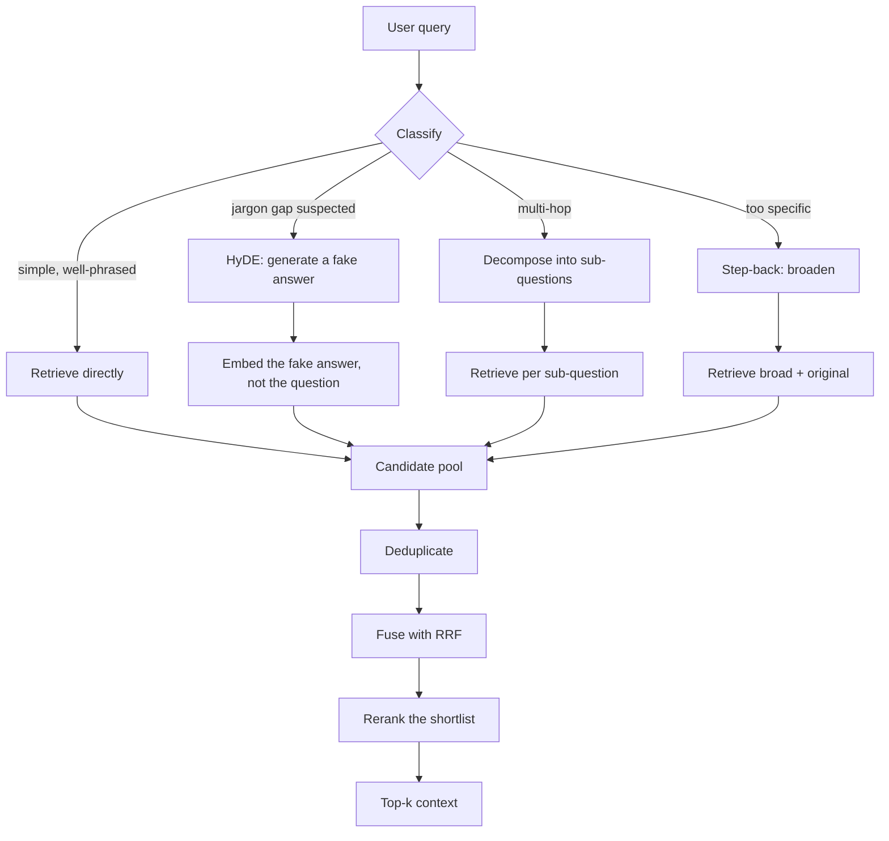

# Query transformation & HyDE

> **The one sentence:** the user's question and the passage that answers it are
> written by different people for different purposes, and embedding similarity
> quietly assumes they are not.

This is the cheapest large win available in RAG, and the most commonly skipped.
Teams reach for a better embedding model or a reranker while the actual problem
is that "why is it slow?" shares almost no vocabulary with the paragraph that
explains query planner statistics.

---

## 1 · Diagram

```
   THE ASYMMETRY YOU ARE FIGHTING

   user query      "why is it slow?"                 8 tokens, no domain terms
                          |
                          |   cosine similarity in embedding space
                          v
   passage         "The query planner picks a sequential scan when it
                    estimates most rows will match..."                  40 tokens, dense jargon

   These are a QUESTION and an ANSWER. Embeddings reward text that
   LOOKS ALIKE. A question does not look like its own answer.


   THE FOUR FIXES, and what each one is actually for

   multi-query    one question  -> N phrasings      ... vocabulary coverage
   HyDE           one question  -> a fake ANSWER    ... fixes the asymmetry above
   step-back      one question  -> a broader one    ... when the query is too specific
   decomposition  one question  -> sub-questions    ... when it is really 3 questions
```

---

## 2 · Design

**Basic.** Query transformation means: do not retrieve with the raw user string.
Rewrite it first, retrieve with the rewrite (or several), then merge.

**Intermediate.** The four techniques are not interchangeable — each fixes a
different failure:

| Technique | Turns the query into | Fixes | Cost |
|---|---|---|---|
| **Multi-query** | 3–5 paraphrases | Vocabulary mismatch, unlucky phrasing | N retrievals, 1 LLM call |
| **HyDE** | A hypothetical answer | Question/answer asymmetry | 1 LLM call + 1 retrieval |
| **Step-back** | A more general question | Over-specific queries with no exact match | 1 LLM call + 2 retrievals |
| **Decomposition** | Several sub-questions | Multi-hop questions | N LLM calls + N retrievals |

**HyDE deserves the most attention** because it attacks the asymmetry directly.
Instead of embedding the question, you ask a model to *hallucinate an answer* —
deliberately, with no retrieval — and embed **that**. The fake answer is
factually unreliable and completely irrelevant: what matters is that it is
written in the register, vocabulary and length of a real answer, so it lands
near real answers in embedding space.

> **The counter-intuitive bit worth saying out loud in an interview:** HyDE
> works *because* the generated document may be wrong. You never show it to the
> user and you never use its content. It is a search probe shaped like an
> answer, not an answer.

**Advanced — when each one hurts.**

- **Multi-query** multiplies retrieval cost and can *dilute* precision: five
  queries return five plausible-but-different neighbourhoods, and the fusion
  step decides your quality. It is only as good as your reciprocal rank fusion.
- **HyDE** fails on queries about things the model has no prior for — a private
  product name, an internal acronym, a genuinely novel entity. The hypothetical
  answer is then confidently generic, and you retrieve generic passages. It also
  adds a full generation to your latency budget before retrieval even starts.
- **Step-back** can retrieve context so general it crowds out the specific
  passage that actually answers the question. Use it *alongside* the original
  query, never instead of it.
- **Decomposition** is the most expensive and the most likely to compound
  errors: a bad sub-question produces bad context that a later step treats as
  established fact.

---

## 3 · Flow



**The classifier at step B is the part people skip**, and skipping it is why
transformation pipelines get abandoned. Applying HyDE to every query pays a
generation on every request including the ones that were fine. A cheap
router — heuristics on query length and jargon overlap with the corpus
vocabulary, or one small classification call — keeps the average cost near zero
while still rescuing the hard queries.

---

## 4 · UML — HyDE as a sequence

```mermaid
sequenceDiagram
    participant U as User
    participant R as Retriever service
    participant G as Generator LLM
    participant V as Vector index
    participant K as Reranker

    U->>R: "why is it slow?"
    R->>G: write a passage that would answer this
    Note over G: no retrieval, no grounding.<br/>Plausibility is the goal, not truth.
    G-->>R: hypothetical answer (may be wrong)
    R->>V: embed(hypothetical), search
    V-->>R: candidates that resemble real answers
    R->>V: embed(original query), search
    Note over R: keep BOTH. HyDE fails silently on<br/>unfamiliar entities; the raw query is the floor.
    V-->>R: candidates
    R->>R: dedupe + RRF fuse
    R->>K: shortlist
    K-->>R: reranked top-k
    R-->>U: answer grounded in retrieved passages
```

Retrieving with **both** the hypothetical and the original is the detail that
makes HyDE safe in production. On queries where the model has no prior, HyDE
degrades to noise — and the raw query result is the floor that stops it
degrading the whole system.

---

## 5 · Example

```python
MULTI_QUERY = """Rewrite the question below as {n} differently-worded search
queries. Vary the vocabulary: use synonyms and domain terms a document author
would use, not the words the asker chose. One per line, no numbering."""

HYDE = """Write a short passage that would answer the question below, as if
extracted from technical documentation.

Write with confidence and use domain vocabulary. Accuracy does not matter --
this text is never shown to anyone; it is used only as a search probe, so it
needs to LOOK like a real answer, not be one. Three sentences maximum."""

STEP_BACK = """Given the specific question below, write the more general
question it is an instance of. Return only that question."""


def transformed_retrieve(client, index, query, k=8):
    """Retrieve with the original query plus its transformations, then fuse."""
    variants = [("original", query)]

    hypothetical = complete(client, HYDE, query)
    variants.append(("hyde", hypothetical))

    for i, rewrite in enumerate(complete(client, MULTI_QUERY.format(n=3), query).splitlines()):
        if rewrite.strip():
            variants.append((f"multi-{i}", rewrite.strip()))

    ranked_lists = {label: index.search(text, k) for label, text in variants}
    return rrf_fuse(ranked_lists, k=k)


def rrf_fuse(ranked_lists: dict[str, list[str]], k: int, damping: int = 60):
    """Reciprocal Rank Fusion across the variant result lists.

    RRF rather than averaging scores: the variants are different queries, so
    their score scales are not comparable, but their RANKS always are. A
    document that places well for several phrasings beats one that places first
    for exactly one -- which is the behaviour you want, because a single
    phrasing placing something first is often luck.
    """
    scores: dict[str, float] = {}
    for ids in ranked_lists.values():
        for rank, doc_id in enumerate(ids, start=1):
            scores[doc_id] = scores.get(doc_id, 0.0) + 1.0 / (damping + rank)
    return sorted(scores, key=scores.get, reverse=True)[:k]
```

**The router that keeps it affordable:**

```python
def needs_transformation(query: str, corpus_vocab: set[str]) -> bool:
    """Cheap heuristic: transform only when the query is unlikely to match.

    Runs in microseconds and catches the two dominant cases -- a very short
    query with little to match on, and a query sharing almost no vocabulary
    with the corpus. Everything else retrieves fine as written and should not
    pay for a generation.
    """
    words = {w for w in query.lower().split() if len(w) > 3}
    if not words:
        return True
    overlap = len(words & corpus_vocab) / len(words)
    return len(words) < 4 or overlap < 0.3
```

---

## 6 · Depth — the senior layer

**Latency is the real constraint, and it is worse than it looks.** HyDE puts a
full generation *in front of* retrieval, so it is serial: you cannot start
searching until the model finishes writing. On a p95 budget of 2 seconds, a
600ms generation is 30% of your budget spent before retrieval begins. Mitigations,
in order of how much they actually help:

1. **Route** — most queries do not need it.
2. **Use a small, fast model for the transformation.** The hypothetical answer
   does not need to be good, and a 1B model writes plausible-looking
   documentation prose perfectly well.
3. **Run variants in parallel** once generated; the retrievals are independent.
4. **Cache on the normalised query.** Query distributions are Zipfian — a small
   cache catches a surprising share of traffic.

**Evaluate the transformation separately from the pipeline.** The number that
matters is recall of the *relevant chunk*, measured on queries the raw retriever
missed. A transformation that lifts overall hit rate by 2 points while adding
600ms is usually a bad trade; one that rescues 40% of previously-failed queries
is an obvious win. Those two can be the same aggregate number, which is why the
aggregate is the wrong thing to look at.

| Failure mode | Symptom | Fix |
|---|---|---|
| **HyDE on unknown entities** | Generic answer, generic retrieval, confident nonsense | Always retrieve with the raw query too; fuse |
| **Transformation on every query** | Latency and cost double, quality moves 1 point | Route |
| **Over-broad step-back** | General context crowds out the specific passage | Keep the original query in the pool; cap step-back's share of the top-k |
| **Decomposition error cascade** | One wrong sub-answer poisons the rest | Retrieve for all sub-questions before generating anything |
| **Fusion by score** | Unstable ranking across variants | Fuse by rank (RRF), never by raw score |
| **No dedup** | The same passage occupies three top-k slots | Deduplicate on chunk id before fusing |

**Where this sits relative to reranking.** Query transformation improves
*recall* — it gets the right passage into the candidate pool at all. Reranking
improves *precision* — it puts the right passage at the top of a pool that
already contains it. They fix different failures and they compose. If your
failures are "the answer was never retrieved", transformation is your lever;
if they are "the answer was retrieved at rank 9", the reranker is.

---

## 7 · From each seat

| Seat | What query transformation looks like from here |
|---|---|
| **User** | They type the same short question they always did, and it starts working. The feature is invisible, which is correct — asking users to phrase queries better is a product failure, not a user failure. |
| **Coder** | Keep the raw query in the pool always. Fuse by rank not score. Deduplicate before fusing. Cache on the normalised query. Log which variant produced each retrieved chunk, or you will never know which technique is earning its keep. |
| **Tester** | Bucket the golden set by *why* a query is hard — jargon gap, multi-hop, too specific — and measure per bucket. An aggregate hides which technique works. Also test the router: transformation firing on easy queries is a defect. |
| **System designer** | A generation now sits on the critical path before retrieval. Budget it, set a timeout, and decide the fallback: on timeout, retrieve with the raw query rather than failing the request. |
| **Architect** | This adds a second model dependency to the retrieval path — a different failure domain and a different vendor. Decide whether the transformation model can be small and local while the answer model stays hosted. Often it can, and that is a good boundary. |
| **CEO** | It is the cheapest quality lever in RAG: no re-indexing, no retraining, no data migration. The cost is per-query latency and a small model bill. Worth asking: what fraction of failed queries does it rescue, not what did it do to the average. |
| **Market** | Fully commoditised — LangChain, LlamaIndex and DSPy all ship MultiQuery, HyDE and step-back as one-liners. There is no advantage in implementing them; the advantage is in the routing policy and knowing which failure you actually have. |

---

## 8 · Interview questions

| Question | What they are testing | Answer sketch |
|---|---|---|
| "What is HyDE and why does it work?" | Whether you understand the asymmetry | Generate a hypothetical answer, embed that instead of the question. It works because questions do not resemble their answers in embedding space, but a fake answer resembles a real one. Its factual accuracy is irrelevant — it is a search probe, never shown to anyone. |
| "HyDE hallucinates. Isn't that a problem?" | Depth | No — that is the mechanism, not a bug. It is discarded after embedding. The real risk is different: on entities the model has never seen it produces generic text and retrieves generic passages, so always retrieve with the raw query too and fuse. |
| "Multi-query or reranking?" | Whether you can diagnose | Different failures. Multi-query lifts recall — getting the passage into the pool. Reranking lifts precision — ordering a pool that already has it. Look at your failures: never retrieved, or retrieved and buried? |
| "Would you transform every query?" | Cost awareness | No. Route it. Most queries retrieve fine as written, and transformation puts a generation in front of retrieval on the critical path. A length-and-vocabulary-overlap heuristic catches the hard ones for microseconds. |
| "How do you fuse results from several queries?" | Practical detail | RRF on ranks, not on scores — the variants are different queries so their score scales are not comparable, but ranks are. Dedupe on chunk id first, or one passage takes three slots. |
| "How do you know the transformation helped?" | Evaluation instinct | Measure recall on the bucket of queries the raw retriever failed, not the overall average. A 2-point aggregate gain for 600ms is a bad trade; rescuing 40% of failures is an obvious win, and both can look identical in aggregate. |

---

## Stop condition

You are done when you can:

1. explain the question/answer asymmetry in one sentence,
2. say why HyDE's hallucination is the mechanism rather than the flaw,
3. name the failure case where HyDE degrades and the mitigation,
4. state when transformation beats reranking and vice versa, and
5. justify routing rather than transforming everything.

---

## Sources worth reading

| Topic | Source |
|---|---|
| HyDE | *Precise Zero-Shot Dense Retrieval without Relevance Labels* (Gao et al., 2022) |
| Step-back prompting | *Take a Step Back: Evoking Reasoning via Abstraction* (Zheng et al., 2023) |
| Rank fusion | Cormack et al. on Reciprocal Rank Fusion — short, and the k=60 constant comes from here |
| Implementations | LangChain `MultiQueryRetriever` and LlamaIndex query transforms — read one before writing your own |
