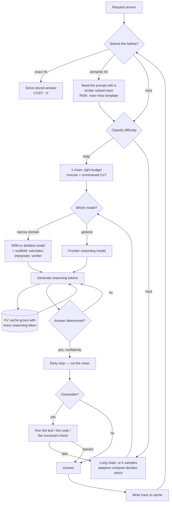

# Reasoning inference optimization

> **The one sentence:** a reasoning model's bill is three numbers multiplied
> together — how many chains, how long each chain is, and what a token costs —
> and every technique here moves exactly one of them, or removes the work
> entirely.

[Reasoning models](reasoning-models.html) is about *whether* to reason: routing,
when thinking helps, when it is expensive superstition. This page assumes you
have already decided the reasoning is worth doing, and the bill has arrived.

That bill is unlike a normal inference bill in one specific way: **you are paying
output-token prices for tokens the user never sees.** A 4,000-token chain that
produces a 200-word answer is 95% invisible cost. Which is why this is a
distinct optimisation surface rather than a footnote on
[KV cache optimization](kv-cache.html) — the techniques are about the *shape of
the thinking*, not the memory it sits in.

---

## 1 · Diagram

```
  REASONING COST  =  chains  ×  tokens_per_chain  ×  cost_per_token
                       ^              ^                   ^
                       |              |                   |
                  path reduction   token reduction    distillation
                  early stopping   step skipping      SRM
                  adaptive compute concise CoT        scaffold + SRM
                  CoT-decoding     constrained CoT    long-context CoT
                  single-pass      Coconut / latent   (attention + KV cost
                                   CoT sparsity        of a long chain)
                                   prompt sequence

  ...and the one that removes the multiplication:

     REASONING CACHING  ->  this problem was already solved. Do not re-solve it.


  WHY IT IS ITS OWN PROBLEM

    normal request     300 in  +   200 out                 user sees 100%
    reasoning request  300 in  + 4,300 out                 user sees ~5%
                                   ^^^^^
                                   billed at output rates, invisible,
                                   and the length is not yours to predict

    Cutting a chain from 4,000 to 1,500 tokens is a ~2.4x bill cut with
    no model change, no infrastructure change, and no new hardware.
```

The asymmetry to internalise: on a normal workload you optimise the *serving*.
On a reasoning workload the dominant term is **how much the model chose to
think**, and most of the leverage is in constraining that rather than in
serving it faster.

---

```sim
reasoncost
```

---

## 2 · Design — the nineteen techniques, in order

Numbered as listed. The **Factor** column is the one that makes this memorable:
once you know which of the three numbers a technique moves, you know what it
composes with. Two techniques on the same factor usually overlap; two on
different factors multiply.

The **Ready?** column is the one that saves you a quarter. Several of the most
interesting entries here are research results with no path into your serving
stack yet, and the page would be dishonest if it listed them flat alongside a
prompt change you can ship this afternoon.

### Group A — shorten the chain (attacks `tokens_per_chain`)

| # | Technique | What it does | Factor | Ready? |
|---|---|---|---|---|
| 1 | **CoT token reduction** | The umbrella: any method that makes the same reasoning use fewer tokens. Symbol-heavy notation, dropped filler, no restating the question | tokens | ✅ Ship today |
| 2 | **CoT step skipping** | Train or prompt the model to omit steps it can do implicitly — the model has learned which intermediate work it does not need to write down | tokens | 🟡 Prompting yes, trained versions are research |
| 4 | **CoT early stopping** | Halt generation once the answer is determined — monitor answer-token confidence and cut the chain rather than letting it run to its natural end | tokens | 🟡 Needs logprob access and a decision rule |
| 6 | **Constrained CoT** | Put an explicit length budget in the prompt ("reason in under 100 words") or enforce it with `max_tokens` on the reasoning segment | tokens | ✅ Ship today |
| 8 | **Concise CoT** | Prompt for compact reasoning without a hard numeric cap. Weaker than constrained CoT, but degrades more gracefully on hard items | tokens | ✅ Ship today |
| 10 | **CoT prompt sequence optimisation** | Order and prune what you put *before* the reasoning: exemplar choice, instruction placement, dropping few-shot CoT entirely on trained reasoners | tokens (input and output) | ✅ Ship today |
| 11 | **CoT sparsity** | Exploits the finding that a small minority of reasoning tokens carry most of the causal weight; the rest are elaboration. Prune toward the load-bearing ones | tokens | 🔴 Research |

### Group B — fewer chains, or fewer tokens spent deciding (attacks `chains`)

| # | Technique | What it does | Factor | Ready? |
|---|---|---|---|---|
| 3 | **CoT path reduction** | Self-consistency samples *k* chains and votes. Path reduction cuts *k* — adaptively, stopping when the votes agree, instead of always paying for a fixed 5 or 10 | chains | ✅ Ship today |
| 5 | **CoT reasoning decoding** | CoT-decoding: branch on the top-*k* first tokens and pick the path whose answer tokens are most confident. Elicits reasoning with *no* CoT prompt at all | chains | 🟡 Needs custom decoding |
| 16 | **Adaptive inference-time compute** | Spend per item, not per workload: classify difficulty first, give easy items one short chain and hard items a long one or several | chains + tokens | ✅ Ship today — but see §5: smaller than it looks |
| 17 | **Single-pass long-form reasoning** | One long chain instead of many sampled short ones. The trade is real: one 8k chain is serial and slow; five 1.5k chains are parallel, cheaper in wall-clock, and often more accurate by majority vote | chains = 1 | ✅ It is what R1-style models already do |

### Group C — make the tokens cheaper (attacks `cost_per_token`)

| # | Technique | What it does | Factor | Ready? |
|---|---|---|---|---|
| 12 | **CoT distillation** | Fine-tune a small model on a strong model's reasoning traces. The clearest current case where distillation genuinely transfers capability | cost/token | ✅ Ship today — mind the licence |
| 13 | **Long-context CoT** | Not a saving — a cost to manage. A 32k chain is a 32k KV cache that grows for the whole generation, so reasoning length is a *memory* problem too | cost/token | ✅ Manage it, via [KV cache optimization](kv-cache.html) |
| 14 | **Small Reasoning Model (SRM)** | A small model trained specifically to reason, rather than a general small model prompted to. 7B-class SRMs beat much larger general models on narrow reasoning | cost/token | ✅ Ship today |
| 18 | **Augmented scaffold + SRM** | Give the small model tools instead of asking it to think harder: a calculator, a code interpreter, a verifier, a retriever. Offloads the part it is worst at | cost/token | ✅ Ship today — best accuracy-per-dollar on this page |

### Group D — reason in latent space (attacks `tokens_per_chain`, radically)

| # | Technique | What it does | Factor | Ready? |
|---|---|---|---|---|
| 7 | **Coconut** | Chain of Continuous Thought: feed the last hidden state straight back as the next input embedding, so reasoning steps never become tokens. No decode, no detokenise, no token bill for the thinking | tokens → ~0 | 🔴 Research |
| 9 | **Hidden CoT / latent reasoning** | The general family Coconut belongs to: interim steps held as continuous state rather than emitted text | tokens → ~0 | 🔴 Research |

**Note the naming collision.** "Hidden CoT" is used for two unrelated things.
The one in this table is *latent* reasoning — steps that were never tokens.
The other is *provider-hidden* reasoning: o1- and R1-style models that generate
ordinary reasoning tokens, bill you for them, and show you a summary. Those are
opposites operationally — one removes the cost, the other removes only your
visibility into it. Be explicit about which you mean.

### The two entries that are not techniques

| # | Entry | What it actually is |
|---|---|---|
| 15 | **Reasoning tokens** | The *unit*, not a method. The billing line for tokens generated during thinking. They price as output tokens, count against your context window, and occupy KV cache exactly like visible tokens. Everything on this page is measured in them |
| 19 | **Reasoning caching** | Not an optimisation of the reasoning — an elimination of it. If this exact problem was solved before, serve the stored trace or its answer. It is the only entry that can take the cost to zero |

**Reasoning caching deserves more than a table row**, because it is the highest-
leverage item here and the one teams reach for last. Three levels, in increasing
order of both payoff and risk:

1. **Exact-match answer cache.** Same normalised problem, serve the stored
   answer. Trivially safe, and on workloads with repeated queries — support
   triage, code review of similar diffs, homework-shaped traffic — the hit rate
   is much higher than people expect.
2. **Prefix cache on the reasoning preamble.** The system prompt and any shared
   scaffolding are identical across requests; that KV is reusable by the normal
   [prefix-caching](kv-cache.html) mechanism. Cuts TTFT, not reasoning tokens.
3. **Semantic / trace cache.** Retrieve a *similar* solved problem and give its
   trace to the model as an exemplar, so it reasons less from scratch. This is
   the one with real payoff and real danger: near-miss retrieval hands the model
   a confidently wrong template, and the failure looks like careful reasoning.
   Gate it on a similarity threshold you validated, and log every hit.

---

## 3 · Flow — how to actually choose

Risk order, not size-of-win order. Everything above the line is reversible and
costs no accuracy; everything below changes what the model does.

```
  1. Measure first          -> What fraction of your output tokens are REASONING
     |                         tokens? If it is under ~40%, this whole page is
     |                         the wrong page. Go optimise something else.
     v
  2. Repeated problems?     -> Reasoning caching, exact match first. The only
     |                         technique that removes the cost rather than
     |                         reducing it. Check hit rate before assuming zero.
     v
  3. Long chains?           -> Constrained / concise CoT. A length budget in the
     |                         prompt. Free to try, instantly reversible,
     |                         measurable in an afternoon, and worth ~2.4x.
     |                         Best effort-to-payoff ratio on the page.
     v
  4. Uniform spend?         -> Adaptive inference-time compute. Classify
     |                         difficulty, route easy items to one short chain.
     |                         Worth less than intuition suggests -- the hard
     |                         tail dominates the bill, so the win comes from
     |                         CAPPING the hard items, not cheapening easy ones.
     v
  5. Using self-consistency -> Path reduction: stop sampling when the votes
     |  with fixed k?          already agree, instead of always paying for k.
     v
  ============ everything above is LOSSLESS or cheap to revert ============
     |
     v
  6. Still too expensive?   -> SRM, or distil your own on traces. Real
     |                         accuracy trade, real evaluation required.
     v
  7. SRM not accurate       -> Augmented scaffold: give it a calculator, a code
     |  enough?                interpreter, a verifier. Almost always better
     |                         than a bigger model for the same money.
     v
  8. Still too expensive?   -> You have a task-fit problem, not a tuning
                               problem. Either the task does not need reasoning,
                               or it needs more than you can afford. Say which.
```

Step 1 is the one people skip, and skipping it is how teams spend a month on
this page for a workload where reasoning was 12% of the bill.

---

## 4 · UML — where the tokens go



Two things the diagram is trying to make obvious. **The KV loop is not
decorative** — every reasoning token is a token in the cache for the rest of the
generation, so a long chain is a memory cost as well as a token cost, and this
is where this page and the [KV cache page](kv-cache.html) meet. And **the
verify-retry edge is cheaper than more thinking**: where an answer is checkable,
checking it costs a fraction of what generating a longer chain costs.

---

## 5 · Example

The arithmetic that decides which technique is worth your quarter. Substitute
your own prices and volumes — the point is the *ratios*, and they are usually
decisive before you benchmark anything.

```python
"""What each reasoning optimisation is actually worth, in money.

Three factors multiply: chains x tokens_per_chain x cost_per_token. Every
technique moves one of them. Run this before choosing what to work on --
most of these decisions are settled by arithmetic.
"""

REQS_PER_MONTH = 1_000_000
IN_TOKENS = 400          # the prompt
ANSWER_TOKENS = 250      # what the user actually reads

# $ per million tokens. Illustrative -- substitute your provider's numbers.
PRICE_IN, PRICE_OUT = 3.0, 15.0
PRICE_IN_SMALL, PRICE_OUT_SMALL = 0.3, 1.2   # a 7B-class SRM, self-hosted


def monthly(chains, reasoning_tokens, p_in=PRICE_IN, p_out=PRICE_OUT,
            cache_hit=0.0, share=1.0):
    """Cost in $/month.

    chains:           sampled reasoning paths per request
    reasoning_tokens: thinking tokens per chain -- billed, mostly unread
    cache_hit:        fraction served from cache at ~zero cost
    share:            fraction of traffic this configuration applies to
    """
    live = REQS_PER_MONTH * share * (1 - cache_hit)
    out = chains * (reasoning_tokens + ANSWER_TOKENS)
    return live * (IN_TOKENS * p_in + out * p_out) / 1e6


base = monthly(chains=1, reasoning_tokens=4000)
print(f"{'baseline: 1 chain, 4000 reasoning tokens':<48}${base:>10,.0f}")
print(f"{'  of which is thinking nobody reads':<48}"
      f"${base * 4000 / 4250:>10,.0f}\n")

rows = [
    # (label, cost)
    ("6+8  constrained/concise CoT -> 1500 tok",
     monthly(chains=1, reasoning_tokens=1500)),
    ("4    early stopping, ~20% of chain cut",
     monthly(chains=1, reasoning_tokens=3200)),
    ("3    self-consistency k=5 (a COST, not saving)",
     monthly(chains=5, reasoning_tokens=4000)),
    ("3    path reduction: adaptive k, avg 2.1",
     monthly(chains=2.1, reasoning_tokens=4000)),
    ("14   SRM at small-model prices",
     monthly(chains=1, reasoning_tokens=4000,
             p_in=PRICE_IN_SMALL, p_out=PRICE_OUT_SMALL)),
    ("19   reasoning cache, 30% exact-hit rate",
     monthly(chains=1, reasoning_tokens=4000, cache_hit=0.30)),
]
for label, cost in rows:
    print(f"{label:<48}${cost:>10,.0f}   {base / cost:>5.2f}x")

# 16 - adaptive compute: the same workload, split by difficulty.
adaptive = (
    monthly(chains=1, reasoning_tokens=400,  share=0.70) +   # easy: barely think
    monthly(chains=1, reasoning_tokens=2000, share=0.22) +   # medium
    monthly(chains=3, reasoning_tokens=6000, share=0.08)     # hard: spend freely
)
print(f"\n{'16   adaptive compute (70/22/8 split)':<48}"
      f"${adaptive:>10,.0f}   {base / adaptive:>5.2f}x")

# Different factors, so they multiply.
stacked = (
    monthly(chains=1, reasoning_tokens=150,  share=0.70, cache_hit=0.30,
            p_in=PRICE_IN_SMALL, p_out=PRICE_OUT_SMALL) +
    monthly(chains=1, reasoning_tokens=800,  share=0.22, cache_hit=0.30) +
    monthly(chains=2, reasoning_tokens=2500, share=0.08, cache_hit=0.30)
)
print(f"{'     + concise + SRM on easy + 30% cache':<48}"
      f"${stacked:>10,.0f}   {base / stacked:>5.2f}x")
```

```
baseline: 1 chain, 4000 reasoning tokens        $    64,950
  of which is thinking nobody reads             $    61,129

6+8  constrained/concise CoT -> 1500 tok        $    27,450    2.37x
4    early stopping, ~20% of chain cut          $    52,950    1.23x
3    self-consistency k=5 (a COST, not saving)  $   319,950    0.20x
3    path reduction: adaptive k, avg 2.1        $   135,075    0.48x
14   SRM at small-model prices                  $     5,220   12.44x
19   reasoning cache, 30% exact-hit rate        $    45,465    1.43x

16   adaptive compute (70/22/8 split)           $    37,950    1.71x
     + concise + SRM on easy + 30% cache        $     7,592    8.56x
```

Three things fall out of that table that are hard to see any other way.

**Self-consistency is a 5× cost multiplier, not a saving.** It buys accuracy.
Path reduction (row 3, second entry) does not make it cheaper than baseline — it
makes it cheaper *than fixed k*. If you are comparing against a single chain, be
honest that you are choosing to spend more.

**Model price dominates everything else.** A 12× cut from moving to an SRM beats
every prompt-level technique combined, which is why Group C is where the money
is and Group A is where the *effort* usually goes. The catch is that Group A
costs an afternoon and Group C costs an evaluation programme.

**Adaptive compute is worth less than intuition says, and for an instructive
reason.** Routing 70% of traffic to short chains sounds like it should be worth
most of the bill; it returns 1.71×. Break the split down and it is obvious why:
the hard 8% costs $22,596 of the $37,950 total. **8% of requests carry 60% of
the bill.** Making the easy majority cheaper barely moves a total the minority
dominates — so the adaptive-compute win comes from putting a *ceiling on the
hard items*, not from economising on the easy ones. Any long-tailed workload
behaves this way, and it is the most commonly mis-estimated number on this
page.

---

## 6 · Depth — the senior layer

**Reasoning length is not yours to control, and that is the actual problem.**
On a normal workload you know your output length distribution. Here the model
decides how long to think, per item, and the distribution has a long right tail.
Two consequences: **budget on p95, never the mean**, and put a hard token cap on
the reasoning segment even if you never expect to hit it — an uncapped reasoning
request is an unbounded bill, and one pathological input can produce a chain
that runs until the context window stops it.

**Cutting the chain and cutting accuracy are the same lever at different
settings, and the curve has a knee.** Constrained CoT down to 60% of natural
length is typically free; down to 20% is not, and the loss is concentrated in
exactly the hard items you bought reasoning for. Measure on a *stratified* eval
— overall accuracy hides this completely, because the easy majority is
unaffected while the hard minority collapses.

**Early stopping needs a decision rule you can defend.** "Stop when the answer
tokens are confident" sounds clean and is not: models are confidently wrong
mid-chain, particularly before a backtrack. A reasoning model that was about to
say "wait, that is wrong" is at its most confident immediately before. If you
implement early stopping, validate it against full-length runs on the same
inputs and look specifically at items where the full chain changed its mind.

**Latent reasoning (Coconut, hidden CoT) is genuinely interesting and genuinely
not deployable.** It is on this page because you will be asked about it and
because the direction matters — if reasoning steps never become tokens, the
entire cost model on this page collapses. But there is no serving stack you can
switch it on in, the models are research artefacts, and the interpretability
cost is severe: a chain you cannot read is a chain you cannot debug, audit, or
show anyone. Know it, do not plan around it.

**The scaffold usually beats the model.** The most reliable accuracy-per-dollar
result in this area is not a reasoning technique at all: give a small model a
calculator, a code interpreter and a verifier, and it will outperform a much
larger model reasoning unaided about arithmetic, code behaviour and constraint
satisfaction. Reasoning tokens spent simulating a computation the machine could
have *run* are the most wasteful tokens on this page.

**Reasoning caching has a correctness trap that ordinary caching does not.**
A prompt cache serves identical inputs. A semantic reasoning cache serves
*similar* inputs a trace that solved a different problem — and the model will
follow that template confidently past the point where the problems diverge. The
failure is not a wrong lookup that looks wrong; it is careful, fluent reasoning
to a wrong answer. Threshold conservatively, and treat a trace hit as a *hint*
the model may discard, never as an answer.

| Failure | Looks like | Actual cause |
|---|---|---|
| Bill 10× the estimate | Costs fine in testing, terrible in production | Budgeted on mean chain length; the tail is long |
| One request never returns | Single hung generation | No cap on the reasoning segment; it runs to the context limit |
| Accuracy fell only on hard items | Aggregate eval still green | Chain budget cut past the knee; stratify the eval |
| Early stopping made it worse | Confident wrong answers | Stopped before a backtrack the full chain would have made |
| Cache hits, wrong answers | Fluent reasoning, wrong conclusion | Semantic cache served a near-miss trace as a template |
| SRM fine on evals, poor in production | Narrow benchmark, broad traffic | An SRM is narrow by construction; route to it, do not replace with it |
| Optimised for a month, bill unchanged | All the work landed, nothing moved | Reasoning was never the dominant term. Step 1 of the flow |

---

## 7 · From each seat

| Seat | What reasoning inference optimization means here |
|---|---|
| **User** | Answers arrive faster and cost less, and on easy questions the model stops pretending to deliberate. The risk they carry is invisible: a cached or truncated chain can be wrong in a way that reads exactly like a careful one. |
| **Coder** | Cap the reasoning segment. Try a length budget in the prompt before anything architectural — it is an afternoon and it is often 2×. Do not build early stopping without validating against full-length runs. |
| **Tester** | Stratify by difficulty or you will not see the damage; the easy majority masks a collapse on hard items. Every technique below the line in the flow needs its own eval, and semantic cache hits need logging so a wrong answer can be traced to the trace that caused it. |
| **System designer** | Reasoning tokens are KV cache too, so chain length is a concurrency limit as well as a bill. Adaptive routing is the highest-leverage component you own; build the difficulty classifier before the clever prompt. |
| **Architect** | The choice is scaffold-plus-small versus frontier-unaided, and it is a standing decision, not a one-off. Latent reasoning would invalidate this page's cost model — worth tracking, not worth planning around. |
| **CEO** | Most of what you pay a reasoning model for is text no customer reads. Typical realistic programmes land 3–10× on the same accuracy; the cheapest of them is noticing that most traffic was never hard. |
| **Market** | Per-token pricing on invisible tokens is a pricing model under obvious pressure. Providers hiding reasoning traces while billing for them is a live tension, and reasoning-effort controls are the first concession. |

---

## 8 · Interview questions

**"Your reasoning bill tripled after launch. Where do you look first?"**
Length distribution, not model choice. Reasoning length is model-decided and
long-tailed, so a mean-based estimate under-predicts badly the moment real
traffic arrives. Check p95 chain length, confirm there is a hard cap on the
reasoning segment, then look at whether every request is getting the same budget
regardless of difficulty — uniform spend on non-uniform traffic is the most
common cause.

**"Rank constrained CoT, an SRM, and reasoning caching by expected saving."**
SRM first, and not close: model price dominates the arithmetic at roughly 12×,
where no prompt-level technique reaches 3×. Constrained CoT second at about
2.4×, and *first* by effort — an afternoon, instantly reversible, so it is what
you ship while the SRM evaluation runs. Caching last **at a 30% hit rate**,
where it is only 1.43× — the caveat is the whole answer, because caching is the
one technique whose value is set entirely by a number you have to measure. At
80% hit rate it beats everything except the SRM. Anyone who ranks it first
without quoting a hit rate is guessing.

**"Does self-consistency reduce cost?"**
No, and this catches people. It multiplies cost by *k* to buy accuracy. Path
reduction makes it cheaper than fixed *k* — stop sampling once the votes agree —
but it is still more expensive than one chain. If someone lists it as a saving,
they are comparing against the wrong baseline.

**"What is Coconut and would you use it?"**
Chain of Continuous Thought: the last hidden state is fed back as the next input
embedding, so reasoning happens in latent space and never becomes tokens. It is
the most interesting direction here because it would collapse the entire cost
model — no decode, no token bill for thinking. And no, not in production: it is
research, there is no serving path, and a chain you cannot read is one you
cannot debug or audit.

**"Why is early stopping riskier than it sounds?"**
Because confidence mid-chain is not a reliable signal of correctness. Reasoning
models backtrack, and the moment just before a backtrack is often a
high-confidence wrong state. Any stopping rule has to be validated against
full-length runs on the same inputs, with specific attention to items where the
complete chain changed its answer.

**"Small model with tools, or large model reasoning unaided?"**
Tools, for anything checkable. Reasoning tokens spent simulating arithmetic or
code execution are the worst-value tokens in the system — the machine can just
run it. A scaffolded small model typically wins on accuracy-per-dollar for
arithmetic, code behaviour and constraint satisfaction. The large model earns
its price on genuinely open-ended problems where there is nothing to call.

---

## Stop condition

You are done with this page when you can:

- State the three-factor cost model and place any technique on this list into it
- Say why adaptive compute usually beats every prompt-level technique
- Explain why self-consistency belongs in a cost section, not a savings section
- Name which entries are deployable now and which are research, without hedging
- Describe the specific failure mode of a semantic reasoning cache
- Say why a stratified eval is mandatory once you start cutting chain length

---

## Sources worth reading

- **Chain-of-thought** — [Wei et al., *Chain-of-Thought Prompting Elicits Reasoning in LLMs*](https://arxiv.org/abs/2201.11903) (2022) — where the whole line starts.
- **Self-consistency** — [Wang et al., *Self-Consistency Improves Chain of Thought Reasoning*](https://arxiv.org/abs/2203.11171) (2022) — the *k*-sample method that path reduction trims.
- **CoT-decoding** — [Wang & Zhou, *Chain-of-Thought Reasoning Without Prompting*](https://arxiv.org/abs/2402.10200) (2024) — reasoning elicited by branching the first token instead of by instruction.
- **Constrained CoT** — [Nayab et al., *Concise Thoughts: Impact of Output Length on LLM Reasoning*](https://arxiv.org/abs/2407.19825) (2024) — explicit length budgets, and where accuracy starts to go.
- **Coconut** — [Hao et al., *Training Large Language Models to Reason in a Continuous Latent Space*](https://arxiv.org/abs/2412.06769) (2024) — the latent-reasoning reference point.
- **Test-time scaling** — [Snell et al., *Scaling LLM Test-Time Compute Optimally*](https://arxiv.org/abs/2408.03314) (2024) — the evidence behind adaptive allocation.
- **Distilled reasoning** — [*DeepSeek-R1*](https://arxiv.org/abs/2501.12948) (2025) — long-form RL-trained reasoning, and the distilled small models released with it.

Related: [Reasoning models](reasoning-models.html) for whether to reason at all ·
[KV cache optimization](kv-cache.html) for the memory a long chain occupies ·
[Decoding](decoding.html) for sampling and speculative decoding ·
[Distillation & pruning](distillation-and-pruning.html) for the licence caution ·
[Regression gates](regression-gates.html) for the stratified eval this page keeps demanding.
