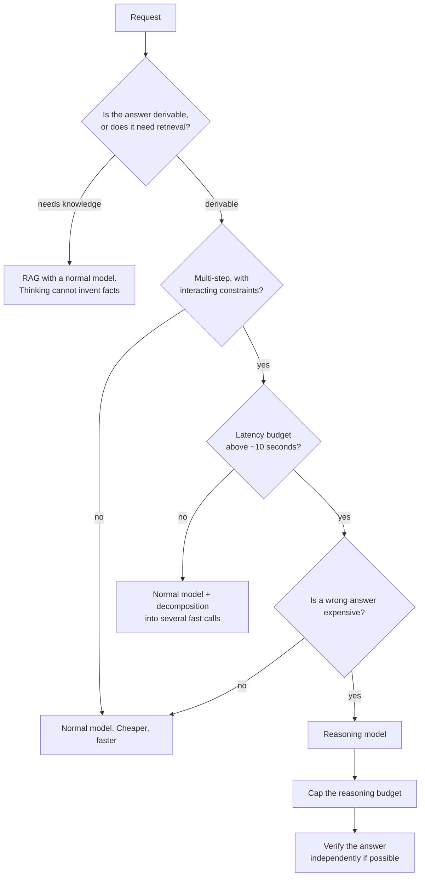
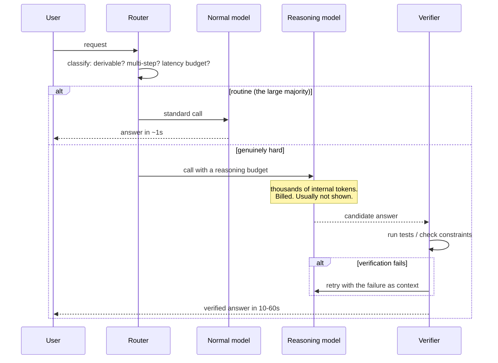

# Reasoning models & test-time compute

> **The one sentence:** instead of scaling the model, scale the *thinking* — let
> it generate a long internal chain before answering, and pay for that chain in
> tokens and seconds.

This is the axis that opened up after parameter scaling started returning less
per dollar. It is genuinely powerful on a narrow class of problems and
completely wasted on most production traffic, and telling the two apart is the
skill.

---

## 1 · Diagram

```
   TWO WAYS TO SPEND MORE COMPUTE

   TRAIN-TIME SCALING              TEST-TIME SCALING
   ------------------              -----------------
   bigger model, more data         same model, more thinking
   paid once, by the vendor        paid per request, by YOU
   fixed at inference              adjustable per query
   improves everything a bit       improves REASONING a lot,
                                   everything else not at all


   WHAT A REASONING MODEL DOES

   prompt ──► [ long internal reasoning chain ]  ──► short answer
                    ~1,000-50,000 tokens              ~200 tokens
                    you are BILLED for these
                    you usually cannot SEE them


   THE ECONOMICS, stated plainly

   normal model:     500 out    ≈  $0.008
   reasoning model: 8,000 out   ≈  $0.130     ~16x, and 10-60s slower

   For a task where it changes nothing, that is a 16x bill for a worse
   user experience.
```

---

## 2 · Design

**Intermediate — what actually changed.** These models are trained (largely with
reinforcement learning on verifiable problems) to produce long chains of
reasoning before answering, and to backtrack when a line of reasoning fails. The
key differences from prompting chain-of-thought on a normal model:

| | Prompted CoT | Reasoning model |
|---|---|---|
| **Trained to do it** | No — instructed | Yes, with RL on outcomes |
| **Backtracking** | Rare | Explicit and common |
| **Length** | Hundreds of tokens | Thousands to tens of thousands |
| **Visible** | Yes | Often summarised or hidden |
| **You pay for it** | Yes | Yes, and it is most of the bill |

**Where it helps, and it genuinely does:**

- Competition mathematics and formal logic
- Complex multi-step code (algorithms, debugging with a hypothesis)
- Constraint satisfaction — scheduling, planning with interacting constraints
- Anything with a **verifiable** answer where a wrong intermediate step
  compounds

**Where it does not help at all**, which is most production traffic:

- Retrieval and summarisation — the answer is in the context, not derived
- Classification and extraction
- Style transfer, rewriting, tone
- Conversational turns
- Anything latency-sensitive

**Advanced — the pattern to internalise.** Test-time compute converts *tokens
into accuracy*, but only on problems where accuracy is limited by reasoning
depth. If the bottleneck is knowledge (use RAG), format (use constrained output)
or speed (use a smaller model), extra thinking buys nothing and costs a lot.

**Prompting them is different, and counter-intuitive.** Chain-of-thought
instructions — "think step by step", elaborate scaffolding, worked examples —
are unnecessary and can *hurt*, because the model has its own trained reasoning
process and your scaffolding interferes with it. State the problem and the
constraints clearly, and stop.

---

## 3 · Flow — routing to one



**Node `C` is the most common misuse.** A reasoning model asked a question whose
answer is not in its context will reason very carefully to a confident wrong
answer. **Thinking is not knowing** — extra reasoning tokens cannot retrieve a
fact the model does not have.

**Node `K` matters where the answer is checkable.** If you can verify — run the
code, check the arithmetic, validate against constraints — do so and retry on
failure. Verification is far cheaper than reasoning and turns a probabilistic
answer into a checked one.

---

## 4 · UML — where the cost goes



---

## 5 · Example

```python
def should_use_reasoning(task: str, latency_budget_s: float, cost_of_error: str) -> bool:
    """Route deliberately, because the default costs ~16x for no gain.

    The three questions in order: is the answer derived rather than retrieved,
    is there room in the latency budget, and does being wrong actually matter.
    A no to any of them means a normal model.
    """
    derivable = task in {"math", "algorithm", "planning", "constraint_solving", "debug"}
    if not derivable:
        return False                      # retrieval or formatting, not reasoning
    if latency_budget_s < 10:
        return False                      # it cannot finish in time
    return cost_of_error in {"high", "irreversible"}


def solve_with_verification(model, problem, tests, max_attempts=3):
    """Use verification rather than more reasoning where the answer is checkable.

    Running the tests costs milliseconds; another reasoning pass costs seconds
    and dollars. Where a cheap check exists, it beats extra thinking -- and it
    turns a probabilistic answer into one you have actually confirmed.
    """
    context = problem
    for attempt in range(max_attempts):
        answer = model.solve(context)
        passed, failures = run(tests, answer)
        if passed:
            return {"answer": answer, "attempts": attempt + 1, "verified": True}
        # Feed the SPECIFIC failure back; a blind retry usually reproduces it.
        context = f"{problem}\n\nPrevious attempt failed:\n{failures}"
    return {"answer": answer, "attempts": max_attempts, "verified": False}
```

**The cost comparison, made concrete:**

```python
def compare(in_tok=1_000, out_normal=500, out_reasoning=8_000,
            in_price=3.0, out_price=15.0):
    normal = (in_tok * in_price + out_normal * out_price) / 1e6
    reasoning = (in_tok * in_price + out_reasoning * out_price) / 1e6
    return normal, reasoning, reasoning / normal

n, r, ratio = compare()
print(f"normal ${n:.4f} | reasoning ${r:.4f} | {ratio:.0f}x")
# normal $0.0105 | reasoning $0.1230 | 12x
```

At a million requests a month that is roughly **$10,500 against $123,000**. The
routing decision is not a micro-optimisation.

---

## 6 · Depth — the senior layer

**Hidden reasoning tokens are an operational problem.** You are billed for
tokens you often cannot inspect. Consequences:

1. **Cost is less predictable** — the same prompt can produce very different
   reasoning lengths.
2. **Debugging is harder** — a wrong answer with no visible reasoning gives you
   nothing to inspect.
3. **Budget on the p95, not the mean**, because reasoning length has a long tail.

Most providers expose a reasoning-effort or budget control. **Use it.** It is
the difference between a bounded cost and an open one.

| Failure mode | Symptom | Fix |
|---|---|---|
| **Reasoning model as the default** | Bill up 10×, latency up 30× | Route; most traffic does not need it |
| **Used for retrieval tasks** | Careful reasoning to a wrong answer | RAG — thinking is not knowing |
| **Prompted with elaborate CoT** | Worse than a plain prompt | State the problem and stop; it has its own process |
| **No reasoning budget cap** | Unpredictable cost spikes | Set the effort parameter |
| **No verification where possible** | Paying for reasoning you could have checked | Run the tests; retry with failures as context |
| **Budgeted on the mean** | Regular overruns | Long tail — budget the p95 |

**Test-time compute has a diminishing-returns curve**, and where it flattens is
task-dependent. More thinking helps until the model's approach is wrong, at which
point additional tokens elaborate the wrong approach more thoroughly. **Sampling
several shorter attempts and taking the majority often beats one very long
chain** — and it parallelises, so it is faster in wall-clock terms too.

**The distillation angle is worth knowing.** Reasoning traces from a strong model
are excellent training data: fine-tuning a small model on them transfers much of
the capability at a fraction of inference cost. This is one of the clearest
current cases where distillation genuinely wins — and the licence caution from
the distillation page applies with full force, because model providers are
explicit about this one.

---

## 7 · From each seat

| Seat | What reasoning models look like from here |
|---|---|
| **User** | A long pause, then a better answer on hard problems. On easy ones, a long pause for nothing — which reads as the product being slow. |
| **Coder** | Route rather than defaulting. Do not add chain-of-thought scaffolding. Set the reasoning budget. Verify where the answer is checkable — it is cheaper than more thinking. |
| **Tester** | Test whether reasoning actually helps *your* task before adopting it. Compare against a normal model on the same eval set; the gain is often zero and the cost never is. |
| **System designer** | Latency of tens of seconds changes the interaction model: async with a job id, progress indication, and cancellation. A synchronous request that takes 60 seconds is a broken experience. |
| **Architect** | A second model tier with different latency and cost characteristics. The router is now a component with its own accuracy to measure — a bad router wastes the saving it exists to create. |
| **CEO** | Roughly ten times the cost per request. Justified where being wrong is expensive; wasteful everywhere else. Ask what fraction of traffic is routed to it and on what basis. |
| **Market** | The current frontier of differentiation, and it is moving fast. Reasoning capability is being distilled into smaller models steadily, so today's premium is unlikely to hold. |

---

## 8 · Interview questions

| Question | What they are testing | Answer sketch |
|---|---|---|
| ⭐ "What is test-time compute?" | Currency | Spending more compute at inference rather than training — long internal reasoning chains before answering. It converts tokens into accuracy, but only where accuracy is limited by reasoning depth. |
| ⭐ "When would you *not* use a reasoning model?" | Judgement | Retrieval, summarisation, classification, extraction, style, and anything latency-sensitive — most production traffic. Extra thinking cannot supply a fact the model does not have. |
| "How do you prompt one?" | Practical detail | Plainly. State the problem and constraints and stop. Chain-of-thought scaffolding is unnecessary and can interfere with the model's own trained process. |
| "The bill went up 10×." | Diagnosis | Almost certainly routing everything to the reasoning tier. Classify first: derivable, multi-step, latency headroom, expensive to get wrong. Most traffic fails one of those. |
| "More thinking is always better?" | Nuance | No — returns diminish, and past a point extra tokens elaborate a wrong approach. Sampling several shorter attempts and taking the majority often beats one long chain, and parallelises. |
| "How do you make it cheaper without losing quality?" | Levers | Route, cap the reasoning budget, verify instead of re-reasoning where the answer is checkable, and consider distilling reasoning traces into a small model — with the licence checked first. |

---

## Stop condition

You are done when you can:

1. explain test-time versus train-time scaling in one sentence each,
2. name three task types where it helps and three where it does not,
3. say why "thinking is not knowing" and what that rules out,
4. describe the diminishing-returns curve and the sampling alternative, and
5. give the routing criteria you would actually implement.

---

## Sources worth reading

| Topic | Source |
|---|---|
| Test-time scaling | The o1/o3 system cards and the published scaling-curve discussions |
| Self-consistency | *Self-Consistency Improves Chain of Thought Reasoning* (Wang et al., 2022) — the sampling alternative |
| Verification | *Let's Verify Step by Step* (Lightman et al., 2023) — process versus outcome supervision |
| Practical | Provider documentation on reasoning-effort parameters and how reasoning tokens are billed |

Related: [Reasoning inference optimization](reasoning-inference-optimization.html)
for what to do once you have decided the reasoning is worth doing and the bill
has arrived — nineteen ways to make the same thinking cheaper ·
[Prompt engineering](prompt-engineering.html) for why elaborate CoT scaffolding
hurts a trained reasoner ·
[Bias & explainability](bias-and-explainability.html) for why a reasoning trace
is not an explanation.
