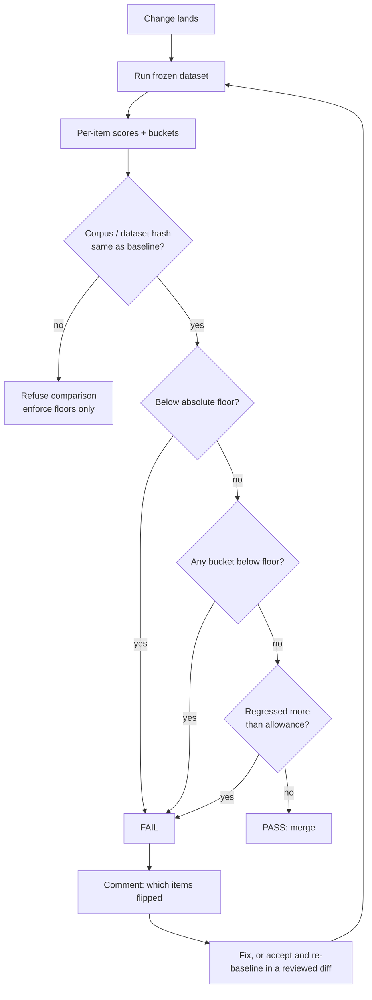
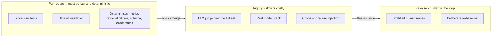

# Regression gates in CI

> **The one sentence:** an eval nobody gates on is a dashboard, and dashboards
> get ignored within about three weeks.

The gate is what turns quality from an opinion into a reviewed diff. It is also
the part most likely to be deleted by an irritated colleague at 6pm on a Friday,
which is a design constraint, not a people problem.

---

## 1 · Diagram

```
   WHAT A GATE ACTUALLY COMPARES

                    committed baseline           this run
                    ------------------           --------
   headline           primary 0.92               primary 0.89
   per bucket         paraphrase 0.75            paraphrase 0.38   <-- the real story
   per item           {rag-001: 1, ...}          {rag-001: 0, ...}
   provenance         corpus b962a80f            corpus b962a80f
                      dataset 1c640984           dataset 1c640984

          THREE INDEPENDENT CHECKS, because each catches what the others cannot

   floor          primary >= 0.70   ......  stops slow decay, one acceptable step at a time
   regression     delta  >= -0.06   ......  stops one change giving back too much at once
   bucket floor   every bucket >= 0.50 ...  stops a small bucket dying inside the noise band

          AND ONE REFUSAL

   if corpus or dataset hash changed -> DO NOT COMPARE.
   Different measurement. Say so; do not report a "regression".
```

---

```sim
gaterun
```

---

## 2 · Design

**Basic.** A gate needs a **committed baseline**, a **policy**, and an **exit
code**. Without the exit code it is a report; without the committed baseline the
number has nothing to be compared against.

**Intermediate — why three checks and not one.**

| Check | Catches | Misses on its own |
|---|---|---|
| **Absolute floor** | Slow decay over many PRs, each individually acceptable | A drop from excellent to merely-above-floor |
| **Max regression** | A single change giving back a lot | Death by a thousand cuts, each under the limit |
| **Per-bucket floor** | A small category collapsing | Nothing much — this is the highest-value check and the most often missing |

The bucket check matters more than people expect. On a 50-item set, a six-item
bucket going from 1.00 to 0.00 moves the headline by 12 points — which sits
comfortably inside the ±11-point confidence interval at that sample size. The
aggregate cannot see it. The bucket check sees nothing else.

**Advanced — the threshold is set by your noise floor, not by ambition.** At
n=50 and p≈0.9 the 95% interval is roughly ±8 points. A gate set at "no
regression greater than 2 points" will fail on noise, roughly monthly, for no
reason. It will then be disabled, and you will have no gate at all.

**Set `max_regression` above your noise floor and get your precision from paired
comparison instead.** Same items, both runs, count the flips. Shared variance
cancels, so a paired comparison detects a real change with far fewer items than
comparing two aggregates ever could.

```
   n=50, p=0.9   ->  95% CI is about +/- 8 points
   so:  a 3-point "improvement" is not evidence
        a gate at 2 points is a noise generator
        a gate at 6 points is a real guard that survives contact with a team
```

---

The gate most teams write first is a 1-point drop on a 200-item set. Every statistic behind that decision is below, computed live — and the interval it produces is the reason the gate gets switched off three months later.

```lab
gate
```

## 3 · Flow

1. A change lands — new prompt, new chunk size, new embedding model, or the
   vendor bumped the model underneath you.
2. CI runs the frozen dataset through the runner.
3. Scorers produce **per-item** results, aggregated per bucket and overall.
4. The gate loads the committed baseline and **checks provenance first** — if
   the corpus or dataset hash moved, it refuses to compare rather than
   reporting a meaningless delta.
5. Three checks applied. Any failure fails the build.
6. The output names **which items flipped**, because that is the only part a
   reviewer actually reads.
7. On a deliberate improvement, someone runs the baseline command and commits
   the new scores — a reviewed diff, not an automatic overwrite.



Step 7 is deliberately manual. **Accepting a quality change is a decision
somebody signs off on**, not something that happens silently on a green run.

---

## 4 · UML — the tiers

Gating everything on every push is how you end up gating nothing.



**The PR lane blocks; the nightly lane files an issue.** A slow, timing-sensitive
or paid check that can block a merge will be deleted. The same check on a
nightly schedule survives for years.

---

## 5 · Example

The gate as pure policy — no I/O, no `sys.exit`, so it can be unit-tested like
any other function. This is the shape used in the companion Inferno project.

```python
from dataclasses import dataclass, field


@dataclass(frozen=True)
class Thresholds:
    primary_floor: float = 0.70
    max_regression: float = 0.06   # above the noise floor on purpose
    bucket_floor: float = 0.50


@dataclass
class GateResult:
    passed: bool
    reasons: list[str] = field(default_factory=list)
    notes: list[str] = field(default_factory=list)


def check(report, baseline, t=Thresholds()) -> GateResult:
    out = GateResult(passed=True)
    primary = report.metrics["primary"]
    low, high = report.interval["primary"]
    out.notes.append(f"primary {primary:.4f} (95% CI {low:.2f}-{high:.2f}, n={report.n})")

    if primary < t.primary_floor:
        out.passed = False
        out.reasons.append(f"primary {primary:.4f} below floor {t.primary_floor:.2f}")

    # Aggregates are blind. A small bucket can collapse entirely while the
    # headline moves less than the confidence interval.
    for name, bucket in report.by_bucket.items():
        if bucket["primary"] < t.bucket_floor:
            out.passed = False
            out.reasons.append(f"bucket {name!r} {bucket['primary']:.4f} below floor")

    if baseline is None:
        out.notes.append("no baseline: floors enforced, regression check skipped")
        return out

    # A changed corpus or dataset means the two runs measured different things.
    # Reporting that as a regression would be a lie with a number attached.
    for label, key in (("corpus", "corpus_hash"), ("dataset", "dataset_hash")):
        if baseline.get(key) and baseline[key] != getattr(report, key):
            out.notes.append(f"{label} changed: comparison skipped, re-baseline deliberately")
            return out

    delta = primary - baseline["metrics"]["primary"]
    fixed, broken = mcnemar_counts(baseline.get("per_item", {}), report.per_item)
    out.notes.append(f"delta {delta:+.4f} ({fixed} fixed, {broken} broken)")

    if delta < -t.max_regression:
        out.passed = False
        out.reasons.append(f"regressed {delta:+.4f}, beyond -{t.max_regression:.2f}")

    return out


def mcnemar_counts(baseline: dict, candidate: dict) -> tuple[int, int]:
    """Discordant pairs over the SAME items.

    Comparing two aggregate numbers from two runs hides both directions of
    change. Comparing per-item outcomes cancels the variance the runs share,
    which is why this detects a real difference on far fewer items.
    """
    shared = baseline.keys() & candidate.keys()
    return (
        sum(1 for i in shared if candidate[i] > baseline[i]),
        sum(1 for i in shared if candidate[i] < baseline[i]),
    )
```

**Worked example:** the [Inferno eval harness](https://github.com/SAGARCHRY0777/inferno)
implements exactly this, gating a 50-item golden set with a committed baseline,
a Wilson interval on every rate, and per-bucket floors. Its `docs/EVALUATION.md`
records the numbers and the three ways they can mislead.

---

## 6 · Depth — the senior layer

**A gate that cannot fail is decoration.** Verify it the way you verify a
failure test: deliberately break the system, confirm the gate goes red, and
write down what the failure looked like. A gate nobody has watched fail is an
assumption.

**Goodhart arrives on schedule.** Once a number gates merges, people optimise
the number. Keep a locked holdout the team does not tune against, and expect the
gap between dev and holdout to be the honest estimate of how much you have
overfitted to your own test set.

| Failure mode | Symptom | Fix |
|---|---|---|
| **Gate too tight** | Fails on noise; gets disabled | Set the allowance above the confidence interval |
| **Gate too loose** | Never fires; quality drifts down | Add the per-bucket floor; it fires when aggregates cannot |
| **Flaky suite** | ±5 points with no code change | temperature 0, pinned model *version*, frozen corpus, cached embeddings, deterministic tie-breaks |
| **Silent staleness** | Trend drifts, nobody knows why | Hash the corpus and dataset into every report; refuse cross-hash comparisons |
| **Judge on the PR lane** | Cost spikes; team switches it off | Deterministic checks gate; judge runs nightly |
| **Baseline auto-updated** | Regressions silently accepted | Re-baselining is a manual, reviewed commit |

**Auto-updating the baseline is the subtlest of these and the most damaging.**
If a green run rewrites the baseline, quality can walk downhill indefinitely,
one within-tolerance step at a time, and every individual run looks fine. The
baseline must be a file a human changed in a pull request.

**At scale you stop running everything.** Past a few thousand items, run a
stratified sample per PR and the full set nightly. Store per-item results as
rows over time, never as an aggregate — six months later the only question that
matters is *when did this item start failing*, and an average cannot answer it.

---

## 7 · From each seat

| Seat | What the gate looks like from here |
|---|---|
| **User** | Invisible, and that is the product: the regression that would have reached them was caught 90 seconds after the commit instead of in their inbox. |
| **Coder** | A red build with a list of item ids. The useful habit is reading the flipped items before touching the threshold — the gate is usually right and the change usually is the problem. |
| **Tester** | You own the policy, not just the tests. Choosing the floor, the allowance and the buckets *is* the testing strategy for a non-deterministic system. |
| **System designer** | Two lanes with different guarantees: fast deterministic checks that block, slow expensive ones that report. Decide what happens when the eval service is down — skip and mark incomplete, never pass. |
| **Architect** | The committed baseline is an organisational artefact, not a build artefact. It is the record of what quality the team agreed to, and it belongs in review like any other contract. |
| **CEO** | This is the mechanism that makes quality a reviewed decision rather than a hope. Two questions worth asking: has the gate ever actually blocked something, and who is allowed to lower it? |
| **Market** | Every eval vendor sells the runner and the dashboard. Almost none sell the gate, because gating is a policy decision that has to live in your CI. The runner is commodity; the policy is yours. |

---

## 8 · Interview questions

| Question | What they are testing | Answer sketch |
|---|---|---|
| "How do you stop LLM quality regressing?" | Whether you have shipped this | Frozen golden set, committed baseline, three checks — absolute floor, max regression, per-bucket floor — wired to the exit code, with the PR comment naming the flipped items. |
| "Why gate per bucket as well as overall?" | Depth | Aggregates are blind. A six-item bucket collapsing moves a 50-item headline by 12 points, which is inside the noise band. The bucket check is the only one that sees it. |
| "You set the gate at 2 points and it keeps failing." | Statistical literacy | The allowance is under the noise floor. At n=50 the interval is about ±8 points. Raise the allowance above the noise and get precision from paired per-item comparison instead. |
| "Should a green run update the baseline automatically?" | Judgement | No. Quality would walk downhill one within-tolerance step at a time with every run looking fine. Re-baselining is a manual commit somebody reviews. |
| "Someone edited the corpus. What should the gate do?" | Rigour | Refuse to compare. The hashes differ, so the runs measured different things; report that and enforce floors only. Calling it a regression would be a confident lie. |
| "How do you know your gate works?" | Seniority | Break the system on purpose and watch it go red. Same discipline as a chaos test — a gate nobody has seen fail is an assumption, not a control. |

---

## Stop condition

You are done when you can:

1. name the three checks and what each catches that the others cannot,
2. explain why the allowance must sit above the confidence interval,
3. say why re-baselining is manual,
4. describe what the gate does when the corpus hash changes, and
5. state which lane a judge belongs in, and why.
