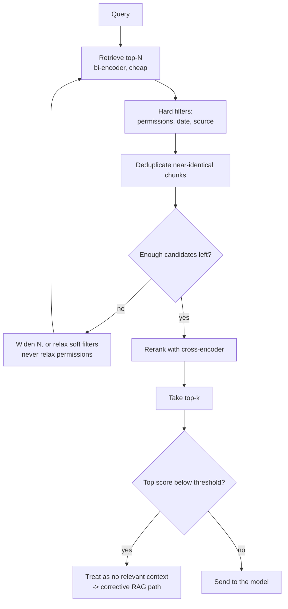
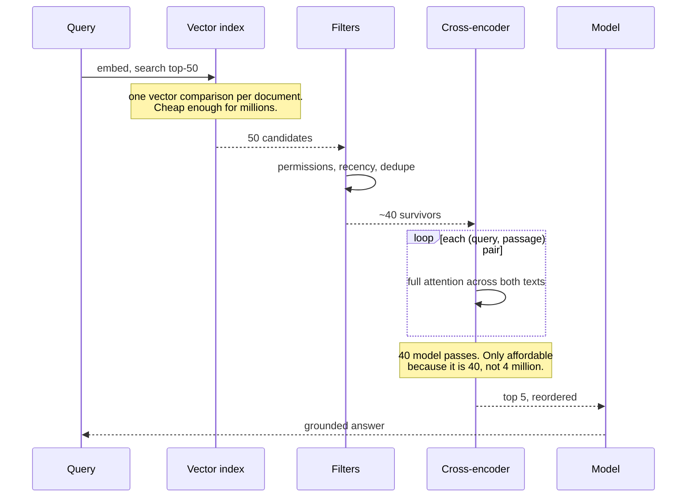

# Reranking & filtering

> **The one sentence:** retrieval is optimised to not miss things, reranking is
> optimised to put the right one first, and asking one component to do both is
> why so many pipelines are mediocre at each.

If you add one thing to a working RAG pipeline, add a reranker. It is the change
with the most consistent measured benefit and the least architectural
disruption.

---

## 1 · Diagram

```
   TWO STAGES, TWO OBJECTIVES

   STAGE 1 - RETRIEVE            optimise RECALL
   ------------------            get the right passage into the pool AT ALL
   bi-encoder over the corpus    cheap: one vector comparison per document
   top 50                        precision does not matter here

                │
                ▼

   STAGE 2 - RERANK              optimise PRECISION
   ---------------               put the right passage FIRST
   cross-encoder over 50 pairs   expensive: a model pass per (query, passage)
   top 5                         only affordable because 50 << corpus


   WHY A CROSS-ENCODER IS BETTER, and why you cannot use it alone

   bi-encoder     embed(query) · embed(passage)     -> vectors never meet
                  precomputable, one comparison      -> scales to millions
                  cannot model INTERACTION

   cross-encoder  model(query + passage together)   -> full attention across both
                  nothing precomputable              -> one pass PER PAIR
                  100x more accurate on hard cases   -> 100x too slow for a corpus
```

---

## 2 · Design

**Intermediate — the options, in ascending cost.**

| Reranker | Latency for 50 docs | Notes |
|---|---|---|
| **Cross-encoder** (ms-marco MiniLM) | ~50–100ms on GPU | The workhorse. Small, fast, strong |
| **ColBERT / late interaction** | ~20–40ms | Per-token MaxSim; precomputable doc vectors |
| **LLM reranker** | 500ms–2s | Most accurate, hardest to justify on latency |
| **Rule/metadata reordering** | ~0ms | Recency, authority, permissions. Free and underused |

**Depth-versus-latency is the parameter that matters.** Reranking cost is linear
in shortlist size, so the retrieve-50-rerank-5 shape is a direct trade:

```
   retrieve 20, rerank 5   fast, but if the answer was at rank 35 it is gone
   retrieve 50, rerank 5   the usual sweet spot
   retrieve 200, rerank 5  better ceiling, 4x the rerank cost
```

Choose it by measuring **retrieval recall at each depth** on your eval set. If
recall@50 and recall@200 are both 0.94, reranking 200 buys nothing but latency.

**Advanced — filtering is reranking's neglected sibling and does work no model
can.** Some reordering is not a relevance judgement at all:

| Filter | Why a model cannot do it |
|---|---|
| **Permissions** | A correctness and security requirement, not a preference |
| **Recency** | "Current policy" needs the newest, not the most semantically similar |
| **Source authority** | Official documentation should outrank a forum post |
| **Deduplication** | Three copies of the same passage waste three of five slots |

**Deduplication before reranking is a genuinely cheap win.** Near-duplicate
chunks — from overlap, or from the same content in several documents — routinely
occupy multiple top-k slots and crowd out the passage that would have completed
the answer. Collapsing near-duplicates by content hash or high mutual similarity
costs nothing and frequently improves end-to-end quality more than a reranker
upgrade.

---

## 3 · Flow



**Filters before the reranker, always.** Reranking a document the user may not
see is wasted compute at best and, if a bug lets it through, a leak. Hard filters
cost nothing and shrink the expensive stage.

**`I` connects this page to corrective RAG.** A reranker gives you a calibrated-ish
relevance score, which is the natural signal for deciding there is nothing worth
answering from.

---

## 4 · UML — the two stages



---

## 5 · Example

```python
def retrieve_and_rerank(index, reranker, query, *, user, depth=50, k=5,
                        min_score=0.3):
    """Two-stage retrieval with filtering between the stages.

    Order matters: filter before reranking, because reranking is the expensive
    stage and there is no reason to spend it on documents that will be dropped
    -- or worse, that the user is not permitted to see.
    """
    candidates = index.search(query, depth)

    # Hard filters. Permissions are a correctness requirement and are applied
    # first; a relevance model must never be able to override them.
    candidates = [c for c in candidates if user.may_read(c.source)]
    candidates = deduplicate(candidates)

    if not candidates:
        return []

    scores = reranker.predict([(query, c.text) for c in candidates])
    ranked = sorted(zip(candidates, scores), key=lambda p: p[1], reverse=True)

    # A relevance floor turns the reranker into a decision, not just an order.
    # Without it the pipeline always returns its five best guesses, however bad.
    return [c for c, s in ranked[:k] if s >= min_score]


def deduplicate(candidates, threshold=0.95):
    """Collapse near-identical chunks before they consume top-k slots.

    Overlap during chunking and duplicated content across documents both
    produce near-copies. Three copies of one passage occupying three of five
    slots is a quality loss that no reranker can repair, because from its point
    of view all three genuinely are relevant.
    """
    kept = []
    for candidate in candidates:
        if all(similarity(candidate.text, k.text) < threshold for k in kept):
            kept.append(candidate)
    return kept
```

**Choosing the shortlist depth by measurement, not by habit:**

```python
def recall_by_depth(index, eval_set, depths=(10, 20, 50, 100, 200)) -> dict:
    """Where does retrieval recall stop improving?

    Reranking cost is linear in depth, so paying for 200 when recall plateaus
    at 50 is pure latency. This is a ten-minute measurement that sets a
    parameter people otherwise copy from a tutorial.
    """
    out = {}
    for depth in depths:
        hits = sum(
            any(c.id in item.relevant_ids for c in index.search(item.query, depth))
            for item in eval_set
        )
        out[depth] = round(hits / len(eval_set), 3)
    return out
```

---

## 6 · Depth — the senior layer

**Reranker scores are not probabilities**, even when they look like them. A
sigmoid output of 0.7 does not mean 70% relevant, and the distribution shifts
with query length and domain. If you use a threshold — and the corrective-RAG
path needs one — calibrate it on your data, and re-calibrate whenever the
reranker changes. A threshold copied from a model card is a guess wearing a
number.

| Failure mode | Symptom | Fix |
|---|---|---|
| **Reranking too few candidates** | Reranker cannot help; answer never in the pool | Measure recall by depth; widen |
| **Reranking too many** | Latency for no quality gain | Same measurement, other direction |
| **No deduplication** | Top-k is three copies of one passage | Collapse near-duplicates first |
| **Filtering after reranking** | Wasted compute; permission risk | Filter first |
| **Uncalibrated threshold** | Refuses good answers, or accepts junk | Calibrate per reranker on your data |
| **LLM reranker on the hot path** | Seconds of latency | Cross-encoder; reserve LLM reranking for offline or high-value queries |

**Where reranking does not help.** If your retrieval recall at the shortlist
depth is already near 1.0 *and* the right passage is already at rank 1, a
reranker adds latency and nothing else. That is rare but real for small,
well-structured corpora with distinctive vocabulary. Measure first — this is the
counter-case to "always add a reranker", and knowing it exists is the difference
between a rule and a judgement.

**ColBERT sits between the two stages and is worth understanding as a category.**
It keeps a vector per token and scores by MaxSim, so document token vectors are
precomputable — giving much of a cross-encoder's precision at closer to a
bi-encoder's cost. The trade is storage: a vector per token is far larger than
a vector per chunk. It is covered in its own right in the ColBERT material of the
retrieval module.

**Reranking is where hybrid retrieval resolves.** BM25 and dense retrieval
produce two ranked lists whose scores are not comparable. Reciprocal Rank Fusion
merges them by *rank*, and a reranker then produces a single, consistent ordering
over the fused pool. That is the standard production shape: hybrid retrieve,
fuse, dedupe, rerank, threshold.

---

## 7 · From each seat

| Seat | What reranking looks like from here |
|---|---|
| **User** | The right answer is first rather than fourth — which matters because most people read the first thing and stop. |
| **Coder** | Filter before reranking. Deduplicate. Batch the pairs into one call. Cache reranker scores on `(query, chunk_id)` — repeated queries are common and this is free latency. |
| **Tester** | Measure recall by depth to justify the shortlist size, and measure precision@k before and after reranking separately. Reranking cannot fix what retrieval never found, and conflating the two hides which stage is failing. |
| **System designer** | A second model on the critical path: bound the shortlist, batch, set a timeout, and decide the fallback — degrade to retrieval order rather than failing the request. |
| **Architect** | Another model dependency with its own versioning and its own eval baseline. Worth it, but it is a component, not a setting. |
| **CEO** | The highest reliable quality gain per unit of effort in retrieval — a small model, tens of milliseconds, no re-indexing and no retraining. Cheap by any standard. |
| **Market** | Commoditised: strong open cross-encoders are free, and hosted rerank APIs exist for those who prefer not to serve one. No moat; just adopt one. |

---

## 8 · Interview questions

| Question | What they are testing | Answer sketch |
|---|---|---|
| "Why two stages instead of one?" | The core idea | Different objectives. Retrieval optimises recall over millions of documents cheaply; reranking optimises precision over tens of candidates expensively. A cross-encoder cannot scan a corpus, and a bi-encoder cannot model query–passage interaction. |
| "How deep should the shortlist be?" | Whether you measure | Measure retrieval recall at several depths on the eval set and stop where it plateaus. Rerank cost is linear in depth, so paying for 200 when recall plateaus at 50 is pure latency. |
| "When does a reranker not help?" | Judgement | When recall at the shortlist depth is near 1.0 and the right passage is already first. Small, distinctive corpora sometimes are. Measure rather than assume in either direction. |
| "Where does filtering go?" | Correctness | Before reranking. Permissions especially — never spend the expensive stage on documents that will be dropped, and never let a relevance model influence an access decision. |
| "Your top-3 are near-duplicates." | Practical detail | Deduplicate before reranking. Chunk overlap and repeated content produce near-copies, and the reranker cannot fix it because all the copies genuinely are relevant. |
| "Is a 0.7 reranker score good?" | Over-trusting numbers | Not inherently — it is not a probability and the distribution shifts with domain and query length. Use it to rank; calibrate any threshold on your own data and re-calibrate when the model changes. |

---

## Stop condition

You are done when you can:

1. state the two stages' different objectives,
2. explain why a cross-encoder is more accurate and unusable alone,
3. justify a shortlist depth from measurement,
4. say why filtering and deduplication come first, and
5. name the case where a reranker is not worth adding.

---

## Sources worth reading

| Topic | Source |
|---|---|
| Cross-encoders | Sentence-Transformers cross-encoder documentation and the ms-marco model cards |
| Late interaction | *ColBERT* (Khattab & Zaharia, 2020) and *ColBERTv2* |
| Rank fusion | Cormack et al. on Reciprocal Rank Fusion |
| Benchmarks | BEIR — how retrievers and rerankers generalise across domains, which is the honest comparison |
