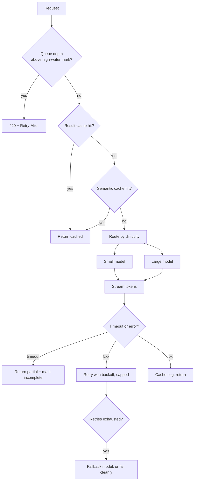
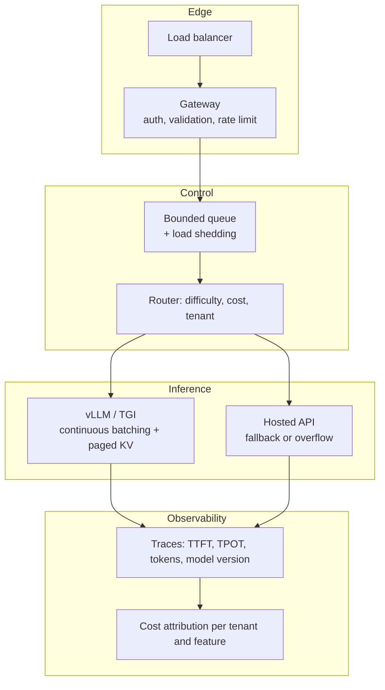

# Serving & operations

> **The one sentence:** an LLM endpoint is a slow, expensive, occasionally
> unavailable dependency with unbounded output, and everything in production
> follows from taking that seriously.

Most LLM outages are not model failures. They are missing timeouts, unbounded
retries, no backpressure, and a queue that grew until memory ran out — ordinary
distributed-systems failures wearing a new hat.

---

## 1 · Diagram

```
   THE LATENCY BUDGET, and where it actually goes

   user presses enter
     |
     |-- 5ms     auth, validation
     |-- 40ms    retrieval (embed + ANN + rerank)
     |-- 200ms   PREFILL: read the whole prompt        <- grows with context length
     |
     +-- TIME TO FIRST TOKEN ~ 250ms   <-- the number users judge you on
     |
     |-- 15ms/token DECODE                             <- grows with output length
     |               400 tokens = 6s
     |
     +-- TOTAL ~ 6.3s     but it FELT fast, because streaming started at 250ms


   THE TWO NUMBERS, and why they are not the same problem

   TTFT   set by prompt length + queueing     -> fix with caching, shorter context
   TPOT   set by memory bandwidth + batch     -> fix with quantization, better batching

   Optimising total latency without separating these two is how teams
   spend a quarter making the wrong thing faster.
```

---

```sim
servequeue
```

---

## 2 · Design

**Intermediate — continuous batching is the single biggest serving win**, and
worth being able to explain precisely.

Naive (static) batching groups N requests, runs them together, and waits for
*all* of them to finish. One request generating 500 tokens holds the whole batch
hostage while others that finished at 20 tokens sit idle.

**Continuous batching** — also called iteration-level scheduling — schedules at
each token step instead. A finished sequence leaves the batch immediately and a
waiting request takes its slot. Throughput improvements of several times over
static batching are routine, which is why vLLM and TensorRT-LLM are built around
it.

**PagedAttention** is the memory counterpart. The KV cache is the dominant
memory consumer at long context, and reserving a contiguous block per sequence
wastes most of it. Paging it like virtual memory — fixed blocks, allocated on
demand — cuts waste dramatically and lets you run far larger batches in the same
VRAM.

| Technique | Improves | Where |
|---|---|---|
| **Continuous batching** | Throughput | vLLM, TGI, TensorRT-LLM |
| **PagedAttention** | Memory efficiency → batch size | vLLM |
| **Prefix caching** | TTFT and cost on shared prefixes | Most serving stacks, and hosted APIs |
| **Speculative decoding** | TPOT, without changing output | Needs a draft model |
| **Quantization** | Memory and TPOT | See the optimization module |

**Advanced — the queue is the actual control surface.** When demand exceeds
capacity you have exactly three options, and choosing not to decide means
choosing the worst one:

1. **Queue** — latency grows, unboundedly if you let it
2. **Shed** — return 429 with `Retry-After`, keeping accepted work fast
3. **Degrade** — smaller model, shorter context, cached answer

Unbounded queueing is the default and the worst outcome: everyone waits, nobody
is served, and the timeouts cascade upstream. **Bounded queue plus load shedding
with hysteresis** — a high-water mark to start shedding, a lower one to resume —
is the pattern that survives contact with real traffic. The hysteresis gap stops
the system flapping around a single threshold.

---

The high-water mark in that first decision node is a number, and queueing theory says where to put it. Move the sliders and find the knee yourself.

```lab
queue
```

## 3 · Flow



**Two things people leave out.**

`L` — on timeout, a partial streamed answer is usually better than an error,
because the user has already read most of it. Mark it incomplete rather than
discarding it.

`M` — retries must be capped and jittered. Uncapped retries against a struggling
provider are how you convert a slow dependency into an outage of your own
making.

---

## 4 · UML — the serving stack



**The gateway never runs the model.** Keeping it thin and async means it stays
responsive enough to shed load correctly while inference is saturated — a
gateway that blocks on inference cannot tell anyone it is overloaded.

---

## 5 · Example

```python
import asyncio, random


class BoundedLLMPool:
    """Concurrency limit, bounded queue, and load shedding with hysteresis.

    The concurrency cap is the important part: without it, a traffic spike
    opens unbounded connections, every request slows, upstream timeouts fire,
    clients retry, and the retries finish the job. Bounding admission is what
    turns overload into degraded service rather than collapse.
    """

    def __init__(self, concurrency=8, high_water=64, low_water=32):
        self._sem = asyncio.Semaphore(concurrency)
        self._high, self._low = high_water, low_water
        self._waiting = 0
        self._shedding = False

    def _update_shedding(self) -> None:
        # Two thresholds, not one: a single threshold makes the system flap
        # between shedding and accepting on every request near the boundary.
        if self._waiting >= self._high:
            self._shedding = True
        elif self._waiting <= self._low:
            self._shedding = False

    async def submit(self, coro_factory, timeout=30.0):
        self._update_shedding()
        if self._shedding:
            raise Overloaded(retry_after=self._suggested_backoff())

        self._waiting += 1
        try:
            async with self._sem:
                self._waiting -= 1
                self._update_shedding()
                return await asyncio.wait_for(coro_factory(), timeout=timeout)
        except asyncio.TimeoutError:
            # A timeout is a real outcome the caller can act on, not a crash.
            raise Timeout("model did not respond within budget")
        finally:
            self._update_shedding()

    def _suggested_backoff(self) -> int:
        # Jittered, so shed clients do not return in a synchronised wave and
        # reproduce the overload that shed them.
        return random.randint(2, 8)
```

```python
def route(query: str, budget_ms: int) -> str:
    """Send the easy majority to the cheap model.

    Most production traffic is easy. Routing on a cheap signal captures most of
    the cost saving before any per-request optimisation, and it is the first
    thing to try -- ahead of quantization or serving changes.
    """
    tokens = len(query.split())
    if budget_ms < 1000:
        return "small"                      # latency budget rules everything
    if tokens < 20 and "?" in query:
        return "small"                      # short factual lookups
    if any(w in query.lower() for w in ("compare", "analyse", "why", "design")):
        return "large"                      # genuine reasoning
    return "small"
```

---

## 6 · Depth — the senior layer

**A model too large for one GPU is a topology problem before it is a serving
problem.** Which axis you split on — tensor, pipeline, expert or sequence —
decides how much traffic crosses which link, and the wrong choice for your
interconnect cannot be fixed anywhere above it. See
[Parallelism & distributed inference](parallelism.html); the short version is
tensor parallel inside a node, pipeline parallel between them, and never the
other way round.

**Cold start is four phases, and the weights are rarely the slowest one.**
The instinct is that loading a big model is the cost; measured, the profile is
usually: container image pull (minutes, for a multi-gigabyte image), weight
transfer into VRAM (tens of seconds — a 70B at FP16 over NVMe at 3–4 GB/s),
**CUDA context init and CUDA-graph capture (10–30 seconds)**, and optionally a
KV warmup. The third one surprises people, and it is the one that responds best
to a fix: graph capture and `torch.compile` output can be persisted to disk and
reused, so later starts on the same model and GPU skip the capture entirely.

That is also why warm start is worth more than it sounds. The gain is not faster
weight loading — it is **not rebuilding the infrastructure**: contexts, captured
graphs, compiled kernels, allocator state. vLLM's sleep mode keeps that standing
and reports waking a sleeping model as roughly 18–20× faster than starting a
fresh instance, which turns model switching from a deployment event into a
request-time one.

The planning consequence: **scale-to-zero is a pricing decision with a latency
price tag, and the tag is mostly fixed cost.** If your cold start is four
minutes and 80% of it is image pull and graph capture, a bigger GPU does not
help and a smaller model barely does. Shrinking the image, caching the compiled
graphs, and keeping one warm replica are the levers — in that order.

**Monitor these, in this order.** The list is short on purpose; a dashboard with
forty panels is one nobody reads.

| Signal | Why it comes before the others |
|---|---|
| **TTFT p50/p95** | What users actually perceive |
| **TPOT** | Throughput health; degrades before anything else breaks |
| **Queue depth** | The leading indicator — moves before latency does |
| **Error rate by class** | 429 and 5xx mean different things and need different responses |
| **Tokens in/out per request** | Cost driver, and where a prompt regression shows up first |
| **Cost per tenant/feature** | The only way to answer "why did the bill double" |
| **Cache hit rate** | Directly proportional to money saved |
| **Refusal rate** | Quality proxy that needs no labels |

**Queue depth is the leading indicator** and the one most often missing. Latency
rises *after* the queue has already grown; if you alert on latency you are
alerting after users are affected.

| Failure mode | Symptom | Fix |
|---|---|---|
| **No concurrency cap** | Spike becomes total collapse | Bounded pool; shed above high-water mark |
| **Uncapped retries** | Self-inflicted outage on a slow provider | Cap, backoff, jitter, circuit breaker |
| **No timeout** | Requests hang for minutes | Explicit timeout; return partial output |
| **Single threshold shedding** | Flapping in and out of overload | Hysteresis: separate high and low marks |
| **No output token cap** | One request consumes a whole budget | `max_tokens` always set |
| **Cost unattributed** | Bill doubles, cause unknown | Log tokens with tenant and feature tags |
| **Optimising total latency** | Effort spent on the wrong half | Separate TTFT from TPOT and fix each properly |

**Cost control, ordered by how much it actually saves:**

1. **Route** easy requests to a small model — usually the largest single win
2. **Cache** exact matches, then semantically similar ones
3. **Prefix-cache** the stable system prompt and shared context
4. **Cap output tokens** — output is several times the price of input
5. **Batch** anything asynchronous at roughly half price
6. Only then: quantize, self-host, or negotiate rates

Teams commonly start at 6 and never do 1, which is backwards by roughly an order
of magnitude in savings.

**Semantic caching deserves a warning.** Returning a previous answer for a
"similar" query is powerful and quietly dangerous: similarity threshold too low
and users receive answers to questions they did not ask. It is also stateful in
a way exact caching is not — "what did I just order" is similar across users and
must never share a cache entry. Scope semantic caches per user, or restrict them
to genuinely stateless queries.

---

## 7 · From each seat

| Seat | What serving looks like from here |
|---|---|
| **User** | Time to first token, and whether it works during the busy hour. Streaming makes a 6-second answer feel fast; the same answer delivered whole feels broken. |
| **Coder** | Always set a timeout and `max_tokens`. Cap and jitter retries. Stream by default. Log tokens, model version and latency on every call, or you cannot debug cost or quality later. |
| **Tester** | Load-test to find the knee, not just the happy path. Assert that overload produces 429 with `Retry-After` rather than timeouts, and that a provider outage degrades rather than cascades. |
| **System designer** | This is ordinary distributed systems: bounded queues, backpressure, hysteresis, circuit breakers, graceful degradation. The novelty is unbounded output length, which is why `max_tokens` is a capacity control and not a formatting preference. |
| **Architect** | Decide the degradation ladder up front — smaller model, shorter context, cached answer, refuse. Systems without a defined ladder degrade by collapsing, and that choice gets made under pressure at the worst moment. |
| **CEO** | Cost scales with success, so model the bill at 10× current volume. Routing and caching typically cut spend more than any infrastructure project, and cost per tenant is the number that makes pricing decidable. |
| **Market** | vLLM, TGI and TensorRT-LLM are open and excellent; serving is not a differentiator. What is scarce is the operational discipline — the teams that stay up under load are not the ones with the best stack. |

---

## 8 · Interview questions

| Question | What they are testing | Answer sketch |
|---|---|---|
| "What is continuous batching?" | Serving knowledge | Scheduling at each token step rather than per batch, so a finished sequence leaves immediately and a waiting request takes its slot. Static batching makes everyone wait for the longest generation; this is several times the throughput. |
| "Your p95 latency doubled. Debug it." | Method | Split TTFT from TPOT. Rising TTFT means queueing or longer prompts; rising TPOT means memory pressure, larger batches or a model change. Then check queue depth, which moved before latency did. |
| "How do you handle overload?" | Distributed systems instinct | Bounded queue, shed above a high-water mark with 429 and jittered `Retry-After`, resume below a lower mark for hysteresis. Never queue without a bound — everyone waits, nobody is served, and the retries finish it. |
| "How would you cut the bill in half?" | Cost sense | Route easy traffic to a small model, cache exact then semantic matches, prefix-cache the stable prompt, cap output tokens, batch async work. Infrastructure changes come after those, not before. |
| "The provider is returning 500s." | Failure handling | Capped retries with jittered backoff, circuit breaker to stop hammering it, fallback model if the eval suite covers it, and honest degradation to the user. Uncapped retries turn their incident into ours. |
| "Why is `max_tokens` a capacity control?" | Depth | Output length is unbounded by default and decode dominates latency and cost. One runaway generation can consume the capacity of many normal requests, so the cap protects the whole system, not just that request. |

---

## Stop condition

You are done when you can:

1. separate TTFT from TPOT and give a different fix for each,
2. explain continuous batching and why it beats static batching,
3. describe load shedding with hysteresis and why one threshold is not enough,
4. order the cost levers by actual saving, and
5. name the risk in semantic caching.

---

## Sources worth reading

| Topic | Source |
|---|---|
| Continuous batching + paged KV | *Efficient Memory Management for LLM Serving with PagedAttention* (Kwon et al., 2023) — the vLLM paper |
| Iteration-level scheduling | *Orca: A Distributed Serving System for Transformer-Based Generative Models* (Yu et al., 2022) |
| Speculative decoding | Leviathan et al. (2022) |
| Load shedding | Google SRE Book, chapters on handling overload and cascading failure — the LLM case is a special case, not a new problem |
