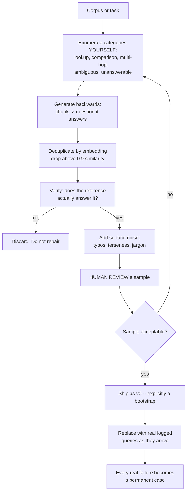
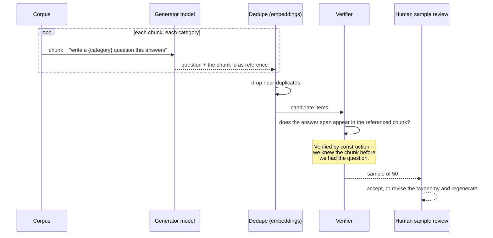

# Synthetic data generation

> **The one sentence:** a model can generate the data you lack, but it generates
> the data it *expects* — so synthetic sets are systematically missing exactly
> the cases that were going to break you.

This is the fastest way to bootstrap an eval set or a fine-tuning corpus, and
the fastest way to build one that measures nothing. The difference is entirely
in how you handle diversity and verification.

---

## 1 · Diagram

```
   THE FAILURE MODE, drawn

   REAL query distribution              SYNTHETIC query distribution
   ────────────────────                 ────────────────────────────
        ▁▃▅███▅▃▁                            ▁▅███▅▁
   ▁▃▅██████████████▅▃▁                     ██████████
   └─ long tail: typos, ─┘              └─ the model's idea ─┘
      jargon, ambiguity,                   of a reasonable question
      half-questions,
      things it can't answer

   The synthetic set is the CENTRE of the distribution.
   Your failures live in the TAIL.
   A model evaluated on synthetic data scores well and ships broken.


   SO THE RULE IS:

   synthetic data       -> BOOTSTRAP and COVERAGE
   real logged data     -> the source of truth, as soon as you have any
   the ratchet          -> every real failure becomes a permanent case
```

---

```sim
synthgen
```

---

## 2 · Design

**Intermediate — the three uses, in descending order of how well it works.**

| Use | Works? | Why |
|---|---|---|
| **Eval set bootstrap** | Well, with care | You control the references; verification is possible |
| **Fine-tuning data** | Moderately | Quality is capped by the teacher; consistency is achievable |
| **Measuring real-world quality** | **No** | The distribution is wrong by construction |

**Generating an eval set is the highest-value use** and the one to get right.
The trick that makes it work: **generate backwards.** Do not ask for questions
and then find answers — take a chunk of your corpus and ask for a question that
chunk answers. You then know the correct chunk id by construction, which gives
you a verified reference for free.

```
   FORWARD (weak)                  BACKWARD (strong)
   "write 50 questions about X"    for each chunk:
   -> then find the answers          "write a question this chunk answers"
   -> references are guesses       -> the chunk IS the reference. Verified.
```

**Advanced — diversity is the whole problem.** Ask a model for fifty questions
and you get fifty variations of about six questions. Mode collapse is the
default behaviour, and it is what makes naive synthetic sets useless.

What actually produces diversity:

1. **Seed each generation differently** — a different chunk, persona, difficulty
   level, or question type per call.
2. **Generate in small batches with the previous questions in context** and
   instruct it to differ.
3. **Deduplicate by embedding**, aggressively. Drop anything above ~0.9
   similarity to an existing item.
4. **Enumerate the taxonomy yourself.** Do not ask for "varied questions" — ask
   for a factual lookup, a comparison, a multi-hop, an ambiguous one, an
   unanswerable one. You know your failure categories; the model does not.
5. **Vary surface form deliberately** — typos, lowercase, terse, over-long,
   jargon-heavy. Real users write badly and synthetic users do not.

Point 5 is the one people skip and the one that matters most, because real query
distributions are full of malformed input and synthetic ones are uniformly
well-formed.

---

## 3 · Flow



**Node `H` is not optional and is the step that gets cut.** Reviewing fifty items
takes an hour and tells you whether the other nine hundred and fifty are worth
anything. Skipping it means you learn the set was bad only from a model that
scores 0.95 and still fails in production.

**Node `K` is the point of the whole exercise.** Synthetic data is scaffolding.
The moment you have real queries, they are better, and the synthetic set should
shrink toward being a coverage supplement rather than the source of truth.

---

## 4 · UML — backwards generation with verification



---

## 5 · Example

```python
CATEGORIES = {
    "lookup":       "a direct factual question this passage answers",
    "comparison":   "a question comparing two things mentioned here",
    "multi_hop":    "a question needing this passage AND general knowledge",
    "paraphrase":   "a question that avoids this passage's own vocabulary",
    "ambiguous":    "a question that could be read two ways",
    "unanswerable": "a plausible question this passage does NOT answer",
}


def generate_eval_items(model, chunks, per_chunk=2):
    """Generate backwards: chunk first, question second.

    The reference is known before the question exists, so every item is
    verified by construction. Asking for questions first and then hunting for
    references produces guesses dressed as ground truth.
    """
    items = []
    for chunk in chunks:
        for category, instruction in CATEGORIES.items():
            prompt = (
                f"Passage:\n{chunk.text}\n\n"
                f"Write {per_chunk} questions: {instruction}.\n"
                "For each, quote the exact phrase from the passage that answers "
                "it, or write NONE if the passage does not answer it.\n"
                "Vary the phrasing. Some should be terse, some conversational."
            )
            for question, span in parse(model.complete(prompt)):
                items.append({
                    "question": question,
                    "bucket": category,
                    # Unanswerable items must have NO reference -- that is the
                    # whole point of the bucket.
                    "relevant_chunk_ids": [] if category == "unanswerable" else [chunk.id],
                    "answer_span": None if span == "NONE" else span,
                })
    return items


def verify(items, chunks_by_id) -> list:
    """Keep only items whose reference genuinely supports them.

    Discard rather than repair. A repaired item was generated from a
    misunderstanding, and repairing it preserves that misunderstanding in a
    tidier form.
    """
    kept = []
    for item in items:
        if item["bucket"] == "unanswerable":
            if item["answer_span"] is None:
                kept.append(item)
            continue
        text = chunks_by_id[item["relevant_chunk_ids"][0]].text
        if item["answer_span"] and normalise(item["answer_span"]) in normalise(text):
            kept.append(item)
    return kept
```

```python
def enforce_diversity(items, embed, threshold=0.9) -> list:
    """Drop near-duplicates. Mode collapse is the default, not the exception.

    Asking a model for fifty questions reliably produces about six questions
    in fifty costumes. Without this step the set has far less coverage than
    its item count suggests, and the score it produces is correspondingly
    less meaningful.
    """
    kept, vectors = [], []
    for item in items:
        v = embed(item["question"])
        if all(cosine(v, seen) < threshold for seen in vectors):
            kept.append(item)
            vectors.append(v)
    return kept
```

---

## 6 · Depth — the senior layer

**The teacher's ceiling is your ceiling.** Data generated by a model inherits its
biases, its blind spots and its errors. For fine-tuning that means the student
cannot exceed the teacher on the distribution it was trained on — it can only
approach it more cheaply. For eval sets it means questions the teacher considers
unimportant are absent, and those are disproportionately the ones your users
will ask.

| Failure mode | Symptom | Fix |
|---|---|---|
| **Mode collapse** | 1,000 items, ~50 distinct questions | Embedding dedupe; seed each call differently |
| **Forward generation** | References are guesses | Generate backwards from chunks |
| **No human review** | Set measures nothing; discovered late | Review 50 before trusting 1,000 |
| **Uniformly well-formed** | Fails on real messy input | Add typos, terseness, jargon deliberately |
| **No unanswerable bucket** | Rewards answering everything | Generate them explicitly, with no reference |
| **Synthetic set never retired** | Measuring imagination indefinitely | Replace with logged queries as they arrive |
| **Repairing bad items** | Misunderstandings preserved | Discard |

**Licensing again, and it applies harder here.** Most commercial model terms
prohibit using outputs to train a competing model. Generating fine-tuning data
from a hosted API is exactly the activity those clauses describe. Check before
you start — this is a legal question that arrives before the technical one, and
raising it unprompted is a mark of seniority.

**Where synthetic data is unambiguously good:** as a *coverage supplement*. You
have 200 real queries; you notice no one has ever asked an unanswerable
question, or a multi-hop one, or anything in Spanish. Generating those
deliberately fills a known hole. That is different from manufacturing a whole
distribution, and it is the use that survives contact with production.

**A useful discipline: label the provenance.** Mark every eval item as
`synthetic` or `logged`, and report scores broken down by both. If the two
diverge, the synthetic half is measuring something other than reality — and you
want to know that from a table rather than from a customer.

---

## 7 · From each seat

| Seat | What synthetic data looks like from here |
|---|---|
| **User** | Nothing directly — but a system evaluated only on synthetic data will fail them in ways nobody predicted, because their real questions were never in the set. |
| **Coder** | Generate backwards. Dedupe by embedding. Verify by construction. Tag provenance on every item so scores can be split later. |
| **Tester** | Synthetic items are a bootstrap with a shelf life. Track the synthetic-versus-logged score gap; a widening gap means your set has drifted from reality. |
| **System designer** | Generation is a batch pipeline — use the batch API at half price, cache aggressively, and make it re-runnable as the corpus grows. |
| **Architect** | The eval set is a long-lived asset. Design for provenance and versioning from the start; retrofitting "where did this item come from" is impossible. |
| **CEO** | It removes the "we can't start without labelled data" blocker, cheaply. Ask what fraction of the eval set is now real, and whether that fraction is rising. |
| **Market** | Everyone can do this, so it is not a differentiator. Real logged queries with real outcomes are the asset nobody can generate — which is why usage is worth more than cleverness. |

---

## 8 · Interview questions

| Question | What they are testing | Answer sketch |
|---|---|---|
| ⭐ "You have no eval data. What do you do?" | Practical bootstrapping | Generate backwards from the corpus: take a chunk, ask for a question it answers, so the reference is known by construction. Enumerate categories myself, dedupe by embedding, human-review a sample, then replace with real queries as they arrive. |
| ⭐ "What is wrong with a synthetic eval set?" | Whether you know the limit | It is the centre of the distribution and your failures are in the tail. Real queries are malformed, ambiguous and jargon-heavy; synthetic ones are uniformly well-formed. It scores well and ships broken. |
| "How do you get diversity?" | Depth | Mode collapse is the default. Seed each call differently, enumerate the taxonomy yourself rather than asking for "varied", dedupe by embedding above 0.9, and deliberately add surface noise. |
| "Would you fine-tune on synthetic data?" | Nuance | It can work, with two caveats: quality is capped by the teacher, and most commercial licences prohibit training on their outputs. Check the licence before the technique. |
| "How do you verify a generated item?" | Rigour | By construction — generate from the chunk so the reference is known, then check the answer span appears verbatim in it. Discard failures rather than repairing them; a repair preserves the misunderstanding. |
| "When is it clearly the right tool?" | Judgement | As a coverage supplement. You have real queries but no unanswerable ones, or nothing multi-hop — generate those deliberately. Filling a known hole, not manufacturing a distribution. |

---

## Stop condition

You are done when you can:

1. draw why synthetic and real distributions differ and what that costs,
2. explain backwards generation and why it verifies for free,
3. name four techniques against mode collapse,
4. raise the licensing constraint unprompted, and
5. say what provenance tagging is for.

---

## Sources worth reading

| Topic | Source |
|---|---|
| Curation over volume | *LIMA* (Zhou et al., 2023) |
| Self-instruction | *Self-Instruct* (Wang et al., 2022) — the diversity problem is visible in its own method |
| Eval generation | Ragas' synthetic test-set generation, for a worked implementation |
| Model collapse | Recent work on training models on model-generated data; the degradation is measurable |
