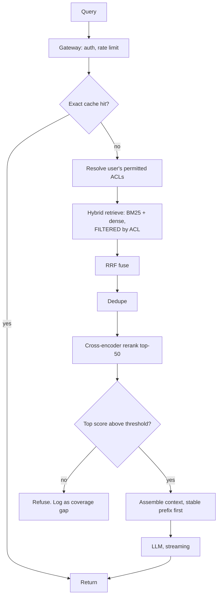
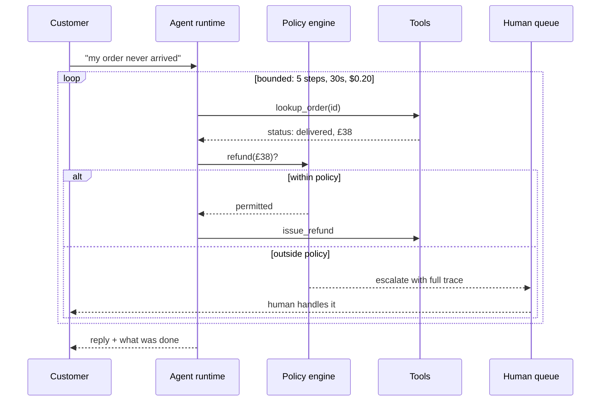
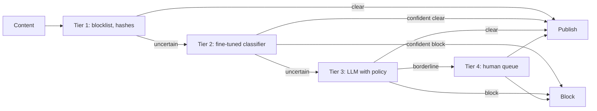

# System design walkthroughs

An LLM system design round is a normal system design round with three extra
axes: **non-determinism, token cost, and unbounded latency**. Everything else —
capacity, failure modes, degradation — is the ordinary discipline.

These five are worked the way you should work one out loud: requirements first,
numbers second, design third, failures fourth.

---

## The structure to use, every time

```
   1. CLARIFY        scale, latency budget, accuracy bar, data sensitivity
   2. NUMBERS        QPS, tokens, memory, cost. Do the arithmetic out loud
   3. HAPPY PATH     the simplest design that meets the requirements
   4. BOTTLENECK     find it, name it, fix it
   5. FAILURES       what breaks, what degrades, what the user sees
   6. EVALUATION     how you know it works, and how you know it still does
```

**Step 6 is where most candidates stop short and where senior signal lives.** If
you finish a design without saying how you would measure it, you have described
a demo.

---

## 1 · A RAG assistant over 10 million internal documents

### Clarify

Ask these before drawing anything:

- **Users and QPS?** Say 5,000 employees, ~2 QPS average, 20 QPS peak.
- **Latency budget?** Interactive — 2s to first token.
- **Accuracy bar?** Wrong answers are costly; refusal is acceptable.
- **Access control?** Yes — documents have per-team permissions. *This one
  changes the architecture, so ask it early.*
- **Freshness?** Minutes for new documents, not seconds.

### Numbers

```
   10M documents × ~8 chunks each        = 80M chunks
   80M × 768 dims × 4 bytes              = 246 GB of vectors
   + HNSW graph (M=16)                   ≈ 20 GB
                                         -> ~270 GB. Does NOT fit one machine.

   Options: shard, or reduce dimensions.
     768 -> 384 via Matryoshka           = 123 GB + graph. Fits one large node.

   Query cost: 2,500 in + 400 out at mid tier
     = (2500 × 1 + 400 × 4) / 1e6        ≈ $0.004
   At 2 QPS sustained: ~5.2M requests/month ≈ $21k/month
     -> routing and caching are not optional at this volume
```

Saying "246 gigabytes, so it does not fit on one box, so either shard or halve
the dimensions" is the moment the interview turns in your favour.

### Design



**Decisions worth defending:**

| Decision | Why |
|---|---|
| Hybrid, not dense-only | Internal docs are full of part numbers and acronyms — BM25 territory |
| ACL filter *at retrieval* | Post-filtering leaks; the model has already read it |
| Rerank 50 → 5 | Retrieval optimises recall, reranking precision |
| Refusal branch | Wrong answers are costly here; that was a stated requirement |
| Stable prefix first | Prompt caching cuts the dominant cost |

### Bottleneck

Index memory. Sharding by team also aligns with the ACL filter — a query only
touches shards the user can see, which makes the security control a performance
win.

### Failures

| Failure | Behaviour |
|---|---|
| Vector store down | Fall back to BM25 only, flag degraded results |
| LLM provider 5xx | Capped retry, then fallback model, then honest error |
| Overload | 429 with `Retry-After` above high-water mark |
| Ingestion lag | Show index freshness in the UI |

### Evaluation

Golden set of 200 questions from real logs, bucketed by department. Gate on
hit@5 and groundedness with a per-bucket floor. Refusal rate monitored in both
directions. Every confirmed miss becomes a golden item.

---

```sim
designwalk
```

---

## 2 · A customer support agent that can act

### Clarify

The critical question: **what can it actually do?** Read-only lookup is a
different system from one that issues refunds.

Assume: look up orders, check policy, draft replies, and issue refunds **under
£50**.

### The design decision that dominates

```
   REVERSIBLE actions        -> automate freely
   IRREVERSIBLE, low value   -> automate with logging and a reversal path
   IRREVERSIBLE, high value  -> HUMAN APPROVAL, always

   The refund tool is capped at £50 IN THE TOOL, not in the prompt.
   A prompt is a request. A policy check is a control.
```

### Numbers

```
   Reliability compounds. At 95% per step:
     3 steps  -> 86%      viable with review
     8 steps  -> 66%      not viable unattended

   So: cap at ~5 steps, decompose anything longer into
   separate bounded runs with a checkpoint between them.
```

### Design



### What the interviewer is listening for

- **Tool-level policy**, not prompt-level. Say it explicitly.
- **Reversibility as the gating criterion**, not model confidence.
- **Injection awareness**: a customer message is untrusted input, and this agent
  has a refund tool. That is the exploit.
- **Bounded loop** with all four budgets.
- **Full trace** on every action, because this one will be audited.

---

## 3 · Serving a 70B model on your own hardware

### Clarify

- Why self-host? *Data residency* is a good reason; *cost* usually is not below
  serious volume.
- Throughput target? Say 50 concurrent users, 30 tokens/sec each.
- Acceptable quality loss from quantization?

### Numbers

```
   70B @ FP16    = 140 GB    -> 2× A100-80 minimum, no room for KV cache
   70B @ INT8    =  70 GB    -> fits one H100-80, tight
   70B @ INT4    =  35 GB    -> comfortable on one 80 GB card

   KV cache, 8k context, batch 50, GQA shape:
     ≈ 2 × 80 layers × 8 kv_heads × 128 × 8000 × 50 × 2 bytes ≈ 131 GB

   -> the CACHE exceeds the quantized weights.
      Batch size is limited by cache, not by the model.

   Throughput needed: 50 × 30 = 1500 tokens/sec aggregate.
   Single-stream decode at INT4 ≈ 200-400 tok/s, so you need
   continuous batching to reach it -- not more GPUs.
```

**That last line is the answer to the question they are really asking.** The
instinct is "add GPUs"; the correct move is better batching.

### Design

vLLM with continuous batching and PagedAttention, INT4 (AWQ) weights, INT8 KV
cache, tensor parallel across two cards if the cache demands it. Gateway in
front with a bounded queue and load shedding.

### Failures

| Failure | Response |
|---|---|
| OOM under load | Cache-driven — cap batch and context, shed above the mark |
| GPU dies | Second node, or degrade to a hosted API |
| Model quality regression after quantization | Eval gate before rollout, not after |

---

## 4 · Real-time content moderation at 50k requests/second

### Clarify

50k/s is far too much for an LLM on every request. The design is a **cascade**,
and recognising that immediately is most of the answer.

### Numbers

```
   50,000 QPS through a frontier model is not a system, it is a bankruptcy.
   Assume 99% of content is obviously fine.

   TIER 1  hash/regex blocklist        50,000/s   ~0.01ms   $0
   TIER 2  small fine-tuned classifier  5,000/s   ~5ms      cheap
   TIER 3  LLM judgement                  100/s   ~500ms    expensive
   TIER 4  human review                     5/s   minutes   expensive

   Each tier passes ~10% upward. The LLM sees 0.2% of traffic.
```

### Design



**The senior points here:**

- **Asymmetric errors.** False negatives (harmful content published) and false
  positives (legitimate content blocked) have different costs, and the
  thresholds should reflect which one your product can survive.
- **Latency budget differs by tier.** Tier 1 must be inline; tier 3 can be
  asynchronous with optimistic publish and retraction.
- **This is where a fine-tuned small model clearly beats an LLM** — high volume,
  narrow task, better *and* cheaper by two orders of magnitude.
- **Drift is guaranteed.** Adversaries adapt deliberately. Monitor tier-3
  escalation rate as the leading indicator.

---

## 5 · Evaluating a RAG system nobody has evaluated

This one comes up as "we have a RAG system, how would you know if it works?"

### The order that matters

```
   1. RETRIEVAL CEILING     is the answer in ANY chunk?     <- do this first
   2. RETRIEVAL QUALITY     is it in the top-k?
   3. GENERATION            given good context, is the answer right?
   4. END TO END            the number the business cares about
```

**Diagnose top-down, because each stage caps the ones below it.** A team that
starts at 3 will tune prompts for a month against a retrieval ceiling of 0.7.

### Design

- 50–200 questions from **real logs**, not imagination, bucketed by type
  including an unanswerable bucket.
- Deterministic scorers first: hit@k, recall@k, groundedness against a verbatim
  answer span. Cheap, and they gate on every PR.
- An LLM judge only for what deterministic scoring cannot reach — and validate
  it against human labels before trusting it.
- Committed baseline, three-check gate, per-bucket floors.
- Tiered CI: deterministic on the PR lane, judge nightly.

### The line that lands

> *"Before optimising anything I would measure how often the answer is in the
> index at all. That number is the ceiling on everything downstream, it takes
> ten minutes, and it regularly redirects a month of work."*

---

## What separates a good answer from a great one

| Good | Great |
|---|---|
| Draws the architecture | Does the arithmetic before drawing |
| Names components | Names the bottleneck and why |
| "We'd add caching" | "The stable prefix is 80% of input tokens, so prefix caching cuts the bill roughly in half" |
| "We'd evaluate it" | Names the metric, the gate, the buckets and the noise floor |
| Handles the happy path | States what degrades, in what order, and what the user sees |
| Answers the question | Asks what the accuracy bar and data sensitivity are first |

**And the one habit worth more than any of them:** say what you would measure to
know your choice was right. Every design decision above is defensible because it
is falsifiable.
