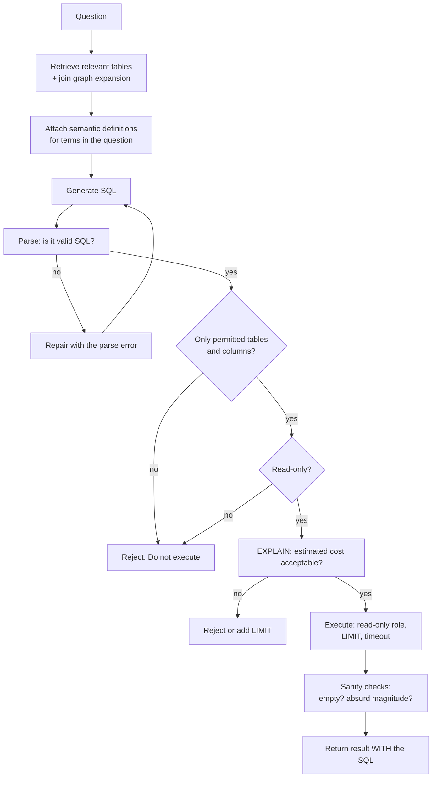

# Text2SQL & structured data

> **The one sentence:** models write syntactically perfect SQL against schemas
> they have misunderstood, and the failure is silent because the query runs and
> returns a number.

That is what makes this harder than it looks. A RAG system that retrieves badly
gives an obviously vague answer. A Text2SQL system that misreads your schema
returns a confident, precise, wrong figure — and someone puts it in a board deck.

---

## 1 · Diagram

```
   WHERE IT ACTUALLY BREAKS

   "how many active customers did we have last quarter?"
          │
          ▼
   SELECT COUNT(*) FROM customers
   WHERE status = 'active'
     AND created_at >= '2026-04-01'
          │
          ▼
   runs fine. Returns 48,213. Looks authoritative.

   BUT:
     - "active" in this schema means status_id = 3, not status = 'active'
     - created_at is SIGNUP date, not activity
     - the business defines a quarter as a fiscal quarter starting in February
     - deleted rows are soft-deleted and not filtered

   Four semantic errors. Zero syntax errors. Nobody notices.


   THE DIFFICULTY IS NOT SQL

   syntax          the model is excellent at this
   schema          which table, which join, which column      <- hard
   semantics       what "active" MEANS in this business       <- harder
   correctness     is the returned number right               <- unverifiable
                                                                 without ground truth
```

---

```sim
sqlgen
```

---

## 2 · Design

**Intermediate — the pipeline that works.**

| Stage | Purpose |
|---|---|
| **Schema retrieval** | Select only the relevant tables — full schemas do not fit and dilute attention |
| **Semantic layer** | Business definitions: what "active", "revenue", "churn" mean here |
| **Generation** | Model writes SQL against that curated context |
| **Static validation** | Parse it; check tables, columns and permissions before executing |
| **Safe execution** | Read-only role, `LIMIT`, statement timeout |
| **Verification** | Sanity checks, and show the SQL to the user |

**Schema retrieval is the part that determines success.** A real warehouse has
hundreds of tables and thousands of columns; you cannot put it all in context,
and doing so would hurt anyway. Retrieve the relevant subset — by embedding
table and column descriptions and searching them with the question, plus
join-graph expansion to pull in bridging tables.

**Advanced — the semantic layer is the difference between a demo and a product.**
The model cannot infer that `status_id = 3` means active, or that the company's
fiscal year starts in February. That knowledge lives in people's heads, and
Text2SQL projects fail when nobody writes it down.

```
   what a semantic layer holds

   metric definitions      "active customer" = status_id 3 AND last_seen < 90 days
   canonical joins         orders -> customers is ALWAYS via customer_id, never email
   grain                   one row per order LINE, not per order -- watch your SUMs
   filters that always apply   deleted_at IS NULL
   fiscal calendar         Q1 starts 1 February
   known traps             the legacy `amount` column is in cents
```

Every one of those is a wrong answer waiting to happen, and none are discoverable
from the schema alone.

---

## 3 · Flow



**`E` through `J` is a static analysis pipeline, not an LLM problem**, and it is
where the safety comes from. Parsing the SQL and checking it against a permitted
schema is deterministic, fast, and catches the dangerous cases before anything
touches the database.

**`N` is the most important product decision on this page.** **Always show the
SQL.** A user who can read it will catch semantic errors you cannot detect
automatically, and one who cannot at least knows a query was run rather than an
answer conjured.

---

## 4 · UML — defence in depth

```mermaid
sequenceDiagram
    participant U as User
    participant G as Generator
    participant P as SQL parser
    participant A as Authorisation
    participant D as Database (read-only role)

    U->>G: question
    G-->>P: candidate SQL
    P->>P: parse; extract tables, columns, operations
    alt not parseable
        P-->>G: syntax error, regenerate
    end
    P->>A: tables, columns, operation type
    A->>A: check against THIS user's grants
    alt not permitted
        A-->>U: refuse, explain what was not allowed
    end
    A->>D: EXPLAIN first
    D-->>A: estimated rows and cost
    alt too expensive
        A-->>U: refuse or narrow
    end
    A->>D: execute with LIMIT + timeout
    D-->>U: rows + THE SQL THAT PRODUCED THEM
```

**The database role is the real control.** A read-only role with row-level
security cannot be talked into a `DELETE` by any prompt. Everything above it is
defence in depth.

---

## 5 · Example

```python
import sqlglot
from sqlglot import exp


def validate_sql(sql: str, allowed_tables: set[str], allowed_columns: dict) -> tuple[bool, str]:
    """Static checks before the query goes anywhere near the database.

    Deterministic and fast. It catches the dangerous cases -- writes, unknown
    tables, unpermitted columns -- without relying on the model having behaved,
    which is the only kind of guarantee worth having here.
    """
    try:
        tree = sqlglot.parse_one(sql, read="postgres")
    except Exception as exc:
        return False, f"unparseable: {exc}"

    # Anything that is not a SELECT is rejected outright. The read-only role
    # would refuse it too -- this is the earlier, clearer error.
    if not isinstance(tree, exp.Select):
        return False, f"only SELECT permitted, got {type(tree).__name__}"

    for table in tree.find_all(exp.Table):
        if table.name not in allowed_tables:
            return False, f"table {table.name!r} not permitted"

    for column in tree.find_all(exp.Column):
        if column.table and column.name not in allowed_columns.get(column.table, set()):
            return False, f"column {column.table}.{column.name} not permitted"

    return True, ""


def sanity_check(rows, question: str) -> list[str]:
    """Cheap checks that catch the obviously-wrong before a human trusts it.

    None of these prove correctness. They catch the failures that are
    embarrassing rather than subtle, which is most of what reaches users.
    """
    warnings = []
    if not rows:
        warnings.append("query returned no rows -- check filters and date ranges")
    if len(rows) == 1 and len(rows[0]) == 1:
        value = list(rows[0].values())[0]
        if isinstance(value, (int, float)) and value == 0:
            warnings.append("result is exactly zero -- often a join or filter error")
    return warnings
```

**The semantic layer, as data rather than prose:**

```python
SEMANTICS = {
    "active customer": {
        "definition": "status_id = 3 AND last_seen_at > now() - interval '90 days'",
        "note": "NOT status = 'active' -- that column is legacy and unreliable",
    },
    "revenue": {
        "definition": "SUM(order_lines.amount_cents) / 100.0",
        "note": "amount_cents is in CENTS. Grain is one row per LINE, not per order",
    },
    "quarter": {
        "definition": "fiscal quarters starting 1 February",
        "note": "never calendar quarters",
    },
}


def attach_semantics(question: str) -> str:
    """Include only the definitions whose terms appear in the question.

    Attaching everything wastes context and dilutes attention; attaching
    nothing is how you get status = 'active'.
    """
    relevant = {k: v for k, v in SEMANTICS.items() if k in question.lower()}
    if not relevant:
        return ""
    lines = [f"- {k}: {v['definition']} ({v['note']})" for k, v in relevant.items()]
    return "Business definitions that apply here:\n" + "\n".join(lines)
```

---

## 6 · Depth — the senior layer

**Evaluation needs execution accuracy, not string matching.** Two different
queries can be equally correct, so comparing generated SQL to a reference string
under-reports badly. The standard is **execution accuracy**: run both, compare
result sets.

| Metric | What it tells you |
|---|---|
| **Execution accuracy** | Same results as the reference query. The headline |
| **Valid SQL rate** | Parses and runs at all. A floor, not a target |
| **Schema-error rate** | Wrong table or column — the diagnostic that matters |
| **Refusal rate** | Declined rather than guessed. Should not be zero |

**A per-question difficulty split is worth building**: single table, single join,
multi-join, aggregation with grouping, window functions, nested subqueries.
Aggregate accuracy hides the fact that everything above two joins is failing.

| Failure mode | Symptom | Fix |
|---|---|---|
| **Whole schema in context** | Wrong tables chosen, high cost | Retrieve the relevant subset |
| **No semantic layer** | Syntactically perfect, semantically wrong | Write the definitions down |
| **Write access** | One prompt away from data loss | Read-only role. Non-negotiable |
| **No cost check** | A cross join takes the warehouse down | `EXPLAIN` first; reject expensive plans |
| **SQL hidden from the user** | Silent wrong answers trusted | Always show the query |
| **String-match evaluation** | Under-reports real accuracy | Execution accuracy |
| **No refusal path** | Guesses on ambiguous questions | Ask a clarifying question instead |

**Ambiguity should produce a question, not a guess.** "How many customers last
month?" — by signup, by activity, by billing? A system that asks is more useful
and far more trustworthy than one that silently picks one interpretation. This
is one of the few places where a clarifying question is unambiguously better
product design than an answer.

**Where Text2SQL genuinely works well**, so this does not read as blanket
scepticism: a curated star schema with clear naming, a written semantic layer, a
bounded set of question types, and users who can read the SQL. That describes
most internal analytics use cases. It works badly on sprawling legacy OLTP
schemas with cryptic column names and undocumented conventions — which also
describes a lot of real databases.

**The honest online metric** is worth stealing for any similar product: log the
SQL you generated and the SQL the user actually ran. **The edit distance between
them is a near-perfect implicit quality label**, it costs one database column,
and it needs no annotation effort at all.

---

## 7 · From each seat

| Seat | What Text2SQL looks like from here |
|---|---|
| **User** | They ask in English and get a number. Whether they can trust it depends entirely on whether they can see and read the query. |
| **Coder** | Parse and validate before executing. Read-only role. `EXPLAIN` before running. Show the SQL. Log generated-versus-executed for free quality labels. |
| **Tester** | Execution accuracy, not string match. Split the eval set by join count and aggregation complexity — the aggregate hides where it falls over. |
| **System designer** | A user-controlled query generator pointed at your warehouse. Timeouts, row limits, cost checks and a separate read-only replica are the design, not extras. |
| **Architect** | The semantic layer is the durable asset and the thing that must be maintained. Without an owner it rots, and the system degrades silently as the schema evolves. |
| **CEO** | Self-service analytics without a data-team queue. The risk is confident wrong numbers reaching decisions. Ask whether users see the SQL, and who owns the definitions. |
| **Market** | Every BI vendor now ships this. The differentiator is the semantic layer and schema quality — which is your data team's work, not the vendor's. |

---

## 8 · Interview questions

| Question | What they are testing | Answer sketch |
|---|---|---|
| ⭐ "What makes Text2SQL hard?" | Whether you know where the difficulty is | Not SQL syntax — models are good at that. Schema selection at scale, and business semantics: what "active" or "revenue" mean here. Those produce syntactically perfect, semantically wrong queries that run and return a number. |
| "How do you stop it dropping a table?" | Safety instinct | A read-only database role. Then static validation before execution, permitted-table checks, and `EXPLAIN` for cost. The role is the control; the rest is defence in depth. |
| "How do you evaluate it?" | Method | Execution accuracy — run generated and reference queries, compare result sets. String matching under-reports because different queries can be equally correct. Split by join count and aggregation complexity. |
| ⭐ "How do you handle an ambiguous question?" | Product judgement | Ask. "Customers last month" by signup, activity or billing are different questions. A clarifying question is more trustworthy than a silent interpretation, and this is one of the clearest cases where asking beats answering. |
| "The schema has 400 tables." | Scale realism | Retrieve the relevant subset — embed table and column descriptions, search with the question, expand along the join graph. The full schema does not fit and dilutes attention even when it does. |
| "What online metric would you use?" | Depth | Edit distance between the SQL generated and the SQL the user actually ran. A near-perfect implicit label, one column to store, no annotation needed. |

---

## Stop condition

You are done when you can:

1. explain why syntax is the easy part,
2. describe what a semantic layer contains and why it cannot be inferred,
3. give the validation pipeline between generation and execution,
4. say why execution accuracy replaces string matching, and
5. name the online metric that costs one database column.

---

## Sources worth reading

| Topic | Source |
|---|---|
| Benchmarks | Spider and BIRD — BIRD is the more realistic, with dirty schemas and business semantics |
| Evaluation | The execution-accuracy methodology in the Spider papers |
| Practical | `sqlglot` for parsing and dialect handling; the right tool for the validation stage |
| Semantic layers | dbt's metric definitions, and the semantic-layer literature from BI — this problem predates LLMs |
