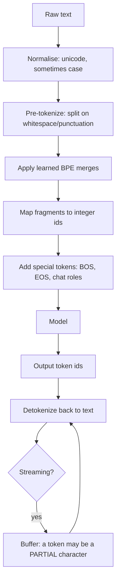
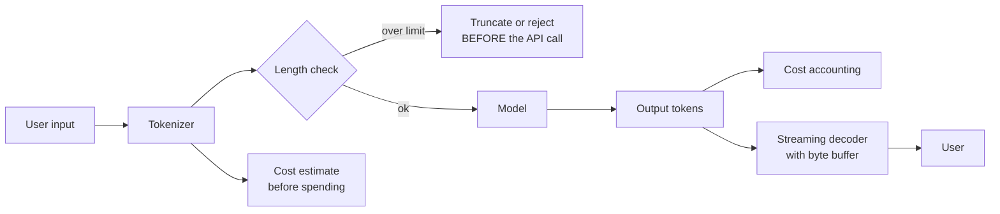

# Tokenization

> **The one sentence:** the model never sees your text — it sees integers from a
> fixed vocabulary, and almost every strange LLM behaviour that looks like
> stupidity is an artefact of that translation.

This is the least glamorous page in the handbook and the one that explains the
most otherwise-inexplicable bugs.

---

## 1 · Diagram

```
   WHAT THE MODEL ACTUALLY RECEIVES

   "The immune system fights viruses."
            │
            ▼   BPE tokenizer
   ["The", " immune", " system", " fights", " virus", "es", "."]
   [ 791,   30248,     1887,      28533,     16989,   288,  13 ]
            │
            ▼
   the model sees ONLY those integers.
   It has no access to letters, spelling, or characters.


   WHY THAT EXPLAINS THE FAMOUS FAILURES

   "how many r's in strawberry?"
     -> ["str", "aw", "berry"]  the model never sees individual letters
        it is being asked to count something it cannot perceive

   arithmetic on long numbers
     -> "1234567" may split as ["123", "45", "67"]
        digit alignment is destroyed before computation begins

   reversing a string
     -> operates on token boundaries, not characters
```

---

```lab
tokenizer
```

## 2 · Design

**Basic — what a tokenizer is.** A fixed vocabulary (typically 32k–200k entries)
mapping text fragments to integers, plus rules for splitting arbitrary text into
those fragments. Common words are one token; rare words break into pieces; the
vocabulary is learned from a training corpus.

**Byte-pair encoding (BPE)**, the dominant algorithm, is trained by starting
from individual bytes and repeatedly merging the most frequent adjacent pair
until the vocabulary reaches its target size. Frequent sequences become single
tokens; rare ones stay fragmented. That frequency dependence is the source of
almost everything on this page.

| Scheme | Used by | Note |
|---|---|---|
| **BPE / byte-level BPE** | GPT, Llama, most modern models | Never fails on unseen input — worst case falls back to bytes |
| **WordPiece** | BERT | Similar; likelihood-based merge criterion |
| **SentencePiece / Unigram** | T5, many multilingual models | Language-agnostic, treats space as a character |

**Intermediate — the rules of thumb worth memorising.**

```
   English prose        ~ 1 token ≈ 4 characters ≈ 0.75 words
   Code                 ~ more tokens per character (punctuation, indentation)
   Numbers              ~ inconsistent; digits group unpredictably
   Non-Latin scripts    ~ often 2-4x more tokens for the SAME meaning
   Whitespace           ~ leading space is usually part of the token
```

That last one causes real bugs: `"hello"` and `" hello"` are **different
tokens**. A prompt template that accidentally strips or adds a leading space
produces different tokenization, and occasionally different behaviour.

**Advanced — the fairness and cost problem nobody planned.** Because vocabularies
are learned from corpora dominated by English, the same sentence in another
language costs substantially more tokens. Measured across languages, some
require 2–4× the tokens of English for equivalent content, and some low-resource
scripts far more.

The consequences compound:

1. **Users pay more** for the same task in their language, since billing is
   per token.
2. **They hit context limits sooner** — the effective window is smaller.
3. **Quality is lower**, because heavily fragmented text is harder to model.

This is a genuine equity issue baked into the pricing layer, and it is worth
raising unprompted in any discussion of multilingual deployment. It is also
measurable in about ten lines of code, which makes it a concrete point rather
than a talking point.

---

## 3 · Flow



**Node `K` is a real bug source.** In byte-level BPE a single token can be part
of a multi-byte UTF-8 character. Decoding token-by-token during streaming
produces mojibake — replacement characters mid-word — unless you buffer until
the bytes form valid characters. Most SDKs handle it; hand-rolled streaming
frequently does not, and the bug only appears for emoji and non-Latin text.

---

## 4 · UML — where tokenization touches the system



**Count tokens client-side before calling.** It is the difference between
rejecting an over-long request in a millisecond for free, and discovering the
limit after paying for the prefill.

---

## 5 · Example

```python
def analyse(tokenizer, texts: dict[str, str]) -> None:
    """Show the cost of the same meaning across languages.

    The vocabulary is learned from a corpus dominated by English, so the same
    content in other scripts fragments into more pieces. Users are billed per
    token, so this is a price difference for identical work.
    """
    baseline = None
    for language, text in texts.items():
        n = len(tokenizer.encode(text))
        ratio = "" if baseline is None else f"  {n / baseline:.1f}x English"
        baseline = baseline or n
        print(f"{language:<12} {n:>4} tokens  ({len(text)/n:.1f} chars/token){ratio}")


analyse(tok, {
    "English":  "The immune system defends the body against disease.",
    "Hindi":    "प्रतिरक्षा प्रणाली शरीर को रोगों से बचाती है।",
    "Japanese": "免疫系は病気から体を守ります。",
    "Tamil":    "நோய் எதிர்ப்பு அமைப்பு உடலை நோய்களிலிருந்து பாதுகாக்கிறது.",
})
```

Typical output shape (exact numbers depend on the tokenizer):

```
English        11 tokens  (4.6 chars/token)
Hindi          29 tokens  (1.5 chars/token)   2.6x English
Japanese       18 tokens  (0.9 chars/token)   1.6x English
Tamil          47 tokens  (1.2 chars/token)   4.3x English
```

**A budget guard that avoids paying to discover a limit:**

```python
def fits(tokenizer, system: str, context: list[str], question: str,
         limit: int, reserve_for_output: int = 1000) -> tuple[bool, int]:
    """Check length locally before spending anything on prefill.

    Reserving output space is the part people forget: the limit covers input
    AND output together, so a prompt that just fits leaves no room to answer
    and fails after you have already paid for it.
    """
    used = len(tokenizer.encode(system)) + len(tokenizer.encode(question))
    used += sum(len(tokenizer.encode(c)) for c in context)
    return used + reserve_for_output <= limit, used


def trim_to_budget(tokenizer, chunks: list[str], budget: int) -> list[str]:
    """Drop whole chunks from the end rather than truncating mid-chunk.

    Cutting inside a passage leaves a fragment that reads as a complete
    statement while missing its qualifier -- which is how a truncation bug
    becomes a factual error rather than an obvious one.
    """
    kept, used = [], 0
    for chunk in chunks:
        n = len(tokenizer.encode(chunk))
        if used + n > budget:
            break
        kept.append(chunk)
        used += n
    return kept
```

---

## 6 · Depth — the senior layer

**Never truncate in the middle of a semantic unit.** Cutting a passage at a token
boundary can leave "The dosage is safe below" without "500mg". The result reads
as a complete claim and is wrong. Drop whole chunks, or truncate from the middle
of the *list* rather than the middle of a *passage*.

**Tokenizers are coupled to models and are not interchangeable.** Counting tokens
with one model's tokenizer and calling another gives wrong estimates — sometimes
by 20% or more. If you support multiple providers, count with each provider's own
tokenizer, or accept that your budget guard is approximate and reserve headroom.

| Failure mode | Symptom | Fix |
|---|---|---|
| **Wrong tokenizer for the model** | Budget guard off by 20% | Use the model's own tokenizer |
| **Mid-passage truncation** | Confident, wrong answers | Drop whole chunks |
| **No output reservation** | Fails after prefill is paid for | Reserve output space in the check |
| **Streaming decode per token** | Mojibake on emoji and non-Latin | Buffer until bytes form valid characters |
| **Leading-space mismatch** | Subtle behaviour change from a template edit | Be consistent; test the assembled prompt |
| **Assuming words ≈ tokens** | Estimates wrong for code and other languages | Measure on your actual data |

**Glitch tokens are a genuine curiosity with a real lesson.** Some vocabularies
contain tokens that appeared during vocabulary construction but were effectively
absent from training data — famously `SolidGoldMagikarp` in GPT-2/3 vocabularies.
Prompting with them produced bizarre, sometimes evasive behaviour. The general
lesson: a token the model has barely seen has an essentially arbitrary embedding,
and the model's behaviour on it is undefined rather than merely poor.

**Why not character-level or byte-level throughout?** It has been tried. Sequences
become 4–5× longer, attention is quadratic in length, and both training and
inference get much more expensive. Tokenization is a compression scheme that
trades a class of failures — counting letters, arithmetic alignment — for a large
efficiency gain. Recent byte-level architectures revisit this trade, and it is
worth watching, but the compression argument is why subword tokenization has
persisted.

---

## 7 · From each seat

| Seat | What tokenization means from here |
|---|---|
| **User** | An invisible tax if they write in a non-English script: fewer words fit, more is charged, quality is lower. They will never know why. |
| **Coder** | Count tokens with the *model's own* tokenizer, before the call. Reserve output space. Buffer streaming bytes. Never truncate inside a passage. |
| **Tester** | Test with non-Latin scripts, emoji and code — not just English prose. Boundary tests belong at the token limit, including the case where input fits but leaves no room for output. |
| **System designer** | Token counting is a cheap local guard that prevents expensive remote failures. Put it at the edge, before the queue. |
| **Architect** | Tokenizers are model-coupled, so multi-provider support means multiple counters and non-portable budgets. Factor that into any abstraction over providers. |
| **CEO** | Non-English users cost more to serve for identical work. That is a pricing and equity question, and it is measurable rather than theoretical. |
| **Market** | Tokenizer efficiency is a real differentiator for multilingual products — a model with a better vocabulary for your users' languages is cheaper *and* better for them, independent of benchmark scores. |

---

## 8 · Interview questions

| Question | What they are testing | Answer sketch |
|---|---|---|
| "Why can't the model count letters in a word?" | Whether you know the mechanism | It never sees letters. Text is split into subword tokens and the model receives integers; "strawberry" may be three tokens, and character-level structure is not accessible from that representation. |
| "Why is non-English text more expensive?" | Depth and awareness | Vocabularies are learned from English-dominated corpora, so other scripts fragment into more tokens for the same meaning — often 2–4×. Users pay more, hit context limits sooner, and get lower quality. |
| "How would you truncate a long prompt?" | Practical care | Drop whole chunks from lowest relevance, never cut inside a passage — a truncated passage reads complete and can be wrong. And reserve output space, since the limit covers both directions. |
| "Your token count doesn't match the bill." | Debugging instinct | Probably counting with a different tokenizer than the model uses, or forgetting special and chat-template tokens, or counting input only when output is billed separately and higher. |
| "What are glitch tokens?" | Curiosity and rigour | Vocabulary entries barely present in training data, so their embeddings are essentially arbitrary and behaviour on them is undefined. The general point is that rare tokens are not merely weak — they are unpredictable. |
| "Why not just use characters?" | Trade-off reasoning | Sequences get 4–5× longer and attention is quadratic in length, so it is far more expensive. Tokenization trades a specific class of failures for a large efficiency gain. |

---

## Stop condition

You are done when you can:

1. explain the strawberry problem in terms of representation,
2. quote the chars-per-token rules of thumb and where they break,
3. describe the multilingual cost and fairness consequence,
4. say why truncating mid-passage is dangerous, and
5. explain why character-level models are not the obvious answer.

---

## Sources worth reading

| Topic | Source |
|---|---|
| BPE | Sennrich et al. (2015), *Neural Machine Translation of Rare Words with Subword Units* |
| Build one | Karpathy's `minbpe` and his tokenizer video — two hours that remove all the mystery |
| Multilingual cost | *Language Model Tokenizers Introduce Unfairness Between Languages* (Petrov et al., 2023) |
| Glitch tokens | The `SolidGoldMagikarp` investigation — an unusually entertaining piece of empirical work |
| Byte-level alternatives | Recent byte-latent and tokenizer-free architectures; the trade-off is still being argued |
