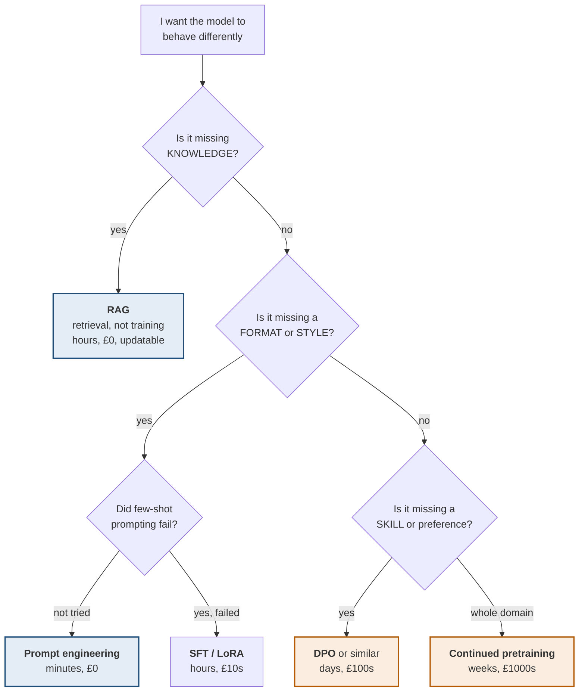

# The 20 ways to train a model

> **Most of these you will never use, and that is the point of the map.** The
> value is knowing which three are live options for your problem, and being able
> to say why the other seventeen are not.

**Every method below is judged against one practical question: does it fit on a
single consumer GPU?** The 8 GB column assumes an 8 GB card, which is the most
common real constraint.

---

## 0 · First — should you train at all?



> **The single most useful thing on this page: most "we need to fine-tune"
> problems are retrieval problems.** If the model does not *know* something,
> training it is the expensive, stale, unverifiable way to tell it — you cannot
> update a fact without retraining, and you cannot cite a source. **Fine-tuning
> teaches behaviour; retrieval supplies knowledge.** Get that the wrong way
> round and you spend weeks producing a model that confidently hallucinates
> last quarter's numbers.

---

## 1 · Pretraining stage

### 1. Full pretraining from scratch

Train all weights from random initialisation on trillions of tokens.

| | |
|---|---|
| **Updates** | Everything |
| **Data** | 1–15T tokens |
| **Cost** | Millions of GPU-hours; $100k–$100M |
| **8 GB?** | **No** — not at any useful scale |
| **When** | You are a frontier lab, or training something genuinely tiny for research |

**Worth understanding, never worth doing.** Know the shape so you can explain
why nobody sane starts here.

### 2. Continued pretraining (domain-adaptive)

Take an existing base model and keep pretraining on domain text — legal,
medical, code, a language.

| | |
|---|---|
| **Updates** | All weights (or LoRA over them) |
| **Data** | 1–100B domain tokens |
| **Cost** | Thousands of GPU-hours |
| **8 GB?** | Only with QLoRA, and only for small models |
| **When** | The domain vocabulary and structure genuinely differ from the base distribution |

**The risk is catastrophic forgetting** — the model gets better at your domain
and worse at everything else. Mitigate by mixing in general data (a common
recipe is ~5–10% replay).

---

```sim
trainstages
```

---

## 2 · Supervised fine-tuning stage

**This is where you almost certainly are.** You have input→output pairs and want
the model to imitate them.

### 3. Full fine-tuning

Update every parameter on your labelled examples.

```
Memory = params × (2 bytes weights + 2 grads + 8 Adam states) + activations
       ≈ 12 bytes per parameter

7B model  ->  ~84 GB.  Not on one consumer card.
0.5B      ->  ~6 GB.   Tight, but possible.
```

| **8 GB?** | Only up to ~0.5B |
|---|---|
| **When** | Small models, or you have real cluster access |

> **The 12-bytes-per-parameter rule is worth memorising.** It is why full
> fine-tuning of anything interesting needs a data-centre, and it is the number
> that makes every method below necessary rather than clever.

### 4. Layer freezing / partial fine-tuning

Freeze most layers; train only the last N blocks (or just the head).

| | |
|---|---|
| **Updates** | A chosen subset |
| **8 GB?** | Yes, for small models |
| **When** | Crude but effective; largely superseded by LoRA |

### 5. LoRA ⭐

**The default, and the one to understand properly.** Freeze the base weights;
inject small trainable low-rank matrices beside them.

```
Instead of updating W (d × k), learn  ΔW = B·A
  where A is (r × k) and B is (d × r), with r ≈ 8–64

A 4096 × 4096 layer:      16.7M parameters
LoRA with r=16:           4096×16 + 16×4096 = 131k parameters   ~0.8%

Base weights stay FROZEN, so no gradients and no optimiser states for them.
```

| | |
|---|---|
| **Updates** | ~0.1–1% of parameters |
| **Memory** | Base in bf16 + tiny adapters |
| **8 GB?** | **Up to ~3B** |
| **Output** | A ~10–200 MB adapter file, not a whole model |

> **Two properties make LoRA dominant.** Adapters are tiny — you can keep
> dozens for different tasks and swap them at runtime against one base. And they
> are **mergeable**: `W + BA` folds back into the original weights, so inference
> costs nothing extra once merged.

### 6. QLoRA ⭐⭐

**LoRA with the frozen base held in 4-bit.** This is the one that puts 7–8B
models on consumer hardware.

```
7B in bf16:   ~14 GB   -> will not fit
7B in 4-bit:  ~3.5 GB  -> fits, with room for activations and adapters
```

| | |
|---|---|
| **8 GB?** | **Yes — 7–8B comfortably, ~13B at a squeeze** |
| **Cost** | Slower per step than LoRA (dequantisation on the fly) |
| **Quality** | Very close to full LoRA in practice |

**Three components worth naming:** 4-bit NormalFloat (a data type matched to the
normal distribution weights actually follow), double quantisation (quantising the
quantisation constants), and paged optimisers (spilling optimiser state to CPU on
memory spikes).

> **QLoRA is the correct default for your hardware.** Everything else on this
> page is either too big, or a refinement of this.

### 7. DoRA

LoRA that decomposes weights into magnitude and direction, adapting each
separately. Slightly better quality than LoRA at similar cost. **Use if your
library supports it; not worth switching frameworks for.**

### 8. Adapters (bottleneck)

Insert small trainable feed-forward bottlenecks between layers. The pre-LoRA
approach. **Adds inference latency because the layers cannot be merged away** —
which is exactly why LoRA replaced it.

### 9. Prefix tuning

Prepend trainable vectors to the key/value states at every layer. Base frozen.

### 10. Prompt tuning (soft prompts)

Train a handful of embedding vectors prepended to the input. **Extremely cheap
— thousands of parameters** — and only works well at large scale (10B+).

### 11. P-tuning v2

Prefix tuning applied at every layer, made to work at smaller scales.

### 12. IA³

Learn scaling vectors that rescale keys, values and activations. **Even smaller
than LoRA** — often under 0.01% of parameters.

### 13. BitFit

Train only the bias terms. About 0.1% of parameters. Mostly of academic
interest, but a genuinely surprising result: it works far better than it should.

> **Methods 9–13 all exist because LoRA was not obvious yet.** Know that they
> exist and what family they belong to (PEFT). In practice you will reach for
> LoRA or QLoRA and be right to.

---

## 3 · Preference and alignment stage

**After SFT, the model imitates your examples. This stage teaches it what is
*better*.**

### 14. RLHF with PPO

The original recipe: train a reward model on human comparisons, then optimise
the policy against it with reinforcement learning.

```
1. SFT model
2. Collect human preferences: "response A is better than B"
3. Train a REWARD MODEL to predict that preference
4. PPO: optimise the policy against the reward model, with a KL penalty
   against the SFT model so it does not drift into nonsense
```

| | |
|---|---|
| **Needs** | 3–4 models in memory at once (policy, reference, reward, critic) |
| **8 GB?** | **No** |
| **Reputation** | Powerful, unstable, expensive, hard to reproduce |

**The KL penalty is the crucial detail:** without it the policy finds degenerate
outputs that score highly on the reward model and are useless — **reward
hacking**.

### 15. DPO ⭐

**Direct Preference Optimization — the one that made this stage accessible.**

> **DPO's insight: you do not need a separate reward model or RL at all.** The
> optimal policy under a reward model has a closed form, so preference data can
> be optimised *directly* with a classification-style loss. It reduces
> "reinforcement learning" to "supervised learning on pairs".

| | |
|---|---|
| **Needs** | Policy + a frozen reference model |
| **Data** | `(prompt, chosen, rejected)` triples |
| **8 GB?** | **Yes with QLoRA**, for small models |
| **Why it won** | ~90% of PPO's benefit at ~10% of the complexity |

### 16. ORPO

Combines SFT and preference optimisation into **one stage with no reference
model**. Cheaper still; newer and less battle-tested.

### 17. KTO

Uses **single-sided** labels — "this output was good" / "this was bad" — instead
of pairs. **Enormously more practical**, because thumbs-up/down data is what
production systems actually collect; matched preference pairs are not.

### 18. SimPO

Reference-free, using average log-probability as the implicit reward. Simpler
and memory-lighter than DPO.

### 19. RLAIF / Constitutional AI

Replace the human labeller with a model that judges against a written set of
principles. **Scales preference data collection**, at the cost of inheriting the
judge model's biases.

### 20. Rejection sampling / Best-of-N

Generate N candidates, keep the best by some scorer, fine-tune on those. **Dead
simple, surprisingly strong, and the easiest way to start** — no preference
algorithm required.

---

## 4 · Adjacent methods worth knowing

| Method | Does |
|---|---|
| **Knowledge distillation** | Train a small student to match a large teacher's outputs. How 7B models get good |
| **Model merging** (SLERP, TIES, DARE) | Combine several fine-tunes into one model **with no training at all** — a genuinely underrated trick |
| **Mixture of Experts** | Route tokens to a subset of parameters; more capacity at similar inference cost |
| **Speculative decoding** | Not training — a small model drafts, a big one verifies. Inference speedup |

---

## 5 · The whole map on one screen

| # | Method | Stage | Updates | Fits 8 GB? |
|---|---|---|---|---|
| 1 | Pretraining | pretrain | everything | ✗ |
| 2 | Continued pretraining | pretrain | everything | ~ QLoRA only |
| 3 | Full fine-tuning | SFT | everything | ✗ (>0.5B) |
| 4 | Layer freezing | SFT | last N layers | ~ |
| 5 | **LoRA** | SFT | 0.1–1% | **✓ ≤3B** |
| 6 | **QLoRA** ⭐ | SFT | 0.1–1%, 4-bit base | **✓ ≤8B** |
| 7 | DoRA | SFT | like LoRA | ✓ |
| 8 | Adapters | SFT | small blocks | ✓ |
| 9 | Prefix tuning | SFT | prefix vectors | ✓ |
| 10 | Prompt tuning | SFT | a few embeddings | ✓ |
| 11 | P-tuning v2 | SFT | per-layer prefixes | ✓ |
| 12 | IA³ | SFT | scaling vectors | ✓ |
| 13 | BitFit | SFT | biases only | ✓ |
| 14 | RLHF (PPO) | align | policy + 3 models | ✗ |
| 15 | **DPO** ⭐ | align | policy + reference | **✓ small** |
| 16 | ORPO | align | policy only | ✓ |
| 17 | KTO | align | policy + reference | ✓ |
| 18 | SimPO | align | policy only | ✓ |
| 19 | RLAIF | align | as PPO/DPO | depends |
| 20 | Rejection sampling | align | plain SFT | **✓** |

---

## 6 · What to actually do on 8 GB

```
1. Try prompting. Seriously. Measure it.
2. If it is a knowledge gap -> RAG, not training.
3. If it is a behaviour gap -> QLoRA SFT on a 3B model.
   Get the pipeline working end to end before scaling up.
4. Repeat at 7-8B once step 3 works.
5. Only then consider preference tuning -- and start with
   rejection sampling, not DPO, because it needs no new algorithm.
```

> **Step 3's "get the pipeline working before scaling" is the advice people skip
> and regret.** A 3B run that completes in twenty minutes lets you find the bugs
> in your data formatting, your eval harness and your chat template. Finding
> those on an 8B run that takes six hours costs a day per bug.

---

## 7 · Interview questions

| Question | Answer |
|---|---|
| ⭐ "When would you fine-tune rather than use RAG?" | Fine-tune for behaviour — format, style, task-specific reasoning. RAG for knowledge. If the model does not *know* something, training is the expensive, stale, uncitable way to tell it; you cannot update a fact without retraining. |
| ⭐ "Explain LoRA." | Freeze the base weights and learn a low-rank update `ΔW = BA` beside them, typically under 1% of parameters. No gradients or optimiser states for the frozen base, so memory drops enormously. Adapters are tiny, swappable, and mergeable back into the weights at inference. |
| ⭐ "What does QLoRA add?" | It holds the frozen base in 4-bit, so a 7B model drops from ~14 GB to ~3.5 GB. Plus 4-bit NormalFloat, double quantisation, and paged optimisers. It is what puts 7B fine-tuning on a single consumer card. |
| ⭐ "Why did DPO displace PPO?" | The optimal policy under a reward model has a closed form, so preferences can be optimised directly with a classification-style loss — no reward model, no RL loop, no critic. Roughly PPO's benefit at a fraction of the complexity and memory. |
| "What is reward hacking?" | The policy finds outputs scoring highly on the reward model that are actually bad. It is why PPO keeps a KL penalty against the reference model — to stop the policy drifting into degenerate high-reward text. |
| "How much memory does full fine-tuning need?" | About 12 bytes per parameter — 2 for weights, 2 for gradients, 8 for Adam states — plus activations. That is ~84 GB for 7B, which is why PEFT exists. |
| "What is catastrophic forgetting?" | The model improves on your task and degrades elsewhere. Mitigate by mixing general data into the training mix, using lower learning rates and PEFT rather than full fine-tuning, and — critically — **evaluating on general benchmarks, not only your task**. |

---

## Stop condition

You have this map when you can:

1. say why most fine-tuning requests are actually retrieval problems,
2. explain LoRA's rank decomposition and why adapters are mergeable,
3. state what QLoRA adds and the memory numbers that motivate it,
4. explain DPO's insight in one sentence,
5. recite the 12-bytes-per-parameter rule, and
6. pick the right method for a stated problem and 8 GB of VRAM.
