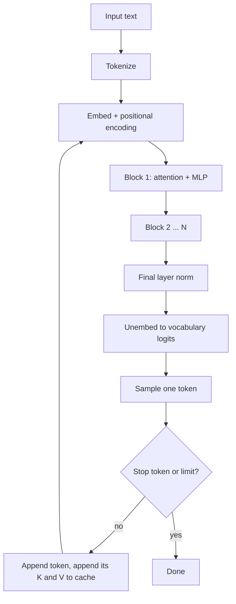
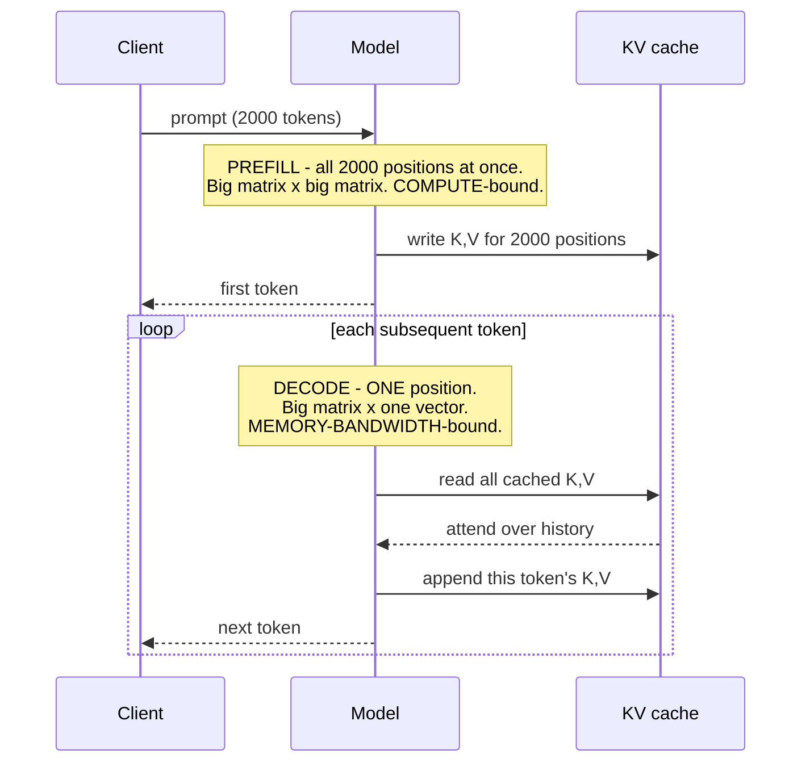

# Transformers & attention

> **The one sentence:** attention lets every token look at every other token and
> decide what to borrow from each — and the cost of that "every to every" is the
> source of nearly every practical constraint you will hit.

You do not need to implement one. You do need to know which part is quadratic,
what the KV cache is for, and why context length is expensive — because those
three facts explain most of the engineering decisions in the rest of this
handbook.

---

## 1 · Diagram

```
   ONE TRANSFORMER BLOCK, and what each part is for

   tokens ──► [ EMBED ] ──► + positional info
                 │
                 ▼
        ┌─────────────────────┐
        │   SELF-ATTENTION    │   every token looks at every other token
        │   Q · Kᵀ → softmax  │   -> O(n²) in sequence length. THIS is the cost
        │   · V               │
        └─────────┬───────────┘
                  │  + residual, layer-norm
                  ▼
        ┌─────────────────────┐
        │  FEED-FORWARD (MLP) │   per-token transformation
        │  ~2/3 of parameters │   -> where most of the WEIGHTS live
        └─────────┬───────────┘
                  │  + residual, layer-norm
                  ▼
             next block  (×32, ×80, ...)


   THE TWO COSTS ARE IN DIFFERENT PLACES, and this matters:

     ATTENTION   → quadratic in CONTEXT LENGTH   → long prompts hurt
     MLP         → linear, but holds most params → model SIZE dominates memory
```

The one thing a still picture cannot show is the *shape of the work over time* —
the prompt lands in a single pass, and then the cache grows one slot at a time
for the whole rest of the generation:

<figure class="fig-anim">
<svg viewBox="0 0 620 128" role="img" aria-label="Animated: six prompt slots of the KV cache fill together during prefill, then ten more fill one at a time during decode, each slot holding a key and a value">
  <path d="M20 34 L20 28 L232 28 L232 34" fill="none" stroke="currentColor" stroke-width="1" opacity=".45"/>
  <text class="lbl-b" x="126" y="20" text-anchor="middle">PREFILL — one pass</text>
  <path d="M236 34 L236 28 L592 28 L592 34" fill="none" stroke="currentColor" stroke-width="1" opacity=".45"/>
  <text class="lbl-b" x="414" y="20" text-anchor="middle">DECODE — one slot per token, forever</text>

  <g>
    <rect class="slot" x="20"  y="42" width="32" height="34" rx="3"/><rect class="k kv-fill" x="23"  y="45" width="26" height="14" rx="2"/><rect class="v kv-fill" x="23"  y="61" width="26" height="14" rx="2"/>
    <rect class="slot" x="56"  y="42" width="32" height="34" rx="3"/><rect class="k kv-fill" x="59"  y="45" width="26" height="14" rx="2"/><rect class="v kv-fill" x="59"  y="61" width="26" height="14" rx="2"/>
    <rect class="slot" x="92"  y="42" width="32" height="34" rx="3"/><rect class="k kv-fill" x="95"  y="45" width="26" height="14" rx="2"/><rect class="v kv-fill" x="95"  y="61" width="26" height="14" rx="2"/>
    <rect class="slot" x="128" y="42" width="32" height="34" rx="3"/><rect class="k kv-fill" x="131" y="45" width="26" height="14" rx="2"/><rect class="v kv-fill" x="131" y="61" width="26" height="14" rx="2"/>
    <rect class="slot" x="164" y="42" width="32" height="34" rx="3"/><rect class="k kv-fill" x="167" y="45" width="26" height="14" rx="2"/><rect class="v kv-fill" x="167" y="61" width="26" height="14" rx="2"/>
    <rect class="slot" x="200" y="42" width="32" height="34" rx="3"/><rect class="k kv-fill" x="203" y="45" width="26" height="14" rx="2"/><rect class="v kv-fill" x="203" y="61" width="26" height="14" rx="2"/>
  </g>
  <g>
    <rect class="slot" x="236" y="42" width="32" height="34" rx="3"/><rect class="k kv-fill" style="animation-delay:.45s" x="239" y="45" width="26" height="14" rx="2"/><rect class="v kv-fill" style="animation-delay:.45s" x="239" y="61" width="26" height="14" rx="2"/>
    <rect class="slot" x="272" y="42" width="32" height="34" rx="3"/><rect class="k kv-fill" style="animation-delay:.9s"  x="275" y="45" width="26" height="14" rx="2"/><rect class="v kv-fill" style="animation-delay:.9s"  x="275" y="61" width="26" height="14" rx="2"/>
    <rect class="slot" x="308" y="42" width="32" height="34" rx="3"/><rect class="k kv-fill" style="animation-delay:1.35s" x="311" y="45" width="26" height="14" rx="2"/><rect class="v kv-fill" style="animation-delay:1.35s" x="311" y="61" width="26" height="14" rx="2"/>
    <rect class="slot" x="344" y="42" width="32" height="34" rx="3"/><rect class="k kv-fill" style="animation-delay:1.8s"  x="347" y="45" width="26" height="14" rx="2"/><rect class="v kv-fill" style="animation-delay:1.8s"  x="347" y="61" width="26" height="14" rx="2"/>
    <rect class="slot" x="380" y="42" width="32" height="34" rx="3"/><rect class="k kv-fill" style="animation-delay:2.25s" x="383" y="45" width="26" height="14" rx="2"/><rect class="v kv-fill" style="animation-delay:2.25s" x="383" y="61" width="26" height="14" rx="2"/>
    <rect class="slot" x="416" y="42" width="32" height="34" rx="3"/><rect class="k kv-fill" style="animation-delay:2.7s"  x="419" y="45" width="26" height="14" rx="2"/><rect class="v kv-fill" style="animation-delay:2.7s"  x="419" y="61" width="26" height="14" rx="2"/>
    <rect class="slot" x="452" y="42" width="32" height="34" rx="3"/><rect class="k kv-fill" style="animation-delay:3.15s" x="455" y="45" width="26" height="14" rx="2"/><rect class="v kv-fill" style="animation-delay:3.15s" x="455" y="61" width="26" height="14" rx="2"/>
    <rect class="slot" x="488" y="42" width="32" height="34" rx="3"/><rect class="k kv-fill" style="animation-delay:3.6s"  x="491" y="45" width="26" height="14" rx="2"/><rect class="v kv-fill" style="animation-delay:3.6s"  x="491" y="61" width="26" height="14" rx="2"/>
    <rect class="slot" x="524" y="42" width="32" height="34" rx="3"/><rect class="k kv-fill" style="animation-delay:4.05s" x="527" y="45" width="26" height="14" rx="2"/><rect class="v kv-fill" style="animation-delay:4.05s" x="527" y="61" width="26" height="14" rx="2"/>
    <rect class="slot" x="560" y="42" width="32" height="34" rx="3"/><rect class="k kv-fill" style="animation-delay:4.5s"  x="563" y="45" width="26" height="14" rx="2"/><rect class="v kv-fill" style="animation-delay:4.5s"  x="563" y="61" width="26" height="14" rx="2"/>
  </g>

  <rect class="k" x="20" y="94" width="11" height="11" rx="2"/><text class="lbl" x="37" y="103">key</text>
  <rect class="v" x="76" y="94" width="11" height="11" rx="2"/><text class="lbl" x="93" y="103">value</text>
  <text class="lbl" x="150" y="103">one slot per token — and this whole strip exists once per layer, so ×32</text>
  <text class="lbl" x="20" y="120">Nothing already drawn is ever recomputed. That is the entire optimisation.</text>
</svg>
<figcaption>Prefill writes every prompt position at once; decode appends exactly one. The strip only ever grows to the right — which is why cost is linear in tokens, and why it is also the thing that runs you out of memory.</figcaption>
</figure>

---

## 2 · Design

**Basic — what attention computes.** Three vectors are derived from each token:

| Vector | Intuition |
|---|---|
| **Query** | What this token is looking for |
| **Key** | What this token offers to others |
| **Value** | What it actually contributes if selected |

Each query is compared against every key (a dot product), the scores are
softmaxed into weights, and the output is a weighted sum of values.
`softmax(QKᵀ/√d)V` — that formula is the whole mechanism, and the `√d` is there
to stop the dot products growing with dimension until the softmax saturates.

Three things about that formula are worth pinning down, because each one is a
place people acquire a wrong model that survives for years.

**Only token ids are integers.** The tokenizer emits a row index — `791` means
"row 791 of the embedding table", not a quantity, and it is not larger than
`790` in any meaningful sense. From the embedding lookup onward everything is
floating point: hidden states, Q, K, V, attention weights, logits,
probabilities. In production that is `bfloat16` or `float16`, sometimes `fp8`
for the KV cache specifically. Integer-quantized formats like `int4` are
compressed *storage* that is converted back to float before the arithmetic runs.

**The score is a scaled dot product, not cosine similarity.** These get
conflated because `q·k = ‖q‖‖k‖cos θ` relates them, but attention divides by
`√d` — a constant — while cosine divides by `‖q‖‖k‖`. Cosine discards
magnitude; attention keeps it, deliberately. Take `q = [1,0,1,0]` against
`k = [1,0,2,0]`: the dot product is 3. Scale that key to `[10,0,20,0]` and the
cosine is unchanged at 0.949 — same direction — but the score becomes 30, and
after softmax that key takes essentially all of the attention. The model uses
key norms to make some positions loud and others quiet independently of
direction, and cosine similarity cannot express that.

**There are two different softmaxes per forward pass, and they answer different
questions.** This is the single most common confusion in the topic.

| | Attention softmax | Output softmax |
|---|---|---|
| Where | Inside every head of every layer — 1,024 times per pass in a 32×32 model | Once, at the very end of the stack |
| Over what | The `seq_len` past positions | The `vocab` possible next tokens |
| Length | Grows with the sequence | 128,256, always |
| Means | "How much of each earlier token do I mix into myself?" | "How likely is each vocabulary entry to be next?" |
| Consumed by | The weighted sum over `V` | The sampler |

Attention does produce a probability distribution — over *positions*. It is not
the next-token distribution, and no amount of staring at attention weights will
show you the model's output probabilities.

**Multi-head** attention runs several of these in parallel with different
projections, so different heads can specialise — some track syntax, some track
position, some appear to do very little at all, which is what makes pruning
possible.

**Intermediate — why decoder-only won.** Three architectures exist; one
dominates:

| Type | Attention | Used for |
|---|---|---|
| **Encoder-only** | Bidirectional | Embeddings, classification, rerankers (BERT) |
| **Decoder-only** | Causal — each token sees only what precedes it | Generation (GPT, Llama, Claude) |
| **Encoder-decoder** | Both | Translation, some seq2seq (T5) |

Decoder-only won for generation because the causal mask makes training
massively parallel: every position predicts its next token simultaneously, so
one sequence yields as many training signals as it has tokens. That efficiency,
not any representational advantage, is the reason.

Those three architectures use three arrangements of the same operation, and the
difference is only *where Q, K and V come from*:

| Kind | Q from | K, V from | Mask | Where you meet it |
|---|---|---|---|---|
| **Self** | sequence A | sequence A | none | BERT-style encoders. Every token sees every other, both directions |
| **Causal self** | sequence A | sequence A | lower-triangular | Every decoder-only LLM. **This is the one that makes the KV cache possible** |
| **Cross** | decoder | encoder output | usually none | T5, Whisper, translation — K and V come from a *different* sequence |

Causal is a *subset* of self-attention, not an alternative to it. And note that
cross-attention K/V are even more cacheable than causal self-attention K/V: they
are computed once from the encoder output and never change at all for the entire
decode, not by a single row. Whisper exploits exactly that.

**Advanced — the KV cache, which is the single most practically important
concept here.** Generating token 500 needs attention over tokens 1–499. Without
caching you would recompute all their keys and values every step — quadratic
work repeated for every token.

So you cache them. Each new token computes its own K and V, appends them, and
attends over the cache.

**Why that is legal** is worth deriving once rather than accepting. Let `xₜ` be
the hidden state of token `t` at some layer. Then `Kₜ = norm(xₜ) @ W_K`, so `Kₜ`
depends on `xₜ` and nothing else; `xₜ` depends, through causal attention, only on
positions `≤ t`; by induction down to the embedding, `xₜ` is a function of token
ids `1..t` alone. Appending token `t+1` does not change token ids `1..t`.
Therefore **`Kₜ` and `Vₜ` are final the instant they are computed** — nothing
downstream can reach back and alter them.

That argument depends entirely on causality. In a bidirectional encoder `xₜ`
depends on future tokens, so appending one invalidates every cached K and V.
That is precisely why BERT-style models have no KV cache and decoder-only models
do — the same property that made decoder-only cheap to *train* is what makes it
cheap to *serve*.

**Q is not cached, and not because it would be wrong.** Old queries are equally
frozen. They are simply never read again: query `q₅` is used exactly once, to
produce position 5's output, and is dead the moment that output exists. Keys and
values are re-read by every future query, forever. Cache what gets read
repeatedly.

**The cache is per layer, not per model.** Layer 3's keys come from layer 3's
hidden states through layer 3's own `W_K`; layer 4's come from different inputs
through a different matrix. Neither is derivable from the other, so a "KV cache"
is really *N independent KV caches* that happen to be indexed by the same token
positions — which is why `layers` appears as a term in the size formula below.

Once that cache becomes the thing limiting your batch size — which it will, at
production context lengths — [KV cache optimization](kv-cache.html) covers the
thirteen ways to shrink it and what each one costs.

```
   KV cache size = 2 (K and V)
                 × layers
                 × kv_heads × head_dim
                 × sequence_length
                 × batch_size
                 × bytes_per_value
```

**This is why long context is expensive at serving time**, not just at prefill.
The cache grows linearly with sequence length and batch size, and at long
context it can exceed the model weights. It is the reason PagedAttention exists,
the reason batch size and context length trade against each other, and the
reason "just use the 200k window" is a capacity decision rather than a
configuration one.

**Grouped-query attention (GQA)** is the standard response: let several query
heads share one key/value head. It shrinks the cache several-fold with little
quality loss, and is why modern models list separate head counts for queries and
key/values.

---

## 3 · Flow



**The loop from `J` back to `C` is generation.** The new token is embedded and
run through every block, exactly like any other token — what it skips is the
*history*. Previous tokens are never re-embedded or re-projected; their K and V
are read from the cache. So the loop costs one token's worth of forward pass,
not the whole sequence's, and that distinction is exactly the prefill/decode
split that drives the whole serving module.

---

## 4 · UML — prefill versus decode



Prefill and decode are different workloads on the same weights. Almost every
serving optimisation targets one or the other, and confusing them is why teams
optimise the wrong half.

---

## 5 · Example

Attention in enough code to be unambiguous:

```python
import numpy as np


def attention(Q, K, V, causal=True):
    """One attention head.

    Q: (n_queries, d)  K, V: (n_keys, d)

    The scale by sqrt(d) is not cosmetic: dot products grow with dimension, and
    without it the softmax saturates into a near-one-hot distribution, which
    kills the gradient during training.
    """
    d = Q.shape[-1]
    scores = Q @ K.T / np.sqrt(d)

    if causal:
        # A token may not attend to its own future. This mask is the entire
        # reason decoder-only models can train on every position at once.
        n_q, n_k = scores.shape
        mask = np.triu(np.ones((n_q, n_k)), k=1 + (n_k - n_q)).astype(bool)
        scores = np.where(mask, -np.inf, scores)

    weights = np.exp(scores - scores.max(-1, keepdims=True))
    weights /= weights.sum(-1, keepdims=True)
    return weights @ V
```

The same head during decode, with a cache. The entire mechanism is the two
`append` lines — everything else is unchanged arithmetic:

```python
def decode_step(x_new, Wq, Wk, Wv, k_cache, v_cache):
    """One new token, attending over all history.

    k_cache / v_cache are lists of past K and V rows for THIS layer. They are
    mutated in place: this position's K and V are final the moment they exist.
    """
    q = x_new @ Wq
    k_cache.append(x_new @ Wk)          # <- the cache write
    v_cache.append(x_new @ Wv)          # <- there is nothing else to it

    K = np.stack(k_cache)               # every position, including this one
    V = np.stack(v_cache)

    # No mask. Causality is structural here: the cache only ever contains the
    # past and the present, so there is no future entry to mask out. Batched
    # implementations still need an explicit mask, but only because padding
    # forces them to -- not because the algorithm requires it.
    scores = q @ K.T / np.sqrt(q.shape[-1])
    w = np.exp(scores - scores.max()); w /= w.sum()
    return w @ V
```

A runnable version of the whole stack — two layers, GQA, cache growth, and an
assertion that cached and uncached generation emit *identical* tokens — is in
[`examples/kv_cache_lab.py`](https://github.com/SAGARCHRY0777/llm-handbook/blob/main/examples/kv_cache_lab.py).
It is pure standard-library Python so it runs anywhere, and it counts every dot
product so the saving is a number rather than a claim.

The memory arithmetic that decides your batch size:

```python
def kv_cache_gb(layers, kv_heads, head_dim, seq_len, batch=1, bytes_per=2):
    """KV cache size. The number that limits concurrency at long context.

    Grows linearly with BOTH sequence length and batch size, which is why they
    trade against each other: doubling context halves the batch you can hold.
    """
    return 2 * layers * kv_heads * head_dim * seq_len * batch * bytes_per / 1e9


# Llama-3-8B shape: 32 layers, 8 KV heads (GQA), head_dim 128
for seq in (4_000, 32_000, 128_000):
    print(f"{seq:>7,} tokens, batch 1  ->  {kv_cache_gb(32, 8, 128, seq):5.2f} GB")
print()
print(f"  128k tokens, batch 16 ->  {kv_cache_gb(32, 8, 128, 128_000, 16):5.1f} GB")
```

```
  4,000 tokens, batch 1  ->   0.27 GB
 32,000 tokens, batch 1  ->   2.15 GB
128,000 tokens, batch 1  ->   8.59 GB

  128k tokens, batch 16 ->  137.4 GB   <- larger than the 16 GB of weights
```

**That last line is the point.** At long context and real batch sizes, the KV
cache dominates memory — not the model. Without GQA it would be four times
worse; that is why every recent model uses it.

---

## 6 · Depth — the senior layer

**Position information is a design choice with real consequences.** Attention
itself is permutation-invariant — it has no idea what order tokens came in — so
position must be injected.

| Scheme | Property |
|---|---|
| **Learned absolute** | Simple; cannot extrapolate past trained length |
| **Sinusoidal** | Deterministic; extrapolates poorly in practice |
| **RoPE** (rotary) | Rotates Q and K by position; encodes *relative* distance and extrapolates far better. Now standard |
| **ALiBi** | Linear distance penalty on attention scores; extrapolates well, cheap |

RoPE is why context windows can be extended after training: interpolating or
scaling the rotation frequencies stretches the effective range without
retraining from scratch. Every "we extended this model to 128k" release is doing
some version of that, and it is also why quality often degrades in the extended
region — it was interpolated into, not trained on.

**Attention is quadratic, but that is not usually your bottleneck at inference.**
This trips people up. At *training* and *prefill*, O(n²) attention dominates. At
*decode* with one new token, attention is O(n) against the cache, and the
bottleneck is reading the weights — which is why quantization helps decode more
than any attention optimisation does.

**FlashAttention** is worth knowing by name and by mechanism: it does not change
the mathematics, it changes the memory access pattern. By tiling the computation
so intermediate scores never leave fast on-chip memory, it avoids materialising
the n×n matrix in HBM. Same output, several times faster, much less memory.
That distinction — an IO optimisation, not an approximation — is the kind of
detail that separates recall from understanding. Note also that it is orthogonal
to the KV cache: FlashAttention reduces *activation* memory during a pass, not
the cache that persists between passes. The two compose.

**The causal-mask bug everyone writes exactly once.** Leaving `is_causal=True`
on during decode:

```python
out = F.scaled_dot_product_attention(q, k, v, is_causal=(T_new > 1))
```

With one query row against 500 cached keys, PyTorch aligns the triangular mask
to the top-left of a 1×500 score matrix and hides almost the entire history. The
model appears to catastrophically forget its own prompt, generation degenerates,
and nothing raises an error. The guard is the fix: masking is needed during
prefill, where `T_new == T_total`, and is actively wrong during decode, where a
single query legitimately sees everything before it.

| Failure mode | Symptom | Cause |
|---|---|---|
| **Long-context recall degrades** | Middle of context ignored | Position extrapolation and attention dilution |
| **OOM at high batch + long context** | Crashes under load | KV cache, not weights |
| **Extended context underperforms** | Works to 8k, poor at 100k | Interpolated positions the model never trained on |
| **Prefill dominates latency** | High TTFT on long prompts | Quadratic attention over the prompt |

**What is actually inside the weights.** Roughly two-thirds of parameters live in
the MLP blocks, not attention. That is where mixture-of-experts intervenes:
route each token to a few expert MLPs instead of all of them, so total parameters
grow while per-token compute stays flat. It is the main reason a "several hundred
billion parameter" model can serve at reasonable cost.

**Shared experts** are the refinement that made MoE routing work better. In a
plain MoE every expert is routed to, so each one has to independently relearn
the common knowledge every token needs — the same basic competence duplicated
across dozens of experts, which is capacity spent on redundancy. The DeepSeekMoE
answer is to keep one or more experts **always active** for every token,
alongside the routed ones. The shared expert absorbs what is common; the routed
experts are then free to specialise, because they no longer have to carry the
baseline. Same per-token compute, better division of labour.

---

## 7 · From each seat

| Seat | What the architecture means from here |
|---|---|
| **User** | Nothing directly — but it is why long conversations get slower and more expensive, and why the model sometimes forgets the middle of a long document. |
| **Coder** | Context length is not free. Every token in the prompt is paid for at prefill and occupies KV cache for the whole generation. Trim context before reaching for a bigger window. |
| **Tester** | Test recall at your *real* context length, not a short one. Quality at 4k says nothing about quality at 100k, and the failure is position-dependent — probe the middle. |
| **System designer** | KV cache is your concurrency limit. Batch size and context length trade directly against each other; that trade is the capacity model for the whole service. |
| **Architect** | Model shape decides serving cost more than parameter count: GQA head counts, layer count and the MoE decision all change what hardware you need. |
| **CEO** | Context length is a cost driver, not a feature to maximise. "Supports 200k tokens" and "is affordable at 200k tokens" are different claims, and vendors quote the first. |
| **Market** | The architecture has been stable since 2017; competition is in scale, data, and serving efficiency. Attention variants that claimed to beat it have mostly not displaced it, which is itself informative. |

---

## 8 · Interview questions

| Question | What they are testing | Answer sketch |
|---|---|---|
| "Explain attention." | Whether you understand it or recite it | Each token emits a query, key and value. Queries are scored against all keys, softmaxed, and used to weight values. Scaling by √d stops the softmax saturating. Multi-head runs several in parallel with different projections. |
| "What is the KV cache and why does it matter?" | Practical depth | Cached keys and values for previous tokens, so decode does not recompute history. It matters because it grows linearly with context and batch, and at long context exceeds the weights — it is what limits concurrency. |
| "Why can you cache K and V but not Q?" | Whether you derived it or memorised it | You *could* cache Q — old queries are equally frozen — but nothing ever reads them again. A query is used once, for its own position's output. Keys and values are re-read by every future query. The reason K and V are *safe* to cache is causality: a token's hidden state depends only on ids `1..t`, so appending `t+1` cannot change them. Bidirectional models get no cache for exactly this reason. |
| "Is the attention softmax the same as the output softmax?" | Whether the mental model is real | No. Attention softmax runs inside every head of every layer, over `seq_len` positions — "how much of each earlier token do I mix in". The output softmax runs once at the end over `vocab` entries — "what comes next". Different length, different meaning, different place in the network. |
| "Why is decode memory-bound but prefill compute-bound?" | Systems understanding | Prefill processes all positions at once — big matrix multiplies, arithmetic dominates. Decode processes one token against the whole weight set — you read every weight and do very little with it, so bandwidth dominates. |
| "Why decoder-only?" | Architecture reasoning | Training efficiency. The causal mask lets every position predict its next token in parallel, so one sequence gives as many signals as it has tokens. Not a representational advantage. |
| "How do models get longer context?" | Currency | Position-encoding interpolation or scaling, usually with RoPE, plus continued training. It is why extended-context models often degrade in the extended region — those positions were interpolated into, not trained on. |
| "What does FlashAttention change?" | Precision | The memory access pattern, not the maths. It tiles so the n×n score matrix never materialises in HBM. Identical output, much faster, far less memory. An IO optimisation, not an approximation. |

---

## Stop condition

You are done when you can:

1. write the attention formula and say what the `√d` is for,
2. explain why the score is a dot product rather than a cosine, and what that buys,
3. name the two softmaxes, what each ranges over, and where each sits,
4. derive why K and V can be cached — and say why Q is not,
5. explain the KV cache and compute its size from model shape,
6. say why decode is bandwidth-bound and prefill is compute-bound,
7. name why decoder-only dominates generation, and
8. explain what GQA and FlashAttention each save — and why only one of them touches the cache.

---

## Sources worth reading

| Topic | Source |
|---|---|
| The architecture | *Attention Is All You Need* (Vaswani et al., 2017) |
| Visual intuition | Jay Alammar, *The Illustrated Transformer* — still the clearest explanation available |
| IO-aware attention | *FlashAttention* (Dao et al., 2022) |
| Position | *RoFormer* (Su et al., 2021) for RoPE; *ALiBi* (Press et al., 2021) |
| Grouped-query attention | *GQA* (Ainslie et al., 2023) |
