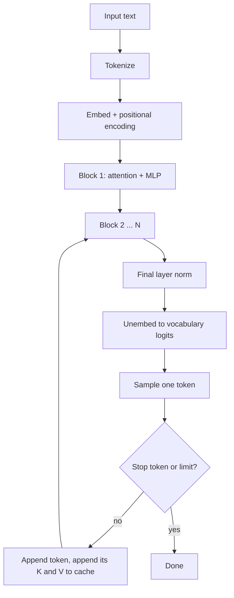
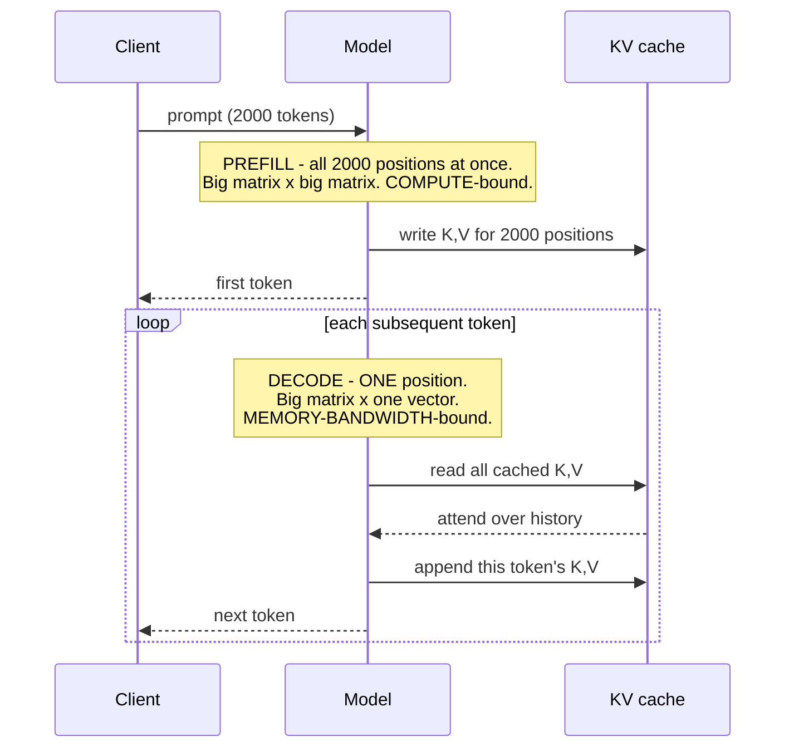

# Transformers & attention

> **The one sentence:** attention lets every token look at every other token and
> decide what to borrow from each — and the cost of that "every to every" is the
> source of nearly every practical constraint you will hit.

You do not need to implement one. You do need to know which part is quadratic,
what the KV cache is for, and why context length is expensive — because those
three facts explain most of the engineering decisions in the rest of this
handbook.

---

## 1 · Diagram

```
   ONE TRANSFORMER BLOCK, and what each part is for

   tokens ──► [ EMBED ] ──► + positional info
                 │
                 ▼
        ┌─────────────────────┐
        │   SELF-ATTENTION    │   every token looks at every other token
        │   Q · Kᵀ → softmax  │   -> O(n²) in sequence length. THIS is the cost
        │   · V               │
        └─────────┬───────────┘
                  │  + residual, layer-norm
                  ▼
        ┌─────────────────────┐
        │  FEED-FORWARD (MLP) │   per-token transformation
        │  ~2/3 of parameters │   -> where most of the WEIGHTS live
        └─────────┬───────────┘
                  │  + residual, layer-norm
                  ▼
             next block  (×32, ×80, ...)


   THE TWO COSTS ARE IN DIFFERENT PLACES, and this matters:

     ATTENTION   → quadratic in CONTEXT LENGTH   → long prompts hurt
     MLP         → linear, but holds most params → model SIZE dominates memory
```

---

## 2 · Design

**Basic — what attention computes.** Three vectors are derived from each token:

| Vector | Intuition |
|---|---|
| **Query** | What this token is looking for |
| **Key** | What this token offers to others |
| **Value** | What it actually contributes if selected |

Each query is compared against every key (a dot product), the scores are
softmaxed into weights, and the output is a weighted sum of values.
`softmax(QKᵀ/√d)V` — that formula is the whole mechanism, and the `√d` is there
to stop the dot products growing with dimension until the softmax saturates.

**Multi-head** attention runs several of these in parallel with different
projections, so different heads can specialise — some track syntax, some track
position, some appear to do very little at all, which is what makes pruning
possible.

**Intermediate — why decoder-only won.** Three architectures exist; one
dominates:

| Type | Attention | Used for |
|---|---|---|
| **Encoder-only** | Bidirectional | Embeddings, classification, rerankers (BERT) |
| **Decoder-only** | Causal — each token sees only what precedes it | Generation (GPT, Llama, Claude) |
| **Encoder-decoder** | Both | Translation, some seq2seq (T5) |

Decoder-only won for generation because the causal mask makes training
massively parallel: every position predicts its next token simultaneously, so
one sequence yields as many training signals as it has tokens. That efficiency,
not any representational advantage, is the reason.

**Advanced — the KV cache, which is the single most practically important
concept here.** Generating token 500 needs attention over tokens 1–499. Without
caching you would recompute all their keys and values every step — quadratic
work repeated for every token.

So you cache them. Each new token computes its own K and V, appends them, and
attends over the cache.

Once that cache becomes the thing limiting your batch size — which it will, at
production context lengths — [KV cache optimization](kv-cache.html) covers the
twelve ways to shrink it and what each one costs.

```
   KV cache size = 2 (K and V)
                 × layers
                 × kv_heads × head_dim
                 × sequence_length
                 × batch_size
                 × bytes_per_value
```

**This is why long context is expensive at serving time**, not just at prefill.
The cache grows linearly with sequence length and batch size, and at long
context it can exceed the model weights. It is the reason PagedAttention exists,
the reason batch size and context length trade against each other, and the
reason "just use the 200k window" is a capacity decision rather than a
configuration one.

**Grouped-query attention (GQA)** is the standard response: let several query
heads share one key/value head. It shrinks the cache several-fold with little
quality loss, and is why modern models list separate head counts for queries and
key/values.

---

## 3 · Flow



**The loop from `J` back to `E` is generation.** Note what it skips: the new
token re-enters at the blocks, not at the start, and previous tokens are never
recomputed — they are read from the cache. That distinction is exactly the
prefill/decode split that drives the whole serving module.

---

## 4 · UML — prefill versus decode



Prefill and decode are different workloads on the same weights. Almost every
serving optimisation targets one or the other, and confusing them is why teams
optimise the wrong half.

---

## 5 · Example

Attention in enough code to be unambiguous:

```python
import numpy as np


def attention(Q, K, V, causal=True):
    """One attention head.

    Q: (n_queries, d)  K, V: (n_keys, d)

    The scale by sqrt(d) is not cosmetic: dot products grow with dimension, and
    without it the softmax saturates into a near-one-hot distribution, which
    kills the gradient during training.
    """
    d = Q.shape[-1]
    scores = Q @ K.T / np.sqrt(d)

    if causal:
        # A token may not attend to its own future. This mask is the entire
        # reason decoder-only models can train on every position at once.
        n_q, n_k = scores.shape
        mask = np.triu(np.ones((n_q, n_k)), k=1 + (n_k - n_q)).astype(bool)
        scores = np.where(mask, -np.inf, scores)

    weights = np.exp(scores - scores.max(-1, keepdims=True))
    weights /= weights.sum(-1, keepdims=True)
    return weights @ V
```

The memory arithmetic that decides your batch size:

```python
def kv_cache_gb(layers, kv_heads, head_dim, seq_len, batch=1, bytes_per=2):
    """KV cache size. The number that limits concurrency at long context.

    Grows linearly with BOTH sequence length and batch size, which is why they
    trade against each other: doubling context halves the batch you can hold.
    """
    return 2 * layers * kv_heads * head_dim * seq_len * batch * bytes_per / 1e9


# Llama-3-8B shape: 32 layers, 8 KV heads (GQA), head_dim 128
for seq in (4_000, 32_000, 128_000):
    print(f"{seq:>7,} tokens, batch 1  ->  {kv_cache_gb(32, 8, 128, seq):5.2f} GB")
print()
print(f"  128k tokens, batch 16 ->  {kv_cache_gb(32, 8, 128, 128_000, 16):5.1f} GB")
```

```
  4,000 tokens, batch 1  ->   0.27 GB
 32,000 tokens, batch 1  ->   2.15 GB
128,000 tokens, batch 1  ->   8.59 GB

  128k tokens, batch 16 ->  137.4 GB   <- larger than the 16 GB of weights
```

**That last line is the point.** At long context and real batch sizes, the KV
cache dominates memory — not the model. Without GQA it would be four times
worse; that is why every recent model uses it.

---

## 6 · Depth — the senior layer

**Position information is a design choice with real consequences.** Attention
itself is permutation-invariant — it has no idea what order tokens came in — so
position must be injected.

| Scheme | Property |
|---|---|
| **Learned absolute** | Simple; cannot extrapolate past trained length |
| **Sinusoidal** | Deterministic; extrapolates poorly in practice |
| **RoPE** (rotary) | Rotates Q and K by position; encodes *relative* distance and extrapolates far better. Now standard |
| **ALiBi** | Linear distance penalty on attention scores; extrapolates well, cheap |

RoPE is why context windows can be extended after training: interpolating or
scaling the rotation frequencies stretches the effective range without
retraining from scratch. Every "we extended this model to 128k" release is doing
some version of that, and it is also why quality often degrades in the extended
region — it was interpolated into, not trained on.

**Attention is quadratic, but that is not usually your bottleneck at inference.**
This trips people up. At *training* and *prefill*, O(n²) attention dominates. At
*decode* with one new token, attention is O(n) against the cache, and the
bottleneck is reading the weights — which is why quantization helps decode more
than any attention optimisation does.

**FlashAttention** is worth knowing by name and by mechanism: it does not change
the mathematics, it changes the memory access pattern. By tiling the computation
so intermediate scores never leave fast on-chip memory, it avoids materialising
the n×n matrix in HBM. Same output, several times faster, much less memory.
That distinction — an IO optimisation, not an approximation — is the kind of
detail that separates recall from understanding.

| Failure mode | Symptom | Cause |
|---|---|---|
| **Long-context recall degrades** | Middle of context ignored | Position extrapolation and attention dilution |
| **OOM at high batch + long context** | Crashes under load | KV cache, not weights |
| **Extended context underperforms** | Works to 8k, poor at 100k | Interpolated positions the model never trained on |
| **Prefill dominates latency** | High TTFT on long prompts | Quadratic attention over the prompt |

**What is actually inside the weights.** Roughly two-thirds of parameters live in
the MLP blocks, not attention. That is where mixture-of-experts intervenes:
route each token to a few expert MLPs instead of all of them, so total parameters
grow while per-token compute stays flat. It is the main reason a "several hundred
billion parameter" model can serve at reasonable cost.

---

## 7 · From each seat

| Seat | What the architecture means from here |
|---|---|
| **User** | Nothing directly — but it is why long conversations get slower and more expensive, and why the model sometimes forgets the middle of a long document. |
| **Coder** | Context length is not free. Every token in the prompt is paid for at prefill and occupies KV cache for the whole generation. Trim context before reaching for a bigger window. |
| **Tester** | Test recall at your *real* context length, not a short one. Quality at 4k says nothing about quality at 100k, and the failure is position-dependent — probe the middle. |
| **System designer** | KV cache is your concurrency limit. Batch size and context length trade directly against each other; that trade is the capacity model for the whole service. |
| **Architect** | Model shape decides serving cost more than parameter count: GQA head counts, layer count and the MoE decision all change what hardware you need. |
| **CEO** | Context length is a cost driver, not a feature to maximise. "Supports 200k tokens" and "is affordable at 200k tokens" are different claims, and vendors quote the first. |
| **Market** | The architecture has been stable since 2017; competition is in scale, data, and serving efficiency. Attention variants that claimed to beat it have mostly not displaced it, which is itself informative. |

---

## 8 · Interview questions

| Question | What they are testing | Answer sketch |
|---|---|---|
| "Explain attention." | Whether you understand it or recite it | Each token emits a query, key and value. Queries are scored against all keys, softmaxed, and used to weight values. Scaling by √d stops the softmax saturating. Multi-head runs several in parallel with different projections. |
| "What is the KV cache and why does it matter?" | Practical depth | Cached keys and values for previous tokens, so decode does not recompute history. It matters because it grows linearly with context and batch, and at long context exceeds the weights — it is what limits concurrency. |
| "Why is decode memory-bound but prefill compute-bound?" | Systems understanding | Prefill processes all positions at once — big matrix multiplies, arithmetic dominates. Decode processes one token against the whole weight set — you read every weight and do very little with it, so bandwidth dominates. |
| "Why decoder-only?" | Architecture reasoning | Training efficiency. The causal mask lets every position predict its next token in parallel, so one sequence gives as many signals as it has tokens. Not a representational advantage. |
| "How do models get longer context?" | Currency | Position-encoding interpolation or scaling, usually with RoPE, plus continued training. It is why extended-context models often degrade in the extended region — those positions were interpolated into, not trained on. |
| "What does FlashAttention change?" | Precision | The memory access pattern, not the maths. It tiles so the n×n score matrix never materialises in HBM. Identical output, much faster, far less memory. An IO optimisation, not an approximation. |

---

## Stop condition

You are done when you can:

1. write the attention formula and say what the `√d` is for,
2. explain the KV cache and compute its size from model shape,
3. say why decode is bandwidth-bound and prefill is compute-bound,
4. name why decoder-only dominates generation, and
5. explain what GQA and FlashAttention each save.

---

## Sources worth reading

| Topic | Source |
|---|---|
| The architecture | *Attention Is All You Need* (Vaswani et al., 2017) |
| Visual intuition | Jay Alammar, *The Illustrated Transformer* — still the clearest explanation available |
| IO-aware attention | *FlashAttention* (Dao et al., 2022) |
| Position | *RoFormer* (Su et al., 2021) for RoPE; *ALiBi* (Press et al., 2021) |
| Grouped-query attention | *GQA* (Ainslie et al., 2023) |
